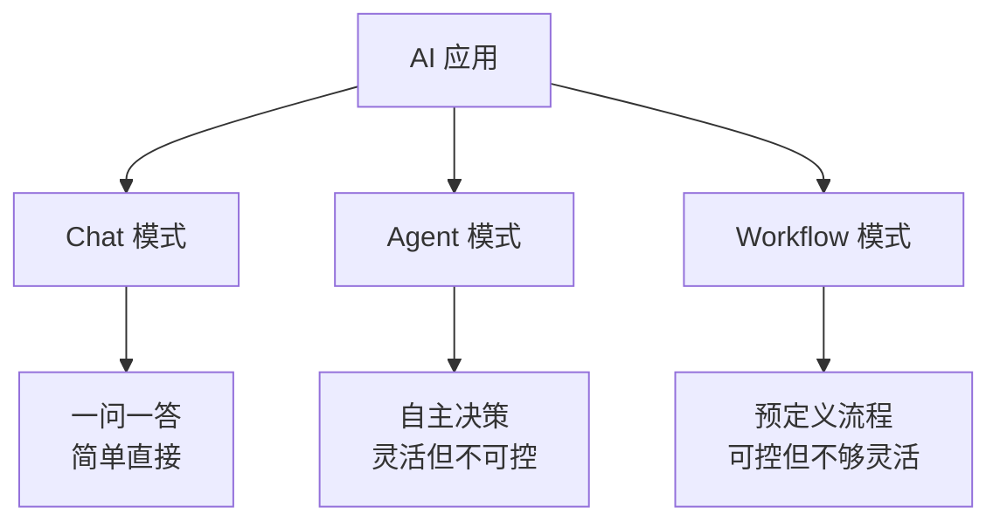
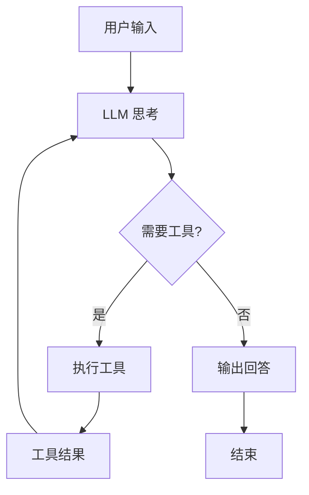
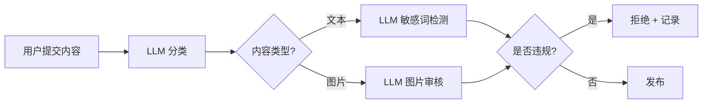
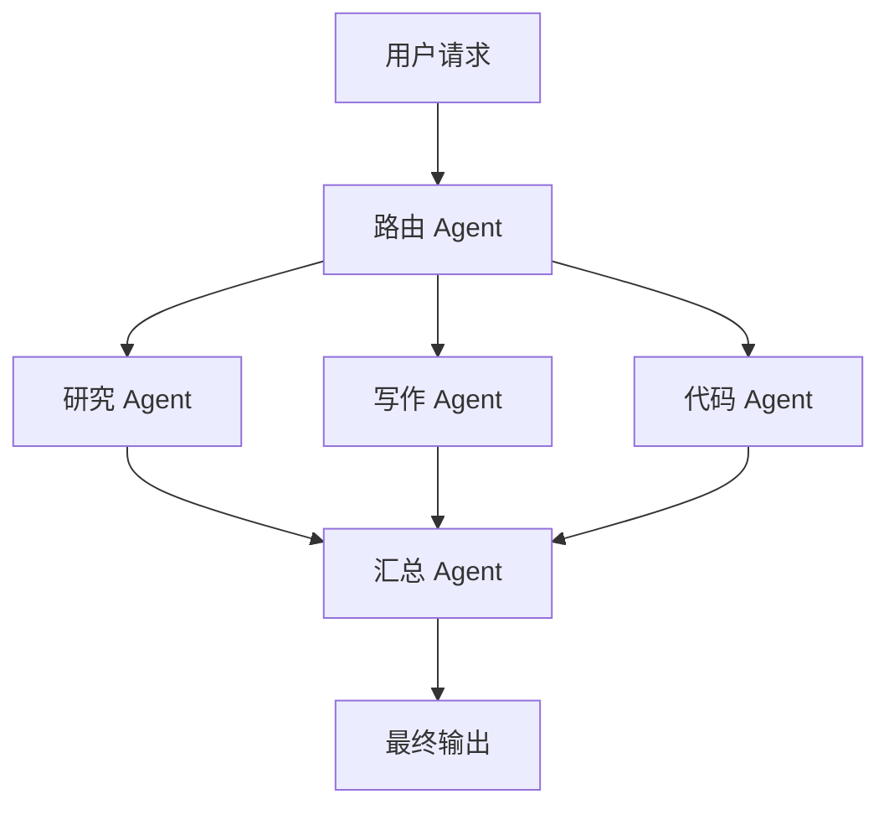
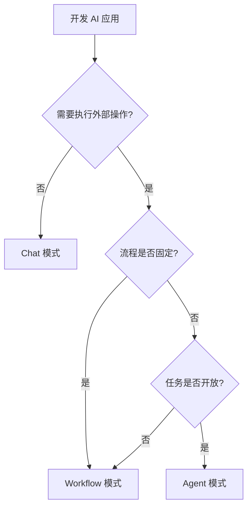

# AI 应用架构模式

学会调用 API 和工具后，下一步是理解 AI 应用的架构模式。不同的业务场景适合不同的模式。

## 三种核心模式



| 模式 | 特点 | 适用场景 | 复杂度 |
|------|------|----------|--------|
| **Chat** | 用户问，LLM 答 | 客服、问答、翻译 | 低 |
| **Agent** | LLM 自主决定调用工具 | 研究助手、代码助手 | 中 |
| **Workflow** | 预定义流程 + LLM 节点 | 内容审核、数据处理 | 中 |

## Chat 模式

最简单的模式，本质是"带记忆的对话"。

### 架构

```
用户输入 → 拼接对话历史 → LLM → 返回回答 → 更新历史
```

### 关键设计点

**1. 消息历史管理**

```javascript
class ChatManager {
  constructor(options = {}) {
    this.maxMessages = options.maxMessages || 50
    this.maxTokens = options.maxTokens || 4000
    this.messages = []
  }

  addMessage(role, content) {
    this.messages.push({ role, content, timestamp: Date.now() })
    this.trim()
  }

  // 裁剪策略：保留 system + 最近 N 条
  trim() {
    const systemMsg = this.messages.filter(m => m.role === 'system')
    const rest = this.messages.filter(m => m.role !== 'system')

    if (rest.length > this.maxMessages) {
      this.messages = [...systemMsg, ...rest.slice(-this.maxMessages)]
    }
  }

  // 高级：按 Token 数裁剪
  trimByTokens(tokenCounter) {
    const systemMsg = this.messages.filter(m => m.role === 'system')
    const rest = [...this.messages.filter(m => m.role !== 'system')].reverse()

    let totalTokens = tokenCounter(systemMsg)
    const kept = []

    for (const msg of rest) {
      const tokens = tokenCounter([msg])
      if (totalTokens + tokens > this.maxTokens) break
      totalTokens += tokens
      kept.unshift(msg)
    }

    this.messages = [...systemMsg, ...kept]
  }
}
```

**2. System Prompt 设计**

```javascript
const systemPrompt = `你是一个电商客服助手。

## 职责
- 回答商品相关问题
- 处理退换货咨询
- 引导用户联系人工客服（复杂问题时）

## 规则
- 不知道的事情不要编造，回复"我不确定，建议联系人工客服"
- 不要透露系统内部信息
- 语气友好、简洁

## 商品信息
- 支持 7 天无理由退换
- 运费险覆盖首重
- 工作日 9:00-18:00 人工在线`
```

## Agent 模式

Agent = LLM + 工具 + 循环。LLM 自主决定"下一步做什么"，直到任务完成。

### 核心循环



```javascript
class Agent {
  constructor({ llm, tools, systemPrompt, maxIterations = 10 }) {
    this.llm = llm
    this.tools = tools
    this.systemPrompt = systemPrompt
    this.maxIterations = maxIterations
  }

  async run(userInput) {
    const messages = [
      { role: 'system', content: this.systemPrompt },
      { role: 'user', content: userInput },
    ]

    for (let i = 0; i < this.maxIterations; i++) {
      const response = await this.llm(messages, { tools: this.tools })

      // 没有工具调用 → 最终回答
      if (!response.toolCalls) {
        return response.content
      }

      messages.push(response.message)

      // 执行工具
      for (const toolCall of response.toolCalls) {
        const result = await this.tools.execute(toolCall.name, toolCall.args)
        messages.push({
          role: 'tool',
          tool_call_id: toolCall.id,
          content: JSON.stringify(result),
        })
      }
    }

    return '达到最大迭代次数'
  }
}
```

### ReAct 模式

ReAct（Reasoning + Acting）是最经典的 Agent 模式：先思考，再行动，再观察结果。

```
Thought: 用户想知道北京的天气，我需要调用天气工具
Action: getWeather(city="北京")
Observation: { temp: 28, condition: "晴" }
Thought: 已获取天气信息，可以回答用户了
Answer: 北京今天晴天，气温 28°C
```

在 system prompt 中引导 LLM 使用这种格式：

```javascript
const systemPrompt = `你是一个研究助手。在回答之前，请先思考需要什么信息。

请按以下格式工作：
Thought: <你的思考过程>
Action: <工具名称>(<参数>)
Observation: <工具返回的结果>
...（可以重复多轮）
Final Answer: <最终回答>

如果已有足够信息，直接给出 Final Answer。`
```

## Workflow 模式

Workflow 是预定义的流程，LLM 只在特定节点发挥作用。适合需要确定性结果的场景。

### 示例：内容审核流程



```javascript
async function contentModerationWorkflow(content) {
  // Step 1: 分类
  const category = await llm(`分类以下内容：${content}。类别：文本/图片/视频`)

  // Step 2: 根据类型选择审核策略
  let moderationResult
  if (category === '文本') {
    moderationResult = await llm(`检测以下内容是否包含违规信息：${content}`)
  } else if (category === '图片') {
    moderationResult = await llmVision(`审核这张图片是否合规`, content.imageUrl)
  }

  // Step 3: 决策
  if (moderationResult.violated) {
    await db.recordViolation({ content, reason: moderationResult.reason })
    return { approved: false, reason: moderationResult.reason }
  }

  // Step 4: 发布
  await db.publish(content)
  return { approved: true }
}
```

### Workflow vs Agent

| 维度 | Workflow | Agent |
|------|----------|-------|
| **流程** | 预定义，确定性强 | LLM 自主决定，灵活 |
| **可控性** | 高，每一步可预测 | 低，LLM 可能走偏 |
| **适用场景** | 审核、审批、数据处理 | 研究、探索、开放任务 |
| **调试难度** | 低，流程固定 | 高，需要追踪 LLM 决策 |

**实际建议：** 大部分生产应用用 Workflow 或"受限 Agent"（限制工具范围和迭代次数），纯 Agent 模式适合内部工具或探索性场景。

## 记忆管理

AI 应用的记忆系统决定了"智能程度"。

### 记忆分层

```
┌─────────────────────────────────────┐
│         短期记忆（对话历史）           │  ← 当前会话的消息
├─────────────────────────────────────
│         工作记忆（工具结果/中间状态）    │  ← 本次任务的上下文
├─────────────────────────────────────┤
│         长期记忆（用户偏好/历史知识）    │  ← 跨会话持久化
├─────────────────────────────────────┤
│         外部记忆（文档/知识库/RAG）     │  ← 向量数据库检索
─────────────────────────────────────┘
```

### 长期记忆实现

```javascript
// 用数据库存储用户偏好
class UserMemory {
  constructor(db) {
    this.db = db
  }

  async save(userId, key, value) {
    await this.db.query(
      `INSERT INTO user_memory (user_id, key, value, updated_at)
       VALUES (?, ?, ?, NOW())
       ON DUPLICATE KEY UPDATE value = ?, updated_at = NOW()`,
      [userId, key, JSON.stringify(value), JSON.stringify(value)]
    )
  }

  async load(userId) {
    const rows = await this.db.query(
      'SELECT key, value FROM user_memory WHERE user_id = ?',
      [userId]
    )
    return Object.fromEntries(rows.map(r => [r.key, JSON.parse(r.value)]))
  }

  // 注入到 system prompt
  async buildSystemPrompt(userId) {
    const memory = await this.load(userId)
    const memoryStr = Object.entries(memory)
      .map(([k, v]) => `- ${k}: ${v}`)
      .join('\n')

    return `你是一个个性化助手。

## 用户偏好
${memoryStr || '暂无记录'}

## 规则
- 根据用户偏好调整回答风格
- 新发现的偏好及时记录`
  }
}
```

## 多 Agent 协作

复杂任务可以拆给多个专门的 Agent 处理。



```javascript
// 简单的多 Agent 编排
class MultiAgentOrchestrator {
  constructor(agents) {
    this.agents = agents  // { researcher, writer, coder, summarizer }
  }

  async handle(request) {
    // 1. 路由：决定哪些 Agent 参与
    const plan = await this.agents.router.plan(request)
    // plan = { agents: ['researcher', 'writer'], task: '写一篇技术文章' }

    // 2. 并行执行
    const results = await Promise.all(
      plan.agents.map(name => this.agents[name].run(request))
    )

    // 3. 汇总
    const final = await this.agents.summarizer.run({
      task: request,
      results: Object.fromEntries(plan.agents.map((name, i) => [name, results[i]])),
    })

    return final
  }
}
```

**何时用多 Agent：**
- 任务可以明确拆分为不同专业领域
- 单个 Agent 上下文不够用
- 需要不同模型（大模型推理 + 小模型执行）

**何时不用：**
- 简单任务一个 Agent 就够了
- 多 Agent 增加复杂度和成本
- 调试困难

## 选型指南



| 场景 | 推荐模式 |
|------|----------|
| 客服机器人 | Chat + RAG |
| 代码助手 | Agent（工具：文件读写、终端、搜索） |
| 内容审核 | Workflow |
| 数据分析 | Agent（工具：SQL、图表生成） |
| 文档摘要 | Workflow（分段 → 摘要 → 合并） |
| 研究助手 | Agent + 多 Agent 协作 |
