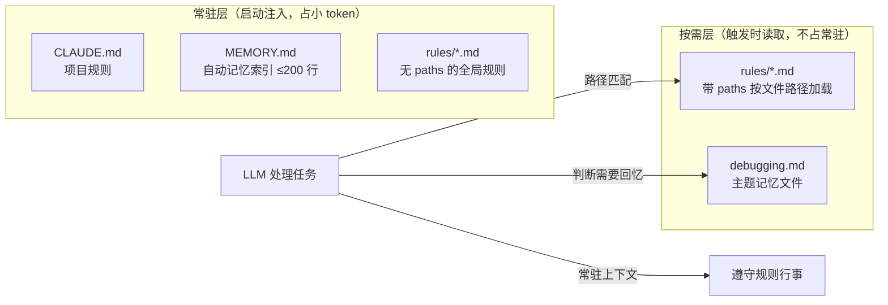

# Claude Code 记忆机制：文件化索引 + 按需加载

::: tip 一句话说清
Claude Code 用两套互补的 markdown 记忆机制解决"跨会话失忆"：**CLAUDE.md（人工指令）** + **Auto Memory（自动笔记）**，核心设计是"**索引常驻 + 内容按需**"——不依赖数据库和向量库，纯文件系统搞定。这套模式是给 AI Agent 搭项目级记忆系统的最简可行方案。
:::

## 为什么需要记忆系统

LLM 是无状态的：**每轮对话都是一张白纸**。上次会话里告诉它的"项目用 TypeScript strict 模式"、"提交信息用 conventional commits"，关掉终端就全没了。

- 个人场景：每次开会话都要重复同样的规范，浪费
- 团队场景：你花了半小时教会 Claude 项目约定，这些约定只存在那一轮对话里，换个人一切从头

Claude Code 用文件系统解决了这个问题。

## 两套互补的记忆机制

### 1. CLAUDE.md：你写给 Claude 的指令

人工维护、可提交 Git、团队共享。有**四个层级**，会话启动时自动加载：

| 层级 | 路径 | 用途 |
|------|------|------|
| 全局 | `~/.claude/CLAUDE.md` | 你的通用偏好（用中文回复、函数式风格） |
| 项目 | `./CLAUDE.md` | 项目规范、架构、技术栈约定（跟 Git 走，团队共享） |
| 个人本地 | `./CLAUDE.local.md` | 个人偏好（`.gitignore` 掉，不共享） |
| 模块化规则 | `.claude/rules/*.md` | 分主题规则，**支持 glob 条件加载** |

加载方式：会话启动时从当前目录**向上遍历**，加载沿途所有 CLAUDE.md（monorepo 子包进入即生效）。上下文压缩后还会从磁盘**重新读取注入**——写在 CLAUDE.md 里的规则不会丢，只存在对话里的才会丢。

**`.claude/rules/` 是精华**：规则文件 frontmatter 写 `paths` 字段即可按需加载：

```
---
paths:
  - src/api/**/*.ts
---
## API 规范
- 所有接口必须有入参校验
```

这条规则只在 Claude 处理 `src/api/` 下的文件时加载——编辑前端组件时不出现，不浪费上下文。这是"按需加载"的第一个落地形态，触发条件是**文件路径 glob**。

### 2. Auto Memory：Claude 自己记的笔记

无需手动操作，工作过程中自动积累：

- **什么会被记住**：你的纠正（"用 X 不要用 Y"）、明确指令（"记住以后都用 bun"）、反复出现的模式、项目关键信息
- **存储位置**：`~/.claude/projects/<项目>/memory/`，个人私有，不进 Git
- **触发方式**：识别"记住"、"别忘了"、"remember"、"don't forget"等关键词时主动写入

**存储结构**——主文件常驻，主题文件按需：

```
~/.claude/projects/<项目>/memory/
  MEMORY.md           # 主记忆，每次会话启动时加载（≤200 行）
  debugging.md        # 主题文件，需要时按需读取
  patterns.md
  api-conventions.md
```

关键设计：**MEMORY.md 常驻注入，主题文件按需读取**——详细经验存子文件不占上下文，需要时才翻出来。

### 3. /memory 命令

查看当前会话加载了哪些记忆文件、切换 Auto Memory 开关、直接打开记忆目录编辑。回答一个基本问题：**Claude 现在记住了什么？**

## 核心设计：索引常驻 + 内容按需

两套机制共用一个模式——**两段式加载**：



与 [Skill 的两段式加载](/ai-agent/prompt-engineering/skills) 是同一思路：**元数据/索引常驻 + 正文按需注入**。Skill 的触发条件是 `description` 语义匹配，rules 的触发条件是路径 glob，Auto Memory 主题文件的触发条件是 LLM 自主判断。

## 可靠性边界：依赖 LLM"自觉按需加载"

这个模式的决策权交给了 LLM，而 LLM 的自主性不可靠，有两个失效模式：

1. **不触发**：长会话、任务复杂时，LLM 可能"忘了"去查索引——提示词只能要求，无法强制（这正是 [Harness 工程](/ai-agent/harness-engineering/core-concepts) 的核心痛点）
2. **编造**：LLM 可能凭索引的印象或想象回答，而不去读真实文件内容——索引里一行"有 auth 规范，见 auth.md"，它可能不读就开写

Claude Code 的缓解手段是"**200 行法则**"：CLAUDE.md 和 MEMORY.md 都限制在 200 行内。索引一旦膨胀，LLM 的注意力被稀释，遵守度下降；更糟的是索引本身变成"该按需加载的大文件"，违背设计初衷。

## 实践指南：用 markdown 搭项目级记忆系统

如果你要自己搭一个项目级记忆系统，最简方案就是 Claude Code 这套模式的直接复刻：

> **用 markdown 维护一个知识库目录，在根目录暴露索引文件，把索引暴露给 LLM，依赖它的按需加载。**

这是**最简单**的可行方案：零数据库、零向量库、零服务，纯文件 + 一个索引，人和 AI 共享同一套可 git 版本管理的资产。

### 索引文件模板

```markdown
# 项目知识库索引（常驻段：≤200 行，核心规则直接内联）

## 硬性规则（必须遵守，不必读文件）
- 所有新文件必须使用 TypeScript strict 模式
- 提交信息遵循 conventional commits
- 禁止修改 legacy/ 目录下任何文件

## 知识文件目录（按需段：触发时读对应文件）

| 文件 | 内容 | 适用场景 |
|------|------|---------|
| `kb/api-conventions.md` | API 入参校验、错误码、响应格式 | 处理 src/api/ 相关任务 |
| `kb/auth-flow.md` | 认证流程、token 机制 | 涉及登录/鉴权 |
| `kb/testing.md` | 测试命令、覆盖率要求 | 任何改代码后的验证 |
```

### 四个默认动作，覆盖大部分风险

| 手段 | 做法 | 成本 |
|------|------|------|
| **索引小型化** | 索引 ≤200 行，只放核心规则 + 文件清单 | 零 |
| **关键知识内联** | 最高频的规则直接写进索引，而不是只留链接 | 零 |
| **适用场景标注** | 每篇知识文件顶部写 `## 适用场景`，给 LLM 判断"要不要读"的信号 | 零 |
| **命令式规则** | 写"必须"指令而非描述句（"必须用 strict 模式" ≠ "项目使用 TS"） | 零 |

### 规模阈值：什么时候该升级

纯索引方案在**几十个文件、每篇几百行**以内是最优解。再往上：

- **索引膨胀**（>200 行法则失效）→ 轻量升级：给 LLM 配 **grep/搜索工具**（关键词检索比读索引更直接，仍无需向量库）
- **语义检索需求**（"想不起来关键词"）→ 重量升级：**RAG 向量检索**（引入向量库 + 索引管线，不再"最简单"）

### 增强方向：从"依赖自觉"到"工程兜底"

如果可靠性要求高，把"读知识库"从 LLM 自觉升级为工程机制（呼应 [dev-agent-harness 的 L2 思路](/ai-agent/harness-engineering/function-calling-upgrade)）：

1. **工具封装**：把"读知识库"封装成 `search_kb` / `read_kb` 工具（function calling），比纯提示词可靠
2. **hook/gate 兜底**：特定场景强制校验"是否读过知识库"，不读不放行
3. **晋升机制**：稳定重要的条目从"按需文件"晋升到"常驻索引"（对应 Knowledge Harness 的 candidate → review → promote）

## 总结

Claude Code 的记忆系统没有向量库、没有知识图谱、没有记忆评分——靠的是**文件组织约定**：

- **人工/自动分工**：规范（CLAUDE.md，团队共享）vs 经验（Auto Memory，个人私有）
- **索引常驻 + 内容按需**：用最小的常驻 token 换取全局地图
- **200 行法则**：索引小型化，防止注意力稀释
- **路径 glob 触发**：rules 按文件路径按需加载，是"按需"的最简单落地形态

这套模式可以直接复刻成你自己的项目级记忆系统——**索引文件是地图，知识文件是货架，LLM 是拿着地图逛货架的人。地图必须常驻，货架按需打开**。

## 延伸阅读

- [Skill：文件化的提示词工程](/ai-agent/prompt-engineering/skills) - 两段式加载的另一落地形态
- [Harness Engineering 核心思想](/ai-agent/harness-engineering/core-concepts) - Knowledge Harness：记忆治理的工程化
- [AI 应用架构模式](/ai-agent/app-architecture) - 长期记忆在应用架构中的位置
