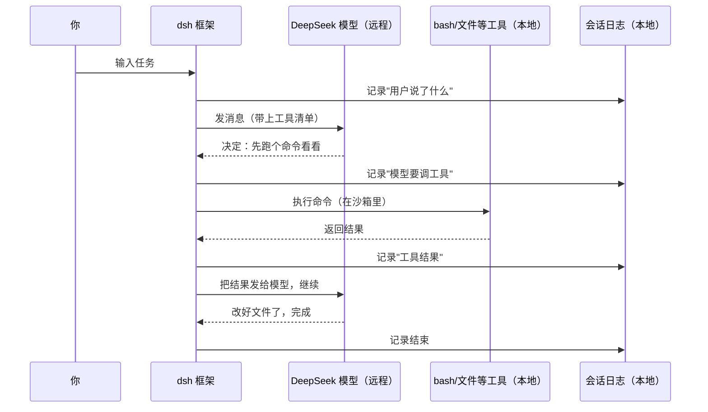

# DeepSeek Harness：一切皆插件的开源 Agent Harness

::: tip 一句话说清
DeepSeek Harness（dsh）是 DeepSeek 官方开源的 **Agent 运行框架**——就是 Claude Code、Qoder 这类工具背后那套"让模型真正能干活"的骨架。模型负责聪明，它负责干活。MIT 协议完全免费，2026 年 8 月开源，目前是预览版。
:::

## 它解决什么问题

大模型本身只会"生成文字"。让它帮你改代码、跑命令、读文件，需要一整套外部系统配合：

- 能执行命令、读写文件的**工具**
- 记住"刚才干到哪了"的**会话记忆**
- 决定"哪些操作要问你一声"的**权限**
- 出错之后怎么**恢复**

这套系统就是 Harness（驾驭工具）。DeepSeek 把这套系统整个开源了，这就是 dsh——官方口号 "Model + Harness = Agent"。

## 怎么理解"一切皆插件"

dsh 的核心设计叫 "Everything is a Plugin"（一切都是插件）。

可以把它想成一台**组装电脑**：CPU、内存、硬盘、显卡都是标准件，你可以换任意一个部件，甚至自己造一个插上去。

在 dsh 里：

- 模型接入是一个插件（想换模型就换插件）
- 执行 bash 是一个插件
- 读写文件是一个插件
- 会话记录是一个插件
- 界面（Web UI）也是一个插件

连"这几个插件怎么组合在一起"本身也是配置（官方叫 profile），有官方预装的组合，也可以自己拼。

它靠一个叫 Cordis 的插件框架实现：每个插件只做一件事，插件之间通过**事件**通信（比如"模型要调工具了"这个事件，谁感兴趣谁来接），需要别的插件时声明依赖，框架自动排好加载顺序——不用你手工安排谁先启动。

## 一次任务是怎么跑起来的

你在 Web UI 里输入一句话，dsh 内部是这样流转的（简化版）：



注意一个关键点：**每一步都先记录、再执行**。"模型要调工具"这句话在命令真正执行之前就已经写进日志了。

## 三个值得记住的设计

### 1. 会话记录是"账本"，不是聊天记录

dsh 把整个交互过程记成一份**只能追加、不能修改**的事件日志（官方叫 Session Log）。模型看到的每一句话、它调的每个工具、每个结果，全部在里面。

最硬的一条规则是：**"凡是模型见过的，日志里必须能找到"**。聊天历史不是单独存的一份，而是从这个账本里重新算出来的。

这意味着：任何时刻断电、崩溃，日志都能完整还原对话——包括中途压缩过、分叉过的对话。我们之前聊的 ledger/证据链，它就是最严格的版本。

### 2. 模型要调工具，先过"审批流水线"

工具调用不是模型说调就调，中间有层层关卡（全是插件，可增可减）：

```
模型说要调工具
  → 拦截钩子（可以拒绝，也可以改写请求）
  → 权限校验（这个操作允许吗？）
  → 需要的话问你审批
  → 执行（带超时、重试）
  → 结果检查（可以接受、阻断、替换）
  → 记录结果
```

这个设计正好对应我们之前聊过的 hook 拦截 + gate 校验：**把"靠模型自觉"变成"靠系统把关"**。

### 3. 拦截钩子不是只能拦，还能"改"

我们之前规划 hook 时想的是"拦截/放行"。dsh 的钩子更强：它可以**改写**即将执行的流程（比如把项目约定插进上下文），再放行。拒绝是它的一种选择，不是它的全部。

## 和我们 Harness 计划的对照

| dsh 的做法 | 我们计划的对应 | 值得学的 |
|-----------|--------------|---------|
| 会话日志（追加式账本） | ledger / 证据链 | 强制"模型可见的必须可回放"，不只是记录 |
| 工具流水线（拦截→审批→执行→检查） | gate 校验 | 关卡分两类：可协作的钩子和必须保序的守卫 |
| pre-step 钩子 | hook 拦截 | 除了拦，还能改写消息 |
| 一切皆插件 | 载体降级链 | 连"组合方式"本身也是配置 |
| 控制事件与日志事件分开 | 控制 / 证据分离 | 实时控制可丢，证据不能丢 |

## 值得借鉴的实践

1. **控制与证据分开**：实时控制（钩子、状态）和持久记录（日志）是两套事件系统。控制丢了不致命，证据丢了不行。
2. **先记录后执行**：工具调用在真正执行前就落日志，审计是默认行为，不是事后补的。
3. **出错要正交上报**：比如"进程超时"和"退出码 0"是两件事，必须分开报告，不能因为一个吞掉另一个。
4. **销毁要等安静**：关停系统时，发出杀死信号后要等子进程真正退出，不能留孤儿进程。

## 怎么继续学

- 官方文档（有完整中文版）：https://deepseek-harness.github.io/deepseek-harness/
- 本地代码 `docs/` 目录每个文档都有 `.zh.md` 中文版
- 推荐顺序：`user/guide`（怎么用）→ `architecture.zh.md`（架构总览）→ 感兴趣再深入
- 动手最快：配好 API key 后 `npx @deepseek-ai/dsh web` 跑起来，边用边看
