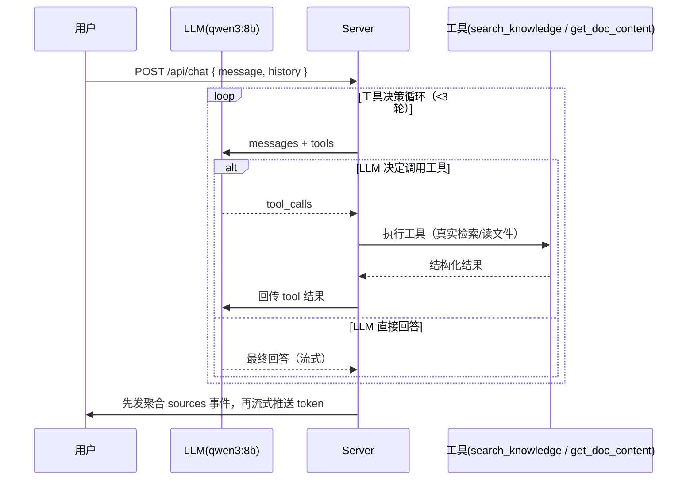

# 知识库 AI 助理引入 Function Calling

::: tip 一句话说清
把 `/api/chat` 的"固定检索管道"（无条件检索 5 条 → 拼上下文 → 流式回答）升级为"**LLM 驱动的工具调用管道**"（agent loop）：LLM 自主决定何时检索、检索几条、是否需要读全文，最后基于真实工具结果流式回答。本次落地场景 1（动态 RAG 检索）+ 场景 2（精确读全文），场景 4（知识库操作）仅规划。
:::

## 一、背景与现状

### 现有实现（server/src/routes/chat.ts）

```
用户消息 → 无条件 retriever.invoke(message) 固定检索 5 条
        → 拼进 system prompt → Ollama 流式回答 → SSE 推送
```

### 现状的三个局限

| 局限 | 表现 |
|------|------|
| 检索策略固定 | 固定 top_k=5：问综述不够、问精确问题冗余；闲聊也白检索一次 |
| 检索词不智能 | 只用用户原话检索，多轮追问时偏离真实意图 |
| 无法读全文 | RAG 只给 chunk 片段；"总结某篇文章""对比两篇"时片段拼不完整 |

### 目标

- **场景 1**：动态 RAG 检索——LLM 决定"要不要检索、检索几条、用什么词检索"
- **场景 2**：精确读文档全文——LLM 判断"片段不够"时主动读全文
- **场景 4（规划，本次不做）**：知识库操作（归档、打标签、生成摘要落盘）

## 二、小范围验证结果

验证脚本：`server/scripts/verify-tool-calling.ts`（工具实现为 mock，不依赖 Chroma）

环境：Ollama `qwen3:8b`（capabilities 含 `tools`）+ OpenAI 兼容接口 `http://localhost:11434/v1`

| 用例 | 预期 | 结果 |
|------|------|------|
| 技术问答"介绍 useMemo" | 触发 `search_knowledge` | ✅ 触发，query 被重构为"React useMemo 作用"，top_k=3 |
| "把闭包这篇文章完整内容总结" | 触发 `get_doc_content` | ✅ 触发，path="javascript/closure.md" 正确 |
| 闲聊"你好" | 不触发工具 | ✅ 直接回答，无误触发 |
| 多轮追问"闭包注意事项" | 基于上下文回答 | ✅ 回答正确（可依赖会话历史，不强制重检索） |

**结论**：qwen3:8b 的 tool calling 链路完全可用——工具定义解析、调用决策、参数生成、多轮 agent loop、流式输出全部正常。本地模型单次工具调用延迟约 10-30s（4 用例总计约 3 分钟）。

## 三、总体架构改造

### 改造前 vs 改造后

```
改造前（固定管道）                          改造后（agent loop）
用户消息 → 固定检索5条 → LLM流式回答        用户消息 → LLM(带tools) 决策循环
                                                    ↓ 需检索？→ search_knowledge
                                                    ↓ 需全文？→ get_doc_content
                                                    ↓ 无需工具 → 直接进入回答
                                              聚合工具来源 → 发 sources 事件
                                              → LLM 基于真实内容流式回答
```

### agent loop 核心流程



### 前端契约（AIChat.vue）

现状：服务端在回答前发**一次** `sources` 事件（固定检索的 5 条），前端渲染"参考来源"标签。

改造后保持契约形状不变，但 sources 来源从"固定检索"变为"**工具调用聚合**"：

- agent loop 的**工具阶段**（可能有 0~N 次工具调用）结束后，聚合所有工具产生的来源（检索命中的文档 + 全文读取的文档），在进入流式回答**之前**发一次 `sources` 事件
- 前端**无需改动**——仍是"开头一个 sources 事件 + 后续 token"的结构
- 若工具阶段为 0 次（未检索），不发 sources 或发空数组（同现状闲聊逻辑）

## 四、场景 1：动态 RAG 检索

### 工具定义

```json
{
  "type": "function",
  "function": {
    "name": "search_knowledge",
    "description": "在知识库中检索与用户问题相关的文档片段。当问题需要知识库内容支撑（技术问答、概念解释、找文章）时调用；闲聊不需要调用。",
    "parameters": {
      "type": "object",
      "properties": {
        "query": { "type": "string", "description": "检索关键词，应基于对话意图重构而非直接复制用户原话" },
        "top_k": { "type": "integer", "description": "返回结果数量，默认 3" }
      },
      "required": ["query"]
    }
  }
}
```

### 实现要点

- **工具实现复用现有 retriever**：`retriever.invoke(query)`，但需处理 `top_k` 动态化
- **注意现有缓存机制**（`retriever.ts:24-31）：`getRetriever(topK)` 按创建时的 topK 缓存实例，动态 top_k 需要新方案：
  - 方案 A：改用 `vectorStore.similaritySearchWithScore(query, k)` 直接查询，每次按需传 k（推荐，改动小）
  - 方案 B：按不同 top_k 建 retriever 缓存池（k 是离散值，如 3/5/10，最多几个实例）
- **检索失败的容错**沿用现有 `invalidateRetriever()` 重试逻辑（`chat.ts:44-48`）

### 价值

- 闲聊/简单问题不触发检索 → 省 token 和延迟
- LLM 重构检索词 → 多轮追问检索更准
- top_k 动态 → 综述多取、精确问题少取

## 五、场景 2：精确读文档全文

### 工具定义

```json
{
  "type": "function",
  "function": {
    "name": "get_doc_content",
    "description": "读取知识库中某篇文章的完整内容。当检索到的片段不足以回答（如用户要求全文总结、对比多篇文章）时调用。",
    "parameters": {
      "type": "object",
      "properties": {
        "path": { "type": "string", "description": "文章路径，如 javascript/closure.md" }
      },
      "required": ["path"]
    }
  }
}
```

### 实现要点

- 读取 `config.docsPath`（docs/ 目录）下对应 md 文件
- **路径安全**：`path.resolve(docsPath, p)` 后必须 `startsWith(docsPath)`，防止路径穿越（`../../` 逃逸）
- 解析 frontmatter（用现有 `gray-matter` 依赖）取 title，正文去掉 frontmatter 返回
- 返回结构：`{ source, title, content }`，与检索结果的 metadata 字段对齐，便于前端 sources 聚合

### 与检索的组合逻辑

检索命中后 LLM 判断"片段够不够"：够 → 直接答；不够（如"总结全文""对比两篇"）→ 调 `get_doc_content` 读全文。RAG 负责"找到"，全文工具负责"读透"。

## 六、场景 4：知识库操作（规划，本次不做）

### 工具清单（建议）

| 工具 | 作用 | 风险级别 |
|------|------|---------|
| `list_recent_docs(days)` | 列最近更新的文章 | 只读，低 |
| `search_docs_by_metadata(field, value)` | 按 frontmatter 精确匹配 | 只读，低 |
| `git_stats(scope)` | git log 统计最近改动 | 只读，低 |
| `add_tag(path, tag)` | 给文章加标签 | 写，中 |
| `archive_doc(path)` | 归档文章 | 写，高（呼应 AGENTS.md 禁删原则，归档≠删除） |
| `create_summary(path)` | 生成摘要落盘 | 写，中 |

### 安全设计（写操作原则）

- **写操作需用户确认**：走一次 AskUserQuestion 或要求前端弹确认，不静默执行
- **与 RAG 索引的关系**：写操作改变文档内容后，对应 chunk 需重索引（触发 `rag:index` 或增量更新），否则检索结果过期
- 建议先实现只读工具（list/search/git_stats），写工具验证确认机制后再上

## 七、落地计划

| 步骤 | 内容 | 涉及文件 |
|------|------|---------|
| 1 | agent loop 封装（工具决策循环 + SSE 聚合 sources） | `server/src/routes/chat.ts` 或抽 `server/src/agent/loop.ts` |
| 2 | 场景 1：search_knowledge 工具（真实 retriever + 动态 top_k） | `server/src/routes/chat.ts` + `server/src/rag/retriever.ts` 小改 |
| 3 | 场景 2：get_doc_content 工具（路径安全读全文） | `server/src/routes/chat.ts` |
| 4 | 前端验证：sources 聚合展示是否符合预期 | `docs/.vitepress/theme/components/AIChat.vue`（预期无需改） |
| 5 | 全流程实测：真实检索 + 全文 + 多轮追问 | 手动验证 |

## 八、风险与注意事项

| 风险 | 说明 | 缓解 |
|------|------|------|
| 本地模型工具调用质量 | qwen3:8b 已验证可用；更复杂的调用决策可能需更强模型 | 工具 description 写清楚触发条件；必要时换 qwen3:30b |
| 延迟 | 本地模型单次工具调用 10-30s，多轮循环会累积 | 限制循环 ≤3 轮；闲聊不触发工具省一轮 |
| sources 聚合准确性 | 工具调用产生的来源需去重、按真实用途聚合 | 聚合时用 Set 去重；全文工具返回的 source 与检索 source 同格式 |
| 路径穿越 | get_doc_content 的 path 参数不可信 | resolve + startsWith 双重校验 |
| 工具参数不可信 | LLM 生成的参数可能不合法 | 工具实现内 try-catch + 参数校验（top_k 钳制 1-10） |

## 延伸阅读

- [Function Calling 与工具调用](/ai-agent/function-calling) - 工具机制基础
- [AI 应用架构模式](/ai-agent/app-architecture) - Agent 循环架构
- 验证脚本：`server/scripts/verify-tool-calling.ts`
