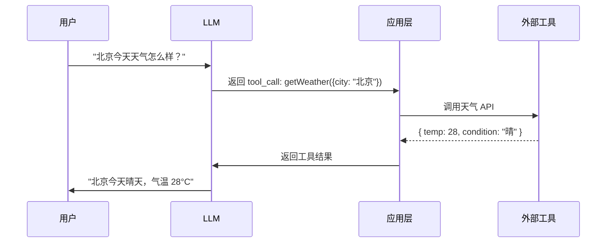

# Function Calling 与工具调用

Function Calling 让 LLM 不再只是"聊天"，而是能够**调用外部工具**来完成实际任务——查天气、搜索数据库、调用 API、执行代码。这是构建 AI Agent 的核心能力。

## 为什么需要 Function Calling

```
纯 LLM 的局限：
- 知识有截止日期，不知道实时信息
- 无法执行操作（发邮件、下单、查数据库）
- 数学计算可能出错

Function Calling 解决：
- LLM 决定"需要用什么工具"
- 应用层执行工具，把结果返回给 LLM
- LLM 基于工具结果生成最终回答
```

## 工作流程



**关键点：** LLM 不直接执行工具，它只是"决定"调用哪个工具、传什么参数。实际执行由应用层完成。

## OpenAI Function Calling

### 定义工具

```javascript
const tools = [
  {
    type: 'function',
    function: {
      name: 'getWeather',
      description: '获取指定城市的当前天气信息',
      parameters: {
        type: 'object',
        properties: {
          city: {
            type: 'string',
            description: '城市名称，如 "北京"、"Shanghai"',
          },
          unit: {
            type: 'string',
            enum: ['celsius', 'fahrenheit'],
            description: '温度单位',
          },
        },
        required: ['city'],
      },
    },
  },
  {
    type: 'function',
    function: {
      name: 'searchDatabase',
      description: '在用户数据库中搜索用户信息',
      parameters: {
        type: 'object',
        properties: {
          query: {
            type: 'string',
            description: '搜索关键词，可以是用户名或邮箱',
          },
          limit: {
            type: 'integer',
            description: '返回结果数量上限',
          },
        },
        required: ['query'],
      },
    },
  },
]
```

### 调用流程

```javascript
import OpenAI from 'openai'
const openai = new OpenAI({ apiKey: process.env.OPENAI_API_KEY })

// 工具的实际实现
const toolImplementations = {
  getWeather: async ({ city, unit = 'celsius' }) => {
    // 实际调用天气 API
    const res = await fetch(`https://api.weather.com/v1/${city}`)
    const data = await res.json()
    return {
      city: data.name,
      temperature: unit === 'celsius' ? data.temp_c : data.temp_f,
      condition: data.condition,
      unit,
    }
  },

  searchDatabase: async ({ query, limit = 10 }) => {
    const users = await db.query(
      'SELECT * FROM users WHERE username LIKE ? OR email LIKE ? LIMIT ?',
      [`%${query}%`, `%${query}%`, limit]
    )
    return users
  },
}

async function chatWithTools(userMessage) {
  const messages = [{ role: 'user', content: userMessage }]

  // 第一轮：LLM 决定是否调用工具
  const response = await openai.chat.completions.create({
    model: 'gpt-4o',
    messages,
    tools,
  })

  const choice = response.choices[0]

  // 如果 LLM 决定调用工具
  if (choice.message.tool_calls) {
    messages.push(choice.message)  // 保存 LLM 的 tool_call

    // 逐个执行工具
    for (const toolCall of choice.message.tool_calls) {
      const fn = toolImplementations[toolCall.function.name]
      const args = JSON.parse(toolCall.function.arguments)
      const result = await fn(args)

      // 把工具结果加回消息
      messages.push({
        role: 'tool',
        tool_call_id: toolCall.id,
        content: JSON.stringify(result),
      })
    }

    // 第二轮：LLM 基于工具结果生成回答
    const finalResponse = await openai.chat.completions.create({
      model: 'gpt-4o',
      messages,
      tools,
    })

    return finalResponse.choices[0].message.content
  }

  // 不需要工具，直接返回
  return choice.message.content
}

// 使用
const reply = await chatWithTools('北京今天天气怎么样？')
console.log(reply)  // "北京今天晴天，气温 28°C"
```

## Anthropic Tool Use

Anthropic 的工具调用方式类似，但格式略有不同。

```javascript
import Anthropic from '@anthropic-ai/sdk'
const anthropic = new Anthropic({ apiKey: process.env.ANTHROPIC_API_KEY })

const response = await anthropic.messages.create({
  model: 'claude-sonnet-4-20250514',
  max_tokens: 1024,
  tools: [
    {
      name: 'getWeather',
      description: '获取指定城市的当前天气信息',
      input_schema: {
        type: 'object',
        properties: {
          city: { type: 'string', description: '城市名称' },
        },
        required: ['city'],
      },
    },
  ],
  messages: [
    { role: 'user', content: '北京今天天气怎么样？' },
  ],
})

// 检查是否有工具调用
for (const block of response.content) {
  if (block.type === 'tool_use') {
    console.log(block.name)        // 'getWeather'
    console.log(block.input)       // { city: '北京' }
    console.log(block.id)          // toolu_xxx
  }
}
```

## 多轮工具调用

LLM 可能需要在一次对话中调用多个工具，甚至基于前一个工具的结果决定下一步。

```javascript
async function chatLoop(userMessage, maxIterations = 5) {
  const messages = [{ role: 'user', content: userMessage }]

  for (let i = 0; i < maxIterations; i++) {
    const response = await openai.chat.completions.create({
      model: 'gpt-4o',
      messages,
      tools,
    })

    const choice = response.choices[0]

    // 没有工具调用，说明 LLM 已准备好最终回答
    if (!choice.message.tool_calls) {
      return choice.message.content
    }

    // 执行工具
    messages.push(choice.message)
    for (const toolCall of choice.message.tool_calls) {
      const fn = toolImplementations[toolCall.function.name]
      const args = JSON.parse(toolCall.function.arguments)
      const result = await fn(args)

      messages.push({
        role: 'tool',
        tool_call_id: toolCall.id,
        content: JSON.stringify(result),
      })
    }
  }

  return '达到最大迭代次数，未能完成'
}
```

**示例场景：**
```
用户: "帮我查一下 alice 的订单，然后取消最近那一单"

第 1 轮: LLM 调用 searchDatabase("alice") → 找到用户 ID
第 2 轮: LLM 调用 getOrders(userId) → 获取订单列表
第 3 轮: LLM 调用 cancelOrder(latestOrderId) → 取消订单
第 4 轮: LLM 生成回答 "已为您取消 alice 最近的订单 #12345"
```

## 工具设计最佳实践

### 1. 描述要清晰

LLM 根据 `description` 和参数描述来决定是否调用、怎么调用。

```javascript
// 不好：描述模糊
{
  name: 'getData',
  description: '获取数据',
}

// 好：描述具体
{
  name: 'getUserOrderHistory',
  description: '查询指定用户的订单历史记录，返回最近 30 天的订单列表',
  parameters: {
    properties: {
      userId: { type: 'string', description: '用户 ID，格式为 UUID' },
      days: { type: 'integer', description: '查询最近多少天，默认 30，最大 90' },
    },
  },
}
```

### 2. 工具粒度要适中

```
太粗: 一个工具做所有事 → LLM 难以正确使用
太细: 每个操作一个工具 → 工具列表太长，LLM 选择困难

适中: 按业务领域分组，每个工具完成一个明确的任务
```

### 3. 错误处理

工具可能失败，把错误信息返回给 LLM，让它决定如何处理。

```javascript
const toolImplementations = {
  searchDatabase: async ({ query }) => {
    try {
      const users = await db.query('SELECT * FROM users WHERE username LIKE ?', [`%${query}%`])
      if (users.length === 0) {
        return JSON.stringify({ error: '未找到匹配的用户' })
      }
      return JSON.stringify(users)
    } catch (err) {
      return JSON.stringify({ error: `数据库查询失败: ${err.message}` })
    }
  },
}
```

### 4. 安全：校验 LLM 的参数

LLM 可能生成不合理的参数，应用层必须校验。

```javascript
const toolImplementations = {
  executeCommand: async ({ command }) => {
    // 白名单校验
    const allowed = ['ls', 'pwd', 'date', 'echo']
    const cmd = command.split(' ')[0]
    if (!allowed.includes(cmd)) {
      return JSON.stringify({ error: `不允许执行命令: ${cmd}` })
    }
    // 执行...
  },
}
```

## 实际案例：AI 助手调用数据库

```javascript
// 一个能查数据库、发邮件的 AI 助手

const tools = [
  {
    type: 'function',
    function: {
      name: 'queryUsers',
      description: '根据条件查询用户列表',
      parameters: {
        type: 'object',
        properties: {
          role: { type: 'string', enum: ['admin', 'editor', 'viewer'], description: '用户角色' },
          status: { type: 'string', enum: ['active', 'inactive'], description: '账号状态' },
          limit: { type: 'integer', description: '返回数量上限，默认 20' },
        },
      },
    },
  },
  {
    type: 'function',
    function: {
      name: 'sendEmail',
      description: '向指定邮箱发送邮件',
      parameters: {
        type: 'object',
        properties: {
          to: { type: 'string', description: '收件人邮箱' },
          subject: { type: 'string', description: '邮件主题' },
          body: { type: 'string', description: '邮件正文' },
        },
        required: ['to', 'subject', 'body'],
      },
    },
  },
]

// 用户: "给所有管理员发一封通知邮件，主题是系统维护通知"
//
// LLM 推理过程:
// 1. 需要先找到所有管理员 → 调用 queryUsers({ role: 'admin', status: 'active' })
// 2. 拿到邮箱列表后 → 逐个调用 sendEmail
// 3. 生成总结回复
```

## Function Calling vs RAG

| 维度 | Function Calling | RAG |
|------|-----------------|-----|
| **目的** | 让 LLM 执行操作 | 让 LLM 获取知识 |
| **触发方式** | LLM 主动决定调用 | 每次查询都检索 |
| **典型场景** | 查数据库、调 API、执行代码 | 问答、文档检索、知识库 |
| **返回内容** | 结构化数据（JSON） | 文本片段 |

两者经常组合使用：RAG 提供知识背景，Function Calling 执行具体操作。
