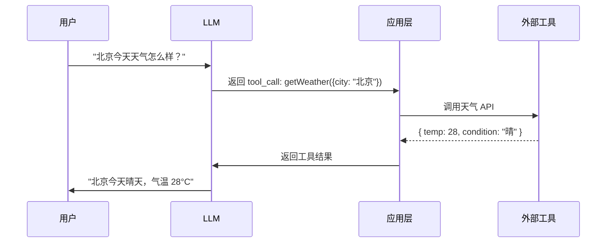

# Function Calling 与工具调用

Function Calling 让 LLM 不再只是"聊天"，而是能够**调用外部工具**来完成实际任务——查天气、搜索数据库、调用 API、执行代码。这是构建 AI Agent 的核心能力。

## 为什么需要 Function Calling

```
纯 LLM 的局限：
- 知识有截止日期，不知道实时信息
- 无法执行操作（发邮件、下单、查数据库）
- 数学计算可能出错

Function Calling 解决：
- LLM 决定"需要用什么工具"
- 应用层执行工具，把结果返回给 LLM
- LLM 基于工具结果生成最终回答
```

## 工作流程



**关键点：** LLM 不直接执行工具，它只是"决定"调用哪个工具、传什么参数。实际执行由应用层完成。

## OpenAI Function Calling

### 定义工具

```javascript
const tools = [
  {
    type: 'function',
    function: {
      name: 'getWeather',
      description: '获取指定城市的当前天气信息',
      parameters: {
        type: 'object',
        properties: {
          city: {
            type: 'string',
            description: '城市名称，如 "北京"、"Shanghai"',
          },
          unit: {
            type: 'string',
            enum: ['celsius', 'fahrenheit'],
            description: '温度单位',
          },
        },
        required: ['city'],
      },
    },
  },
  {
    type: 'function',
    function: {
      name: 'searchDatabase',
      description: '在用户数据库中搜索用户信息',
      parameters: {
        type: 'object',
        properties: {
          query: {
            type: 'string',
            description: '搜索关键词，可以是用户名或邮箱',
          },
          limit: {
            type: 'integer',
            description: '返回结果数量上限',
          },
        },
        required: ['query'],
      },
    },
  },
]
```

### 调用流程

```javascript
import OpenAI from 'openai'
const openai = new OpenAI({ apiKey: process.env.OPENAI_API_KEY })

// 工具的实际实现
const toolImplementations = {
  getWeather: async ({ city, unit = 'celsius' }) => {
    // 实际调用天气 API
    const res = await fetch(`https://api.weather.com/v1/${city}`)
    const data = await res.json()
    return {
      city: data.name,
      temperature: unit === 'celsius' ? data.temp_c : data.temp_f,
      condition: data.condition,
      unit,
    }
  },

  searchDatabase: async ({ query, limit = 10 }) => {
    const users = await db.query(
      'SELECT * FROM users WHERE username LIKE ? OR email LIKE ? LIMIT ?',
      [`%${query}%`, `%${query}%`, limit]
    )
    return users
  },
}

async function chatWithTools(userMessage) {
  const messages = [{ role: 'user', content: userMessage }]

  // 第一轮：LLM 决定是否调用工具
  const response = await openai.chat.completions.create({
    model: 'gpt-4o',
    messages,
    tools,
  })

  const choice = response.choices[0]

  // 如果 LLM 决定调用工具
  if (choice.message.tool_calls) {
    messages.push(choice.message)  // 保存 LLM 的 tool_call

    // 逐个执行工具
    for (const toolCall of choice.message.tool_calls) {
      const fn = toolImplementations[toolCall.function.name]
      const args = JSON.parse(toolCall.function.arguments)
      const result = await fn(args)

      // 把工具结果加回消息
      messages.push({
        role: 'tool',
        tool_call_id: toolCall.id,
        content: JSON.stringify(result),
      })
    }

    // 第二轮：LLM 基于工具结果生成回答
    const finalResponse = await openai.chat.completions.create({
      model: 'gpt-4o',
      messages,
      tools,
    })

    return finalResponse.choices[0].message.content
  }

  // 不需要工具，直接返回
  return choice.message.content
}

// 使用
const reply = await chatWithTools('北京今天天气怎么样？')
console.log(reply)  // "北京今天晴天，气温 28°C"
```

## Anthropic Tool Use

Anthropic 的工具调用方式类似，但格式略有不同。

```javascript
import Anthropic from '@anthropic-ai/sdk'
const anthropic = new Anthropic({ apiKey: process.env.ANTHROPIC_API_KEY })

const response = await anthropic.messages.create({
  model: 'claude-sonnet-4-20250514',
  max_tokens: 1024,
  tools: [
    {
      name: 'getWeather',
      description: '获取指定城市的当前天气信息',
      input_schema: {
        type: 'object',
        properties: {
          city: { type: 'string', description: '城市名称' },
        },
        required: ['city'],
      },
    },
  ],
  messages: [
    { role: 'user', content: '北京今天天气怎么样？' },
  ],
})

// 检查是否有工具调用
for (const block of response.content) {
  if (block.type === 'tool_use') {
    console.log(block.name)        // 'getWeather'
    console.log(block.input)       // { city: '北京' }
    console.log(block.id)          // toolu_xxx
  }
}
```

## MCP：Function Calling 的标准分发协议

上面两种方式（OpenAI Function Calling、Anthropic Tool Use）都是**直接调用各家 LLM API**，工具定义格式、调用流程都和具体厂商绑定。如果想把同一批工具在多个 AI 应用（CLI、IDE 插件、Web 应用）之间复用，每个应用都要写一遍对接代码——这就是 MCP 要解决的问题。

**MCP（Model Context Protocol）是工具分发协议，不是新的 function calling 机制**：

- Function Calling 是**机制**：LLM API 层的 `tools` 参数 + `tool_calls` 响应，负责"让 LLM 决定调用哪个工具、填什么参数"
- MCP 是**分发协议**：标准化工具的暴露、发现和调用，让任意宿主（Claude Code、QoderCLI、自研应用）都能用同一套协议接同一批工具

宿主启动时会从 MCP server 拉取工具定义，**转成自家 LLM API 的 `tools` 参数格式**注入进去。对 LLM 来说毫无区别——它看到的还是普通的 function calling。

### 最小 MCP server 示例

```javascript
// verify-mcp-server.js
import { McpServer } from '@modelcontextprotocol/sdk/server/mcp.js'
import { StdioServerTransport } from '@modelcontextprotocol/sdk/server/stdio.js'

const server = new McpServer({ name: 'harness-tools', version: '0.1.0' })

server.registerTool('verify', {
  title: 'verify',
  description: '执行验证命令并返回真实 exit code。宣称测试通过前必须调用。',
  inputSchema: {
    type: 'object',
    properties: {
      commands: { type: 'array', items: { type: 'string' } },
      phase: { type: 'string', enum: ['testing', 'reviewing'] },
    },
    required: ['commands'],
  },
}, async (args) => {
  const results = runVerification(args.commands)
  return { content: [{ type: 'text', text: JSON.stringify(results) }] }
})

const transport = new StdioServerTransport()
await server.connect(transport)
```

注意 `inputSchema` 和 OpenAI 的 `parameters`、Anthropic 的 `input_schema` 是**同一套 JSON Schema 规范**，只是字段名不同。

### 注册到 AI 应用

以 QoderCLI 为例，在 `settings.json` 中注册：

```json
{
  "mcpServers": {
    "harness": {
      "command": "node",
      "args": [".harness/mcp/verify-server.js"]
    }
  }
}
```

Claude Code 则用命令行注册：`claude mcp add harness node .harness/mcp/verify-server.js`。

### 调用闭环

```
宿主应用                 MCP server                LLM API
  │                         │                        │
  ├─ tools/list ──────────► │                        │
  │ ◄─── 工具定义 ─────────┤                        │
  │                         │                        │
  ├─ 转成 tools 参数 ──────┼───────────────────────►│
  │                         │                        │
  │ ◄───────── tool_call ──┼────────────────────────┤
  ├─ tools/call ──────────► │                        │
  │ ◄─── 执行结果 ─────────┤                        │
  ├─ 作为 role:'tool' ─────┼───────────────────────►│
```

### 三种实现对比

| 维度 | OpenAI Function Calling | Anthropic Tool Use | MCP |
|------|------------------------|--------------------|-----|
| 工具定义字段 | `parameters` | `input_schema` | `inputSchema`（同一套 JSON Schema） |
| 依赖 | 绑定 OpenAI API | 绑定 Anthropic API | 协议中立，任何宿主 + 任何 LLM |
| 传输方式 | HTTP API 直接调用 | HTTP API 直接调用 | stdio（本地进程）/ SSE、HTTP（远程） |
| 工具复用 | 仅当前应用 | 仅当前应用 | 一次实现，跨应用复用 |
| 典型场景 | 后端脚本直接调 LLM | 后端脚本直接调 LLM | CLI / IDE 插件等宿主工具 |

**怎么选**：自己写代码调 LLM API（如自动化脚本）时，直接用 OpenAI/Anthropic 原生的 function calling 就够了；工具要跨多个 AI 应用复用时，才值得包装成 MCP server。

## 多轮工具调用

LLM 可能需要在一次对话中调用多个工具，甚至基于前一个工具的结果决定下一步。

```javascript
async function chatLoop(userMessage, maxIterations = 5) {
  const messages = [{ role: 'user', content: userMessage }]

  for (let i = 0; i < maxIterations; i++) {
    const response = await openai.chat.completions.create({
      model: 'gpt-4o',
      messages,
      tools,
    })

    const choice = response.choices[0]

    // 没有工具调用，说明 LLM 已准备好最终回答
    if (!choice.message.tool_calls) {
      return choice.message.content
    }

    // 执行工具
    messages.push(choice.message)
    for (const toolCall of choice.message.tool_calls) {
      const fn = toolImplementations[toolCall.function.name]
      const args = JSON.parse(toolCall.function.arguments)
      const result = await fn(args)

      messages.push({
        role: 'tool',
        tool_call_id: toolCall.id,
        content: JSON.stringify(result),
      })
    }
  }

  return '达到最大迭代次数，未能完成'
}
```

**示例场景：**
```
用户: "帮我查一下 alice 的订单，然后取消最近那一单"

第 1 轮: LLM 调用 searchDatabase("alice") → 找到用户 ID
第 2 轮: LLM 调用 getOrders(userId) → 获取订单列表
第 3 轮: LLM 调用 cancelOrder(latestOrderId) → 取消订单
第 4 轮: LLM 生成回答 "已为您取消 alice 最近的订单 #12345"
```

## 每次请求都全量发送 tools？——常驻机制与 Prompt Caching

上面的多轮循环里，`tools` 每轮都完整发送。这是 API 的**无状态设计**：每次请求必须自包含，才能水平扩展、负载均衡、随意重试。工具定义是"常驻上下文"，每轮全量注入，占用模型输入 token。

但这里有一个关键机制让"全量重发"从成本灾难变成合理设计：**Prompt Caching（提示词缓存）**。

### 三层视角：真的重复吗

| 层面 | 实际行为 |
|------|---------|
| 网络层 | tools 定义每轮全量传输（确实重复，但 schema 只有几 KB，在 API 网关内廉价） |
| 计算层 | 不重复：KV cache 前缀命中，**跳过整个 Prefill 阶段** |
| 计费层 | 不重复：缓存读有折扣价 |

### 底层原理

Transformer 推理分两个阶段：

- **Prefill**：把 prompt 整体读入，算出每个 token 的 K/V 向量（计算密集型，堆 GPU）
- **Decode**：逐 token 生成，拿 query 与前面所有 token 的 K/V 做注意力（内存带宽密集）

Prompt Caching 是**跨请求复用**：第一次请求算完的 KV 不丢弃，下次请求前缀完全相同就直接复用，跳过 Prefill。工具定义是 prompt 里最稳定的部分，正好是缓存的高命中区。

### OpenAI：自动生效

- 缓存**自动开启**，无需改代码、无额外费用（gpt-4o 及更新模型）
- 官方文档明确：**"消息数组和可用的 `tools` 列表均可缓存"**
- 命中后输入 token 成本降低高达 90%，延迟降低 80%
- 只有**精确前缀匹配**才能命中 → 静态内容（工具定义）放开头，动态内容（对话）放结尾

### Anthropic：cache_control 断点

- 手动在 block 上打 `cache_control: {"type": "ephemeral"}` 标记缓存位置
- 缓存**读取价是 base 价的 1/10（0.1×）**；5 分钟 TTL 档写入价 1.25×
- 工具定义在 prompt 最前面，是最稳定的部分；每个断点向后回溯最多 20 个 block 找匹配
- 官方专门有 "Tool use with prompt caching" 文档；Claude Code 团队把缓存命中率列为 SEV 级监控指标——"prompt caching is everything"

### 铁律：前缀稳定性

> 前缀里**任何一个 token 变化，后面全部缓存失效**。

| 操作 | 后果 |
|------|------|
| 修改工具定义 | tools / system / messages 三层缓存全失效 |
| 工具顺序变化 | 缓存失效（JSON 键序不稳定是经典坑） |
| 换模型 | 缓存作废（缓存是模型 specific 的） |

所以"**永远别中途增删工具**"是 agent 工程的黄金法则。Claude Code 的 Plan Mode 用"工具集固定 + 系统消息切状态"而不是切换工具集合，正是为了保住缓存前缀。

### 工具界的"懒加载"：defer_loading

MCP 普及后工具可能挂载几十上百个，每个都塞完整 schema 既贵又撑爆 context，但中途删工具又破坏缓存。Claude Code 的解法是 `defer_loading`：

- 先只发轻量 **stub**（仅工具名），顺序永远一样 → 缓存前缀稳定
- 模型通过 tool search 发现有需要时，**再请求完整 schema**
- 只有真正用到的工具才付出 schema 的 token 成本

这与 Skill 的两段式加载（元数据常驻 + 正文按需注入）殊途同归——都是"目录常驻、按需翻页"。区别是：经典 tools 靠 **Prompt Cache 前缀复用**消化成本，Skill 靠**懒加载**规避成本，defer_loading 则是两者结合。

## 工具设计最佳实践

### 1. 描述要清晰

LLM 根据 `description` 和参数描述来决定是否调用、怎么调用。

```javascript
// 不好：描述模糊
{
  name: 'getData',
  description: '获取数据',
}

// 好：描述具体
{
  name: 'getUserOrderHistory',
  description: '查询指定用户的订单历史记录，返回最近 30 天的订单列表',
  parameters: {
    properties: {
      userId: { type: 'string', description: '用户 ID，格式为 UUID' },
      days: { type: 'integer', description: '查询最近多少天，默认 30，最大 90' },
    },
  },
}
```

### 2. 工具粒度要适中

```
太粗: 一个工具做所有事 → LLM 难以正确使用
太细: 每个操作一个工具 → 工具列表太长，LLM 选择困难

适中: 按业务领域分组，每个工具完成一个明确的任务
```

### 3. 错误处理

工具可能失败，把错误信息返回给 LLM，让它决定如何处理。

```javascript
const toolImplementations = {
  searchDatabase: async ({ query }) => {
    try {
      const users = await db.query('SELECT * FROM users WHERE username LIKE ?', [`%${query}%`])
      if (users.length === 0) {
        return JSON.stringify({ error: '未找到匹配的用户' })
      }
      return JSON.stringify(users)
    } catch (err) {
      return JSON.stringify({ error: `数据库查询失败: ${err.message}` })
    }
  },
}
```

### 4. 安全：校验 LLM 的参数

LLM 可能生成不合理的参数，应用层必须校验。

```javascript
const toolImplementations = {
  executeCommand: async ({ command }) => {
    // 白名单校验
    const allowed = ['ls', 'pwd', 'date', 'echo']
    const cmd = command.split(' ')[0]
    if (!allowed.includes(cmd)) {
      return JSON.stringify({ error: `不允许执行命令: ${cmd}` })
    }
    // 执行...
  },
}
```

## 实际案例：AI 助手调用数据库

```javascript
// 一个能查数据库、发邮件的 AI 助手

const tools = [
  {
    type: 'function',
    function: {
      name: 'queryUsers',
      description: '根据条件查询用户列表',
      parameters: {
        type: 'object',
        properties: {
          role: { type: 'string', enum: ['admin', 'editor', 'viewer'], description: '用户角色' },
          status: { type: 'string', enum: ['active', 'inactive'], description: '账号状态' },
          limit: { type: 'integer', description: '返回数量上限，默认 20' },
        },
      },
    },
  },
  {
    type: 'function',
    function: {
      name: 'sendEmail',
      description: '向指定邮箱发送邮件',
      parameters: {
        type: 'object',
        properties: {
          to: { type: 'string', description: '收件人邮箱' },
          subject: { type: 'string', description: '邮件主题' },
          body: { type: 'string', description: '邮件正文' },
        },
        required: ['to', 'subject', 'body'],
      },
    },
  },
]

// 用户: "给所有管理员发一封通知邮件，主题是系统维护通知"
//
// LLM 推理过程:
// 1. 需要先找到所有管理员 → 调用 queryUsers({ role: 'admin', status: 'active' })
// 2. 拿到邮箱列表后 → 逐个调用 sendEmail
// 3. 生成总结回复
```

**tools 是"说明书"，实现是"员工"**：`tools` 数组里的 `parameters` 就是 **JSON Schema**（子集）——只用来描述"这个工具收什么参数、参数长什么样"，LLM 按它生成参数的 JSON；真正干活的是应用层写的普通函数，靠 `name` 一一对应：

```javascript
// 工具的实际实现：key 必须与 tools 里的 name 完全一致
const toolImplementations = {
  // queryUsers 对应 tools 里的 name: 'queryUsers'
  queryUsers: async ({ role, status, limit = 20 }) => {
    // LLM 生成的参数不可信：必须用参数化查询，防 SQL 注入
    const conditions = []
    const params = []
    if (role) { conditions.push('role = ?'); params.push(role) }
    if (status) { conditions.push('status = ?'); params.push(status) }
    params.push(limit)
    const sql = `SELECT id, email, name FROM users
      WHERE ${conditions.join(' AND ') || '1=1'} LIMIT ?`
    const rows = await db.query(sql, params)
    return JSON.stringify(rows)   // 结果必须是字符串，回传给 LLM
  },

  sendEmail: async ({ to, subject, body }) => {
    await emailService.send({ to, subject, body })
    return JSON.stringify({ ok: true, to })
  },
}

// 完整调用：LLM 返回 tool_call → 按 name 找到函数 → 传参执行 → 结果回传
async function runToolCall(toolCall) {
  const fn = toolImplementations[toolCall.function.name]
  const args = JSON.parse(toolCall.function.arguments)  // arguments 是 JSON 字符串
  return fn(args)
}
```

**对应关系一句话**：JSON Schema 决定"LLM 能传什么"，函数实现决定"收到参数后干什么"，桥梁就是 `name`。

## Function Calling vs RAG

| 维度 | Function Calling | RAG |
|------|-----------------|-----|
| **目的** | 让 LLM 执行操作 | 让 LLM 获取知识 |
| **触发方式** | LLM 主动决定调用 | 每次查询都检索 |
| **典型场景** | 查数据库、调 API、执行代码 | 问答、文档检索、知识库 |
| **返回内容** | 结构化数据（JSON） | 文本片段 |

两者经常组合使用：RAG 提供知识背景，Function Calling 执行具体操作。
