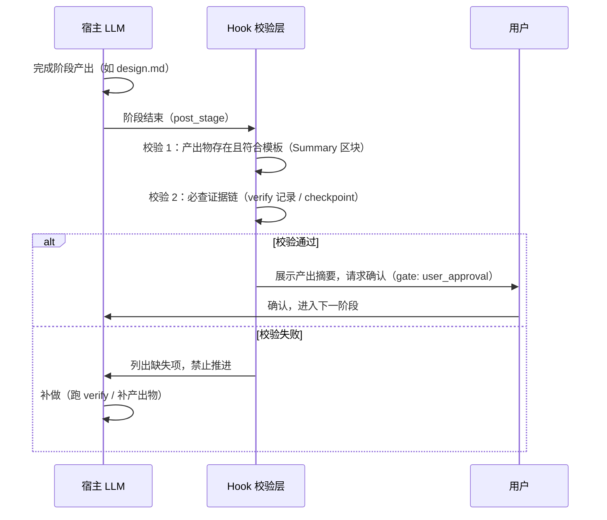

# dev-agent-harness 引入 Function Calling：提示词驱动 + 关键节点硬校验

::: tip 本文定位
本文是 dev-agent-harness 的**优化计划**（设计稿），讨论如何引入 Function Calling 与 Hook 机制，在**保留宿主 CLI 对话体验**的前提下，把"靠提示词约束 LLM"升级为"关键节点硬校验"。**Phase 0（Hook 基建）已实施**，见文末[十二、评审结论与落地情况](#十二评审结论与落地情况)。
:::

::: info 前置阅读
- [dev-agent-harness 项目介绍](/ai-agent/harness-engineering/dev-agent-harness) - 项目现状
- [Function Calling 与工具调用](/ai-agent/function-calling) - Function Calling 基础
- [核心思想](/ai-agent/harness-engineering/core-concepts) - Harness Engineering 理论
:::

---

## 一、为什么想引入 Function Calling

dev-agent-harness 目前是**纯提示词驱动**：`harness.md` 入口 → 读 YAML 工作流 → 按阶段加载 SKILL.md → LLM 在宿主工具（QoderCLI / Claude Code / Cursor）里自驱动执行。

这套设计解决了很多问题，但有一个天花板：**LLM 手里有全部宿主工具（Bash / Read / Write），提示词只能"要求"，无法"强制"**。文章里自己承认了这一点：

> `harness.md` 反合理化红旗表：*"这些不是硬门禁，而是注意力提醒。"*

Function Calling 的价值在于：它可以把"验证、记账、检查点"这些**确定性动作**变成工具通道，配合 Hook 校验，让 LLM 的偷懒行为无法通关。

---

## 二、方案演进：从"全权接管"到"关键节点介入"

最初的设想是**runtime 全权接管**：runtime 自己调 LLM（第二个 LLM），剥夺宿主 LLM 的全部工具，只留注册通道。但这个方案在讨论中被否掉了，有三个致命问题：

| # | 问题 | 说明 |
|---|------|------|
| 1 | 入口不可能改变 | 用户肯定直接跟 CLI 对话，不会去启动一个独立 runtime |
| 2 | 上下文割裂 | 第二个 LLM 没有用户的对话历史，上下文只能靠文件传递，体验断裂 |
| 3 | runtime 太重 | 全量接管意味着要实现几十个工具，重活全堆在自己身上 |

**修正后的方向**：宿主 LLM 继续驱动全部流程（对话、规划、写代码、产出文档），runtime 不做全权接管，只在**关键确定性节点**介入——提供薄工具 + 记录证据 + 阶段校验。

```
宿主 LLM 驱动全部流程（用户直接跟 CLI 对话，上下文不割裂）
        │
        ▼ 只在确定性节点介入
   ┌──────────────────────────────┐
   │ verify()    宣称测试通过前必经 │  ← 真实 exit code
   │ read 记账   读文件自动记账     │  ← 赖账不可能
   │ checkpoint() 阶段结束自动落盘  │  ← 含 git hash
   │ gate 校验   产出物不达标不放行  │  ← 止损点前移
   └──────────────────────────────┘
```

**为什么这样可行**：LLM 在简单任务上会遵守提示词（首个提示词基本都会执行），失忆/走样发生在任务变复杂、上下文变多之后。所以不需要全程强制，只需要在**关键节点兜底**——把可靠性从"依赖 LLM 全程自觉"降级为"只在少数节点依赖自觉"。

---

## 三、现状诊断：软约束的六个漏洞

对照源码，可靠性短板精确对应以下位置：

| # | 痛点 | 源码证据 | 为什么管不住 |
|---|------|---------|-------------|
| 1 | 验证可绕过 | `harness.md` 红旗表第一条：*"测试应该能过，先声明完成吧"* | `verify.js` 是 CLI，LLM 可以选不跑，还能谎报输出 |
| 2 | Context Ledger 纯自觉 | `harness.md`：*"每次读取新文件后，追加记录"* | 忘记/漏记没有后果，AI 可能赖账 |
| 3 | checkpoint 手工操作 | `state-checkpoint/SKILL.md`：*"读取 JSON → 更新 → 写回"* | LLM 手写 JSON，格式错误、忘写都可能 |
| 4 | 阶段门禁是软约束 | `feature.yaml` 的 `gate: user_approval` | 全靠 LLM "自觉"等用户确认，跳步无惩罚 |
| 5 | skill-log 靠 LLM 跑脚本 | `feature.yaml` 每个 stage 的 `action: skill-log` | 同样是提示词指令，可跳过 |
| 6 | 执行日志靠 LLM 自述 | `execution-log.md` 由 LLM 事后撰写 | 事后回忆会失真，reflecting 的输入不可靠 |

**根因一句话**：可靠性模型建立在"LLM 会自觉遵守提示词"之上，而 LLM 做不到。

---

## 四、可靠性层级模型：L2 和"技能里放脚本"到底差在哪

> 批注问题：只在关键节点做成 MCP 工具的话，和"写工具脚本 + 提示词引导"差别也不大，可靠性总不会那么强吧？
>
> 这个问题问到了要害。把"可靠性"拆成四个层级就清楚了——**选择权在谁手里**是分水岭：

| 层级 | 做法 | 选择权在谁 | 可靠性 | 实现成本 |
|------|------|-----------|--------|---------|
| **L0** | 纯提示词 + 技能脚本（现状） | LLM：可以不跑、可以谎报 | 最弱 | 零 |
| **L1** | 关键节点 MCP 工具（只注册） | LLM：可以调、**可以不调** | 比 L0 强一点（参数规范、执行真实），但差别不大 | 低 |
| **L2** | MCP 工具 + **Hook 检测 + gate 证据校验** | 系统：不调 = 阶段不放行、当场被提醒 | 质的提升 | 中（薄工具 + hook 脚本 + 校验逻辑） |
| **L3** | runtime 全权接管（第二个 LLM） | 系统：除通道外无路可走 | 最强 | 高（gateway + 工具循环全自建，且上下文割裂） |

### L1 和"技能里放脚本"确实差不多——但 L2 不是 L1

如果只看"把 `verify` 包成 MCP 工具然后用提示词引导"，那确实是换汤不换药——**因为选择权还在 LLM 手里，它不调，一切白搭**。

L2 的本质区别在于：MCP 工具不是用来"引导"的，而是用来**留下规范化证据**的——工具化是地基，hook + gate 校验才是关键：

- LLM 用 Bash 直接跑 `npm test` → PostToolUse hook 当场拦截提醒
- LLM 干脆不跑测试直接写报告 → gate 校验发现 test-report 里没有 verify 记录 → 阶段不放行

到这里，**选择权从 LLM 手里移交给了系统**——"不调工具"变成有后果的行为。这是"技能里放脚本"永远做不到的，因为脚本没有配套的"不执行就过不了关"。

### L2 与 L3 的差距：检测 vs 剥夺

L2 的 hook 是**检测**，不是**剥夺**——LLM 总能找到绕过检测的方式（命令变体、换工具跑命令）。L3 的"除通道外无路可走"是物理强制。所以：

- **L2 是成本较低的实现**：不动架构、体验不变、工具实现少，立刻能用
- **L3 runtime 层较重**：要实现 gateway、完整工具循环、上下文管理，且用户不再直接对话宿主

### L2 与 L3 全维度对比

| 维度 | L2：宿主环境（MCP + hook + gate） | L3：代码调用模式 |
|------|----------------------------------|------------------|
| 谁驱动流程 | 宿主 LLM（用户对话的那个） | 自己的代码循环里的 LLM |
| 工具来源 | 原生工具库（Bash/Read/Write）+ 注册的 MCP 工具 | **只有**代码里注册的 tools 数组 |
| 有没有后门 | **有**：不调 MCP 工具，可以用 Bash 绕 | **没有**：不调就无路可走 |
| 命中能力 | 一样（模型能力） | 一样（模型能力） |
| 谎言拦截 | 两层：hook 检测（软）+ gate 校验（硬） | 一层：gate 校验（硬）——但没有后门，这一层就够 |
| hook 盲区 | 有：命令变体、换工具跑命令，检测规则覆盖不全 | 无（没有 Bash 可绕） |
| 证据链 | MCP 调用记录在宿主手里（拿不全），verify 结果文件在 workspace 可读 | 全量自控：参数/exit code/时间戳全落盘 |
| 上下文 | 完整连续，对话历史都在 | 割裂，靠任务文件传递 |
| 用户确认 | 走宿主 permission / gate 系统，现成 | 自己实现（或省略） |
| 会话管理 / 记忆 / 断点恢复 | 宿主现成（续聊、checkpoint 文件） | 全部自己造 |
| 实现成本 | 低：MCP server（薄）+ hook 脚本 + gate 脚本 | 高：gateway + 工具循环 + 会话/上下文管理 |
| 使用体验 | 照常跟 CLI 对话，无感 | 面对自己的 CLI，体验自己负责 |
| 适用范围 | 个人即插即用，多个宿主都能挂 | 团队 / 产品化，完全可控 |

**核心差异浓缩**：

> **L2 是"给宿主装门禁"**——便宜、体验好，但门禁是检测：LLM 有 Bash 后门，hook 的检测规则总有覆盖不到的盲区，抓到一次是一次。
>
> **L3 是"自己盖楼"**——贵、上下文割裂，但门禁是物理的：没有 Bash、没有后门，gate 校验一层就够，不需要 hook。

**怎么选**：先用 L2（成本低、立刻能用、拦截大部分偷懒，性价比最高）→ 用一段时间观察：如果 hook 盲区被钻的次数多、偷懒依然频繁 → 把出问题的阶段升级 L3。**L2 打底，L3 补漏**——体验留在宿主，强制留给关键节点。

### 渐进路径：不是二选一，是升级路线

```
Phase 1-5：L2（hook + gate 校验）——不动架构，体验不变，立刻能用
Phase 6 起：把高频出问题的阶段（大概率是 testing）升级为 L3
            ——该阶段切 runtime 强制驱动，其余阶段保持 L2
```

L2 的 hook、工具、校验代码在 L3 里全部复用，不是白做。**混合架构**：大部分阶段宿主驱动（体验好），关键阶段 runtime 强制（可靠）。

---

## 五、核心思路：提示词驱动 + 关键节点硬校验

### 双通道设计

```
软通道（保留）：提示词 + SKILL.md —— 流程怎么走、产出什么格式
硬通道（新增）：工具 + Hook —— 关键节点必须留下真实证据
```

提示词负责"怎么做"，工具/Hook 负责"不做就过不了关"。

### "强制"的三层机制

> 批注问题：如何约束 LLM 除了调用 function 之外无路可走？通过提示词约束吗？
>
> **不是提示词**。提示词只是"告知"，真正的约束来自三层机制：

1. **工具引导（Function Calling）**：`verify()` / `checkpoint_save()` 等以工具形式注册给宿主 LLM，LLM 按 JSON Schema 传参调用，结果真实落盘。**调用记录本身就是证据**——比提示词"记得跑 verify.js"可靠得多。

   > 批注问题：还能把 function 提供给宿主 LLM 吗？是不是必须代码调用 LLM？
   >
   > **可以，不需要自己调 LLM**。给宿主 LLM 注册工具有两种主流方式：
   > - **MCP（Model Context Protocol）**：写一个 MCP server（JSON-RPC 暴露工具定义 + 实现），在宿主配置里注册即可。你本机的 QoderCLI 就注册了 playwright MCP——我在对话里直接调用 `browser_navigate` 等工具，这就是"宿主工具"模式
   > - **宿主原生自定义工具**（如 Claude Code 的 Tools / Skills）
   >
   > 可靠度对比：

   | 维度 | 宿主工具模式（MCP/自定义工具） | 代码调用模式（自己调 LLM） |
   |------|------------------------------|--------------------------|
   | 谁执行 | 宿主 LLM 在对话中直接调注册工具 | 自己的代码循环里调 LLM |
   | 上下文 | 连续，不割裂 | 割裂，靠文件传递 |
   | 强制力 | 弱——LLM 可以不调用 | 强——可环境剥夺 |
   | 证据完整性 | 有调用记录，但宿主不提供完整证据链 | 全量可控，exit code 全落盘 |
   | 实现成本 | 低（写 MCP server） | 高（gateway + 工具循环全自建） |
   >
   > 代码调用确实"更可靠"（强制力 + 证据），但代价是上下文割裂；宿主工具模式够用且体验好，配合 Hook 校验兜底后可靠性可接近前者——这正是本方案"关键节点介入"的依据。

2. **Hook 拦截（兜底引导）**：宿主 LLM 可能绕过工具直接用 Bash 跑命令。通过 Hook（如 QoderCLI 的 PostToolUse）检测关键动作：检测到直接跑测试命令而没走 `verify()` → 当场提醒并记录违规；检测到阶段产物缺失 → 拦截阶段推进。Hook 是"引导 + 记录"，不是"剥夺"。

   > 批注问题：Hook 拦截具体是怎么做到的？
   >
   > **实现机制**（以 QoderCLI 为例，Claude Code / Codex 机制相同）：
   >
   > 1. **配置**：在 `~/.qoder-cn/settings.json` 注册事件 + 匹配规则 + 脚本：
   > ```json
   > {
   >   "hooks": {
   >     "PostToolUse": [
   >       {
   >         "matcher": "Bash|Write",
   >         "hooks": [
   >           { "type": "command", "command": "node .harness/hooks/check-verify.js", "timeout": 5 }
   >         ]
   >       }
   >     ]
   >   }
   > }
   > ```
   > 2. **触发**：每次 LLM 调用 Bash/Write 工具后，CLI 把工具调用上下文（含命令/参数）通过 **stdin JSON** 传给 hook 脚本——`matcher` 支持精确工具名、`Bash|Edit` 多值、正则，甚至 `Bash(npm test*)` 按命令模式匹配
   > 3. **响应**：脚本检查命令是否为绕过行为（如直接跑 `npm test` 而 `verify` 未注册），向 stdout 输出 JSON 控制行为：
   > ```json
   > {
   >   "decision": "block",
   >   "reason": "检测到直接执行测试命令，请改用 verify() 工具",
   >   "systemMessage": "测试必须通过 verify() 执行，结果才会被计入证据链",
   >   "hookSpecificOutput": "（可选）追加给 LLM 的提示"
   > }
   > ```
   > `decision: block` 即拦截该工具调用并把原因反馈给 LLM；也可以只输出 `systemMessage` 提醒不阻断（引导模式）。退出码 `2` 也表示阻塞（stderr 作为反馈）。
   >
   > **三个主流 CLI 都支持 hooks**，事件模型一致：

   | CLI | 支持 | 关键事件 | 配置位置 |
   |-----|------|---------|---------|
   | QoderCLI | ✅ | PreToolUse / PostToolUse / PostToolUseFailure / UserPromptSubmit / SessionStart / Stop / PermissionRequest 等 | `~/.qoder-cn/settings.json` 的 `hooks` 键 |
   | Claude Code | ✅ | PreToolUse / PostToolUse / PostToolUseFailure / UserPromptSubmit / Stop / SubagentStart / SubagentStop / SessionStart 等 | `~/.claude/settings.json` 或项目 `.claude/settings.json` |
   | Codex | ✅ | PreToolUse / PostToolUse / UserPromptSubmit / SessionStart / SessionEnd / SubagentStart / SubagentStop / Stop / PermissionRequest / PreCompact / PostCompact（**配置层事件键 PascalCase**，与 Claude Code 一致；协议层序列化为 snake_case） | `config.toml`（另有 `requirements.toml` 的 `allow_managed_hooks_only` 可强制只运行受管理 hook，团队场景无法被用户绕过） |
   >
   > **重要差异（实施时从源码核实）**：Codex 对 hook stdout 是**严格校验**（`deny_unknown_fields`）——输出里出现未定义字段会导致整个输出被丢弃（表现为提醒消失，不会崩溃）。因此跨 CLI 脚本的 stdout 只能输出**交集字段**：`hookSpecificOutput.hookEventName` + `additionalContext`（三个 CLI 都认）。拦截统一走 exit 2 + stderr（三个 CLI 语义一致，stderr 作 reason）。
   >
   > 结论：**"检测绕过并当场提醒"不是设想，是三个 CLI 都有的标准能力**，方案落地只需要写 hook 脚本。

3. **证据校验闭环（最后防线）**：LLM 仍然可以"说谎"——不调用工具，直接文本输出"测试通过了"。但这只是**声明**，不是**证据**。阶段校验时检查：test-report.md 必须附带 `verify()` 的真实记录（exit code、日志路径），而这些记录只能由 `verify()` 产生。没有调用 → 没有记录 → 产物不完整 → 阶段不放行。

所以这套机制的准确含义是：**不能阻止 LLM 说谎，但可以让谎言无法通关**。说谎从"免费"变成"付费"——代价是阶段永远过不去，直到它补上真实的工具调用。

### 为什么不需要"第二个 LLM"

本方案**不引入独立 runtime LLM**：宿主 LLM 保有完整对话上下文，全程与用户对话的是同一个 LLM，不存在上下文割裂问题。runtime 层退化为"工具 + 校验"的轻量代码层。

---

## 六、架构设计

```
┌────────────────────────────────────────────────────────┐
│              宿主 CLI（QoderCLI / Claude Code / Cursor）  │
│                                                        │
│  用户 ⇄ 宿主 LLM（遵守 harness.md + SKILL.md 驱动流程）    │
│              │                    │                    │
│       常规工具（保留）         harness 工具（新增）        │
│       Bash / Read / Write     verify / checkpoint /    │
│       / Edit / ...            skill-log / git-facts    │
│              │                    │                    │
│              ▼                    ▼                    │
│   ┌──────────────────────────────────────────┐        │
│   │              Hook 校验层（新增）            │        │
│   │  PostToolUse: 检测绕过工具的关键动作并提醒  │        │
│   │  PostStage:   校验产出物 + 证据链完整性     │        │
│   └──────────────────────────────────────────┘        │
└────────────────────────────────────────────────────────┘
        │
        ▼
┌────────────────────────────────────────────────────────┐
│            runtime/（轻量工具层，Node.js）                │
│                                                        │
│  verify.js        包装现有验证脚本，返回结构化结果        │
│  checkpoint.js    自动落盘 + git hash（git rev-parse）  │
│  skill-log.js     自动记录技能执行                      │
│  ledger.js        context-ledger 记账                  │
│  gate-check.js    阶段产物模板校验                      │
└────────────────────────────────────────────────────────┘
        │ 复用（不改动）
        ▼
┌────────────────────────────────────────────────────────┐
│   现有纯文件资产                                        │
│   harness.md / workflows/*.yaml / skills/              │
│   / templates/ / knowledge/                           │
└────────────────────────────────────────────────────────┘
```

**与旧方案的架构对比**：

| 维度 | 全权接管（已否决） | 关键节点介入（当前方案） |
|------|------------------|----------------------|
| 谁驱动流程 | runtime 的 LLM | 宿主 LLM（用户对话的那个） |
| 上下文 | 割裂，靠文件传递 | 不割裂，宿主保有完整对话 |
| 工具实现量 | 几十个全量实现 | 4-5 个薄封装 |
| 强制方式 | 环境剥夺（唯一通道） | 工具引导 + Hook 提醒 + 证据校验 |
| 使用体验 | 用户要启动独立 runtime | 照常跟 CLI 对话 |

---

## 七、工具清单

### P0 — 先做这四个，解决最大痛点

| 工具 | 调用场景 | 返回 | 替换/解决 |
|------|---------|------|----------|
| `verify(commands)` | 测试阶段强制验证 | 真实 exit code + 日志路径 + 结果 JSON | 包装 `verify.js`，调用即证据，**不可伪造** |
| `checkpoint_save(stage, outputs)` | 每阶段结束 | 落盘 JSON + runtime 自己取 `git rev-parse HEAD` | 替换 state-checkpoint 的手工 JSON 操作 |
| `skill_log(action, skill)` | 技能执行前后 | 自动写 skill-logs | 替换 `skill-log.js` 的自觉触发 |
| `ledger_append(file, reason)` | 读文件后记账 | 追加 ledger 记录 + 查重提示 | 替换手工维护 Context Ledger |

以 `verify` 为例，JSON Schema 定义（可直接喂给支持自定义工具/MCP 的宿主）：

```javascript
const tools = [
  {
    type: 'function',
    function: {
      name: 'verify',
      description: '执行验证命令并返回真实 exit code。宣称"测试通过/构建成功"前必须调用此工具。',
      parameters: {
        type: 'object',
        properties: {
          commands: {
            type: 'array',
            items: { type: 'string' },
            description: '要执行的命令列表，如 ["npm run test:unit", "npm run build"]',
          },
          phase: {
            type: 'string',
            enum: ['testing', 'reviewing', 'implementing'],
            description: '当前所处阶段',
          },
        },
        required: ['commands', 'phase'],
      },
    },
  },
]
```

### P1 — 增强确定性事实

| 工具 | 调用场景 | 解决 |
|------|---------|------|
| `git_facts(action)` | status / diff / hash / log | 文件清单、变更内容从实际状态取，杜绝 LLM 凭记忆描述 |
| `gate_check(stage)` | 阶段结束校验 | 产出物是否存在、模板区块是否齐全、verify 记录是否必查 |

### 载体说明

工具的注册方式取决于宿主能力，**优先级从高到低**：

1. **自定义工具 / MCP**（Claude Code、支持 MCP 的宿主）：以 function calling 形式注册，LLM 直接结构化调用
2. **Hook 注入**（QoderCLI hooks）：不注册工具，而是在 LLM 尝试用 Bash 跑命令时拦截引导
3. **纯提示词 + 校验**（兜底）：提示词要求调用 CLI 脚本，阶段校验强制检查产物

---

## 八、及时止损：阶段门禁前移

原方案"干完不认可 = 白干"的问题，靠**把校验点从最终交付前移到每个阶段结束**解决：

```
最终交付校验（被动）：任务全跑完 → 发现产物不合格 → 白干
阶段门禁（主动止损）：每个阶段结束 → 校验产出物 → 不合格当场拦下
```

**止损流程**（对应 `feature.yaml` 的 `post_stage` 钩子）：



**止损的另一个关键**：Hook 检测到"绕过行为"（直接 Bash 跑测试、不写 ledger）时**当场提醒**，而不是默默记录等最后算账——LLM 失忆是渐进的，越早提醒代价越小。

### gate 校验的具体实现

gate 校验就是"阶段结束时用脚本检查产出物和证据链，不合格不放行"。挂在阶段产出之后、进入下一阶段之前，载体有两种（可叠加）：

- **Hook 自动触发**：`PostToolUse` 匹配 `Write` 工具——检测到 LLM 写入 `test-report.md` 这类阶段产出物时自动跑校验脚本
- **阶段推进时触发**：LLM 声称"进入下一阶段"时先跑校验，通过才放行

**校验项清单**：

| 检查项 | 检查逻辑 | 数据来源 |
|--------|---------|---------|
| 产出物存在 | `design.md` / `test-report.md` 文件是否存在 | 读 `workspace/{task-id}/` 目录 |
| 模板完整 | 是否包含 `Summary for downstream`、`Anti-Cherry-Pick Declaration` 等必含区块 | 读 `templates/` 模板定义对比 |
| **证据链**（最关键） | 测试报告是否附带 `verify()` 的真实记录（exit code、日志路径） | 读 `workspace/{task-id}/verify/verification-result.json` |
| 内容有效 | 文件非空、JSON 可解析、exit code 与报告结论一致 | 解析产物内容 |

**实现示例（gate-check.js，几十行）**：

```javascript
// gate-check.js —— 阶段门禁校验（以 testing 阶段为例）
const stage = 'testing'
const taskDir = 'workspace/task-123'

const checks = []

// 1. 产出物存在
checks.push({
  name: 'output-exists',
  pass: fs.existsSync(`${taskDir}/test-report.md`),
})

// 2. 模板区块完整（Anti-Cherry-Pick 是测试报告的必含区块）
const report = fs.readFileSync(`${taskDir}/test-report.md`, 'utf8')
checks.push({
  name: 'template-section',
  pass: report.includes('## Anti-Cherry-Pick Declaration'),
})

// 3. 证据链：verify 的真实记录必须存在且通过
const verifyReport = `${taskDir}/verify/verification-result.json`
const hasVerify = fs.existsSync(verifyReport)
const verifyOk = hasVerify
  ? JSON.parse(fs.readFileSync(verifyReport)).overall_status === 'passed'
  : false
checks.push({ name: 'verify-evidence', pass: hasVerify && verifyOk })

// 4. 汇总输出（hook 模式输出 JSON 给 CLI 决策）
const failed = checks.filter(c => !c.pass)
if (failed.length > 0) {
  console.log(JSON.stringify({
    decision: 'block',
    reason: `阶段校验失败：${failed.map(c => c.name).join(', ')}`,
    systemMessage: '请补齐上述证据后再申请进入下一阶段',
  }))
  process.exit(2)
}
console.log(JSON.stringify({ decision: 'allow' }))
```

CLI 收到 `decision: block` → 拦截阶段推进，把 `reason` 反馈给 LLM，LLM 补做（跑 verify / 补区块）后重新校验。

**好消息：现有资产已有雏形，不用从零写**：

- `verify.js` 执行完已经会生成 `verification-result.json`（含 `overall_status`、每个命令的 exit code）——这就是证据文件，gate 校验只要读它
- `templates/` 就是校验基准——`Anti-Cherry-Pick Declaration`、`Summary for downstream` 的格式定义都在模板里
- `feature.yaml` 的 `post_stage` 就是天然挂载点——每个 stage 定义里已有钩子位置，校验脚本塞进去即可

---

## 九、与现有资产的关系（兼容性）

- **不破坏纯文件模式**：`tools/*.js` 保留，`harness.md` 继续可用。工具层是**可选增强**，不是替代品
- **SKILL.md 语义保留**：SKILL.md 的"执行步骤"在增强模式下变成工具调用指引（"用 `verify` 跑测试，用 `checkpoint_save` 记录进度"）
- **工作流 YAML 原样复用**：`post_stage` 钩子天然是校验挂载点，`gate: user_approval` 语义不变
- **知识闭环增强**：工具调用记录 + Hook 拦截记录自动生成真实版 `execution-log.md`，reflecting 的输入更可靠

---

## 十、实施阶段规划

| 阶段 | 内容 | 验收标准 |
|------|------|---------|
| **Phase 0** ✅ | **Hook 基建先行**：`hooks/` 四脚本（post-tool-log / check-verify / gate-check / install）+ `hook-init` SKILL.md | 一套脚本随 submodule 分发，install.js 一键注册到 QoderCLI / Claude Code / Codex；管道模拟测试全通过（详见[十二、评审结论与落地情况](#十二评审结论与落地情况)） |
| **Phase 1** | `verify` 工具化（注册到宿主 / hook 引导）+ 阶段产出校验 | 测试阶段产物必须含 verify 真实记录，否则不放行 |
| **Phase 2** | `checkpoint_save` + `skill_log` 自动落盘 | 任务中断后能从 checkpoint 恢复，skill-log 全量留痕 |
| **Phase 3** | Hook 拦截层：绕过检测 + 当场提醒 | 直接 Bash 跑测试会被提醒并记录违规 |
| **Phase 4** | `git_facts` + `ledger_append` | 确定性事实全部走工具通道，ledger 自动记账 |
| **Phase 5** | 用真实项目（如 taskflow）跑完整任务验证（L2 完整态） | 与纯提示词模式对比，验证不可跳过、止损及时 |
| **Phase 6** ⏸️ | L3 试点：把 testing 阶段升级为 runtime 强制驱动（**暂缓**：L3 太重，先做好 L2；将来可用 dsh 作为 L3 载体） | 测试阶段除 verify 通道外无路可走，其余阶段保持 L2 |

### Phase 6 的模型选型：双模型混合与成本权衡

L3 有一个 L2 没有的特权：**runtime 是代码调用 LLM，模型可插拔**——宿主模型由用户对话习惯决定（换模型 = 用户换习惯），而 runtime 模型只是配置文件里的一个参数。所以"宿主一个模型、runtime 另一个模型"的混合场景，只在 L3 成立。

#### 为什么值得混合

两个 LLM 的负载特征完全不同：

| 维度 | 宿主 LLM | Runtime LLM |
|------|---------|-------------|
| 职责 | 对话、规划、写代码、生成文档 | 看状态 → 决定调哪个工具 → 解析结果 → 决定下一步 |
| 调用次数 | 少（一次任务 2-5 次） | 多（工具循环 5-20 次，测试反复失败更多） |
| 单次上下文 | 大（数万 token，全量上下文） | 小（状态摘要 + 工具结果，几千 token） |
| 模型能力需求 | 高（复杂推理、长程记忆） | 中（任务单一、无长程记忆需求） |

典型直觉：**少而大的调用用强模型，多而小的调用用便宜模型**。

#### 成本拆解（显性部分）

以单次 feature 任务粗估（假设宿主 3 次调用 × 40k 输入 / 2k 输出，runtime 15 次调用 × 3k 输入 / 0.5k 输出，价格按 2026 年市价量级）：

| 方案 | 宿主成本 | Runtime 成本 | 总成本 | 说明 |
|------|---------|-------------|--------|------|
| 全强模型（Sonnet 级） | $0.45 | $0.25 | **$0.70** | 基线，无模型变量 |
| 混合（宿主 Sonnet + runtime Haiku 级） | $0.45 | $0.08 | **$0.53** | runtime 成本降 70%，总成本降 ~24% |
| 全便宜模型 | $0.15 | $0.08 | **$0.23** | 总成本最低，但宿主体验与命中率双重风险 |

注意：宿主调用占大头，所以混合省的是 runtime 那一小块——**总成本下降比例取决于 runtime 调用占比**，测试反复失败、工具循环多的任务，混合收益越大。

#### 成本拆解（隐性部分）：命中率才是真正的成本变量

省下的钱可能被"命中率下降"吃回去。runtime 模型越便宜，工具命中率越低，而失败的代价不止是重试：

```
runtime 命中率下降
  → 工具循环重试（runtime 成本 × 1/命中率）
  → 更糟：错误结论导致测试报告造假风险 / 返工
  → 返工一轮 = 宿主重新驱动 implementing → 宿主成本 ×(1+返工率)
```

返工一轮的宿主成本（$0.45）约等于全 Sonnet 方案的总成本（$0.70）的 60%——**只要返工一次，混合方案省下的 $0.17 就全吐回去了**。所以：

> 混合模型省的是 token 单价的钱，赔的是命中率的钱。选择 runtime 模型档位，本质是在两条成本曲线之间找 U 型底部。

#### 落地方法：先同款、再降档、用数据定档

1. **Phase 6 起步**：runtime 先用与宿主同款模型跑通，排除模型变量，只验证机制（L3 的循环、gate、止损是否成立）
2. **逐级降档**：同款 → 中档 → 便宜档 → 本地模型（Ollama），每档跑 N 个真实任务，记录两个指标：工具命中率、阶段返工率
3. **定档**：画出"档位 vs 总成本（显性 + 返工折算）"曲线，取 U 型底部，不拍脑袋选最便宜的

#### 更细的混合：runtime 内部也能分级

runtime 的工具循环里，节点对模型能力的需求并不一样：

- **机械节点**（`skill_log`、`checkpoint_save`、`ledger_append`）：工具参数基本是固定的，LLM 只做"要不要调、填什么"——便宜模型毫无压力，甚至可以直接去掉 LLM 用确定性代码
- **语义节点**（verify 结果判断、是否回退 implementing、报告结论）：需要理解测试输出、判断证据是否充分——必须保持强模型

这正呼应 skill-interface.md 的"确定性输入与语义判断分离"原则：**能确定性的交给代码（零成本），必须语义判断的才交给 LLM，且按节点分级配模型**。

---

## 十一、风险与权衡

| 风险 | 说明 | 缓解 |
|------|------|------|
| Hook 是"软强制" | 宿主 LLM 仍有全部原生工具，Hook 只能提醒不能剥夺 | 接受"简单任务靠自觉，关键节点靠校验"的定位；校验闭环兜底 |
| 依赖宿主开放程度 | 自定义工具 / MCP / Hook 的开放度各宿主不同 | 载体降级链：自定义工具 → Hook → 提示词+校验，逐级可用 |
| LLM 语义绕过 | LLM 该调 `verify` 不调，直接声明完成 | gate 校验强制：测试报告无 verify 记录 → 阶段不放行 |
| 工具越多选择越难 | 工具列表太长，LLM 选择困难 | 保持 P0 四个核心工具，P1 按需注册，按阶段动态注入 |
| runtime 模型能力不足 | 工具命中率下降，返工成本吃掉省钱收益 | 先同款后降档的定档实验，语义节点保持强模型 |
| 拦截误伤 | Hook 误判正常操作，打断流程 | 拦截只做"提醒 + 记录"，放行权仍在 LLM/用户 |

---

## 十二、评审结论与落地情况

> 2026-08 评审结论：对设计稿的 8 条评审意见中，**1-6 采纳并实施（Phase 0），7 暂缓（L3 太重，先做好 L2；将来可用 dsh 作为 L3 载体），8 不采纳（成本模型，暂不关注）**。

### 评审意见与结论

| # | 评审意见 | 结论 | 落地 |
|---|---------|------|------|
| 1 | gate 校验的触发点不明确：宿主 hook 没有"阶段推进"事件 | ✅ 采纳 | **双触发**：PostToolUse 匹配 Write 产出物 + Stop 终检（对应 dsh 的 turn-stopping 终检点），`gate-check.js` 已实现 |
| 2 | execution-log 靠 LLM 自述不可靠，需要真实执行日志 | ✅ 采纳 | **post-tool-log**：每次 Bash/Write 后自动追加 `workspace/tool-actions.log`（最小会话日志），async 不阻塞 |
| 3 | verify.js 自身不可靠（execSync 无 timeout、逗号拼接命令） | ✅ 采纳 | **待实施（Phase 1 前置）**：加 timeout / cwd / JSON 传参 |
| 4 | checkpoint 手工 JSON 操作易错 | ✅ 采纳 | **待实施（Phase 2）**：文件级 git hash 由 runtime 自动取 |
| 5 | hook 拦截可能误伤正常操作 | ✅ 采纳 | **hook 只提醒、gate 才否决**：check-verify 输出提醒不拦截；否决权全部交给 gate-check 的证据校验 |
| 6 | 应该先做 hook 基建（Phase 0） | ✅ 采纳 | **已完成**：hooks/ 四脚本 + hook-init SKILL.md + install.js |
| 7 | 用 dsh 做 L3 载体 | ⏸️ 暂缓 | L3 太重，先做好 L2；dsh 的"钩子能改写不只是拦截"思路留作 L3 参考 |
| 8 | 成本模型分析 | ❌ 不采纳 | 暂不关注 |

### 已落地的 Phase 0：hooks/ 四脚本

```
.harness/
├── hooks/                    ← 脚本层：一套，随 submodule 分发
│   ├── lib.js                ← 共享：读 stdin、定位项目根、跨 CLI 兼容输出
│   ├── post-tool-log.js      ← 工具调用自动记账（async，永不阻塞）
│   ├── check-verify.js       ← 绕过检测提醒（只提醒，不拦截）
│   ├── gate-check.js         ← 阶段门禁（产出物 + 模板区块 + verify 证据，exit 2 阻塞）
│   └── install.js            ← 安装器：检测 CLI → 生成对应注册配置
└── skills/framework/
    └── hook-init/SKILL.md    ← 技能层：跑 install.js + 验证 + 故障排查
```

**跨 CLI 兼容的关键设计**（实施时从 Codex 源码核实）：

- **拦截统一 exit 2 + stderr**：三个 CLI 语义一致（stderr 作 reason；Codex 下 stderr 为空会被视为失败，所以必须写）
- **提醒只输出交集字段**：Codex 对 stdout 严格校验未知字段（`deny_unknown_fields`），输出超集字段会导致提醒被静默丢弃 → 脚本 stdout 只输出 `hookSpecificOutput.hookEventName` + `additionalContext`
- **配置格式按 CLI 生成**：QoderCLI / Claude Code 写 JSON（`.qoder/settings.json` / `.claude/settings.json`），Codex 写 TOML（`.codex/config.toml`，`[[hooks.PostToolUse]]` 数组表，事件键 PascalCase）
- **合并策略**：读现有配置 → 按 hook name 去重 → 备份原文件（`.bak-时间戳`）→ 写回；TOML 无法安全合并数组表，已有 hooks 段时追加并提示人工检查

**实测结果**（管道模拟 stdin，全通过）：

| 场景 | 输入 | 预期 | 结果 |
|------|------|------|------|
| 记账 | PostToolUse(Bash, `npm run build`) | tool-actions.log 追加一行 | ✅ |
| 绕过提醒 | PostToolUse(Bash, `npm test`) | 输出 hookSpecificOutput 提醒 | ✅ |
| 门禁拦截 | testing 阶段写 test-report.md，缺 verify 证据 | exit 2 + 缺失项列表 | ✅ |
| 门禁放行 | verify 证据存在（passed） | exit 0 | ✅ |
| 无任务容错 | 无 checkpoint 的目录跑 Stop | exit 0（不打扰） | ✅ |
| 安装器 | install.js --cli=qoder/codex | 配置生成、幂等（重复安装不重复添加） | ✅ |
| 配置合并 | 已有自定义 hooks 的 settings.json | 保留原有，只追加 harness hooks | ✅ |

### 与设计稿的偏差

1. **载体优先级调整**：原设计"自定义工具 / MCP 优先"→ 实施时**hook 先行**（Phase 0 只有 hook，没有 MCP 工具），因为 hook 三个 CLI 原生支持、无需 MCP server；MCP 工具留给 Phase 1 的 verify
2. **工具清单调整**：P0 四工具（verify / checkpoint_save / skill_log / ledger_append）→ hook 版先做 post-tool-log（替代 ledger_append 的记账）+ gate-check（替代 skill_log 的留痕校验）；`verify` 仍是 Phase 1 主角
3. **Codex 事件名修正**：设计稿原写小驼峰（preToolUse / postToolUse），源码核实为 **PascalCase**（与 Claude Code 一致），协议层才序列化为 snake_case

---

## 十三、总结

一句话概括这个方案：

> **提示词负责"怎么做"，工具与 Hook 负责"不做就过不了关"。LLM 在关键节点留下的每一个真实证据，都是可靠性的一层保险。**

方案相比"全权接管"的修正在于：**不换大脑，只装门禁**。宿主 LLM 继续跟你对话、规划、写代码（不割裂上下文），runtime 只在验证、记账、检查点、阶段门禁这几个确定性节点兜底——工具实现更轻，止损点更早，体验无感。

可靠性按成本递进：**L2（hook + gate 校验）成本低、立刻能用**——Phase 0 已落地（hooks/ 四脚本 + hook-init），在真实项目跑通后再考虑把高频出问题的阶段升级为 L3（runtime 强制，暂缓）——渐进升级，每层代码复用，不推倒重来。

## 延伸阅读

- [dev-agent-harness 项目介绍](/ai-agent/harness-engineering/dev-agent-harness) - 项目现状与核心机制
- [DeepSeek Harness 案例研究](/ai-agent/case-studies/deepseek-harness) - L3 的参考对象：钩子能改写不只是拦截
- [Function Calling 与工具调用](/ai-agent/function-calling) - 工具定义与调用流程
- [质量控制对比](/ai-agent/harness-engineering/quality-control) - 现有质量控制机制的边界
