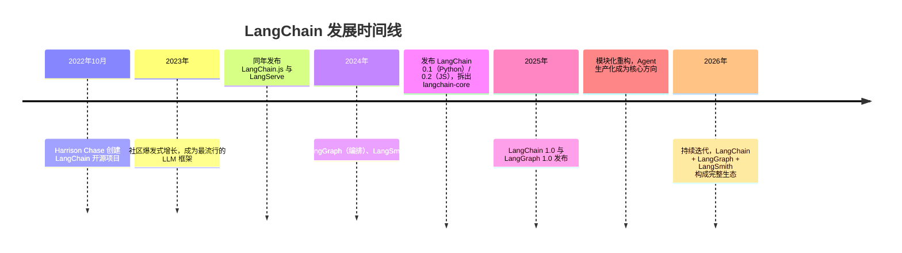
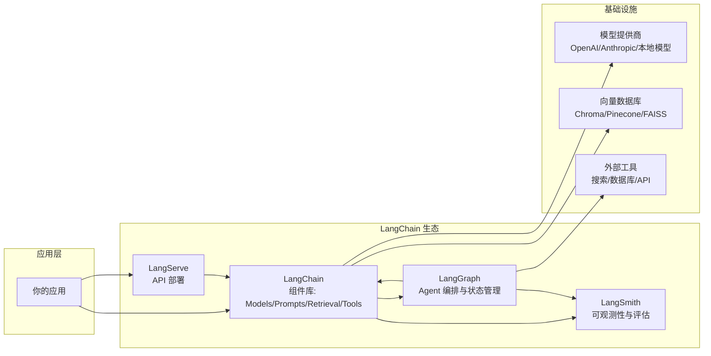
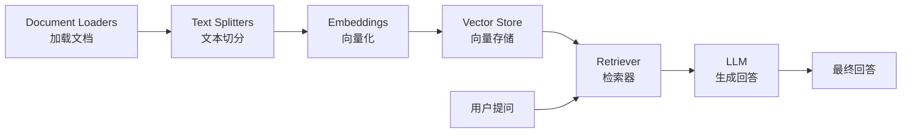
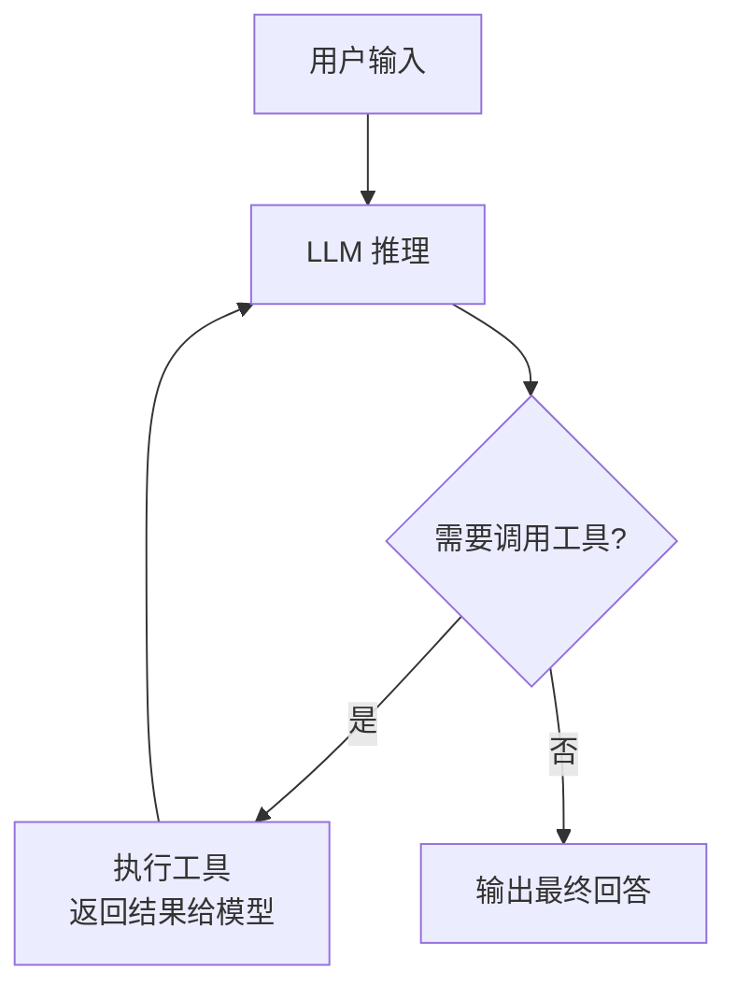
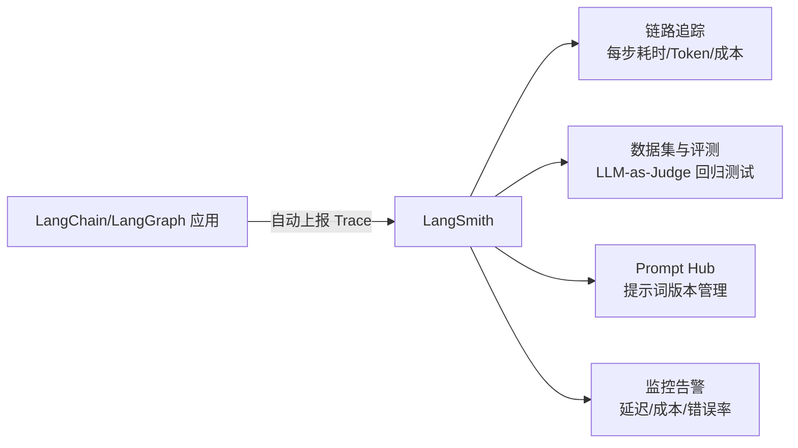
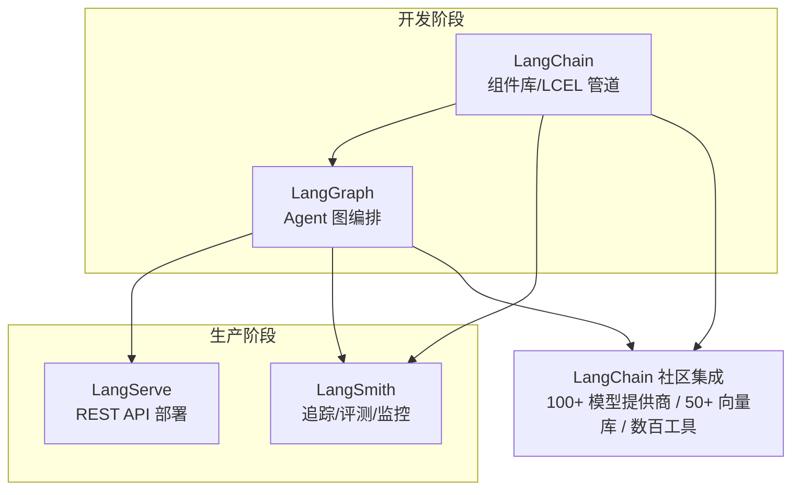

# LangChain 框架介绍

LangChain 是当前最流行的 LLM 应用开发框架。本文从设计思想、核心组件、生态全家桶到代码实战，全面介绍 LangChain 是什么、能做什么、怎么用。

## 为什么需要 LangChain

直接调用大模型 API（如 OpenAI、Claude）做简单问答很容易，但构建真实业务应用时，会反复遇到这些痛点：

| 痛点 | 具体表现 |
|------|----------|
| **供应商差异** | OpenAI、Anthropic、Google、本地模型（Ollama）的 API 格式各不相同，切换成本高 |
| **应用逻辑碎片化** | 提示词管理、输出解析、对话记忆、工具调用、向量检索……每个环节都要自己造轮子 |
| **缺乏标准抽象** | 团队内部没有统一的概念模型，代码难以复用和协作 |
| **生产化困难** | 流式输出、重试、追踪、评估、部署等工程能力需要重复建设 |

LangChain 的答案：**提供一套标准化的组件抽象和可组合的管道，让你像搭积木一样构建 LLM 应用**。

## 什么是 LangChain

LangChain 是一个开源的 LLM（大语言模型）应用开发框架，由 Harrison Chase 于 2022 年 10 月创建，现由 LangChain 公司维护。它有 Python 和 JavaScript/TypeScript（LangChain.js）两个版本。

### 发展历程



### 定位变化：从"链"到"Agent 编排"

LangChain 早期以 **Chain（链）** 为核心概念——把固定流程串成管道。但随着 Agent 兴起，2024 年起官方把重心转向 **LangGraph**（图状态机编排），LangChain 本身回归为"组件库"，提供模型、提示词、检索、工具等标准化组件。



## 核心设计思想

### 1. 组件化

一切皆组件：模型、提示词、解析器、加载器、分割器、向量库、检索器、工具、记忆……每个组件职责单一，可独立替换。

### 2. 统一抽象

不同供应商的模型被封装成统一的 `ChatModel` 接口，切换供应商只需换一行构造函数。

### 3. 可组合

通过 LCEL（LangChain Expression Language）和 `Runnable` 协议，组件之间可以用 `|` 管道符直接串联。

### 4. 提供商无关

`@langchain/openai`、`@langchain/anthropic`、`@langchain/ollama` 等集成包让同一套业务代码对接任意模型。

## 核心组件详解

### Model I/O（模型输入输出）

#### ChatModels（对话模型）

统一封装各家大模型，接口一致：

```typescript
import { ChatOpenAI } from "@langchain/openai";
import { ChatAnthropic } from "@langchain/anthropic";

// 换供应商只改这一行
const model = new ChatOpenAI({ model: "gpt-4o", temperature: 0.7 });
// const model = new ChatAnthropic({ model: "claude-sonnet-4" });

const response = await model.invoke([
  { role: "system", content: "你是一个友好的助手" },
  { role: "user", content: "你好" },
]);
console.log(response.content); // 输出文本
```

支持的模型家族：OpenAI、Anthropic、Google Gemini、Meta Llama、Mistral、DeepSeek、本地 Ollama 等 100+ 集成。

#### Prompt Templates（提示词模板）

```typescript
import { ChatPromptTemplate } from "@langchain/core/prompts";

const prompt = ChatPromptTemplate.fromMessages([
  ["system", "你是{role}专家，请用{language}回答"],
  ["human", "{question}"],
]);

const messages = await prompt.invoke({
  role: "前端",
  language: "中文",
  question: "什么是闭包？",
});
```

支持变量插值、Few-shot 示例注入、消息历史格式化。

#### Output Parsers（输出解析器）

把模型的自由文本解析成结构化数据：

```typescript
import { StructuredOutputParser } from "langchain/output_parsers";
import { z } from "zod";

const parser = StructuredOutputParser.fromZodSchema(
  z.object({
    title: z.string().describe("标题"),
    points: z.array(z.string()).describe("要点列表"),
  })
);

const chain = prompt.pipe(model).pipe(parser);
const result = await chain.invoke({ ... }); // 得到 { title, points }
```

常用解析器：`StringOutputParser`、`JsonOutputParser`、`StructuredOutputParser`、`CommaSeparatedListOutputParser` 等。

### Retrieval（检索/RAG 管线）

这是 LangChain 最受欢迎的能力之一，配套完整的 RAG 组件：



#### Document Loaders（文档加载器）

支持 PDF、Markdown、Word、HTML、CSV、JSON、Notion、飞书、网页等 100+ 格式：

```typescript
import { PDFLoader } from "@langchain/community/document_loaders/fs/pdf";
import { TextLoader } from "langchain/document_loaders/fs/text";

const loader = new PDFLoader("docs/manual.pdf");
const docs = await loader.load(); // Document[]
```

#### Text Splitters（文本分割器）

按语义合理切分长文本，避免切断语义：

| 分割器 | 特点 | 适用场景 |
|--------|------|----------|
| `RecursiveCharacterTextSplitter` | 按分隔符递归切分，保留段落结构 | 通用首选 |
| `CharacterTextSplitter` | 按固定字符切分 | 简单场景 |
| `TokenTextSplitter` | 按 Token 数切分 | 精确控制上下文窗口 |
| `MarkdownHeaderTextSplitter` | 按 Markdown 标题结构切分 | 文档类内容 |
| `RecursiveJsonSplitter` | 按 JSON 结构切分 | 结构化数据 |

```typescript
import { RecursiveCharacterTextSplitter } from "@langchain/textsplitters";

const splitter = new RecursiveCharacterTextSplitter({
  chunkSize: 500,        // 每块约 500 字符
  chunkOverlap: 50,      // 相邻块重叠 50 字符，保持上下文连贯
});
const chunks = await splitter.splitDocuments(docs);
```

#### Embeddings（向量化）

把文本映射为向量，用于语义相似度计算：

```typescript
import { OpenAIEmbeddings } from "@langchain/openai";

const embeddings = new OpenAIEmbeddings({ model: "text-embedding-3-small" });
const vector = await embeddings.embedQuery("什么是闭包");
```

#### Vector Stores（向量存储）

支持 Chroma、Pinecone、Qdrant、FAISS、Milvus、pgvector 等 50+ 数据库，API 统一：

```typescript
import { Chroma } from "@langchain/community/vectorstores/chroma";
import { MemoryVectorStore } from "langchain/vectorstores/memory";

// 内存版（开发用）
const store = await MemoryVectorStore.fromDocuments(chunks, embeddings);

// 生产版：Chroma 等持久化存储
// const store = new Chroma(embeddings, { collectionName: "kb" });
```

#### Retrievers（检索器）

从向量库取回相关文档，支持多种检索策略：

- **相似度检索（默认）**：按向量距离返回 Top-K
- **MMR（最大边际相关）**：兼顾相关性与多样性
- **Contextual Compression**：先用小模型压缩文档，再交给大模型
- **MultiQuery**：把一个问题拆成多个子问题分别检索

```typescript
const retriever = store.asRetriever({ k: 4 }); // 返回最相关的 4 个片段
const relevant = await retriever.invoke("闭包的作用域规则");
```

### Memory（记忆）

管理多轮对话的上下文，有几种策略：

| 记忆类型 | 实现 | 特点 |
|----------|------|------|
| 消息窗口记忆 | `BufferWindowMemory` | 只保留最近 N 轮，Token 可控 |
| 全部历史记忆 | `BufferMemory` | 完整保留，长对话成本高 |
| 摘要记忆 | `SummaryBufferMemory` | 长对话压缩为摘要，节省 Token |
| 向量检索记忆 | `VectorStoreRetrieverMemory` | 按相关度取回历史，适合超长会话 |

**注意**：LangChain 1.0 之后官方更推荐直接把对话历史存进 `messages` 列表由应用自己管理，Memory 类组件逐渐边缘化。

### Tools（工具）

让模型能够调用外部能力（搜索、数据库、API）：

```typescript
import { tool } from "@langchain/core/tools";
import { z } from "zod";

const weatherTool = tool(
  async ({ city }) => {
    // 实际调用天气 API
    return `${city} 今天 25°C，晴`;
  },
  {
    name: "get_weather",
    description: "查询指定城市的天气",
    schema: z.object({
      city: z.string().describe("城市名"),
    }),
  }
);
```

### Agents（智能体）

Agent 的核心：**模型自主决定调用哪个工具、调几次、何时结束**。



LangChain 的 Agent 实现经历了三代演进：

| 代际 | 代表 | 说明 |
|------|------|------|
| 第一代 | `ReAct`、`ZeroShotAgent` | 文本格式推理，靠 prompt 引导，脆弱 |
| 第二代 | `createToolCallingAgent` | 基于原生 Tool Calling（Function Calling），主流方案 |
| 第三代 | `LangGraph Agent`（`createAgent`） | 图状态机编排，可流式、可持久化、可干预 |

```typescript
// 现代写法：LangGraph 的 createAgent
import { createAgent } from "@langchain/langgraph/prebuilt";
import { ChatOpenAI } from "@langchain/openai";

const agent = await createAgent({
  llm: new ChatOpenAI({ model: "gpt-4o" }),
  tools: [weatherTool],
});

const result = await agent.invoke({ messages: [{ role: "user", content: "北京今天天气怎么样？" }] });
```

### Callbacks（回调钩子）

在组件执行的关键节点挂载钩子，用于日志、追踪、流式处理：

```typescript
import { BaseCallbackHandler } from "@langchain/core/callbacks";

class LogHandler extends BaseCallbackHandler {
  name = "log_handler";
  async handleLLMStart(llm, prompts) {
    console.log("开始调用模型:", prompts[0]);
  }
  async handleLLMEnd(output) {
    console.log("模型输出:", output.generations[0][0].text);
  }
}

const response = await model.invoke("你好", {
  callbacks: [new LogHandler()],
});
```

## LCEL 与 Runnable 协议

LCEL（LangChain Expression Language）是 LangChain 的设计核心：**一切组件都实现 `Runnable` 接口，可以用 `|` 管道组合**。

### Runnable 三大方法

| 方法 | 说明 |
|------|------|
| `invoke(input)` | 同步执行，返回结果 |
| `batch(inputs)` | 批量执行，自动并发 |
| `stream(input)` | 流式输出（Token 逐字返回） |

### 管道组合

```typescript
import { ChatPromptTemplate } from "@langchain/core/prompts";
import { StringOutputParser } from "@langchain/core/output_parsers";

const prompt = ChatPromptTemplate.fromTemplate("用一句话解释{concept}");
const parser = new StringOutputParser();

// 管道串联：提示词 → 模型 → 解析器
const chain = prompt.pipe(model).pipe(parser);

const result = await chain.invoke({ concept: "闭包" });
// "闭包是函数记住并访问其外部作用域变量的能力"

// 流式输出
for await (const chunk of chain.stream({ concept: "Promise" })) {
  process.stdout.write(chunk);
}
```

### 常用 Runnable 变体

- `RunnableSequence`：串行执行（`|` 的等价物）
- `RunnableParallel`：并行执行多个分支
- `RunnablePassthrough`：透传数据，用于把输入传给下一步
- `RunnableLambda`：把任意函数包装成 Runnable
- `RunnableMap`：对输入做字段映射

LCEL 让代码从"命令式 if/else 拼装"变成"声明式管道"，同时免费获得流式、批量、重试、追踪能力。

## LangChain 生态全家桶

2024 年之后，LangChain 不再是单一框架，而是一个生态：

### LangGraph（Agent 编排引擎）

LangGraph 把 Agent 流程建模为**有状态图**：节点（执行逻辑）和边（流转条件），支持循环、条件分支、状态持久化。

| 能力 | 说明 |
|------|------|
| **StateGraph** | 用图定义 Agent 流程，天然支持循环（工具调用多次） |
| **Checkpoint** | 状态持久化，中断后可恢复（断点续跑） |
| **Human-in-the-loop** | 关键步骤暂停等待人工审批/输入 |
| **流式与流控** | 按节点粒度流式，可设置递归上限防死循环 |
| **多 Agent** | 支持多个 Agent 协作（supervisor、handoff 等模式） |

```typescript
import { StateGraph, Annotation } from "@langchain/langgraph";

const State = Annotation.Root({
  messages: Annotation<BaseMessage[]>({
    reducer: (x, y) => x.concat(y),
  }),
});

const graph = new StateGraph(State)
  .addNode("agent", agentNode)
  .addNode("tools", toolsNode)
  .addEdge("agent", "tools")
  .addConditionalEdges("tools", shouldContinue) // 循环直到不需要工具
  .addEdge("agent", "__end__")
  .compile();
```

### LangSmith（可观测与评估平台）

LLM 应用的生产必备：每条链路（LLM 调用、工具调用、检索）自动记录 trace，支持数据集评测、回归测试、Prompt 版本管理。



### LangServe（API 部署）

把 Chain 或 Agent 一键部署为 REST API，自动生成 OpenAPI 文档和 Playground 调试界面，支持流式响应（SSE）。

```typescript
import { Runnable } from "@langchain/core/runnables";

const chain: Runnable = prompt.pipe(model).pipe(parser);

// FastAPI 风格：POST /invoke、/stream、/batch
app.add_routes(RunnableLambda(chain));
```

### 生态全景图



## 代码实战：完整示例

### 示例一：快速开始（Chat + 流式）

```typescript
import { ChatOpenAI } from "@langchain/openai";

const model = new ChatOpenAI({
  model: "gpt-4o-mini",
  temperature: 0.5,
  apiKey: process.env.OPENAI_API_KEY, // 也可用环境变量
});

// 流式输出
const stream = await model.stream("讲个三句话的冷笑话");
for await (const chunk of stream) {
  process.stdout.write(chunk.content);
}
```

### 示例二：完整 RAG 问答（知识库问答）

```typescript
import { ChatOpenAI, OpenAIEmbeddings } from "@langchain/openai";
import { TextLoader } from "langchain/document_loaders/fs/text";
import { RecursiveCharacterTextSplitter } from "@langchain/textsplitters";
import { MemoryVectorStore } from "langchain/vectorstores/memory";
import { ChatPromptTemplate } from "@langchain/core/prompts";
import { StringOutputParser } from "@langchain/core/output_parsers";

// 1. 加载文档
const loader = new TextLoader("docs/knowledge-base.txt");
const docs = await loader.load();

// 2. 切分文档
const splitter = new RecursiveCharacterTextSplitter({
  chunkSize: 500,
  chunkOverlap: 50,
});
const chunks = await splitter.splitDocuments(docs);

// 3. 向量化并存入向量库
const embeddings = new OpenAIEmbeddings();
const store = await MemoryVectorStore.fromDocuments(chunks, embeddings);

// 4. 构建 RAG 管道：检索 + 提示词 + 模型
const prompt = ChatPromptTemplate.fromMessages([
  ["system", "仅根据以下资料回答问题，资料不足以回答时请说明：\n\n{context}"],
  ["human", "{question}"],
]);

const chain = prompt
  .pipe(new ChatOpenAI({ model: "gpt-4o-mini" }))
  .pipe(new StringOutputParser());

// 5. 检索并生成
const question = "什么是闭包？";
const relevant = await store.similaritySearch(question, 4);
const context = relevant.map((doc) => doc.pageContent).join("\n\n");

const answer = await chain.invoke({ context, question });
console.log(answer);
```

### 示例三：Agent 工具调用

```typescript
import { createAgent } from "@langchain/langgraph/prebuilt";
import { ChatOpenAI } from "@langchain/openai";
import { tool } from "@langchain/core/tools";
import { z } from "zod";

const searchTool = tool(
  async ({ query }) => {
    // 模拟搜索引擎
    return `关于"${query}"的搜索结果：...`;
  },
  {
    name: "web_search",
    description: "搜索互联网获取最新信息",
    schema: z.object({ query: z.string() }),
  }
);

const agent = await createAgent({
  llm: new ChatOpenAI({ model: "gpt-4o" }),
  tools: [searchTool],
  systemMessage: "你是助手，需要最新信息时使用搜索工具。",
});

const result = await agent.invoke({
  messages: [{ role: "user", content: "帮我查一下今天的前端框架新闻" }],
});

console.log(result.messages.at(-1).content);
```

## 生态对比：LangChain 与其他框架

| 框架 | 定位 | 核心抽象 | 优势 | 适用场景 |
|------|------|----------|------|----------|
| **LangChain** | 全栈 LLM 应用框架 | 组件 + 管道 | 生态最大、组件最全、文档丰富 | 各类 LLM 应用、RAG、原型到生产 |
| **LangGraph** | Agent 编排引擎 | 图状态机 | 可控循环、持久化、人机协同 | 复杂 Agent、多步骤工作流 |
| **LlamaIndex** | 数据框架 | 索引 + 检索 | 数据连接器多、检索精细 | 数据密集型 RAG、知识库 |
| **AutoGen**（微软） | 多 Agent 对话框架 | 对话式多 Agent | 多智能体协作模式成熟 | Multi-Agent 研究原型 |
| **CrewAI** | 角色化多 Agent | Crew + 角色 | 上手简单、抽象直观 | 固定团队分工的多 Agent |
| **Haystack**（deepset） | 检索流水线框架 | Pipeline | 检索/问答深耕、企业级 | RAG、搜索问答系统 |
| **Vercel AI SDK** | AI UI 工具链 | `useChat`/`streamText` | 与前端框架无缝集成 | 前端 AI 应用、流式 UI |
| **Dify / Coze** | 低代码平台 | 可视化编排 | 无需写代码 | 业务团队快速搭建 |

**选型建议：**

- 需要**深度定制 Agent 逻辑** → LangGraph（或直接手写状态机）
- **纯 RAG/知识库** → LangChain 或 LlamaIndex 均可
- **前端为主的应用** → Vercel AI SDK + 后端自己写
- **快速验证想法** → 手写 API 调用（几十行代码就够）
- **复杂多 Agent 生产系统** → LangGraph + LangSmith 是当前最主流组合

## 优缺点与争议

### 优点

- **生态最庞大**：模型、向量库、工具的集成数量遥遥领先
- **组件齐全**：RAG、Agent、记忆、输出解析一站式解决
- **LCEL 设计优雅**：声明式管道，流式/批量/追踪免费获得
- **演进方向正确**：LangGraph + LangSmith 补齐了编排和生产观测能力
- **社区活跃**：教程、示例、企业实践丰富

### 缺点

- **API 变动频繁**：历史上多次大版本破坏性变更，网上旧教程大量过期
- **抽象层级多**：为了兼容不同供应商，概念名词多（Runnable、Chain、Agent、Node……），学习曲线陡
- **调试困难**：问题可能藏在任意一层封装里，排查成本高
- **过度设计风险**：简单场景用 LangChain 反而更复杂
- **供应商锁定疑虑**：虽然模型可切换，但对框架本身的依赖会越来越深
- **性能开销**：多一层抽象就多一层序列化/包装开销，对延迟敏感场景不友好

### 社区争议

LangChain 一直伴随"过度封装""没必要"的批评（"LangChain 无用论"）。客观来说：**它能帮你快速搭出 80% 的常见场景，但 20% 的复杂场景需要你理解底层原理甚至绕开它**。这也是本文最后一部分想说的。

## 实战建议：什么时候用，什么时候不用

### 适合用 LangChain

- 需要对接**多种模型供应商**（做模型路由/降级）
- 需要**多种文档格式**的加载与切分
- 需要**多向量库**兼容（本地开发用内存库，生产切 Pinecone）
- 想快速从 0 搭出 RAG 或 Agent 原型
- 团队需要**统一抽象**来协作

### 不适合用 LangChain

- 只调一家模型 API 的简单对话 → 直接用官方 SDK，几十行搞定
- 对**延迟和成本**极度敏感 → 手写更可控
- 业务逻辑复杂、需要深度定制 → LangGraph 甚至自己写状态机
- 团队无人熟悉框架 → 学习成本可能大于收益

### 学习路线建议

1. 先搞懂 **LLM API 基础**（[LLM API 调用基础](/ai-agent/llm-api-basics)），理解底层再学框架
2. 掌握 **LCEL 与 Runnable**：这是理解一切的钥匙
3. 上手 **RAG 组件**：加载 → 切分 → 向量化 → 检索（配合 [RAG 入门](/ai-agent/rag/introduction)）
4. 学习 **LangGraph**：把 Agent 从"黑盒"变成"看得见的图"
5. 接入 **LangSmith**：建立"先追踪、再评估"的生产习惯

## 总结

- LangChain 是**组件化、可组合**的 LLM 应用开发框架，核心价值是标准化抽象
- 核心组件：Model I/O、Retrieval、Memory、Tools、Agents、Callbacks
- LCEL / Runnable 协议是其设计灵魂，`|` 管道组合一切
- 2024 年后演化为生态：**LangChain（组件）+ LangGraph（编排）+ LangSmith（观测）+ LangServe（部署）**
- 优势是生态全、上手快；劣势是抽象重、API 变动频繁
- **选型原则**：简单场景手写，复杂场景用生态，始终理解底层原理

---

## 🔗 相关资源

### 本模块相关文章

- [LLM API 调用基础](/ai-agent/llm-api-basics) - 先学会直接调用模型
- [RAG 入门](/ai-agent/rag/introduction) - 检索增强生成原理
- [AI 应用架构模式](/ai-agent/app-architecture) - Chat/Agent/Workflow 三种模式
- [Function Calling 与工具调用](/ai-agent/function-calling) - Agent 的技术基础
- [AI 应用工程化实践](/ai-agent/app-engineering) - 评估、监控、成本、安全

### 官方文档

- [LangChain Python 文档](https://python.langchain.com/docs) - 官方文档（生态最全）
- [LangChain.js 文档](https://js.langchain.com/docs) - JavaScript/TypeScript 版
- [LangGraph 文档](https://langchain-ai.github.io/langgraph/) - Agent 编排引擎
- [LangSmith 文档](https://docs.smith.langchain.com/) - 可观测与评估平台

### 开源项目

- [LangChain (GitHub)](https://github.com/langchain-ai/langchain) - 主仓库
- [LangGraph (GitHub)](https://github.com/langchain-ai/langgraph) - 编排引擎
- [langchain.js (GitHub)](https://github.com/langchain-ai/langchainjs) - JS/TS 版
