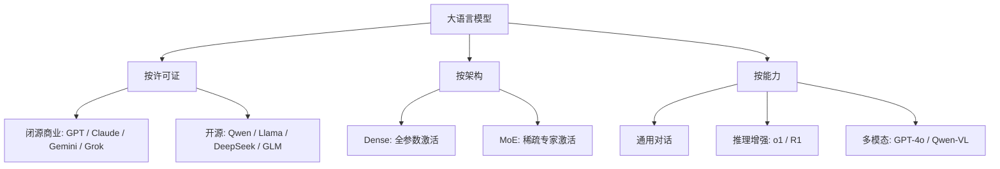
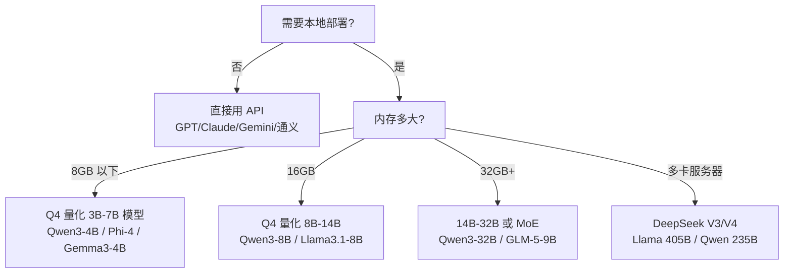

# 大模型全景介绍

> 从 GPT、Claude 到 Qwen、DeepSeek——主流大语言模型（LLM）生态全景，涵盖开源与闭源模型的演进、特点与选型思路。

## 什么是大语言模型

大语言模型（Large Language Model，LLM）是基于 **Transformer 架构**、在海量文本上预训练得到的深度神经网络模型。核心能力来自"参数规模 + 数据规模"的涌现效应：参数量越大、训练数据越多，模型就越能表现出对话、推理、代码生成甚至工具调用等复杂能力。

### 常见名词速览

| 名词 | 含义 |
|------|------|
| **参数量（B）** | 模型权重数量，1B ≈ 10 亿参数。通常越大越聪明，但推理更慢、更吃内存 |
| **上下文窗口** | 一次能处理的最大 token 数，如 128K、1M |
| **量化（Quantization）** | 将权重从 FP16 压缩为 INT8/INT4，大幅降低内存占用，牺牲少量精度 |
| **Dense / MoE** | Dense 每次推理激活全部参数；MoE 只激活部分专家网络，效率更高 |
| **推理模型（Reasoning）** | 通过思维链训练，擅长数学、逻辑等复杂推理（如 o1、R1） |
| **多模态** | 不仅能处理文本，还能理解图片、音频、视频 |

## 模型分类



### 开源 vs 闭源

| 维度 | 闭源商业模型 | 开源模型 |
|------|-------------|----------|
| **代表** | GPT、Claude、Gemini | Qwen、Llama、DeepSeek、GLM |
| **获取方式** | API 按 token 付费 | 下载权重，自由部署 |
| **可控性** | 黑盒，数据上云 | 完全可控，可本地部署 |
| **隐私** | 数据需传给厂商 | 数据不出本地 |
| **成本** | 长期使用成本高 | 一次性硬件成本，之后免费 |
| **效果上限** | 通常最高 | 与闭源头部差距逐年缩小 |
| **许可证** | 不可商用/需授权 | 各家不同（Apache-2.0 / Llama License 等） |

---

## 闭源商业模型

闭源模型通过 API 提供服务，效果通常最强，适合对效果要求高、无隐私顾虑的场景。

### OpenAI GPT 系列

当前闭源模型的标杆，演进路线：GPT-3.5 → GPT-4 → GPT-4o（多模态）→ o1（推理）→ GPT-5 → GPT-5.6。

- **GPT-4o**：多模态统一模型，文本/图片/语音一体化，速度快
- **o1 / o3 系列**：推理增强模型，数学、代码、逻辑题能力显著强于通用模型
- **GPT-5**：2025 年发布，统一了通用与推理能力，能自主判断何时"深度思考"
- **GPT-5.6**：2026 年的旗舰迭代，继续提升推理与 Agent 能力

### Anthropic Claude 系列

以"安全、长文本、编程"著称，路线：Claude 3 → 3.5 → 3.7 → 4 → 4.5 → 4.6。

- 按定位分三个档位：**Opus**（最强旗舰）、**Sonnet**（均衡主力）、**Haiku**（轻量快速）
- Claude 4.5/4.6 在编程和 Agent 场景口碑极佳，常被视为"写代码最好的闭源模型"之一
- 长上下文支持好，适合处理大文档

### Google Gemini 系列

背靠 Google 的生态和算力，路线：Gemini 1.5 → 2.0 → 2.5 → 3。

- 强项是**超长上下文**（最高 1M+ token）和多模态理解
- Gemini 3 是 2025 年底的旗舰，原生多模态 + 原生工具调用
- 2026 年团队重组（布林接管），3.5 Pro 一度传出取消，战略仍在调整

### xAI Grok 系列

马斯克旗下 xAI 出品，Grok 4.6 是 2026 年 8 月最新版本。

- 特点是实时接入 X（推特）数据，风格更"叛逆"
- Grok 4 系列在代码和数学评测中一度登顶
- 开源过 Grok-1（2024，314B MoE），但新版本闭源

### 国内闭源 API

| 厂商 | 模型 | 特点 |
|------|------|------|
| 阿里云 | 通义千问 Max | 中文生态完善，阿里云一站式 |
| 百度 | 文心一言 ERNIE | 中文传统强厂 |
| 字节跳动 | 豆包 Doubao（Seed 系列） | 便宜量大，中文性价比高 |
| 月之暗面 | Kimi | 超长上下文（最早 200K），Agent 能力强 |
| 腾讯 | 混元 Hunyuan | 中文场景、微信生态 |
| 智谱 | GLM（商业 API 版） | 中文模型老牌厂商 |

> 注：以上国内模型大多有对应的开源版本（如通义 Qwen、豆包 Seed、智谱 GLM），闭源 API 版通常更大、效果更好。

---

## 开源模型（重点）

开源模型权重公开，可以本地部署、微调、商用（注意各家许可证），是个人开发者和小团队的首选。近年来开源与闭源的差距快速缩小，2026 年头部开源模型（DeepSeek、Qwen）在部分评测上已经与闭源旗舰互有胜负。

### 1. Qwen 系列（阿里通义）⭐ 中文开源首选

演进：Qwen → Qwen1.5 → Qwen2 → Qwen2.5 → **Qwen3**（2025）→ Qwen3.5（2026）。

- 参数量覆盖 **0.6B 到 235B（MoE）**，每个规模档位都有开源，生态极其完整
- 中文能力在开源模型中第一梯队，多模态有 Qwen2.5-VL（视觉）
- Qwen3 引入了**思考/非思考双模式**（类似 o1 的推理开关）
- 本地部署友好：8B 级模型量化后 16GB 内存的笔记本即可流畅运行（本知识库的 RAG 聊天用的就是 qwen3:8b）
- Ollama 一键安装：`ollama pull qwen3:8b`

### 2. Llama 系列（Meta）⭐ 开源奠基者

演进：Llama 1（2023）→ Llama 2 → Llama 3 → Llama 3.1 → 3.2 → 3.3 → **Llama 4**（2025）。

- 第一个引爆开源生态的系列，几乎所有开源工具链都以它为基准
- 参数量 8B 到 405B，还有 1B/3B 的边缘端小模型
- **英文能力最强**，中文弱于 Qwen/DeepSeek
- 许可证为 Llama License（商用需遵守条款，>7 亿月活需 Meta 授权）
- Llama 4 首次引入 MoE 架构（Scout 109B / Maverick 400B）

### 3. DeepSeek 系列（深度求索）⭐ MoE 性价比之王

演进：DeepSeek-V2 → V3（2024 底）→ R1（推理）→ V3.1 → V3.2 → **V4 / V4-Flash**（2026）。

- **V3**：671B 总参数（37B 激活）MoE，训练成本仅 557 万美元，轰动业界
- **R1**：开源推理模型，效果对标 OpenAI o1，训练方法（强化学习 + 冷启动）影响了一整代模型
- 中文能力顶级，代码能力强，API 价格极低
- **V4**（2026）：继续用 MoE + 稀疏激活路线，V4-Flash 是轻量版，2026 年 8 月发布 V4 Pro-0813
- 完全开源（MIT 许可证），本地部署门槛较高（671B 需多卡，但蒸馏小模型如 R1-Distill-7B 可本地跑）

### 4. GLM 系列（智谱）⭐ 国产老牌

演进：ChatGLM-6B（2023，国产开源先驱）→ ChatGLM2/3 → GLM-4 → GLM-4.5/4.6 → **GLM-5.2**（2026）。

- 最早让中文开发者用上"免费本地模型"的功臣
- GLM-4 系列带工具调用、多模态（GLM-4V），代码能力不错
- GLM-5.2（2026 年 6 月）是新一代旗舰开源模型

### 5. Kimi 系列（月之暗面）

- 以**超长上下文**起家（Kimi K1 最早支持 200K+）
- **Kimi K2**（2025）开源，MoE 架构（1T 总参数/32B 激活），Agent 和编程能力很强
- 2026 年迭代到 K2.6/K2.7，K3 传闻对标闭源旗舰

### 6. Mistral 系列（法国）

- 欧洲开源代表，7B 小模型质量高
- **Mixtral 8x7B**：首个开源 MoE，8 个 7B 专家，只激活 2 个，性价比高
- Mistral Large 走闭源 API 路线

### 7. Gemma 系列（Google）

- Google 的开源系列，2B-27B，主打轻量
- **Gemma 3** 多模态，**Gemma-4**（2026）继续迭代
- 适合边缘设备、移动端

### 8. Phi 系列（微软）

- 主打"小模型大智慧"，3B-14B，用高质量合成数据训练
- 适合 CPU/边缘端推理

### 9. 其他值得关注的开源模型

| 模型 | 厂商 | 特点 |
|------|------|------|
| **InternLM / InternVL** | 上海 AI Lab | 书生浦语系列，多模态 InternVL 是开源视觉标杆 |
| **Yi 系列** | 零一万物 | 李开复团队，34B 档位中文能力强 |
| **Falcon** | TII | 中东地区开源代表 |
| **MiniCPM** | 面壁智能 | 端侧小模型，手机可跑 |
| **Dbrx** | Databricks | 132B MoE，企业数据场景 |

### 开源模型综合对比（2026 年视角）

| 模型 | 参数量 | 架构 | 中文 | 英文/代码 | 本地部署难度 | 许可证 |
|------|--------|------|------|-----------|-------------|--------|
| **Qwen3** | 0.6B-235B | Dense/MoE | ⭐⭐⭐⭐⭐ | ⭐⭐⭐⭐⭐ | 低（8B 即可） | Apache-2.0 |
| **DeepSeek V3/V4** | 671B MoE | MoE | ⭐⭐⭐⭐⭐ | ⭐⭐⭐⭐⭐ | 高（需多卡） | MIT |
| **DeepSeek R1** | 1.5B-671B | Dense/MoE | ⭐⭐⭐⭐ | ⭐⭐⭐⭐⭐ | 中（蒸馏版可跑） | MIT |
| **Llama 4** | 8B-400B | MoE | ⭐⭐⭐ | ⭐⭐⭐⭐⭐ | 中 | Llama License |
| **GLM-5** | 9B-305B | Dense/MoE | ⭐⭐⭐⭐⭐ | ⭐⭐⭐⭐ | 低 | MIT |
| **Kimi K2** | 1T(32B 激活) | MoE | ⭐⭐⭐⭐⭐ | ⭐⭐⭐⭐⭐ | 高 | 自定义 |
| **Mistral/Mixtral** | 7B-123B | Dense/MoE | ⭐⭐ | ⭐⭐⭐⭐ | 低 | Apache-2.0 |
| **Gemma 3** | 4B-27B | Dense | ⭐⭐⭐ | ⭐⭐⭐⭐ | 低 | Gemma License |

---

## 多模态模型

| 类别 | 模型 | 支持模态 |
|------|------|----------|
| 闭源 | GPT-4o / GPT-5 | 文本、图片、语音 |
| 闭源 | Gemini 2.5 / 3 | 文本、图片、视频、音频 |
| 闭源 | Claude 4.x | 文本、图片 |
| 开源 | **Qwen2.5-VL** | 文本、图片、视频（中文视觉最强） |
| 开源 | Llama 3.2 Vision | 文本、图片 |
| 开源 | InternVL 3 | 文本、图片、视频 |
| 开源 | GLM-4V / GLM-4.5V | 文本、图片 |

> 本知识库的 `qwen2.5vl:3b` 就是 Ollama 上的视觉模型，用于 dsh 插件的截图理解等场景。

---

## 模型架构核心概念

### Dense vs MoE

| 维度 | Dense | MoE（Mixture of Experts） |
|------|-------|--------------------------|
| 推理方式 | 激活全部参数 | 按 token 激活部分"专家" |
| 总参数 | 相对小 | 可以很大（数百 B 到 1T） |
| 推理成本 | 随参数量线性增长 | 总参数大但激活参数少，成本低 |
| 代表 | Qwen3-8B/32B、Llama 3 405B | DeepSeek V3/V4、Mixtral、Kimi K2、Qwen3-235B |

### 通用模型 vs 推理模型

- **通用模型**：直接给答案，速度快，适合日常对话、写作、翻译
- **推理模型**：先"思考"再回答（内部思维链），数学、逻辑、复杂编程更强，但更慢更贵
- 2025 年后趋势是**混合模式**：一个模型内自动切换（GPT-5、Qwen3 的 thinking 模式、Kimi K3）

---

## 本地部署与硬件选择

### 内存估算

模型推理内存 ≈ 参数量 × 每参数字节数：

| 精度 | 每参数字节 | 8B 模型 | 14B 模型 | 32B 模型 |
|------|-----------|---------|----------|----------|
| FP16 | 2B | 16GB | 28GB | 64GB |
| INT8 | 1B | 8GB | 14GB | 32GB |
| INT4（GGUF Q4） | 0.5B | 4.5GB | 8GB | 16GB |

### 16GB 内存笔记本实测（M1 Pro，本机）

| 模型 | 大小 | 用途 | 体验 |
|------|------|------|------|
| qwen3:8b | 5.2GB | 聊天/知识库问答 | ✅ 流畅，100% GPU |
| bge-m3 | 1.2GB | 中文向量检索 | ✅ 流畅 |
| qwen2.5vl:3b | 3.2GB | 视觉理解（截图等） | ✅ 可用 |

### 部署选型流程



### Ollama 常用命令

```bash
ollama pull qwen3:8b        # 下载聊天模型
ollama pull bge-m3          # 下载 embedding 模型
ollama list                 # 查看已安装模型
ollama ps                   # 查看当前加载的模型
ollama run qwen3:8b         # 交互式对话
ollama rm qwen2.5:7b        # 删除模型
```

---

## 如何选择模型

### 按场景选择

| 场景 | 推荐 |
|------|------|
| **中文知识库 / 中文应用** | Qwen3（开源）或通义千问 Max（API） |
| **英文写作 / 通用对话** | Claude Sonnet / GPT / Llama 3.1 |
| **编程（最强效果）** | Claude Opus / GPT-5.6 / Gemini 3 |
| **编程（免费本地）** | Qwen3-8B（量化）、DeepSeek R1 蒸馏版 |
| **数学 / 逻辑推理** | o1 / DeepSeek R1 / Kimi K3 |
| **超长文档分析** | Gemini / Kimi |
| **多模态（图片/视频）** | GPT-4o / Gemini / Qwen2.5-VL |
| **隐私敏感 / 离线** | 本地部署 Qwen3 / Llama / DeepSeek |
| **低成本大批量** | 豆包 / DeepSeek API / 开源小模型 |

### 个人开发者建议

1. **先确定效果下限**：你的场景对效果要求多高？能接受本地 8B 还是必须 API 旗舰？
2. **数据是否敏感**：敏感则必须本地部署，选 Qwen3-8B/14B
3. **按 80/20 原则**：80% 场景用性价比模型（Qwen/DeepSeek/豆包），20% 难点用旗舰（Claude/GPT）
4. **跟随社区**：开源模型迭代极快（2025-2026 年基本每月都有旗舰发布），选生态好、迭代勤的系列（Qwen、DeepSeek）更稳妥

---

## 总结

- **闭源**：GPT / Claude / Gemini / Grok 四强争霸，效果天花板，按 API 付费
- **开源**：Qwen、DeepSeek、Llama、GLM、Kimi 五强领跑，与闭源差距快速缩小
- **中文场景**：开源选 Qwen3 / DeepSeek / GLM，闭源选通义 / 豆包 / Kimi
- **本地部署**：16GB 内存跑 8B 量化模型完全够用，Ollama 是最简单的入口

## 参考资料

- [Ollama 模型库](https://ollama.com/library) - 本地模型一键安装
- [Hugging Face](https://huggingface.co) - 开源模型下载与社区
- [OpenAI](https://openai.com) / [Anthropic Claude](https://www.anthropic.com/claude) / [Google Gemini](https://gemini.google.com) 官方文档
- [DataLearner 大模型排行榜](https://www.datalearner.com/leaderboards) - 实时评测对比
