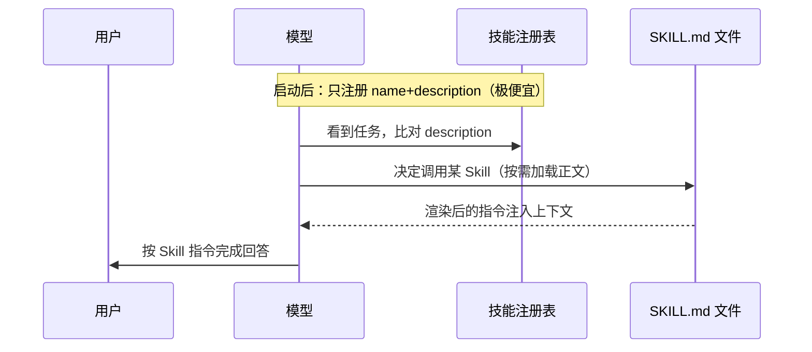
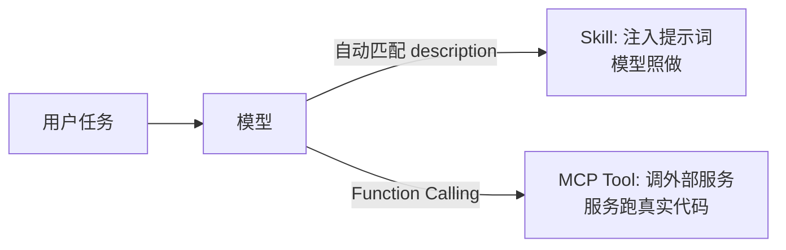

# Skill：文件化的提示词工程

> 本质一句话：**Skill 是一份被"按需注入到模型上下文里的 Markdown 提示词文件"**，它不执行任何特殊代码，智能全部来自 LLM 遵循这份文本指令。

它与本栏目 [基础技巧](./basics) 里讲的提示词工程是同一血脉——Skill 就是提示词工程的"工业化版本"：把一段专家指令沉淀成可发现、可复用、可治理的文件。

## 为什么需要 Skill

裸提示词工程每次都要在对话框里手敲一长段指令，有几个痛点：

```
裸提示词工程的痛点：
- 不可复用：同一个专家指令每次重抄
- 不可共享：团队成员各写各的，质量参差
- 不可发现：模型不知道"有这份能力"可用
- 不好约束：无法限制它能使用什么工具
```

Skill 把提示词工程**文件化、可复用、可治理**：

| 维度 | 裸提示词 | Skill |
|------|---------|-------|
| 载体 | 聊天框临时文字 | `SKILL.md` 文件，可版本管理、可共享 |
| 发现 | 手动粘贴 | 靠 `description` 让模型自动匹配触发 |
| 治理 | 无 | `allowed-tools` 工具白名单、`context: fork` 隔离 |
| 复用 | 每次重抄 | 一次写好，全项目/全用户复用 |

## 它怎么实现的（两段式加载）

核心是一个**懒加载（lazy loading）**设计，避免把所有 Skill 正文都塞进上下文撑爆 token。

### 阶段 1：启动注册（只加载元数据）

启动时扫描固定目录，对每个 `SKILL.md` 只解析 YAML frontmatter（`name` / `description` / `allowed-tools`），并估算正文 token 数。这些轻量元数据被放进**技能注册表**，以"可用技能清单"形式呈现给模型——模型因此知道"有这些技能、各自干嘛用"，但**完整正文还没进上下文**。

```
.codebuddy/skills/      # 项目级（优先级高）
~/.codebuddy/skills/    # 用户级
插件来源                # Plugin skills
```

### 阶段 2：触发时注入（按需拉正文）

当模型根据用户任务比对各 Skill 的 `description` 认为"该用这个了"（自动），或你手动 `/skill-name` 时：

1. 系统按名字从磁盘读取完整 `SKILL.md` 正文；
2. 做模板渲染：替换 `$ARGUMENTS`、`${ENV}`、执行 `!`command``、注入 `@file`；
3. 把渲染后的内容注入对话上下文，模型随后照着这份指令干活。



**为什么要这样分两段**：若几十个 Skill 正文全常驻上下文，token 成本爆炸；只留 name+description 极便宜。工具里的"预估 token 数量"正是阶段 1 算出来的——平时只占元数据那点开销，触发时才把整本"说明书"翻开放进上下文。

## SKILL.md 长什么样

```markdown
---
name: pdf
description: PDF 文档处理和转换专家
allowed-tools: Read, Write, Bash, WebFetch
---

# PDF 处理专家

你是一个专业的 PDF 文档处理专家。

## 工作流程
1. 检查 PDF 文件是否存在并可访问
2. 使用 pdftotext 或 pdfinfo 获取基本信息
3. 根据任务类型选择合适的处理工具
4. 验证输出结果的完整性
```

支持的写法（与斜杠命令一致）：

- **变量占位符**：`${CODEBUDDY_SKILL_DIR}`、`${MY_ENV_VAR:-默认值}`（也兼容 Claude Code 的 `${CLAUDE_SKILL_DIR}` 别名）
- **内联 Shell**：`!`command`` 会把 stdout 替换进正文
- **文件引用**：`@src/utils/helpers.js` 把文件内容注入上下文

## 谁提出的？有国际标准吗

- **提出方**：Anthropic（Claude），于 **2025 年 10 月** 随 Claude（Claude.ai / Claude Code / Agent SDK）正式推出 "Agent Skills"。
- **国际标准**：**没有** ISO / IETF 之类的官方标准。它属于**事实标准 / 行业惯例**——Claude Code 的 `SKILL.md` 格式是事实上的参考实现，其他工具（如 CodeBuddy）主动对齐它（保留 `${CLAUDE_*}` 别名就是证据）。
- **与 MCP 区分**：常被比较的 **MCP（Model Context Protocol）** 是 Anthropic 推出的**真·开放协议**（有规范、跨厂商），用于定义 Agent 连接外部工具；而 Skill 只是"知识/流程的提示词包"，目前没有走标准化协议路线。

## Skill vs Slash Command

| 特性 | Skills | Slash Commands |
|------|--------|----------------|
| 触发 | 模型自动识别调用 | 用户手动 `/xxx` |
| 场景 | 专业领域任务 | 快捷操作 / 工作流 |
| 权限 | 支持工具白名单 | 无特殊权限控制 |

简单说：**Slash Command 是用户主动调用的快捷方式；Skill 是 AI 根据任务需求自动选择的专业能力。**

## Skill vs MCP（关键对比）

在 [Function Calling](/ai-agent/function-calling) 一文里讲过：MCP 是"工具分发协议"，让模型能调用外部服务的真实代码。Skill 和它是完全不同的两层：

| 维度 | Skill | MCP |
|------|-------|-----|
| 实质 | **提示词包**（context 注入） | **通信协议**（tool 调用） |
| 跑不跑代码 | 不跑，只把 Markdown 指令塞进上下文 | Server 跑**真实程序 / 外部 API** |
| 扩展的是 | 知识、流程、话术 | 真实世界操作能力（连库、联网、写盘） |
| 标准化 | 事实惯例（Claude 引领） | 开放协议（有规范、跨厂商） |
| 触发 | 模型按 description 自动选 / 手动 `/` | 模型决定调用某个 Tool |



二者互补不冲突：

- **MCP 给模型"手"**（能真实操作外部系统）；
- **Skill 给模型"脑子/经验"**（知道在这种场景下该怎么用那双手）。

在 CodeBuddy 里，Skill 的 `allowed-tools` 可以开放 MCP 提供的工具——**Skill 负责"何时、怎么做"，MCP 负责"真去执行"**。

## 与 Function Calling 的关系

Skill 本身**不调用工具、不执行代码**。它只是把一段专家指令注入上下文，模型读完后，仍是通过自身的 **Function Calling 能力**去调用工具（无论是 app 内写死的函数，还是 MCP Server 暴露的 Tool）。

所以可以这样串起来（呼应 [Function Calling](/ai-agent/function-calling) 一文）：

```
裸 Function Calling：开发者手写工具 + 注册 schema，模型调用
+ MCP：工具来自外部协议化服务，一次实现跨应用复用
+ Skill：在"何时、按什么流程"调用工具这件事上，给模型一份可复用的专家说明书
```

## 最佳实践

1. **清晰的 `description`**：模型靠它匹配触发，写清"能处理什么任务"。
2. **详细的正文指令**：核心能力、标准流程、可用工具、输出格式都写清楚。
3. **最小权限**：`allowed-tools` 只授予必需工具，如 `Bash(git:*)`, `Read`。
4. **按需组织目录**：按领域分子目录（document / data / code），便于团队共享。

## 小结

Skill = 把提示词工程沉淀成"可发现、可复用、可治理"的 Markdown 文件。它和 Prompt Engineering 是同一血脉——**如果你已经在练提示词工程，Skill 就是它的"工业化版本"**。它需要配合 Function Calling / MCP 才能真正"动手"，但本身只负责"把专家经验递到模型手上"。
