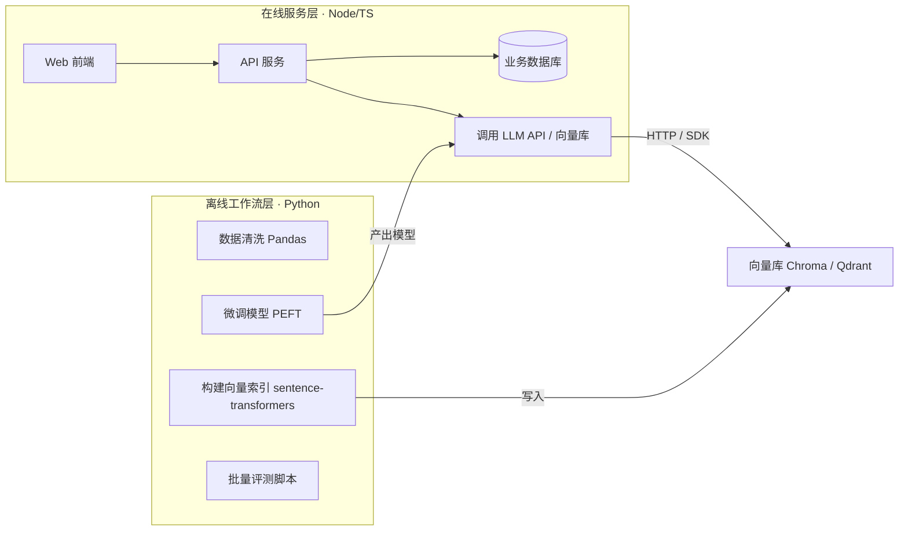

# Python AI 生态入门

> 做 AI 应用，绕不开 Python。本文回答两个问题：**Python 在 AI 生态里到底承担什么**、**Node/TS 后端和 Python 如何分工**，并给出一组最小可运行示例。

## 为什么是 Python 而不是其他语言

Python 不是"最好的语言"，但它是 AI 生态的**事实标准**。原因是历史路径形成的网络效应：

1. **学术起点**：AI 学术界（PyTorch、TensorFlow）从 Python 起家，论文复现、开源模型发布都以 Python 为第一语言
2. **框架沉淀**：数据科学（NumPy/Pandas）、机器学习（scikit-learn）、深度学习（PyTorch）、大模型（Transformers）整套工具链都是 Python
3. **模型发布格式**：主流开源模型（Llama、Qwen、DeepSeek 等）的推理代码、微调脚本、官方示例几乎全是 Python
4. **生态反哺**：新论文 → Python 实现 → 新框架 → 更多人用 Python，滚雪球

> 关键认知：**你可以不会写 Python 训练模型，但调用/落地 AI 能力的工具链（向量化、RAG 编排、微调脚本）大多只有 Python 版或 Python 版最成熟**。Node/TS 在这块是追赶者。

## Python 在 AI 生态中的价值地图

| 环节 | 干什么 | 代表库 | 前端/Node 的对应物 |
|------|--------|--------|-------------------|
| 数值计算 | 张量运算、GPU 加速 | NumPy、PyTorch | 无直接对应 |
| 数据处理 | 表格清洗、统计分析 | Pandas | 无（JS 生态较弱） |
| 模型推理 | 跑本地开源模型 | Transformers、vLLM、Ollama | Transformers.js（受限） |
| 向量化 | 文本 → embedding 向量 | sentence-transformers | 少，多走 HTTP API |
| LLM 编排 | 链式调用、Agent、RAG 管道 | LangChain、LlamaIndex | LangChain.js（功能滞后） |
| 向量库 | 相似度检索 | Chroma、Qdrant、Milvus SDK | 各库 JS SDK 可用 |
| 微调 | 低成本适配领域模型 | PEFT、LoRA、Unsloth | 无 |
| 数据爬取 | 语料采集 | Scrapy、BeautifulSoup | Puppeteer 可替代 |

## Node/TS 与 Python 的分工



**分工原则**：

| 场景 | 选谁 | 原因 |
|------|------|------|
| 在线 API、业务逻辑、鉴权 | **Node/TS** | 与前端同语言、I/O 强、生态成熟 |
| 文档解析、切分、入库（批量、离线） | **Python** | LangChain 文档处理链最全 |
| 向量化模型推理 | **Python** | 本地模型生态（GPU、量化）都在 Python |
| 数据清洗、语料准备 | **Python** | Pandas 无可替代 |
| 简单的 LLM 调用、流式输出 | **Node/TS** | OpenAI SDK 官方支持，直接写 |
| Agent / 复杂编排 | **Python 优先** | 工具多、踩坑资料多 |

> 现实案例：本项目（front-end-knowledge-summary）的 RAG 就是混合形态——**在线链路**是 Node/TS（Koa + Chroma SDK），**离线索引构建**（embedding 入库）可以交给 Python 脚本完成。

## 最小可运行示例

以下示例按"用得最多 → 用得较少"排序，可作为学习路线上的练习目标。

### 1. Pandas 数据清洗

```python
import pandas as pd

df = pd.read_csv("raw_data.csv")
df = df.dropna(subset=["title"])          # 去掉标题为空的
df["title"] = df["title"].str.strip()     # 去掉首尾空格
df["len"] = df["title"].str.len()         # 新增列
df.to_csv("cleaned.csv", index=False)
print(df.shape)
```

### 2. OpenAI SDK 调用

```python
from openai import OpenAI

client = OpenAI()  # 默认读 OPENAI_API_KEY 环境变量

resp = client.chat.completions.create(
    model="gpt-4o-mini",
    messages=[
        {"role": "system", "content": "你是前端面试官"},
        {"role": "user", "content": "问一个闭包相关的面试题"},
    ],
)
print(resp.choices[0].message.content)
```

### 3. sentence-transformers 本地向量化

```python
from sentence_transformers import SentenceTransformer

# 首次运行会自动下载模型到本地
model = SentenceTransformer("BAAI/bge-small-zh-v1.5")

vec = model.encode("什么是闭包？")
print(vec.shape)  # 输出向量维度，如 (512,)
```

### 4. LangChain 文档入库 + 检索（RAG 最小闭环）

```python
from langchain_community.document_loaders import TextLoader
from langchain_text_splitters import RecursiveCharacterTextSplitter
from langchain_chroma import Chroma
from langchain_huggingface import HuggingFaceEmbeddings

# 1. 加载
loader = TextLoader("docs/javascript/memory.md")
docs = loader.load()

# 2. 切分
splitter = RecursiveCharacterTextSplitter(chunk_size=500, chunk_overlap=50)
chunks = splitter.split_documents(docs)

# 3. 入库（自动向量化）
embeddings = HuggingFaceEmbeddings(model_name="BAAI/bge-small-zh-v1.5")
db = Chroma.from_documents(chunks, embeddings, persist_directory="./chroma_db")

# 4. 检索
retriever = db.as_retriever(search_kwargs={"k": 3})
hits = retriever.invoke("垃圾回收怎么工作的")
for hit in hits:
    print(hit.page_content[:100])
```

> 对应到本项目：`pnpm rag:index` 做的事就是这个流程，只是用了本地 Ollama 的 embedding 模型（`mxbai-embed-large`）。

## 学习优先级

面向"全栈 + AI 应用"岗位，Python 不用学成算法工程师，按优先级来：

| 优先级 | 内容 | 投入 | 说明 |
|--------|------|------|------|
| ★★★ | Python 基础语法 + asyncio | 1 周 | 能读懂、能写脚本即可 |
| ★★★ | OpenAI SDK 调用 | 1 天 | 与 Node 版 API 结构几乎一样 |
| ★★☆ | LangChain / LlamaIndex 基础 | 1 周 | 核心是文档加载 → 切分 → 向量化 → 检索 |
| ★★☆ | Pandas / NumPy 基础 | 3 天 | 数据处理脚本够用即可 |
| ★★☆ | sentence-transformers | 1 天 | 会换模型、调维度、算相似度 |
| ★☆☆ | Transformers / PEFT 微调 | 了解 | 知道 LoRA 是干什么的即可，不用真训 |

**判断标准**：能独立把"一篇文档 → 向量库 → 检索出结果"跑通，就超过了大部分前端转 AI 的候选人。

## 常见问题

**Q: 必须会 Python 才能做 AI 应用吗？**
A: 纯调 API 不用（Node 就能做），但一涉及本地模型、向量索引构建、文档处理管道，Python 的工具成熟度碾压 Node，学是值得的。

**Q: LangChain.js 不行吗？**
A: 能用，但版本碎片化严重、文档不全、社区踩坑案例少。复杂项目建议 Python 跑离线管道，Node 只做在线服务。

**Q: 微调（Fine-tuning）需要学吗？**
A: 应用层岗位了解概念即可：知道 LoRA（低秩适配）是低成本微调的主流方案、知道什么时候该微调（专业术语/固定格式输出）而不是改 Prompt。真上手是算法/部署岗的事。
