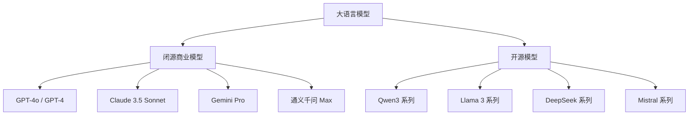

# AI 知识库实战指南

从零搭建本地 AI 知识库的完整实践，涵盖模型选择、本地部署、RAG 服务构建和前端交互优化。

##  大语言模型概览

### 模型分类



### 开源模型对比

| 模型 | 参数量 | 中文能力 | 特点 | 适用场景 |
|------|--------|----------|------|----------|
| **Qwen3** | 0.6B-235B | ⭐⭐⭐⭐⭐ | 阿里出品，中文最强 | 通用对话、代码、知识库 |
| **DeepSeek-V2** | 236B(MoE) | ⭐⭐⭐⭐⭐ | 性价比极高 | 长文本、推理 |
| **Llama 3** | 8B-70B | ⭐⭐⭐ | Meta 出品，英文强 | 英文场景、多语言 |
| **Mistral** | 7B-8x7B | ⭐⭐ | 轻量高效 | 资源受限场景 |

### 如何选择模型

```
参数量选择指南：
├── 7B 以下 → 轻量任务、资源受限
├── 7B-14B → 日常对话、简单问答（推荐起步）
├── 32B-72B → 复杂推理、专业领域
└── 72B+ → 极致效果、充足算力
```

---

## 🦙 Ollama 本地模型运行

### 什么是 Ollama

Ollama 是一个开源的本地大模型运行工具，让你可以在自己的电脑上运行各种开源 LLM，无需云端 API。

**核心优势：**
- 🔒 **隐私安全** - 数据完全本地，不上传云端
- 💰 **免费使用** - 无需 API 费用
- ⚡ **低延迟** - 本地推理，响应更快
- 🔧 **易于管理** - 一条命令拉取、运行模型

### 安装与使用

#### 1. 安装 Ollama

```bash
# macOS
brew install ollama

# Linux
curl -fsSL https://ollama.com/install.sh | sh

# Windows
# 从 https://ollama.com/download 下载安装包
```

#### 2. 启动服务

```bash
ollama serve
```

#### 3. 下载模型

```bash
# 下载聊天模型
ollama pull qwen3:8b

# 下载 embedding 模型
ollama pull bge-m3

# 查看已安装模型
ollama list

# 运行模型（交互式对话）
ollama run qwen3:8b
```

#### 4. 常用管理命令

```bash
# 查看运行中的模型
ollama ps

# 停止模型
ollama stop qwen3:8b

# 删除模型
ollama rm qwen3:8b

# 查看模型信息
ollama show qwen3:8b
```

### Ollama API

Ollama 提供 OpenAI 兼容的 API 格式，可以直接使用 OpenAI SDK 调用：

```typescript
import OpenAI from 'openai'

const client = new OpenAI({
  apiKey: 'ollama',  // Ollama 不需要 API key
  baseURL: 'http://localhost:11434/v1',  // Ollama 本地服务
})

// 聊天
const response = await client.chat.completions.create({
  model: 'qwen3:8b',
  messages: [
    { role: 'user', content: '你好' }
  ],
})

// 生成 embedding
const embedding = await client.embeddings.create({
  model: 'bge-m3',
  input: '这是一段测试文本',
})
```

---

## 🏗️ 用 LangChain 构建 RAG 服务

### 什么是 RAG

RAG（Retrieval Augmented Generation，检索增强生成）让 LLM 能够访问外部知识库，解决知识截止和幻觉问题。

```
用户提问 → 向量检索相关文档 → 文档 + 问题 → LLM 生成回答
```

### 技术栈

| 组件 | 工具 | 说明 |
|------|------|------|
| **文档处理** | LangChain.js | 加载、切分文档 |
| **Embedding** | Ollama + bge-m3 | 文本转向量 |
| **向量数据库** | Chroma | 存储和检索向量 |
| **LLM** | Ollama + qwen3:8b | 生成回答 |
| **后端框架** | Koa + TypeScript | API 服务 |
| **流式传输** | SSE | 实时推送回答 |

### 项目结构

```
server/
├── src/
│   ├── config/
│   │   └── index.ts          # 配置管理
│   ├── rag/
│   │   ├── indexer.ts        # 文档索引构建
│   │   ├── retriever.ts      # 向量检索器
│   │   └── chunker.ts        # 文档切分策略
│   ├── routes/
│   │   └── chat.ts           # 聊天 API（SSE 流式）
│   └── app.ts                # Koa 应用入口
├── data/
│   └── chroma/               # Chroma 数据持久化
└── package.json
```

### 核心实现

#### 1. 文档索引构建

```typescript
// server/src/rag/indexer.ts
import { glob } from 'glob'
import fs from 'fs/promises'
import matter from 'gray-matter'
import { Document } from '@langchain/core/documents'
import { Chroma } from '@langchain/community/vectorstores/chroma'
import { OpenAIEmbeddings } from '@langchain/openai'

async function index() {
  // 1. 扫描文档目录
  const files = await glob('**/*.md', {
    cwd: config.docsPath,
    ignore: ['node_modules/**', '.vitepress/**'],
  })

  // 2. 加载并解析文档
  const docs: Document[] = []
  for (const file of files) {
    const raw = await fs.readFile(file, 'utf-8')
    const { content, data } = matter(raw)
    docs.push(new Document({
      pageContent: content,
      metadata: { source: file, title: data.title || '' },
    }))
  }

  // 3. 切分文档（chunking）
  const chunker = createMarkdownChunker()
  const chunks = await chunker.splitDocuments(docs)

  // 4. 生成 embedding 并存入 Chroma
  const embeddings = new OpenAIEmbeddings({
    modelName: 'bge-m3',
    apiKey: 'ollama',
    configuration: { baseURL: 'http://localhost:11434/v1' },
  })

  await Chroma.fromDocuments(chunks, embeddings, {
    collectionName: 'knowledge_base',
    url: 'http://localhost:8000',
  })
}
```

#### 2. 向量检索

```typescript
// server/src/rag/retriever.ts
export async function getRetriever(topK: number = 5) {
  const embeddings = new OpenAIEmbeddings({
    modelName: 'bge-m3',
    apiKey: 'ollama',
    configuration: { baseURL: 'http://localhost:11434/v1' },
  })

  const vectorStore = await Chroma.fromExistingCollection(embeddings, {
    collectionName: 'knowledge_base',
    url: 'http://localhost:8000',
  })

  return vectorStore.asRetriever({ k: topK })
}
```

#### 3. SSE 流式聊天 API

```typescript
// server/src/routes/chat.ts
router.post('/api/chat', async (ctx) => {
  const { message, history = [] } = ctx.request.body

  // 1. 检索相关文档
  const retriever = await getRetriever(5)
  const docs = await retriever.invoke(message)

  // 2. 构建 context
  const context = docs
    .map((doc, i) => `[来源${i + 1}: ${doc.metadata.source}]\n${doc.pageContent}`)
    .join('\n\n---\n\n')

  // 3. SSE 流式响应
  ctx.respond = false  // 绕过 Koa 自动响应
  const res = ctx.res
  res.writeHead(200, {
    'Content-Type': 'text/event-stream',
    'Cache-Control': 'no-cache',
    Connection: 'keep-alive',
  })

  // 4. 发送来源信息
  res.write(`data: ${JSON.stringify({ type: 'sources', data: sources })}\n\n`)

  // 5. 流式生成回答
  const response = await client.chat.completions.create({
    model: 'qwen3:8b',
    messages: [
      { role: 'system', content: SYSTEM_PROMPT + context },
      ...history,
      { role: 'user', content: message },
    ],
    stream: true,
  })

  for await (const chunk of response) {
    const content = chunk.choices[0]?.delta?.content
    if (content) {
      res.write(`data: ${JSON.stringify({ type: 'token', data: content })}\n\n`)
    }
  }
  res.write(`data: ${JSON.stringify({ type: 'done' })}\n\n`)
  res.end()
})
```

---

##  前端流式渲染优化

### SSE 与 ReadableStream 的关系

面试常问"SSE 和 fetch 的 ReadableStream 有什么区别"——它们是**协议**与**载体**的关系，不是二选一：

| 维度 | SSE（Server-Sent Events） | fetch + ReadableStream |
|------|--------------------------|------------------------|
| 本质 | 服务端推送**协议**（数据格式约定：`data:` / `event:` / `id:` 字段） | 通用**流式传输载体**（可读任意流式响应：SSE、ndjson、纯文本） |
| 客户端 API | `EventSource`：自动重连、`Last-Event-ID` 断点续传 | `response.body.getReader()` 手动读取 |
| 限制 | 只能 GET、不能自定义 Header | 任意方法 + 任意 Header（鉴权）、AbortController 取消 |
| 重连 | 自动 | 需自己实现 |

**实践结论**：AI 聊天用 `fetch` + `ReadableStream` 读 SSE 格式的响应是标准做法（需要 POST + 鉴权），本项目正是如此。SSE 是"服务端如何组织数据"的协议约定，EventSource 只是它最省事的客户端，灵活性不够时就用 fetch 读流自己解析。

### SSE 客户端实现

前端使用 `fetch` + `ReadableStream` 接收 SSE 流：

```typescript
// docs/.vitepress/theme/composables/useAIChat.ts
export function useAIChat() {
  const abortController = ref<AbortController | null>(null)

  async function sendMessage(message: string) {
    abortController.value = new AbortController()

    const response = await fetch('/api/chat', {
      method: 'POST',
      headers: { 'Content-Type': 'application/json' },
      body: JSON.stringify({ message, history: messages.value }),
      signal: abortController.value.signal,
    })

    const reader = response.body!.getReader()
    const decoder = new TextDecoder()
    let buffer = ''

    while (true) {
      const { done, value } = await reader.read()
      if (done) break

      buffer += decoder.decode(value, { stream: true })
      const lines = buffer.split('\n')
      buffer = lines.pop() || ''

      for (const line of lines) {
        if (line.startsWith('data: ')) {
          const data = JSON.parse(line.slice(6))
          handleEvent(data)
        }
      }
    }
  }

  function handleEvent(data: any) {
    switch (data.type) {
      case 'sources':
        // 显示参考来源
        sources.value = data.data
        break
      case 'token':
        // 追加 token 到当前消息
        currentMessage.value += data.data
        break
      case 'done':
        // 完成，保存消息
        messages.value.push({ role: 'assistant', content: currentMessage.value })
        break
    }
  }

  return { sendMessage, abortController }
}
```

### 自动重连实践

概念表里说过：EventSource 自动重连，fetch 方案要自己实现。连接随时可能断（网络闪断、服务端重启、代理超时），实践分三步：

**1. 识别"异常中断"**

正常结束的标志是收到 `{ type: 'done' }`；除此之外流提前结束都算异常（读流抛错或 done 时未收到 done 事件）：

```typescript
async function readStream(message: string) {
  // ...fetch + reader 循环解析（见上）
  let completed = false
  for (const line of lines) {
    if (line.startsWith('data: ')) {
      const data = JSON.parse(line.slice(6))
      if (data.type === 'done') completed = true
      handleEvent(data)
    }
  }
  // 流结束了但没收到 done：网络被切断或服务端异常
  if (!completed) throw new Error('stream interrupted')
}
```

**2. 指数退避 + 抖动重连**

```typescript
async function sendWithRetry(message: string) {
  let retry = 0
  while (true) {
    try {
      await readStream(message)
      return  // 正常完成
    } catch (e) {
      // 用户主动取消（AbortController）不算故障，不重连
      if (e instanceof DOMException && e.name === 'AbortError') return
      if (retry >= 5) throw e
      retry++
      const delay = Math.min(1000 * 2 ** (retry - 1), 30000) // 1s→2s→4s→8s→16s→30s 封顶
      await sleep(delay + Math.random() * 500) // 加抖动，防止多客户端同时重连打爆服务
    }
  }
}
```

**3. 重连策略：重新生成（默认做法）**

重连 = 重新发起请求，让服务端重新生成。这是默认做法：

- **服务端零改动**：`chat.ts` 不需要知道任何断点概念
- **实现简单**：客户端只需清空半截内容再重发

```typescript
// 重连前：清空正在显示的半截回复，避免新旧内容拼接错乱
currentMessage.value = ''
receivedLength = 0
await sendWithRetry(message) // 重新发起相同请求
```

体验上回答会"从头重新生成"——首 token 延迟通常很低，加上重连后往往能快速输出，用户可接受。

**4. 为什么不做断点续传**

续传思路是"跳过已生成的部分继续发"，但实际不划算：

- **LLM 生成有随机性**：temperature > 0 时同样输入重生成的内容未必一致，按字符数跳过会对不上（错位）
- **服务端要改造**：记录发送进度、解析 `resumeFrom`、跳过逻辑，复杂度全在服务端
- **协议支持有限**：EventSource 有 `Last-Event-ID` 自动续传，fetch 方案得自己传，收益还受前两点限制

**结论**：除非生成成本极高（长文档、付费模型重算贵），否则"重新生成"是更划算的工程选择。面试被问到这个权衡，能说出"LLM 随机性导致续传错位"是加分项。

更完备的还可以加**心跳**：服务端每 N 秒发一行 `: ping` 注释（SSE 注释不产生事件），客户端超过 M 秒没收到任何数据就判定连接假死，主动断开触发重连。

> 与"错误重试机制"（见其他最佳实践）互补：重试负责"请求还没发出/没连上"，重连负责"连上之后流断了"。

### 流式渲染优化技巧

#### 1. 平滑滚动

```typescript
// 自动滚动到底部，但用户手动滚动时暂停
let userScrolled = false
const chatContainer = ref<HTMLElement>()

function scrollToBottom() {
  if (!userScrolled && chatContainer.value) {
    chatContainer.value.scrollTop = chatContainer.value.scrollHeight
  }
}

// 监听用户滚动
chatContainer.value?.addEventListener('scroll', () => {
  const { scrollTop, scrollHeight, clientHeight } = chatContainer.value
  userScrolled = scrollHeight - scrollTop - clientHeight > 50
})

// 每个 token 到达时调用
watch(currentMessage, () => {
  scrollToBottom()
})
```

#### 2. Markdown 实时渲染

使用 `marked` 或 `markdown-it` 实时解析 Markdown：

```typescript
import { marked } from 'marked'

// 计算属性，实时渲染
const renderedContent = computed(() => {
  return marked(currentMessage.value, {
    breaks: true,
    gfm: true,
  })
})
```

#### 3. 代码高亮

```typescript
import hljs from 'highlight.js'

// 渲染后高亮代码块
onUpdated(() => {
  document.querySelectorAll('pre code').forEach((block) => {
    hljs.highlightElement(block as HTMLElement)
  })
})
```

#### 4. 打字机效果优化

```typescript
// 使用 requestAnimationFrame 避免频繁重渲染
let rafId: number | null = null
let pendingContent = ''

function updateDisplay(content: string) {
  pendingContent = content
  if (rafId === null) {
    rafId = requestAnimationFrame(() => {
      currentMessage.value = pendingContent
      rafId = null
    })
  }
}
```

#### 5. 中断生成

```typescript
function stopGeneration() {
  if (abortController.value) {
    abortController.value.abort()
    abortController.value = null
  }
}
```

#### 6. 视口外暂停渲染

流式输出时每个 token 都触发 DOM 更新，但如果聊天区域**不在视口内**（用户滚到别处看其他内容），这些更新纯属浪费。用 `IntersectionObserver` 检测：不在视口内时**暂停 DOM 更新**（继续读流、累积文本），回到视口一次性补渲染：

```typescript
let isVisible = true
let pendingContent = ''

const observer = new IntersectionObserver(([entry]) => {
  isVisible = entry.isIntersecting
  if (isVisible) {
    // 回到视口，一次补渲染积压的内容
    appendToDOM(pendingContent)
    pendingContent = ''
  }
})
observer.observe(chatContainer.value)

// 流式回调里：不可见时只攒文本，不碰 DOM
function onToken(text: string) {
  if (!isVisible) {
    pendingContent += text
    return
  }
  appendToDOM(text)
}
```

它比虚拟滚动更轻量：不减少 DOM 数量，只是**暂停更新**。面试答"用户快速滚动时流式渲染区域怎么处理"，就用这个方案。

---

##  框架批量渲染与逐字输出

### 问题：Vue/React 的批量更新机制

Vue 和 React 都采用**异步批量更新**策略：

```
Token 到达 → 更新 state → 框架批量 → nextTick/microtask → 统一渲染
```

这导致两个问题：

| 问题 | 表现 | 原因 |
|------|------|------|
| **延迟感** | 多个 token 攒一起才显示 | 框架等待 microtask 队列清空 |
| **闪烁** | 内容突然跳变一大段 | 批量更新时一次性渲染多个 token |

### 解决方案对比

| 方案 | 优点 | 缺点 | 适用场景 |
|------|------|------|----------|
| **直接操作 DOM** | 无延迟，真正逐字 | 绕过框架，需手动管理 | AI 流式输出 |
| **innerHTML + rAF** | 简单，合并多次更新 | 全量重新解析 HTML | 内容较短（<10KB） |
| **Text 节点追加** | 只更新新增内容，最高效 | 需自己管理 DOM 结构 | 内容较长（>10KB） |
| **框架 state + flushSync** | 保持框架一致性 | React 专用，仍有轻微延迟 | 必须用框架的场景 |

### 方案 1：直接操作 DOM + rAF 节流（推荐）

```typescript
class StreamingRenderer {
  private container: HTMLElement
  private buffer = ''
  private rafId: number | null = null

  constructor(container: HTMLElement) {
    this.container = container
  }

  append(token: string) {
    this.buffer += token
    
    // rAF 节流：合并同一帧内的多次更新
    if (!this.rafId) {
      this.rafId = requestAnimationFrame(() => {
        this.flush()
        this.rafId = null
      })
    }
  }

  private flush() {
    // 简单方案：全量更新（适合短内容）
    this.container.innerHTML = marked(this.buffer)
    
    // 滚动到底部
    this.container.scrollTop = this.container.scrollHeight
  }

  destroy() {
    if (this.rafId) {
      cancelAnimationFrame(this.rafId)
    }
  }
}
```

**为什么用 rAF 而不是 setTimeout？**

| 对比 | rAF | setTimeout(fn, 0) |
|------|-----|-------------------|
| 执行时机 | 浏览器重绘前 | 下一个宏任务 |
| 帧同步 | 是，避免掉帧 | 否，可能跨帧 |
| 性能 | 更好，合并同一帧更新 | 一般 |

### 方案 2：Text 节点追加（高性能）

当内容很长时，`innerHTML` 每次都会**重新解析整个 HTML**，包括已渲染过的内容。更好的方案是只追加新内容：

```typescript
class IncrementalRenderer {
  private container: HTMLElement
  private textBuffer = ''
  private rafId: number | null = null
  private lastNode: ChildNode | null = null

  constructor(container: HTMLElement) {
    this.container = container
  }

  append(token: string) {
    this.textBuffer += token
    
    if (!this.rafId) {
      this.rafId = requestAnimationFrame(() => {
        this.flush()
        this.rafId = null
      })
    }
  }

  private flush() {
    // 只创建新文本节点，不重新解析旧内容
    const textNode = document.createTextNode(this.textBuffer)
    
    if (this.lastNode) {
      this.lastNode.after(textNode)
    } else {
      this.container.appendChild(textNode)
    }
    
    this.lastNode = textNode
    this.textBuffer = ''
    
    // 滚动到底部
    this.container.scrollTop = this.container.scrollHeight
  }
}
```

**注意**：这个方案只适合纯文本。如果需要 Markdown 渲染，还是需要 `innerHTML`，因为 Markdown 转 HTML 会改变 DOM 结构。

### 方案 3：React 的 flushSync（不得已的选择）

如果必须用 React state，可以用 `flushSync` 强制同步更新：

```typescript
import { flushSync } from 'react-dom'

function useStreamingMessage() {
  const [message, setMessage] = useState('')

  const appendToken = (token: string) => {
    // 强制同步更新，绕过批量机制
    flushSync(() => {
      setMessage(prev => prev + token)
    })
  }

  return { message, appendToken }
}
```

**缺点**：
- 每个 token 都触发一次渲染，性能差
- 仍有轻微延迟（React 内部处理）
- 只适合 token 到达频率较低的场景

### 实践建议

| 场景 | 推荐方案 |
|------|----------|
| AI 聊天流式输出 | 直接 DOM + rAF（方案 1） |
| 长文档流式加载（>10KB） | Text 节点追加（方案 2） |
| 必须用框架 state | flushSync（方案 3，最后选择） |

**本项目实现**：使用方案 1，直接操作 DOM + rAF 节流，详见 `AIChat.vue` 组件。

---

## 🛡️ 其他最佳实践

### 1. 错误重试机制

SSE 连接可能因网络问题断开，需要自动重试：

```typescript
class StreamingClient {
  private maxRetries = 3
  private retryCount = 0

  async sendMessage(message: string) {
    try {
      const response = await fetch('/api/chat', {
        method: 'POST',
        headers: { 'Content-Type': 'application/json' },
        body: JSON.stringify({ message }),
      })

      if (!response.ok) {
        throw new Error(`HTTP ${response.status}`)
      }

      this.retryCount = 0  // 成功后重置计数
      await this.readStream(response)
    } catch (error) {
      if (this.retryCount < this.maxRetries) {
        this.retryCount++
        console.log(`重试 ${this.retryCount}/${this.maxRetries}...`)
        await this.sleep(1000 * this.retryCount)  // 指数退避
        return this.sendMessage(message)
      }
      throw error
    }
  }

  private sleep(ms: number) {
    return new Promise(resolve => setTimeout(resolve, ms))
  }
}
```

**重试策略：**
- 最多重试 3 次
- 指数退避（1s、2s、3s）
- 成功后重置计数

### 2. 本地缓存

对话历史存 localStorage，刷新不丢失：

```typescript
const STORAGE_KEY = 'ai-chat-history'

function saveMessages(messages: Message[]) {
  try {
    localStorage.setItem(STORAGE_KEY, JSON.stringify(messages))
  } catch (e) {
    // 存储空间不足，只保留最近 50 条
    const recent = messages.slice(-50)
    localStorage.setItem(STORAGE_KEY, JSON.stringify(recent))
  }
}

function loadMessages(): Message[] {
  try {
    const data = localStorage.getItem(STORAGE_KEY)
    return data ? JSON.parse(data) : []
  } catch {
    return []
  }
}

// 组件初始化时加载
onMounted(() => {
  messages.value = loadMessages()
})

// 每次消息更新时保存
watch(messages, (newMessages) => {
  saveMessages(newMessages)
}, { deep: true })
```

### 3. 无障碍支持

让屏幕阅读器能读出新消息：

```html
<!-- 添加 aria-live 区域 -->
<div 
  class="ai-chat-messages" 
  role="log" 
  aria-live="polite" 
  aria-atomic="false"
>
  <!-- 消息列表 -->
</div>
```

**属性说明：**
- `role="log"` - 语义化为日志区域
- `aria-live="polite"` - 不打断用户，等空闲时朗读
- `aria-atomic="false"` - 只朗读新增内容，不重读全部

**流式输出时的特殊处理：**

```typescript
// 流式开始时标记
container.setAttribute('aria-busy', 'true')

// 流式结束时移除
container.setAttribute('aria-busy', 'false')
```

### 4. 输入防抖

防止用户快速重复发送：

```typescript
let sendTimer: number | null = null

function handleSend() {
  const text = inputText.value.trim()
  if (!text || isLoading.value) return
  
  // 防抖：500ms 内不能重复发送
  if (sendTimer !== null) return
  sendTimer = window.setTimeout(() => {
    sendTimer = null
  }, 500)
  
  inputText.value = ''
  sendMessage(text)
}
```

### 5. Web Worker（可选优化）

当 Markdown 内容很长时，解析可能阻塞主线程。可以放到 Worker：

```typescript
// worker/markdown-worker.ts
import { marked } from 'marked'

self.onmessage = (e: MessageEvent<string>) => {
  const html = marked(e.data)
  self.postMessage(html)
}

// 主线程
const worker = new Worker(new URL('./worker/markdown-worker.ts', import.meta.url))

function renderMarkdown(content: string): Promise<string> {
  return new Promise((resolve) => {
    worker.onmessage = (e: MessageEvent<string>) => {
      resolve(e.data)
    }
    worker.postMessage(content)
  })
}
```

**何时需要 Worker：**
- 单次回答 >10KB
- 大量代码块、表格等复杂 Markdown
- 解析耗时 >16ms（掉帧阈值）

**本项目不需要**：AI 回答一般 1-3KB，解析耗时 <5ms。

### 6. 虚拟滚动（可选优化）

长对话列表（>100 条）时，只渲染可见区域：

```typescript
// 使用 vue-virtual-scroller 或类似库
import { RecycleScroller } from 'vue-virtual-scroller'

<RecycleScroller
  :items="messages"
  :item-size="100"
  key-field="id"
>
  <template #default="{ item }">
    <MessageBubble :message="item" />
  </template>
</RecycleScroller>
```

**何时需要：**
- 对话超过 100 条
- 每条消息内容较长
- 出现明显滚动卡顿

**本项目不需要**：一般对话不超过 20 条。

---

## 📋 完整最佳实践清单

| 优化项 | 必要性 | 实现难度 | 本项目状态 |
|--------|--------|----------|------------|
| SSE 客户端 | ✅ 必须 | 低 | ✅ 已实现 |
| rAF 节流 | ✅ 必须 | 低 | ✅ 已实现 |
| 平滑滚动 | ✅ 必须 | 低 | ✅ 已实现 |
| 中断生成 | ✅ 必须 | 低 | ✅ 已实现 |
| Markdown 渲染 | ✅ 必须 | 中 | ✅ 已实现 |
| 错误重试 | ✅ 建议 | 中 | ❌ 待实现 |
| 本地缓存 | ✅ 建议 | 低 | ❌ 待实现 |
| 无障碍支持 | ⚠️ 可选 | 低 | ❌ 待实现 |
| 输入防抖 | ⚠️ 可选 | 低 | ❌ 待实现 |
| Web Worker | ⚠️ 可选 | 中 |  不需要 |
| 虚拟滚动 | ️ 可选 | 中 | ❌ 不需要 |

---

## 🔧 检索质量优化

### 问题：检索到不相关文档

如果问"蛙泳"却返回了 Serverless、React 等无关文档，通常是 embedding 模型对中文支持不好。

### 解决方案

#### 1. 选择更好的 Embedding 模型

| 模型 | 维度 | 中文支持 | 大小 |
|------|------|----------|------|
| nomic-embed-text | 768 | ⭐⭐ | 274MB |
| mxbai-embed-large | 1024 | ⭐⭐⭐ | 669MB |
| **bge-m3** | **1024** | **⭐⭐⭐⭐⭐** | **1.2GB** |
| text-embedding-v3 (通义) | 1024 | ⭐⭐⭐⭐ | 云端 |

> 实测对比：同样的检索场景下，mxbai-embed-large 对中文问题的召回效果明显弱于 bge-m3（如"什么是闭包"这类问题可能完全检索不到相关文档），本项目已切换为 bge-m3。

```bash
# 下载中文更好的模型
ollama pull bge-m3
```

#### 2. 调整 Chunk 策略

```typescript
// 推荐配置
const chunkSize = 1000      // 每个 chunk 最大字符数
const chunkOverlap = 200    // 重叠部分，保持上下文连贯
```

#### 3. 调整 TopK

```typescript
// 检索太多文档会引入噪声
const retriever = vectorStore.asRetriever({ k: 5 })  // 推荐 3-5 个
```

#### 4. 添加 Rerank（重排序）

```typescript
// 先粗检索 20 个，再精排取 Top 5
const initialResults = await retriever.getRelevantDocuments(question, 20)
const rankedResults = await reranker.compressDocuments(initialResults, question, 5)
```

---

## 📋 完整启动流程

### 前置条件

```bash
# 1. 安装 Node.js 18+
node -v  # >= 18

# 2. 安装 pnpm
npm install -g pnpm

# 3. 安装 Ollama
brew install ollama

# 4. 安装 Docker（用于 Chroma）
brew install --cask docker
```

### 启动步骤

```bash
# 1. 安装依赖
pnpm install

# 2. 下载模型
ollama pull qwen3:8b
ollama pull bge-m3

# 3. 启动 Chroma 向量数据库
pnpm chroma:start

# 4. 构建向量索引（首次或文档更新后）
pnpm rag:index

# 5. 启动前后端服务
pnpm dev
```

访问 `http://localhost:5173`，右下角 AI 助手按钮即可使用。

---

##  常见问题

### Q: 为什么不用云端 API？

- 隐私考虑：文档不上传云端
- 成本：本地免费，云端按 token 计费
- 延迟：本地推理更快

### Q: 本地模型效果不如云端？

7B 模型确实不如 GPT-4，但：
- 知识库问答主要依赖检索质量，模型要求不高
- 可以换更大模型（14B/32B）提升效果
- 优化 prompt 和检索策略也能显著改善

### Q: 如何提升检索准确率？

1. 选择中文支持好的 embedding 模型
2. 调整 chunk size（推荐 800-1200）
3. 添加 metadata 过滤
4. 使用 Rerank 模型精排
5. Query 改写（自动生成多个相关问题）

### Q: Chroma 数据存在哪里？

```
server/data/chroma/  # Docker 卷挂载的本地目录
```

删除这个目录可以清空索引，重新构建。

---

## 🔗 延伸阅读

- [RAG 入门](./introduction.md) - RAG 基础概念
- [LLM API 调用基础](../llm-api-basics.md) - API 调用详解
- [SSE 服务端推送](../../browser/sse.md) - SSE 协议详解
