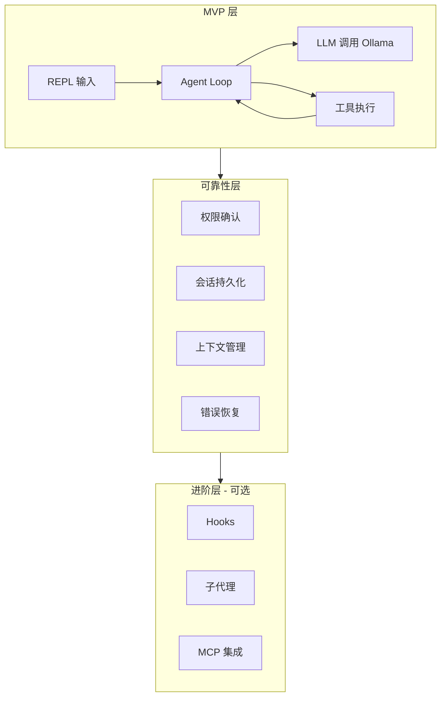

# 自研 Agent CLI：渐进式学习 AI Agent 内部原理

::: tip 一句话说清
从零写一个**接本地 Ollama 的 Agent CLI**（类似 Claude Code 的最小版），按 L1 MVP → L2 可用 → L3 进阶**渐进式推进**。每层一个核心学习目标：先跑通 agent loop，再补可靠性，最后可选探索完整 harness。双目的：①通过自研理解 AI agent 内部原理；②打磨成个人项目亮点。
:::

## 一、定位与目标

### 两个目的

| 目的 | 含义 | 决定的设计取向 |
|------|------|---------------|
| **学习** | 理解 agent loop、工具协议、权限、上下文管理的真实原理 | 每层设置明确的"学习要点"，只做该层该学的事 |
| **亮点** | 做得好可成为个人项目展示 | 架构清晰、README/demo 可展示、有对比视角（vs Claude Code/dsh） |

### 定位：学习工具，不是替代品

不重复造轮子——Claude Code、dsh 已经是产品级。这个 CLI 的价值在**过程**：亲手实现一遍后，你会真正理解那些"为什么"（为什么工具 schema 要精确、为什么权限要策略化、为什么 prompt 前缀要稳定）。

### 硬约束

- **接本地 Ollama**（已验证 qwen3:8b 支持 tools，OpenAI 兼容接口）
- **渐进式**：每层可独立验收，不推倒重来
- **简洁**：只做当前层的事，避免提前引入 L3 复杂度

## 二、已有基础（不是从零）

| 资产 | 状态 | 对 CLI 的价值 |
|------|------|--------------|
| `verify-tool-calling.ts` | ✅ 已验证 agent loop + tools 链路 | L1 的 loop 骨架直接复用思路 |
| Ollama qwen3:8b | ✅ 在线，支持 tools | LLM 后端就绪 |
| dev-agent-harness | 成熟 | skills/workflow 概念可借鉴，但 CLI 保持独立 |
| Claude Code 架构笔记 | 已研究 | 作为 L2/L3 的"参考答案" |

## 三、总体架构



核心是 **agent loop**（已由验证脚本证明可行）：

```
while (true) {
  收集 LLM 流式输出（content + tool_calls）
  if (无 tool_calls) break        // 模型准备好回答
  执行工具 → 结果回传 messages    // 继续下一轮
}
```

## 四、渐进式路线

### L1 MVP：跑通 agent loop（核心学习目标：**loop 与工具协议**）

**功能**：
- REPL 交互（readline 一行输入）
- 3 个工具：`Bash`、`Read`、`Write`
- agent loop 多轮循环 + 流式输出
- 简单 system prompt（你是通用编程助手）

**技术点**：
- 流式 `tool_calls` 累积（delta 分段拼接）
- 参数 JSON 解析 + 容错（解析失败回传给模型重试）
- 循环上限（3 轮）+ 错误路径（工具失败也回传结果）

**验收标准**：能完成"帮我建一个 hello.js 并运行"这类多工具任务（Write → Bash 运行 → 读输出 → 回答）。

**学习要点**：
1. tool_use 是"控制信号"不是"函数调用"——它决定 loop 是否继续
2. 工具结果必须标准化回传（`role: 'tool'` + tool_call_id 配对），模型才能继续
3. 参数不可信：LLM 生成的 JSON 需要解析容错和校验

### L2 可用：可靠性（核心学习目标：**权限与上下文管理**）

**功能**：
- 权限确认：危险命令（rm、git push）交互确认，allow/deny 规则，`--dangerously-skip-permissions` 模式
- 工具参数校验：用 zod 对工具输入做 schema 校验
- 会话持久化：JSONL transcript + `--resume`
- 上下文管理：消息窗口上限 + 简单压缩（超限时摘要历史）
- 错误恢复：API 断流重试、工具失败回传、循环上限

**验收标准**：长对话（20+ 轮）不崩溃、上下文压缩后仍能回答问题、危险操作会被拦截确认。

**学习要点**：
1. **权限是策略引擎不是弹窗**：决策流水线（deny → ask → allow）顺序本身就是安全模型；bypass 不能绕过 deny
2. **上下文是"字节稳定性"问题**：压缩、摘要、会话边界怎么做才不会丢关键信息（对照 Claude Code 的 cache-safe forking）
3. **状态机思维**：会话状态（消息、任务、恢复点）显式建模，而非递归

### L3 进阶（可选，按需）：完整 harness

**功能**：Hooks（PreToolUse/PostToolUse）、子代理（独立上下文）、MCP 集成、插件化。

**学习要点**：这些是 Claude Code 的深度——做到这层说明你已经掌握 agent 的完整图景。**建议 L2 稳定跑一段时间后再决定**，避免范围蔓延。

## 五、技术选型

| 项 | 选择 | 理由 |
|----|------|------|
| 语言 | Node.js + TypeScript | 已熟悉，type 安全适合工具 schema |
| LLM 调用 | `openai` SDK（baseURL 指 Ollama）或直接 fetch | SDK 已兼容，验证过 |
| LLM 后端 | Ollama qwen3:8b（可换） | 本地免费，支持 tools |
| 参数校验 | zod | schema 即文档，校验即安全 |
| 终端交互 | readline → 后续可换 ink/react 渲染 | MVP 不引入渲染复杂度 |
| 存储 | JSONL 文件 | 可读、可恢复、无数据库依赖 |

## 六、每层学到的原理汇总

| 层 | 组件 | 学到的原理 | 对应真实系统 |
|----|------|-----------|-------------|
| L1 | agent loop | 工具调用是控制信号、结果标准化回传、参数容错 | Claude Code `query.ts` |
| L1 | 流式 tool_calls | delta 累积、分段拼接 | 各 LLM API |
| L2 | 权限引擎 | 决策流水线、bypass 边界、allow/deny 规则 | Claude Code `permissions.ts` |
| L2 | 上下文管理 | 压缩策略、会话边界、字节稳定性 | Claude Code compaction |
| L2 | 会话持久化 | 状态机、断点恢复 | `~/.claude/projects/` JSONL |
| L3 | hooks/子代理 | 事件驱动、上下文隔离 | Claude Code hooks/AgentTool |

## 七、项目亮点打磨

（用户明确希望可作亮点——放在**好用之后**，不喧宾夺主）

- **README**：一张架构图 + 一次 demo 录屏（多工具调用过程）+ 对比视角（vs Claude Code 最小版）
- **验证沉淀**：像本知识库一样，每层写一篇"实现笔记"，把踩坑和原理沉淀成文（既是学习也是展示）
- **增量演示**：L1 就能演示"让 CLI 自己写代码并运行"，L2 演示"长对话不丢上下文"
- **技术债克制**：每层代码量小、命名清晰，本身就是最好的展示

## 八、风险

| 风险 | 说明 | 缓解 |
|------|------|------|
| **重复造轮子** | dsh/Claude Code 已存在 | 定位"学习+定制"；README 明示是教育项目，不宣称替代 |
| **范围蔓延** | 想一口气做 hooks/子代理 | 严格按层推进，L3 按需，先让 L1/L2 稳定 |
| **本地模型能力边界** | qwen3:8b 复杂决策弱、延迟高 | 工具 description 写清触发条件；L1 用简单任务验证 |
| **安全事故** | 危险命令执行 | L1 就带最小确认；rm/rm -rf 一律拦截 |
| **学习目标稀释** | 写着写着变成"把代码写完" | 每层先写"学习要点"，先懂原理再动手 |

## 九、路线图

```
Phase 1（本周）：L1 MVP
  - 骨架：REPL + agent loop + 3 工具 + 流式
  - 验收：多工具协作任务跑通
  - 产出：实现笔记《agent loop 是怎么转起来的》

Phase 2（渐进）：L2 可用
  - 权限确认 → 会话持久化 → 上下文管理 → 错误恢复
  - 验收：20+ 轮长对话稳定
  - 产出：实现笔记《权限引擎》《上下文压缩》

Phase 3（按需）：L3 进阶
  - hooks → 子代理 → MCP
  - 评估后再启动
```

## 十、下一步

1. 确定项目名与目录（建议 `code/agent-cli`）
2. Phase 1 起步：搭骨架（agent loop + REPL + Bash/Read/Write 三工具）
3. 每层完成后更新本设计文档的状态标记

## 延伸阅读

- [Function Calling 与工具调用](/ai-agent/function-calling) - 工具机制基础
- [AI 应用架构模式](/ai-agent/app-architecture) - Agent 循环与架构
- [Claude Code 记忆机制](/ai-agent/case-studies/claude-code-memory) - 参考实现
- [DeepSeek Harness 案例研究](/ai-agent/case-studies/deepseek-harness) - 现成开源 harness
