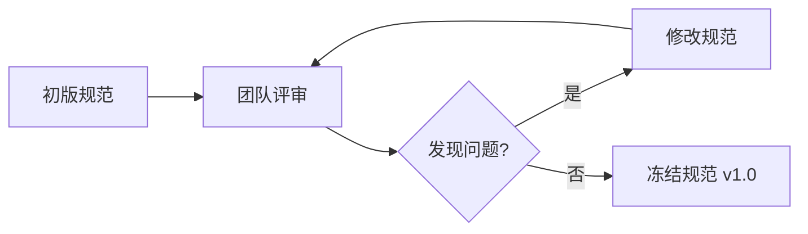

# Spec-First 工作流程

::: tip 学习目标
本文详细介绍 Spec-First 开发的完整工作流程,从需求分析到部署上线的每个步骤,并提供实际案例和工具推荐。
:::

## 📋 工作流概览

Spec-First 开发包含 6 个关键阶段:

```
1. 需求分析 → 2. 规范定义 → 3. 评审迭代 → 4. 代码生成 → 5. 实现验证 → 6. 部署维护
```

---

## 1️⃣ 需求分析

### 目标
将模糊的业务需求转化为清晰的功能列表。

### 实践步骤

#### Step 1: 收集需求
```markdown
业务背景: 需要一个客服 Agent 处理用户咨询

功能需求:
- 回答常见问题(FAQ)
- 创建工单(Ticket)
- 转接人工客服
- 记录对话历史

非功能需求:
- 响应时间 < 2秒
- 支持并发 100 QPS
- 准确率 > 85%
```

#### Step 2: 识别 Agent 能力
```yaml
capabilities:
  - FAQ 问答
  - 工单管理
  - 人工转接
  - 历史记录
```

#### Step 3: 定义边界
```markdown
明确范围:
✅ 处理中文和英文
✅ 支持文本交互
❌ 不支持语音
❌ 不处理支付相关
```

---

## 2️⃣ 规范定义

### 选择规范格式

根据项目特点选择合适的规范语言:

| 场景 | 推荐格式 | 示例 |
|------|---------|------|
| REST API | OpenAPI/Swagger | `agent-api.yaml` |
| 类型安全要求高 | GraphQL Schema | `schema.graphql` |
| 高性能需求 | Protocol Buffers | `agent.proto` |
| 简单配置 | JSON/YAML | `agent-spec.json` |

### 编写规范文档

**示例: OpenAPI 规范**

```yaml
# agent-spec.yaml
openapi: 3.0.0
info:
  title: Customer Support Agent API
  version: 1.0.0
  description: 客服 Agent 接口规范

servers:
  - url: https://api.example.com/v1

paths:
  /chat/faq:
    post:
      summary: 回答常见问题
      operationId: answerFAQ
      tags: [FAQ]
      requestBody:
        required: true
        content:
          application/json:
            schema:
              $ref: '#/components/schemas/FAQRequest'
      responses:
        '200':
          description: 成功返回答案
          content:
            application/json:
              schema:
                $ref: '#/components/schemas/FAQResponse'
        '422':
          description: 无法理解问题
          
  /chat/ticket:
    post:
      summary: 创建工单
      operationId: createTicket
      tags: [Ticket]
      requestBody:
        required: true
        content:
          application/json:
            schema:
              $ref: '#/components/schemas/TicketRequest'
      responses:
        '201':
          description: 工单创建成功

components:
  schemas:
    FAQRequest:
      type: object
      required: [question, userId]
      properties:
        question:
          type: string
          description: 用户问题
          example: "如何重置密码?"
        userId:
          type: string
          description: 用户ID
        context:
          type: array
          items:
            type: object
          description: 对话上下文
          
    FAQResponse:
      type: object
      required: [answer, confidence]
      properties:
        answer:
          type: string
          description: Agent 回答
        sources:
          type: array
          items:
            type: string
          description: 参考来源
        confidence:
          type: number
          minimum: 0
          maximum: 1
          description: 置信度
        shouldEscalate:
          type: boolean
          description: 是否需要转人工
          
    TicketRequest:
      type: object
      required: [issue, priority]
      properties:
        issue:
          type: string
          description: 问题描述
        priority:
          type: string
          enum: [low, medium, high, urgent]
          description: 优先级
        userId:
          type: string
```

### 关键要点

✅ **完整性**: 覆盖所有功能点  
✅ **准确性**: 类型、必填项要明确  
✅ **可扩展**: 预留扩展字段  
✅ **文档化**: 添加详细描述和示例  

---

## 3️⃣ 评审迭代

### 评审清单

#### 产品视角
- [ ] 功能是否完整?
- [ ] 用户体验是否合理?
- [ ] 边界情况是否考虑?

#### 技术视角
- [ ] 接口设计是否合理?
- [ ] 性能要求能否达到?
- [ ] 错误处理是否完善?

#### 前端视角
- [ ] 数据结构是否易用?
- [ ] 是否需要额外转换?
- [ ] 错误提示是否清晰?

### 迭代流程



### 版本管理

```yaml
# 使用语义化版本
version: 1.0.0

# Breaking Change 时升级主版本
# 新增功能时升级次版本
# Bug 修复时升级补丁版本
```

---

## 4️⃣ 代码生成

### 工具链配置

**package.json**:
```json
{
  "scripts": {
    "gen:types": "openapi-generator generate -i agent-spec.yaml -g typescript-axios -o src/generated/",
    "gen:docs": "redoc-cli bundle agent-spec.yaml -o docs/api.html",
    "gen:tests": "openapi-generator generate -i agent-spec.yaml -g typescript-jest -o tests/generated/",
    "gen:all": "npm run gen:types && npm run gen:docs && npm run gen:tests"
  }
}
```

### 生成的代码结构

```
src/generated/
├── api/
│   ├── FAQApi.ts          # FAQ 相关接口
│   ├── TicketApi.ts       # 工单相关接口
│   └── index.ts
├── models/
│   ├── FAQRequest.ts      # 请求类型
│   ├── FAQResponse.ts     # 响应类型
│   ├── TicketRequest.ts
│   └── index.ts
├── configuration.ts       # 配置
└── runtime.ts            # 运行时工具
```

### 生成的 TypeScript 类型

```typescript
// src/generated/models/FAQRequest.ts
export interface FAQRequest {
  /**
   * 用户问题
   * @example "如何重置密码?"
   */
  question: string;
  
  /**
   * 用户ID
   */
  userId: string;
  
  /**
   * 对话上下文
   */
  context?: Array<object>;
}

export interface FAQResponse {
  /**
   * Agent 回答
   */
  answer: string;
  
  /**
   * 参考来源
   */
  sources?: Array<string>;
  
  /**
   * 置信度 (0-1)
   */
  confidence: number;
  
  /**
   * 是否需要转人工
   */
  shouldEscalate?: boolean;
}
```

---

## 5️⃣ 实现验证

### 实现业务逻辑

```typescript
// src/agents/customer-support/faq.handler.ts
import { FAQApi, FAQRequest, FAQResponse } from '../../generated';

export class FAQHandler implements FAQApi {
  
  async answerFAQ(request: FAQRequest): Promise<FAQResponse> {
    // 1. 输入验证
    this.validateRequest(request);
    
    // 2. 检索知识库
    const knowledgeResults = await this.searchKnowledgeBase(request.question);
    
    // 3. 调用 LLM 生成答案
    const llmResponse = await this.callLLM({
      prompt: this.buildPrompt(request.question, knowledgeResults),
      temperature: 0.7,
    });
    
    // 4. 后处理和评分
    const answer = this.postProcess(llmResponse);
    const confidence = this.calculateConfidence(answer, knowledgeResults);
    
    // 5. 判断是否需要转人工
    const shouldEscalate = confidence < 0.6;
    
    return {
      answer,
      sources: knowledgeResults.map(r => r.source),
      confidence,
      shouldEscalate,
    };
  }
  
  private validateRequest(request: FAQRequest): void {
    if (!request.question || request.question.length > 500) {
      throw new Error('Invalid question');
    }
  }
  
  private async searchKnowledgeBase(question: string) {
    // 向量搜索实现
  }
  
  private async callLLM(params: any) {
    // LLM API 调用
  }
  
  // ... 其他私有方法
}
```

### 自动化测试

**生成的测试骨架**:
```typescript
// tests/faq.handler.test.ts
import { FAQHandler } from '../src/agents/customer-support/faq.handler';

describe('FAQHandler', () => {
  let handler: FAQHandler;
  
  beforeEach(() => {
    handler = new FAQHandler();
  });
  
  test('should answer simple question', async () => {
    const request = {
      question: '如何重置密码?',
      userId: 'user123',
    };
    
    const response = await handler.answerFAQ(request);
    
    expect(response).toHaveProperty('answer');
    expect(response).toHaveProperty('confidence');
    expect(response.confidence).toBeGreaterThanOrEqual(0);
    expect(response.confidence).toBeLessThanOrEqual(1);
  });
  
  test('should escalate when confidence is low', async () => {
    // 测试低置信度时的转人工逻辑
  });
});
```

### 合规性检查

```bash
# 运行规范符合性检查
npm run test:compliance

# 输出示例:
# ✅ All API endpoints implemented
# ✅ All types match specification
# ✅ No breaking changes detected
# ✅ Documentation up to date
```

---

## 6️⃣ 部署维护

### CI/CD 集成

**.github/workflows/ci.yml**:
```yaml
name: CI/CD Pipeline

on:
  push:
    branches: [main]
  pull_request:
    branches: [main]

jobs:
  validate:
    runs-on: ubuntu-latest
    steps:
      - uses: actions/checkout@v3
      
      - name: Generate code from spec
        run: npm run gen:all
        
      - name: Check for uncommitted changes
        run: |
          git diff --exit-code
          if [ $? -ne 0 ]; then
            echo "❌ Generated code is out of sync with spec"
            exit 1
          fi
          
      - name: Run compliance tests
        run: npm run test:compliance
        
      - name: Run unit tests
        run: npm test
        
      - name: Build
        run: npm run build
```

### 规范变更管理

**流程**:
```
1. 修改 agent-spec.yaml
2. 运行 npm run gen:all
3. 检查生成的代码差异
4. 更新实现代码
5. 运行测试
6. 提交 PR
```

**Breaking Change 处理**:
```yaml
# 如果需要做 Breaking Change
# 1. 增加版本号
version: 2.0.0

# 2. 保留旧版本 API
paths:
  /v1/chat/faq:    # 旧版本(标记为 deprecated)
    deprecated: true
    
  /v2/chat/faq:    # 新版本
    # ...

# 3. 提供迁移指南
```

---

## 🎯 实际案例:完整工作流

### 场景:电商客服 Agent

**Week 1: 需求与规范**
- Day 1-2: 需求调研,确定功能范围
- Day 3-4: 编写 OpenAPI 规范
- Day 5: 团队评审,修订规范

**Week 2: 开发与测试**
- Day 1: 生成代码骨架
- Day 2-3: 实现业务逻辑
- Day 4: 编写测试用例
- Day 5: 集成测试和优化

**Week 3: 部署与迭代**
- Day 1: 部署到测试环境
- Day 2-3: User Acceptance Testing
- Day 4: 修复问题
- Day 5: 生产环境发布

---

## 💡 最佳实践

### ✅ Do's

1. **从小处开始**
   - 先为核心功能定义规范
   - 逐步扩展到其他功能

2. **保持规范简洁**
   - 避免过度设计
   - 注重可读性

3. **自动化一切**
   - 代码生成
   - 文档更新
   - 测试验证

4. **持续迭代**
   - 收集反馈
   - 优化规范
   - 改进工具链

### ❌ Don'ts

1. **不要一次性定义所有细节**
   - 渐进式细化

2. **不要让规范与实际脱节**
   - 建立自动化验证

3. **不要过度依赖工具**
   - 保持灵活性
   - 必要时手动调整

---

## 🔗 延伸阅读

- [Spec-First 概述](/ai-agent/spec-first/overview) - 理论基础
- [工具链介绍](/ai-agent/spec-first/tools) - 工具对比
- [最佳实践](/ai-agent/harness-engineering/best-practices) - 工程实践

---

## 💬 总结

Spec-First 工作流的核心是:**先思考,再编码**。通过规范化的流程,确保团队协作顺畅、代码质量可控、维护成本降低。

**下一步**: 学习 [工具链介绍](/ai-agent/spec-first/tools),了解如何选择和配置适合你的工具。
