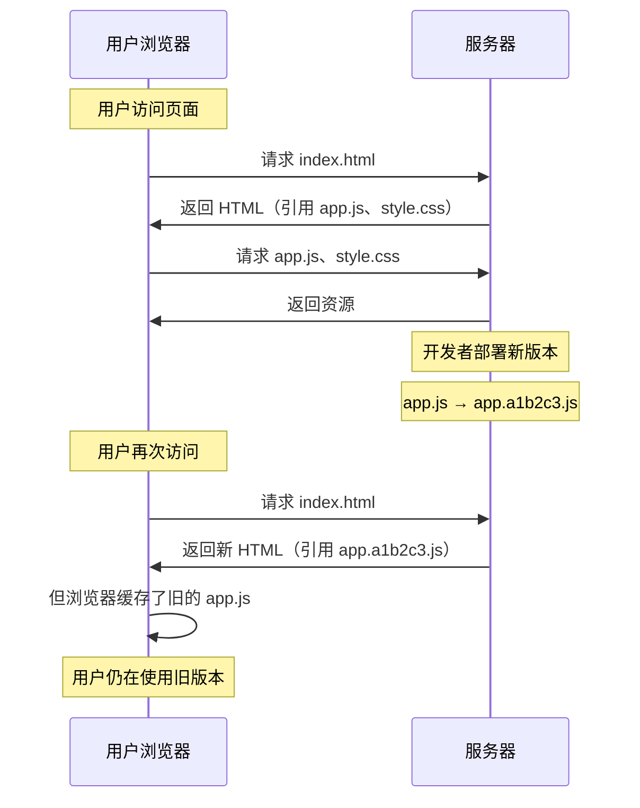

SPA 应用部署后，用户浏览器可能仍在使用旧版本的 JS/CSS 资源。如果没有更新机制，用户可能遇到：

- 新功能不可用
- 旧 Bug 仍然存在
- 接口与前端不匹配导致报错

---

## 问题根源



核心问题：**HTML 文件缓存了旧的资源引用**，或者**静态资源被强缓存但文件名没变**。

---

## 解决方案

### 缓存策略配合

正确的缓存策略是应用更新的基础：

| 资源类型 | 缓存策略 | 说明 |
|---------|---------|------|
| HTML | `Cache-Control: no-cache` | 每次向服务器验证，确保获取最新引用 |
| JS/CSS（带 hash） | `Cache-Control: max-age=31536000, immutable` | 强缓存一年，文件名变化即新资源 |

```nginx
# Nginx 配置示例
location / {
    # HTML 不缓存
    add_header Cache-Control "no-cache";
}

location ~* \.(js|css)$ {
    # 静态资源强缓存（文件名带 hash）
    add_header Cache-Control "public, max-age=31536000, immutable";
}
```

这样，每次用户访问都能获取最新的 HTML，HTML 中引用的 JS/CSS 文件名带 hash，内容变化时 URL 变化，浏览器会请求新资源。

---

## 更新检测

即使缓存策略正确，用户长时间不刷新页面时仍可能使用旧版本。需要主动检测更新。

### 核心思路

两种方案的本质相同：**定时请求某个资源，对比标识判断是否更新**，区别仅在于标识的来源：

| 方案 | 请求目标 | 对比标识 | 标识来源 |
|------|---------|---------|---------|
| 版本号对比 | `version.json` | `version` 字段 | 构建时生成 |
| ETag 对比 | `index.html`（HEAD） | `ETag` 响应头 | 服务器自动生成 |

### 方案一：版本号对比

构建时生成版本文件，运行时定时请求对比：

```js
// build 时生成 version.json
// { "version": "1.2.3", "buildTime": "2026-07-08T10:00:00Z" }

let currentVersion = '1.2.3'; // 构建时注入

async function checkUpdate() {
  const response = await fetch(`/version.json?t=${Date.now()}`);
  const { version } = await response.json();

  if (version !== currentVersion) {
    notifyUpdate(version);
  }
}

// 每 5 分钟检查一次
setInterval(checkUpdate, 5 * 60 * 1000);
```

> 请求时加时间戳 `?t=${Date.now()}` 防止 version.json 本身被缓存。

### 方案二：ETag 对比

用 HEAD 请求获取 HTML 的 ETag，与本地缓存的 ETag 对比：

```js
let lastETag = '';

async function checkUpdate() {
  const response = await fetch('/index.html', {
    method: 'HEAD',
    cache: 'no-cache',
  });
  const newETag = response.headers.get('ETag');

  if (lastETag && newETag !== lastETag) {
    notifyUpdate();
  }

  lastETag = newETag;
}
```

> HEAD 请求只返回响应头，不传输 body，比 GET 请求更轻量。

### 方案对比

| 维度 | 版本号 | ETag |
|------|--------|------|
| 额外请求 | 需要 | 需要（HEAD 轻量） |
| 依赖 | 构建配置 | 服务器配置 |
| 适用场景 | 需要语义化版本号 | 通用，无需额外配置 |
```

---

## 更新提示策略

检测到更新后，根据业务需求选择提示方式：

### 静默更新

不提示用户，下次访问自动生效。适合非关键更新。

### 提示更新（可延迟）

弹窗提示，用户可以稍后再说。适合常规更新。

```js
function notifyUpdate(newVersion) {
  const shouldUpdate = confirm(
    `发现新版本 ${newVersion}，是否刷新页面？`
  );

  if (shouldUpdate) {
    window.location.reload();
  }
}
```

### 强制更新

阻断用户操作，必须刷新才能继续使用。适合重大更新或接口不兼容时。

```js
function forceUpdate(newVersion) {
  // 显示全屏遮罩，无法关闭
  const overlay = document.createElement('div');
  overlay.innerHTML = `
    <div style="position:fixed;inset:0;background:rgba(0,0,0,0.8);
                display:flex;align-items:center;justify-content:center;
                color:white;z-index:99999;">
      <div style="text-align:center;">
        <p>发现重要更新 v${newVersion}</p>
        <button onclick="location.reload()"
                style="margin-top:16px;padding:8px 24px;cursor:pointer;">
          立即更新
        </button>
      </div>
    </div>
  `;
  document.body.appendChild(overlay);
}
```

---

## Service Worker 更新

如果使用 Service Worker，需要处理其更新逻辑：

```js
// 注册时监听更新
navigator.serviceWorker.register('/sw.js').then((registration) => {
  // 检测到新的 Service Worker
  registration.addEventListener('updatefound', () => {
    const newWorker = registration.installing;

    newWorker.addEventListener('statechange', () => {
      if (newWorker.state === 'installed' && navigator.serviceWorker.controller) {
        // 新的 Service Worker 已就绪，提示用户刷新
        notifyUpdate();
      }
    });
  });
});
```

Service Worker 更新时机：
- 页面加载时，浏览器会自动检查 SW 文件是否有变化（字节级对比）
- 有变化则安装新的 SW，但旧的 SW 仍控制页面，直到所有标签页关闭
- 调用 `registration.update()` 可手动触发更新检查

---

## 完整示例

```js
class AppUpdateManager {
  constructor(options = {}) {
    this.currentVersion = options.version || '0.0.0';
    this.checkInterval = options.interval || 5 * 60 * 1000; // 默认 5 分钟
    this.versionUrl = options.versionUrl || '/version.json';
    this.onUpdate = options.onUpdate || this.defaultNotify.bind(this);
  }

  async start() {
    await this.checkUpdate();
    this.timer = setInterval(() => this.checkUpdate(), this.checkInterval);
  }

  stop() {
    clearInterval(this.timer);
  }

  async checkUpdate() {
    try {
      const response = await fetch(`${this.versionUrl}?t=${Date.now()}`);
      const { version } = await response.json();

      if (version !== this.currentVersion) {
        this.onUpdate(version);
      }
    } catch (error) {
      console.warn('检查更新失败：', error);
    }
  }

  defaultNotify(newVersion) {
    const shouldUpdate = confirm(
      `发现新版本 v${newVersion}，是否刷新页面？`
    );
    if (shouldUpdate) {
      window.location.reload();
    }
  }
}

// 使用
const updater = new AppUpdateManager({
  version: __APP_VERSION__, // 构建时注入
  interval: 5 * 60 * 1000,
});
updater.start();
```

---

## 最佳实践

| 实践 | 说明 |
|------|------|
| HTML 用 `no-cache` | 确保每次获取最新资源引用 |
| 静态资源带 hash | 内容变化即新 URL，配合强缓存 |
| 定时检查更新 | 用户长时间不刷新时也能感知更新 |
| 提供更新提示 | 让用户知道有新版本，可选择是否立即刷新 |
| 关键更新强制刷新 | 接口不兼容时必须阻断旧版本 |
| Service Worker 更新处理 | 监听 `updatefound` 事件，提示用户刷新 |
