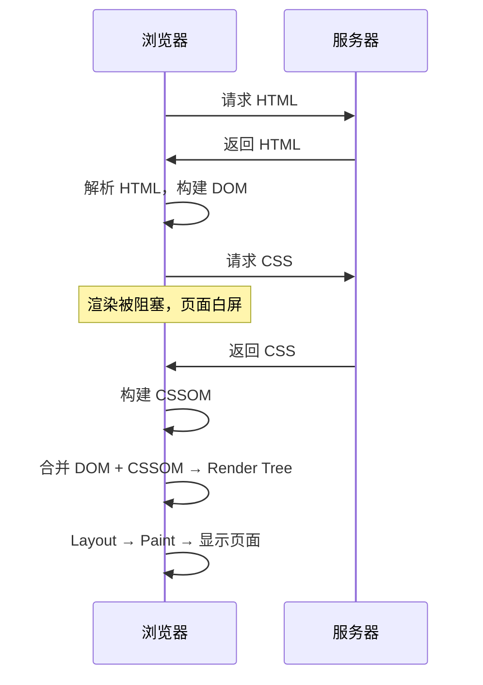
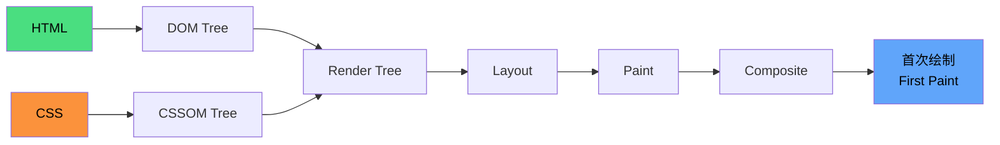

# 关键 CSS

CSS 是**渲染阻塞资源**——在 CSSOM 构建完成之前，浏览器不会将任何内容绘制到屏幕上。关键 CSS 的目标是：**只阻塞首屏必需的 CSS，其余异步加载**。

---

## CSS 加载与渲染阻塞



CSS 阻塞渲染的原因：
- JS 可能读取元素样式（`getComputedStyle`），CSSOM 未就绪时结果不准确
- 渲染需要 DOM 和 CSSOM 两者，缺一不可

---

## 关键渲染路径

从接收 HTML 到首次像素输出，经历以下步骤：



**关键 CSS** 就是首次绘制所需的最小 CSS 集合。减少关键 CSS 体积，可以加快首次绘制速度。

---

## 优化策略

### 内联关键 CSS

将首屏必需的 CSS 直接写入 HTML 的 `style` 标签中：

```html
<!DOCTYPE html>
<html>
<head>
  <!-- 关键 CSS 内联，立即开始构建 CSSOM -->
  <style>
    body { margin: 0; font-family: sans-serif; }
    .header { /* 首屏样式 */ }
    .hero { /* 首屏样式 */ }
  </style>

  <!-- 非关键 CSS 异步加载 -->
  <link rel="preload" href="rest.css" as="style" onload="this.rel='stylesheet'">
</head>
<body>
  <!-- 首屏内容 -->
</body>
</html>
```

### 异步加载非关键 CSS

使用 `media` 属性或 `preload` 实现异步加载：

```html
<!-- 方式一：media 查询（不匹配时不阻塞渲染） -->
<link rel="stylesheet" href="print.css" media="print">

<!-- 方式二：preload + onload 切换 -->
<link rel="preload" href="rest.css" as="style" onload="this.rel='stylesheet'">
<noscript><link rel="stylesheet" href="rest.css"></noscript>

<!-- 方式三：JS 动态插入 -->
<script>
  const link = document.createElement('link');
  link.rel = 'stylesheet';
  link.href = 'rest.css';
  document.head.appendChild(link);
</script>
```

### 按媒体查询拆分

将不同设备的 CSS 拆分，只加载当前设备需要的：

```html
<!-- 只在大屏加载 -->
<link rel="stylesheet" href="desktop.css" media="(min-width: 1024px)">

<!-- 只在打印时加载 -->
<link rel="stylesheet" href="print.css" media="print">

<!-- 只在暗色模式加载 -->
<link rel="stylesheet" href="dark.css" media="(prefers-color-scheme: dark)">
```

不匹配当前环境的 CSS 仍然会下载，但**不会阻塞渲染**。

---

## 关键 CSS 提取工具

手动提取关键 CSS 比较繁琐，可以使用工具自动完成：

| 工具 | 说明 |
|------|------|
| [critters](https://github.com/GoogleChromeLabs/critters) | Webpack/Vite 插件，构建时自动内联关键 CSS |
| [Penthouse](https://github.com/pocketjoso/penthouse) | Node.js 库，基于 Puppeteer 提取关键 CSS |
| [critical](https://github.com/addyosmani/critical) | 基于 Penthouse 的封装，更易用 |

### Vite 项目使用 critters

```js
// vite.config.js
import { defineConfig } from 'vite';
import critters from 'vite-plugin-critters';

export default defineConfig({
  plugins: [critters()],
});
```

构建后，首屏关键 CSS 会自动内联到 HTML 中，其余 CSS 异步加载。

---

## 实践建议

| 建议 | 说明 |
|------|------|
| 关键 CSS 控制在 14KB 内 | 一个 TCP 包能承载的大小，避免额外往返 |
| 非关键 CSS 异步加载 | 使用 `preload` 或 `media` 属性 |
| 使用工具自动提取 | 避免手动维护，构建时自动处理 |
| 配合 CSS 压缩 | 减小关键 CSS 体积 |
| 定期审查 | 页面结构变化后重新提取 |

---

## 与 CSS 渲染优化的关系

关键 CSS 解决的是**加载阶段**的优化（减少阻塞时间），而 CSS 渲染优化（如 `content-visibility`、`contain`、`will-change`）解决的是**渲染阶段**的优化（减少计算开销）。

> CSS 渲染优化技巧详见 [CSS 渲染性能优化](./css-rendering)。
