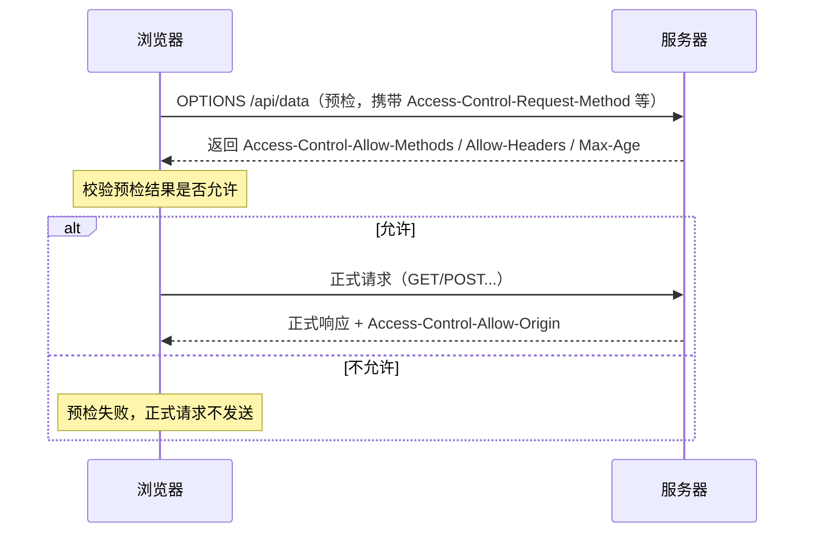

# 跨域通信

浏览器基于**同源策略**限制跨域访问，本文讲解跨域的原因、CORS 机制、常见跨域方案与携带 Cookie 的条件。

## 同源策略

### 什么是同源

**协议 + 域名 + 端口**三者完全一致才算同源：

```text
https://a.com/page        → 与 https://a.com/api 同源
https://a.com             → 与 http://a.com 不同源（协议不同）
https://a.com             → 与 https://a.com:8080 不同源（端口不同）
https://a.com             → 与 https://b.a.com 不同源（域名不同）
```

### 为什么限制跨域

保护用户数据：如果页面能随意跨域读取其他网站的数据，恶意网站就能窃取你的**登录态、Cookie、个人信息**（你的浏览器已登录银行，恶意页面发请求读取银行数据）。

### 关键认知：请求发出去了，浏览器拦截的是响应

跨域时**请求会正常到达服务器并执行**（危险操作照样发生），只是浏览器**屏蔽了响应**，JS 拿不到数据。所以跨域是"看得见结果、拿不到数据"，服务端该做的校验（鉴权、防 CSRF）一个都不能省。

## CORS 机制

### 简单请求 vs 非简单请求

**简单请求**需同时满足：

| 条件 | 要求 |
|------|------|
| 方法 | GET / HEAD / POST |
| Content-Type | `application/x-www-form-urlencoded`、`multipart/form-data`、`text/plain` 之一 |
| 自定义头 | 无 |

**不满足任一条件就是非简单请求**，会触发 preflight 预检。注意：**POST + `application/json` 就是非简单请求**（最常见的情况）。

### preflight 预检流程



### OPTIONS 响应应该返回什么

| 响应头 | 作用 |
|--------|------|
| `Access-Control-Allow-Methods` | 允许的方法，如 `GET, POST, PUT, DELETE` |
| `Access-Control-Allow-Headers` | 允许的自定义头，如 `Content-Type, Authorization` |
| `Access-Control-Max-Age` | 预检结果缓存秒数，期限内不再预检 |
| `Access-Control-Allow-Origin` | 允许的源（携带凭证时不能是 `*`） |
| `Access-Control-Allow-Credentials` | 是否允许携带凭证（Cookie） |

**为什么需要预检**：非简单请求（如 PUT、带自定义头）可能对服务器产生副作用，先让服务器"声明允许"，避免恶意网站借用用户身份直接发起危险请求。

## 跨域方案对比

| 方案 | 原理 | 适用场景 | 局限 |
|------|------|----------|------|
| **CORS** | 服务端加响应头，标准方案 | 常规 HTTP 接口 | 需要服务端配合 |
| **代理** | 请求发到同源服务器，由它转发（dev server proxy / Nginx 反代） | 开发调试、网关统一出口 | 生产需网关/nginx 配置 |
| **JSONP** | `script` 标签不受同源限制，服务端返回 JS 调用回调 | 老系统、只读 GET 接口 | 仅 GET、无统一错误处理、有 XSS 风险 |
| **postMessage** | 跨域 window/iframe 之间传递消息 | 跨域页面、嵌套 iframe 通信 | 需双方约定消息协议 |
| **WebSocket** | 独立协议，不受同源限制 | 长连接双向通信 | 协议独立，与 HTTP 接口无关 |

> `document.domain` 曾用于子域互访，现代浏览器已废弃，不要再依赖。

### JSONP 示例

原理一句话：**利用 `script` 标签加载跨域脚本不受限制**——请求返回的不是 JSON，而是一段"调用你定义好的函数"的 JS 代码。

**最简版：**

```javascript
// 1. 前端定义全局回调函数
function handleUser(data) {
  console.log('拿到用户数据:', data)
}

// 2. 动态创建 script 标签发请求（callback 参数告诉服务端回调名）
const script = document.createElement('script')
script.src = 'https://api.example.com/user?callback=handleUser'
document.body.appendChild(script)
```

```javascript
// 3. 服务端返回的不是 JSON，而是一段 JS 代码（Koa 示例）
router.get('/user', (ctx) => {
  const callback = ctx.query.callback   // 'handleUser'
  const data = { id: 1, name: 'Jun' }
  ctx.body = `${callback}(${JSON.stringify(data)})`  // handleUser({"id":1,"name":"Jun"})
})
```

浏览器把返回的 `handleUser({"id":1,"name":"Jun"})` 当脚本执行 → 回调被调用 → 拿到数据。

**封装成 Promise 版：**

```javascript
function jsonp(url, params = {}) {
  return new Promise((resolve, reject) => {
    // 每次请求生成唯一回调名，避免全局污染和并发冲突
    const callbackName = `jsonp_${Date.now()}_${Math.random().toString(36).slice(2)}`
    window[callbackName] = (data) => {
      resolve(data)
      delete window[callbackName]   // 用完清理
      script.remove()
    }
    const query = new URLSearchParams({ ...params, callback: callbackName })
    const script = document.createElement('script')
    script.src = `${url}${url.includes('?') ? '&' : '?'}${query}`
    script.onerror = () => {
      reject(new Error('JSONP 加载失败'))
      delete window[callbackName]
      script.remove()
    }
    document.body.appendChild(script)
  })
}

// 使用
jsonp('https://api.example.com/user', { id: 1 }).then((data) => {
  console.log(data)
})
```

**局限**：

- 仅支持 GET（script 标签只能发 GET）
- 回调必须挂全局（用唯一名字 + 用完删除来缓解污染）
- 服务端要配合返回 JS，不是标准接口格式
- 错误处理弱：只能捕获加载失败，拿不到 HTTP 状态码
- **XSS 风险**：服务端返回的任何内容都会被当 JS 执行——只能请求可信源

## CORS 携带 Cookie

接口需要带 Cookie 时，**三个条件缺一不可**：

| 条件 | 配置 |
|------|------|
| 前端声明携带 | XHR：`withCredentials = true`；fetch：`credentials: 'include'` |
| 服务端允许凭证 | `Access-Control-Allow-Credentials: true` |
| 明确允许的源 | `Access-Control-Allow-Origin` 必须写**具体源**，不能是 `*` |

```javascript
// 前端 fetch 携带 Cookie
fetch('https://api.example.com/user', {
  credentials: 'include'
})
```

```javascript
// 服务端（Koa 示例）：处理预检 + 携带凭证的响应头
router.options('*', (ctx) => {
  ctx.set('Access-Control-Allow-Methods', 'GET, POST, PUT, DELETE, OPTIONS')
  ctx.set('Access-Control-Allow-Headers', 'Content-Type, Authorization')
  ctx.set('Access-Control-Max-Age', '86400')   // 预检结果缓存 1 天
  ctx.status = 204
})

router.use(async (ctx, next) => {
  ctx.set('Access-Control-Allow-Origin', 'https://app.example.com') // 不能是 *
  ctx.set('Access-Control-Allow-Credentials', 'true')
  await next()
})
```

**附加注意**：Cookie 的 `SameSite` 属性也会影响跨站请求是否携带（`SameSite=Lax/Strict` 时跨站不发），需要一起配置。

## 面试速记

- **跨域请求发出去了吗？** 发出去了，服务器也执行了，浏览器拦截的是响应
- **preflight 什么时候触发？** 非简单请求：非 GET/HEAD/POST、Content-Type 非简单类型（`application/json` 也算）、带自定义头
- **OPTIONS 返回什么？** `Allow-Methods` / `Allow-Headers` / `Max-Age`（+ `Allow-Origin` / `Allow-Credentials`）
- **携带 Cookie 三条件？** `withCredentials` + `Access-Control-Allow-Credentials: true` + `Allow-Origin` 具体源（不能 `*`）
