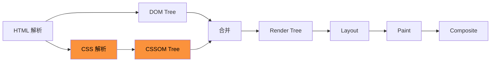

# CSS 渲染性能优化

CSS 虽然不会像 JS 那样阻塞 DOM 解析，但会**阻塞渲染**——在 CSSOM 构建完成之前，浏览器不会将任何内容绘制到屏幕上。

> CSS 渲染的完整流程详见 [从输入 URL 到页面展示](./overview#解析与渲染)。

---

## 阻塞渲染的因素



CSS 是**渲染阻塞资源**：
- CSS 下载完成前，浏览器不会渲染任何内容
- CSSOM 构建完成前，JS 无法获取元素的样式信息（`getComputedStyle` 会返回空）

---

## 优化技巧

### content-visibility

跳过屏幕外元素的渲染，直到它们滚动到可视区域：

```css
.section {
  content-visibility: auto;
  contain-intrinsic-size: 0 500px; /* 预估元素高度，避免滚动条跳动 */
}
```

| 值 | 说明 |
|---|------|
| `visible` | 默认值，正常渲染 |
| `auto` | 屏幕外元素跳过渲染，滚动到可视区域时恢复 |
| `hidden` | 始终跳过渲染（类似 `display: none`，但保留滚动位置等状态） |

适用场景：长列表、多 Tab 面板、折叠区域。

### contain

让元素及其子元素**独立于文档树的其余部分**，浏览器可以只对这部分元素进行重绘/重排：

```css
.card {
  contain: layout style paint;
}
```

| 值 | 说明 |
|---|------|
| `layout` | 元素内部布局不影响外部，反之亦然 |
| `style` | 计数器、引用等样式作用域限制在元素内 |
| `paint` | 元素内容不会绘制到元素边界之外 |
| `size` | 元素尺寸不依赖子元素（需配合 `contain-intrinsic-size`） |
| `strict` | 等同于 `layout style paint size` |
| `content` | 等同于 `layout paint` |

### will-change

提前告知浏览器元素即将发生变化，让浏览器**提前优化**（如提升为独立图层）：

```css
.element {
  will-change: transform;
}
```

使用原则：
- **按需使用**：只在确实遇到性能问题时才用，不要提前优化
- **用完移除**：变化结束后移除 `will-change`，避免浪费资源
- **精确指定**：尽量指定具体属性（如 `transform`、`opacity`），而非笼统的 `all`
- **避免滥用**：不要同时声明太多属性，不要应用在太多元素上

```js
// 通过 JS 动态添加和移除
element.addEventListener('mouseenter', () => {
  element.style.willChange = 'transform';
});

element.addEventListener('transitionend', () => {
  element.style.willChange = 'auto';
});
```

### font-display

解决 Web 字体加载期间的**闪烁问题**（FOUT）：

```css
@font-face {
  font-family: 'CustomFont';
  src: url('font.woff2') format('woff2');
  font-display: swap;
}
```

| 值 | 说明 |
|---|------|
| `auto` | 默认值，浏览器自行决定 |
| `block` | 字体加载期间隐藏文本（ FOIT） |
| `swap` | 立即用后备字体显示，字体加载完后替换 |
| `fallback` | 短暂隐藏（约 100ms），之后用后备字体，字体加载完后替换 |
| `optional` | 短暂隐藏，如果字体在极短时间内加载完则使用，否则本次用后备字体 |

> `swap` 是最常用的选择，确保文本立即可读。

### scroll-behavior

让锚点跳转和 `scrollTo` 调用**平滑滚动**，而非瞬间跳转：

```css
html {
  scroll-behavior: smooth;
}
```

```js
// JS 中也可以使用
element.scrollIntoView({ behavior: 'smooth' });
```

### GPU 加速动画

将动画属性限制在 `transform` 和 `opacity`，浏览器可以将其**提升到 GPU 合成层**，避免重排重绘：

```css
/* 好：只触发合成，性能最佳 */
.box {
  transition: transform 0.3s, opacity 0.3s;
}
.box:hover {
  transform: translateX(10px);
  opacity: 0.8;
}

/* 差：触发重排，性能差 */
.box {
  transition: width 0.3s, left 0.3s;
}
.box:hover {
  width: 200px;
  left: 10px;
}
```

会触发 GPU 加速的属性：
- `transform`（尤其是 3D transform）
- `opacity`
- `will-change`
- `filter`
- `position: fixed` 的元素

### 避免 @import

使用 `link` 而非 `@import` 加载多个样式表：

```html
<!-- 好：并行下载 -->
<link rel="stylesheet" href="a.css">
<link rel="stylesheet" href="b.css">

<!-- 差：串行下载，阻塞渲染 -->
<style>
  @import url('a.css');
  @import url('b.css');
</style>
```

`@import` 嵌套的样式表必须等前一个下载完才开始下载下一个，增加延迟。

---

## 关键 CSS

提取首屏关键 CSS 内联到 HTML 中，非关键 CSS 异步加载，减少渲染阻塞时间。

> 详见 [关键 CSS](./critical-css)。
