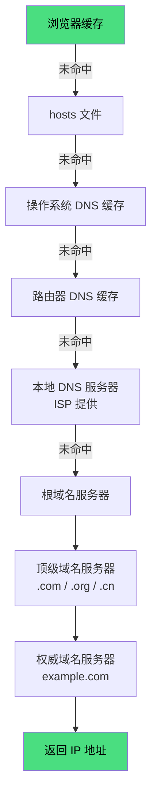

# DNS 域名系统

DNS（Domain Name System）将人类可读的域名转换为机器可读的 IP 地址。

---

## 递归查询 vs 迭代查询

### 递归查询

客户端向 DNS 服务器发请求，服务器**负责完成所有查询**，返回最终结果。

```
客户端 → 本地 DNS 服务器："帮我查 example.com 的 IP"
本地 DNS 服务器 → 客户端："example.com 的 IP 是 93.184.216.34"
```

特点：
- 客户端只发一次请求
- 服务器承担所有查询工作
- 浏览器/操作系统向本地 DNS 服务器发的是递归查询

### 迭代查询

DNS 服务器返回**它能提供的最佳答案**（可能是另一个 DNS 服务器的地址），客户端继续查询。

```
本地 DNS → 根服务器："查 example.com"
根服务器 → 本地 DNS："我不知道，但 .com 的服务器地址是 xxx"

本地 DNS → .com 服务器："查 example.com"
.com 服务器 → 本地 DNS："我不知道，但 example.com 的权威服务器是 yyy"

本地 DNS → 权威服务器："查 example.com"
权威服务器 → 本地 DNS："example.com 的 IP 是 93.184.216.34"
```

特点：
- 本地 DNS 服务器多次查询
- 每次返回最接近的答案
- 本地 DNS 服务器向根/顶级/权威服务器发的是迭代查询

---

## 查询流程



### 1. 浏览器缓存

浏览器会缓存最近查询过的 DNS 记录，缓存时间由 DNS 响应的 TTL 决定。

- Chrome：约 1 分钟
- Firefox：约 60 秒
- Safari：约 10 秒

### 2. hosts 文件

操作系统级别的域名映射文件，优先级高于 DNS 查询。

```
# Windows: C:\Windows\System32\drivers\etc\hosts
# macOS/Linux: /etc/hosts

127.0.0.1 localhost
93.184.216.34 example.com
```

用途：本地开发、屏蔽广告、测试环境。

### 3. 操作系统 DNS 缓存

操作系统会缓存 DNS 查询结果：

- Windows：`ipconfig /displaydns` 查看，`ipconfig /flushdns` 清除
- macOS：`sudo killall -HUP mDNSResponder` 清除
- Linux：取决于发行版（systemd-resolved、dnsmasq 等）

### 4. 路由器 DNS 缓存

家用路由器通常有 DNS 缓存功能，缓存时间由路由器固件决定。

### 5. 本地 DNS 服务器（ISP 提供）

由网络服务提供商（ISP）提供的 DNS 服务器，如：
- 中国电信：`114.114.114.114`
- 阿里云：`223.5.5.5`
- Google：`8.8.8.8`
- Cloudflare：`1.1.1.1`

### 6-8. 根 → 顶级 → 权威域名服务器

如果本地 DNS 服务器没有缓存，则开始迭代查询：

| 层级 | 数量 | 职责 | 示例 |
|------|------|------|------|
| 根域名服务器 | 13 组（实际数百台） | 返回顶级域名服务器地址 | `a.root-servers.net` |
| 顶级域名服务器 | 数千个 | 返回权威域名服务器地址 | `.com`、`.org`、`.cn` |
| 权威域名服务器 | 无数个 | 返回最终 IP 地址 | `ns1.example.com` |

---

## DNS 记录类型

| 记录类型 | 用途 | 示例 |
|---------|------|------|
| **A** | 域名 → IPv4 地址 | `example.com → 93.184.216.34` |
| **AAAA** | 域名 → IPv6 地址 | `example.com → 2606:2800:220:1:248:1893:25c8:1946` |
| **CNAME** | 域名别名 → 真实域名 | `www.example.com → example.com` |
| **MX** | 邮件服务器地址 | `example.com → mail.example.com` |
| **TXT** | 文本记录（SPF、DKIM 等） | `v=spf1 include:_spf.google.com ~all` |
| **NS** | 指定权威域名服务器 | `example.com → ns1.example.com` |
| **SOA** | 起始授权记录（区域信息） | 包含主 DNS、管理员邮箱、序列号等 |
| **PTR** | IP → 域名（反向解析） | `34.216.184.93.in-addr.arpa → example.com` |

---

## DNS 缓存与 TTL

### TTL（Time To Live）

DNS 记录中的 TTL 字段指定缓存时间（秒）：

```
example.com.  3600  IN  A  93.184.216.34
              ↑
           TTL 3600 秒（1 小时）
```

- TTL 越短：更新快，但查询频繁
- TTL 越长：查询少，但更新慢

### 缓存更新

当 DNS 记录变更时：
1. 等待 TTL 过期，缓存自动失效
2. 手动清除各级缓存（浏览器、OS、路由器、ISP）
3. 使用 `dig` 或 `nslookup` 查询最新记录

---

## DNS 安全

### DNS 劫持

攻击者篡改 DNS 响应，将用户引导到恶意网站。

防护：
- 使用 HTTPS（DNS over HTTPS, DoH）
- 使用 DNSSEC（DNS 安全扩展）
- 使用可信的 DNS 服务器

### DNS over HTTPS (DoH)

将 DNS 查询通过 HTTPS 加密传输，防止中间人窃听和篡改：

```js
// Firefox/Chrome 支持 DoH
// 设置 → 隐私与安全 → DNS over HTTPS
```

### DNSSEC

通过数字签名验证 DNS 响应的真实性，防止 DNS 欺骗。

---

## 性能优化

### DNS 预解析

浏览器预测用户可能访问的域名，提前进行 DNS 解析：

```html
<link rel="dns-prefetch" href="https://example.com">
```

### DNS 预连接

不仅预解析 DNS，还提前建立 TCP 连接和 TLS 握手：

```html
<link rel="preconnect" href="https://example.com" crossorigin>
```

### 使用公共 DNS

选择响应快、稳定的公共 DNS 服务器：

| DNS 服务商 | 地址 | 特点 |
|-----------|------|------|
| 阿里 DNS | `223.5.5.5` | 国内速度快 |
| 腾讯 DNS | `119.29.29.29` | 国内速度快 |
| Google DNS | `8.8.8.8` | 全球覆盖 |
| Cloudflare | `1.1.1.1` | 隐私保护 |
| 114 DNS | `114.114.114.114` | 国内老牌 |

---

## 调试工具

### nslookup

```bash
nslookup example.com
nslookup example.com 8.8.8.8  # 指定 DNS 服务器
```

### dig

```bash
dig example.com
dig example.com A        # 查询 A 记录
dig example.com +trace   # 追踪完整查询过程
```

### 浏览器开发者工具

Chrome DevTools → Network → 点击请求 → 查看 DNS 解析耗时。
