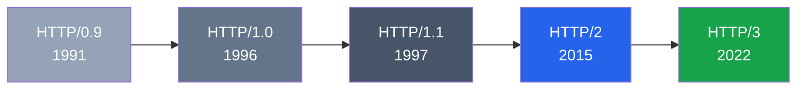
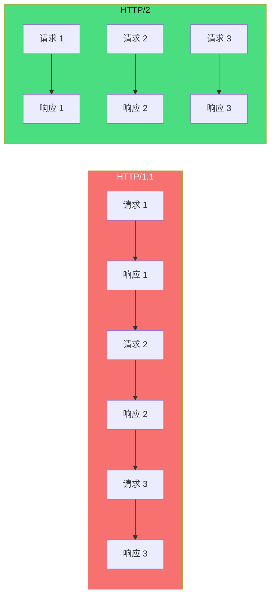
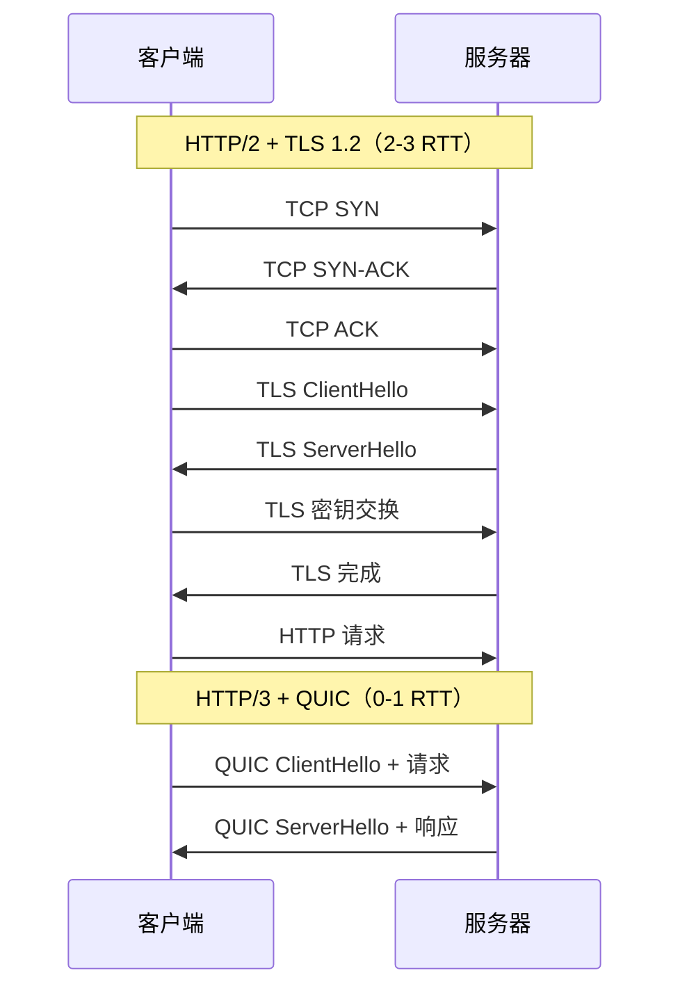

# HTTP 协议演进

HTTP（HyperText Transfer Protocol）是万维网的数据通信基础。从 1991 年至今，HTTP 经历了多次重大演进。



---

## HTTP/0.9（1991）

最早的 HTTP 协议，非常简单。

### 特点

- **只有一个请求行**：`GET /index.html`
- **没有请求头**：无法传递额外信息
- **没有请求体**：只能 GET，不能 POST
- **响应只有数据**：没有状态码、没有响应头

### 示例

```
请求：
GET /index.html

响应：
<html>
  <body>Hello World</body>
</html>
```

### 限制

- 只能传输 HTML 文件
- 无法传输图片、视频等其他资源
- 每次请求后立即断开连接

---

## HTTP/1.0（1996）

正式发布的第一个 HTTP 版本，RFC 1945。

### 新增特性

| 特性 | 说明 |
|------|------|
| **请求方法** | GET、POST、HEAD |
| **请求头** | User-Agent、Accept、Content-Type 等 |
| **响应头** | Content-Type、Content-Length、状态码 |
| **状态码** | 200、404、500 等 |
| **缓存机制** | Expires、If-Modified-Since |
| **多媒体支持** | 可传输图片、视频、音频等 |

### 示例

```
请求：
GET /index.html HTTP/1.0
User-Agent: Mozilla/5.0
Accept: text/html

响应：
HTTP/1.0 200 OK
Content-Type: text/html
Content-Length: 1234

<html>...</html>
```

### 问题

- **每次请求都要建立新的 TCP 连接**（三次握手 + 四次挥手）
- 加载一个包含 10 张图片的页面需要建立 11 次 TCP 连接
- 连接建立开销大，页面加载慢

---

## HTTP/1.1（1997）

目前使用最广泛的 HTTP 版本，RFC 2616（后被 RFC 7230-7235 取代）。

### 新增特性

| 特性 | 说明 |
|------|------|
| **持久连接** | `Connection: keep-alive`，默认复用 TCP 连接 |
| **管道化** | 同一连接上可发送多个请求，无需等待响应 |
| **Host 头** | 支持虚拟主机，一个 IP 可托管多个域名 |
| **分块传输** | `Transfer-Encoding: chunked`，无需预先知道内容长度 |
| **缓存增强** | Cache-Control、ETag、If-None-Match |
| **方法扩展** | PUT、DELETE、OPTIONS、PATCH |
| **范围请求** | `Range` 头，支持断点续传 |

### 持久连接

```
HTTP/1.0：请求 → 响应 → 断开 → 请求 → 响应 → 断开
HTTP/1.1：请求 → 响应 → 请求 → 响应 → 请求 → 响应 → 断开
```

### 管道化（Pipelining）

```
客户端：请求 1 → 请求 2 → 请求 3
服务器：              响应 1 → 响应 2 → 响应 3
```

问题：**队头阻塞** — 如果请求 1 响应慢，请求 2 和 3 也要等待。

### 示例

```
请求：
GET /index.html HTTP/1.1
Host: example.com
User-Agent: Mozilla/5.0
Accept: text/html
Connection: keep-alive

响应：
HTTP/1.1 200 OK
Content-Type: text/html
Content-Length: 1234
Cache-Control: max-age=3600

<html>...</html>
```

---

## HTTP/2（2015）

基于 Google SPDY 协议，RFC 7540。

### 出现原因

HTTP/1.1 的瓶颈：

1. **TCP 慢启动**：小资源也受慢启动影响，响应慢
2. **多连接竞争带宽**：浏览器开启 6-8 个并发连接，互相竞争
3. **队头阻塞**：管道化不成熟，实际未广泛使用
4. **头部开销大**：重复的 Cookie、User-Agent 无法压缩

### 新增特性

| 特性 | 说明 |
|------|------|
| **多路复用** | 单个连接上并行传输多个请求/响应 |
| **头部压缩** | HPACK 算法，压缩重复头部 |
| **服务器推送** | 服务器主动推送资源，无需客户端请求 |
| **请求优先级** | 客户端可指定资源加载优先级 |
| **二进制分帧** | 文本协议 → 二进制协议，解析更高效 |

### 多路复用



### 头部压缩

```
HTTP/1.1 重复发送：
User-Agent: Mozilla/5.0 (Windows NT 10.0; Win64; x64)...
Cookie: session_id=xxx; user_id=yyy; token=zzz...

HTTP/2 HPACK 压缩：
只发送索引号，重复的头部不传输
```

### 服务器推送

```
客户端请求：GET /index.html
服务器响应：
  - /index.html
  - /style.css（推送）
  - /script.js（推送）
  - /logo.png（推送）
```

客户端无需解析 HTML 后再逐个请求资源，服务器提前推送。

---

## HTTP/3（2022）

基于 QUIC 协议，RFC 9114。

### 出现原因

HTTP/2 仍存在的问题：

1. **TCP 队头阻塞**：单个丢包导致所有流等待重传
2. **连接建立慢**：TCP 三次握手 + TLS 握手，至少 2-3 RTT
3. **协议僵化**：TCP 是操作系统内核实现，难以更新

### 解决方案：QUIC 协议

QUIC（Quick UDP Internet Connections）基于 UDP，集成 TLS 1.3。

| 特性 | 说明 |
|------|------|
| **0-RTT 连接** | 首次连接 1-RTT，后续连接 0-RTT |
| **彻底解决队头阻塞** | 每个流独立，丢包不影响其他流 |
| **连接迁移** | 基于 Connection ID，切换网络不断连 |
| **集成 TLS** | 加密是协议的一部分，非可选 |
| **拥塞控制** | 用户空间实现，可快速迭代 |

### 连接建立对比



### 队头阻塞对比

**HTTP/2 over TCP**：所有流共享一个 TCP 连接。TCP 保证有序交付——一个包丢了，后续所有包都要等重传，**不管属于哪个流**。

```
时间线 →

流 1（图片）: [包 1][包 2][包 3]
                    ↑ 丢失，等待重传
流 2（CSS）:  [包 1][包 2][包 3]
                        ↑ 也要等！虽然自己的包没丢
```

**HTTP/3 over QUIC**：每个流独立传输，一个流丢包**只阻塞自己**。

```
时间线 →

流 1（图片）: [包 1][包 2][包 3]
                    ↑ 丢失，等待重传
流 2（CSS）:  [包 1][包 2][包 3]
                        ↑ 继续传输，不受影响
```

**根本原因**：TCP 是单队列有序协议，QUIC 是多队列独立协议。

---

## 版本对比

| 特性 | HTTP/1.0 | HTTP/1.1 | HTTP/2 | HTTP/3 |
|------|---------|---------|--------|--------|
| **连接** | 短连接 | 持久连接 | 单连接多路复用 | 单连接多路复用 |
| **协议** | 文本 | 文本 | 二进制 | 二进制 |
| **队头阻塞** | 无（短连接） | 有 | TCP 层有 | 无 |
| **头部压缩** | 无 | 无 | HPACK | QPACK |
| **服务器推送** | 无 | 无 | 有 | 有 |
| **加密** | 可选 | 可选 | 可选 | 强制 |
| **连接建立** | 1 RTT | 1 RTT | 2-3 RTT | 0-1 RTT |
| **传输层** | TCP | TCP | TCP | QUIC (UDP) |

---

## 浏览器支持

| 浏览器 | HTTP/1.1 | HTTP/2 | HTTP/3 |
|--------|---------|--------|--------|
| Chrome | ✅ | ✅ (v41+) | ✅ (v87+) |
| Firefox | ✅ | ✅ (v36+) | ✅ (v88+) |
| Safari | ✅ | ✅ (v9+) | ✅ (v14+) |
| Edge | ✅ | ✅ | ✅ |

---

## 实际使用建议

| 场景 | 推荐版本 |
|------|---------|
| 内部 API、简单服务 | HTTP/1.1 |
| 大多数网站 | HTTP/2 |
| 高延迟网络、移动场景 | HTTP/3 |
| 实时通信、游戏 | HTTP/3 (QUIC) |

### 升级路径

```
HTTP/1.1 → HTTP/2：无需改代码，服务器配置即可
HTTP/2 → HTTP/3：需要服务器支持 QUIC（如 Nginx 1.25+、Caddy）
```
