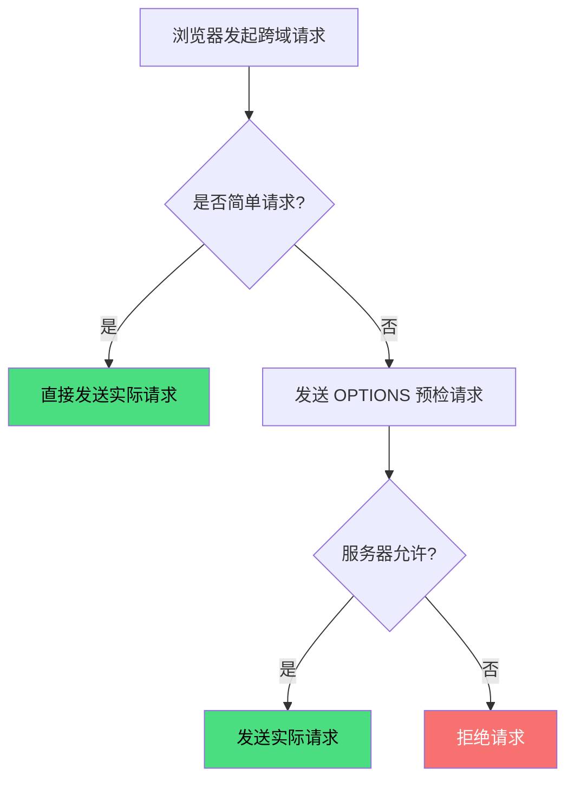

# HTTP Methods

HTTP 定义了多种请求方法，用于对资源执行不同的操作。

---

## 方法概览

| 方法 | 安全 | 幂等 | 用途 |
|------|------|------|------|
| **GET** | ✅ | ✅ | 获取资源 |
| **POST** | ❌ | ❌ | 创建资源 |
| **PUT** | ❌ | ✅ | 全量更新资源 |
| **PATCH** | ❌ | ❌ | 部分更新资源 |
| **DELETE** | ❌ | ✅ | 删除资源 |
| **HEAD** | ✅ | ✅ | 获取响应头（无响应体） |
| **OPTIONS** | ✅ | ✅ | 查询服务器支持的方法 |
| **CONNECT** | ❌ | ❌ | 建立隧道（代理） |
| **TRACE** | ✅ | ✅ | 诊断（回显请求） |

### 安全方法（Safe）

**不会修改服务器资源**的方法。

- ✅ 安全：GET、HEAD、OPTIONS、TRACE — 只是"读"，不"写"
- ❌ 不安全：POST、PUT、PATCH、DELETE、CONNECT — 会修改资源

**意义**：浏览器可以对安全方法做优化，比如预加载、预取，因为知道不会改数据。

### 幂等方法（Idempotent）

**执行多次与执行一次效果相同**。

- ✅ 幂等：GET、PUT、DELETE、HEAD、OPTIONS、TRACE
- ❌ 非幂等：POST、PATCH、CONNECT

**举例**：

```
DELETE /api/users/123  ← 第一次：删除成功
DELETE /api/users/123  ← 第二次：资源已不存在，但状态不变（还是"被删除"）
→ 幂等

POST /api/users        ← 第一次：创建用户 A
POST /api/users        ← 第二次：又创建了用户 B
→ 非幂等（执行两次结果不同）
```

**意义**：网络请求可能超时重试，幂等方法重试是安全的，非幂等方法重试可能产生副作用（如重复下单）。

---

## GET

获取资源，参数通过 URL 传递。

```http
GET /api/users?id=123 HTTP/1.1
Host: example.com
```

**特点**：
- 参数在 URL 中，可见
- 可被缓存
- 可被浏览器历史记录保存
- 可被收藏为书签

**限制**：
- URL 长度限制（浏览器通常 2KB-8KB，非协议限制）
- 只能传输 ASCII 字符（需 URL 编码）

---

## POST

创建资源或提交数据，参数通过请求体传递。

```http
POST /api/users HTTP/1.1
Host: example.com
Content-Type: application/json

{"name": "张三", "email": "zhang@example.com"}
```

**特点**：
- 参数在请求体中，不可见
- 默认不被缓存
- 不保存在浏览器历史记录
- 可传输任意类型数据

---

## PUT vs PATCH

### PUT（全量更新）

替换整个资源，需要提供完整的资源表示。

```http
PUT /api/users/123 HTTP/1.1
Content-Type: application/json

{"name": "张三", "email": "zhang@example.com", "age": 25}
```

**幂等**：多次执行结果相同。

### PATCH（部分更新）

只更新资源的部分字段。

```http
PATCH /api/users/123 HTTP/1.1
Content-Type: application/json

{"age": 26}
```

**非幂等**：多次执行可能产生不同结果（如递增操作）。

---

## DELETE

删除资源。

```http
DELETE /api/users/123 HTTP/1.1
Host: example.com
```

**幂等**：删除不存在的资源返回 404，但资源状态不变。

---

## HEAD

与 GET 相同，但服务器只返回响应头，不返回响应体。

```http
HEAD /api/users/123 HTTP/1.1
Host: example.com

HTTP/1.1 200 OK
Content-Type: application/json
Content-Length: 1234
```

**用途**：
- 检查资源是否存在
- 获取资源大小（Content-Length）
- 检查资源是否被修改（Last-Modified、ETag）

---

## OPTIONS

查询服务器支持的 HTTP 方法，或用于 CORS 预检请求。

### 查询支持的方法

```http
OPTIONS /api/users HTTP/1.1
Host: example.com

HTTP/1.1 200 OK
Allow: GET, POST, PUT, DELETE, OPTIONS
```

### CORS 预检请求

浏览器对**非简单请求**自动发送 OPTIONS 预检请求，确认服务器允许跨域。

#### 简单请求条件（同时满足）

1. 方法是 GET、HEAD 或 POST
2. POST 的 Content-Type 是 `application/x-www-form-urlencoded`、`multipart/form-data` 或 `text/plain`
3. 无自定义请求头

#### 非简单请求触发预检



#### 预检请求示例

```http
OPTIONS /api/users HTTP/1.1
Origin: https://example.com
Access-Control-Request-Method: POST
Access-Control-Request-Headers: Content-Type, Authorization

HTTP/1.1 200 OK
Access-Control-Allow-Origin: https://example.com
Access-Control-Allow-Methods: GET, POST, PUT, DELETE
Access-Control-Allow-Headers: Content-Type, Authorization
Access-Control-Max-Age: 86400
```

#### 优化预检请求

使用 `Access-Control-Max-Age` 缓存预检结果，避免每次请求都发送 OPTIONS：

```http
Access-Control-Max-Age: 86400  # 预检结果缓存 24 小时
```

---

## GET vs POST 对比

| 特性 | GET | POST |
|------|-----|------|
| **参数位置** | URL 查询字符串 | 请求体 |
| **参数可见性** | 可见（地址栏） | 不可见 |
| **长度限制** | URL 长度限制（浏览器实现） | 无协议限制 |
| **缓存** | 可缓存 | 默认不缓存 |
| **历史记录** | 保存 | 不保存 |
| **书签** | 可收藏 | 不可收藏 |
| **幂等** | ✅ | ❌ |
| **安全** | 相对不安全（参数暴露） | 相对安全 |
| **用途** | 查询、获取 | 创建、提交 |

### 常见误区

**误区 1：GET 有 2KB 长度限制**

- HTTP 协议本身对 URL 长度无限制
- 限制来自浏览器实现（IE 2KB，Chrome 8KB）
- 服务器也可能有限制（Nginx 默认 8KB）

**误区 2：POST 比 GET 安全**

- 两者都不安全，都可被拦截
- 安全性依赖 HTTPS 加密，而非请求方法

**误区 3：POST 发送两个 TCP 包**

- 这是 Nagle 算法的行为，与 HTTP 方法无关
- 现代浏览器和服务器通常禁用 Nagle 算法

---

## 方法选择建议

| 操作 | 推荐方法 |
|------|---------|
| 查询列表 | GET |
| 查询详情 | GET |
| 创建资源 | POST |
| 全量更新 | PUT |
| 部分更新 | PATCH |
| 删除资源 | DELETE |
| 检查资源 | HEAD |
| 查询支持的方法 | OPTIONS |

### RESTful 设计原则

```
GET    /api/users      # 获取用户列表
GET    /api/users/123  # 获取用户 123
POST   /api/users      # 创建用户
PUT    /api/users/123  # 更新用户 123（全量）
PATCH  /api/users/123  # 更新用户 123（部分）
DELETE /api/users/123  # 删除用户 123
```
