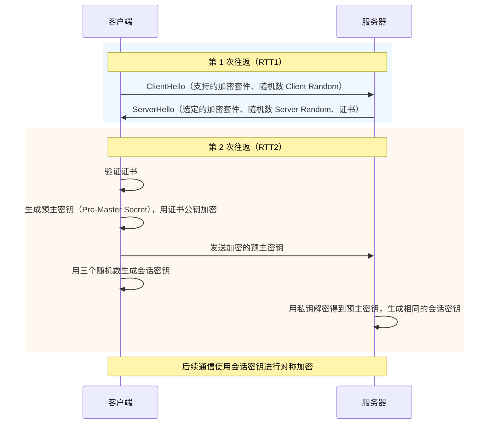
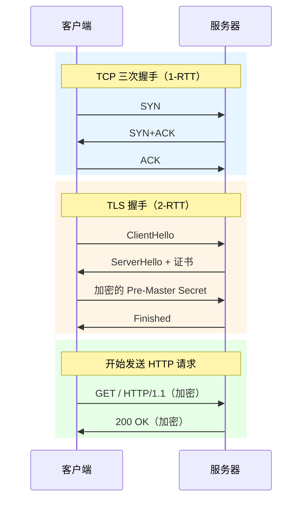
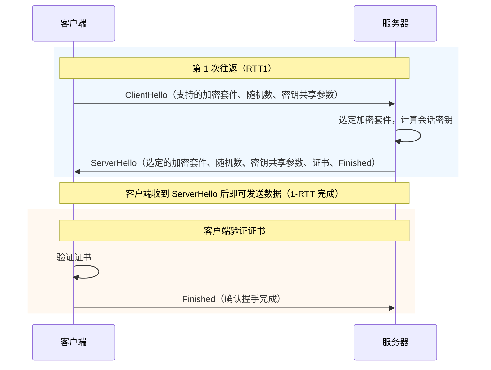
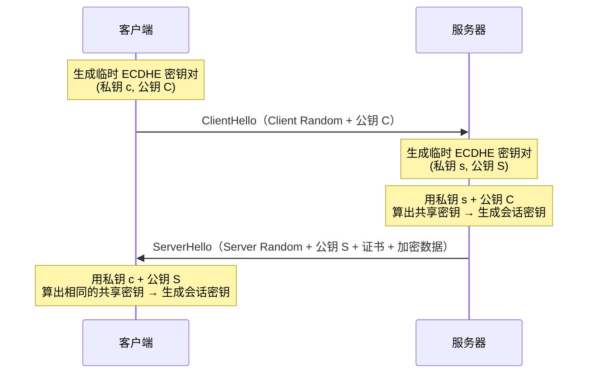
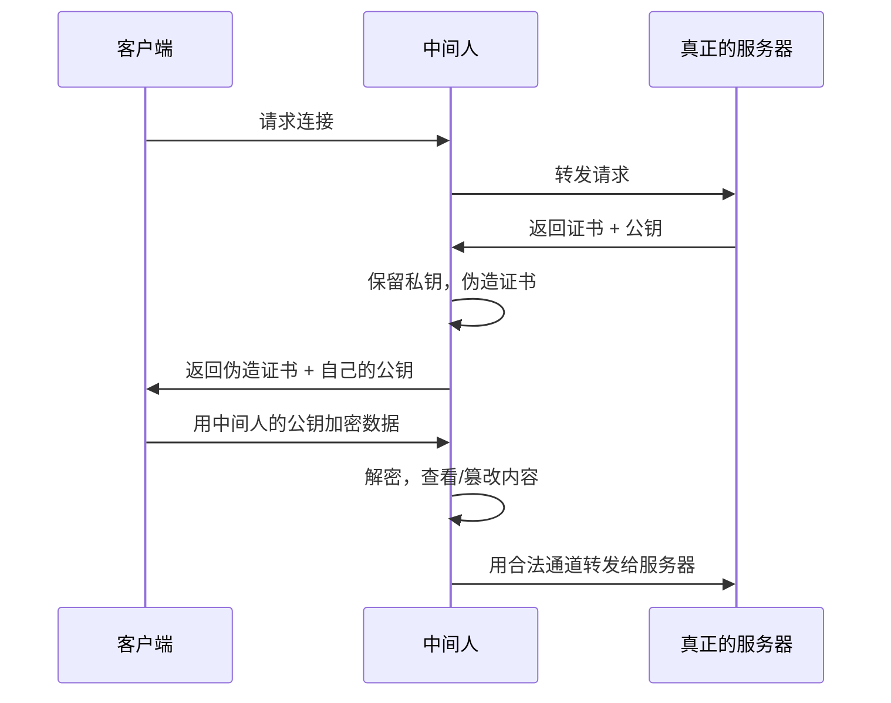
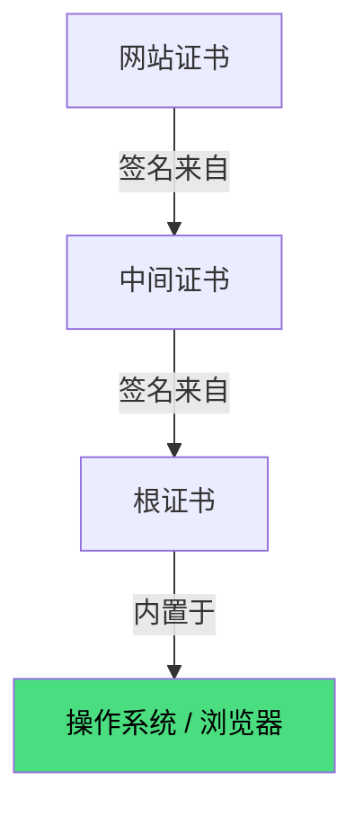

HTTPS（HTTP over TLS）是 HTTP 与 TLS 的结合，解决 HTTP 明文传输的三大风险：**窃听**、**篡改**、**冒充**。

| 风险 | HTTP | HTTPS 的解决方式 |
|------|------|-----------------|
| 窃听 | 明文传输，任何人可读 | 对称加密，中间节点无法解读内容 |
| 篡改 | 中间人可修改请求/响应 | 消息摘要 + MAC，接收方可验证完整性 |
| 冒充 | 无法确认对方是否为真正的服务器 | 数字证书 + CA 信任链，验证身份 |

---

## 加密基础

HTTPS 混合使用三种密码学技术：

### 对称加密

加密和解密使用**同一把密钥**。

- 优点：速度快，适合大量数据
- 缺点：密钥如何安全地传递给对方？
- 常见算法：AES、ChaCha20

### 非对称加密

使用**公钥加密、私钥解密**（或反过来）。

- 优点：公钥可以公开，不需要安全传递
- 缺点：计算量大，速度远慢于对称加密
- 常见算法：RSA、ECDHE

### 哈希算法（摘要）

将任意长度的数据映射为**固定长度**的摘要值，不可逆。

- 用途：验证数据完整性、数字签名
- 常见算法：SHA-256、SHA-384
- 特性：即使改一个比特，摘要值也会完全不同

---

## TLS 握手

HTTPS 在 TCP 连接建立后，还需要进行 TLS 握手来协商加密参数、验证证书、生成会话密钥。

### TLS 1.2 握手（2-RTT）



#### 密钥协商细节

会话密钥由双方**各自独立计算**，依赖三个"原料"：

| 原料 | 谁生成的 | 怎么传递的 |
|------|---------|-----------|
| Client Random | 客户端 | ClientHello 明文发送 |
| Server Random | 服务器 | ServerHello 明文发送 |
| Pre-Master Secret | 客户端 | 用服务器公钥加密后发送 |

**Pre-Master Secret** 是客户端生成的 48 字节随机数，用服务器证书的公钥加密传输。只有持有私钥的服务器才能解密得到它。

双方用相同的算法独立计算：

```
Master Secret = PRF(Pre-Master Secret, "master secret", Client Random + Server Random)
```

- **客户端**：三个值都有，直接计算
- **服务器**：私钥解密得到 Pre-Master Secret，结合已知的两个随机数，算出**完全相同的** Master Secret

之后再从 Master Secret 派生出实际的会话密钥。所以会话密钥不是客户端单方面"定"的——双方用相同原料、相同算法独立算出，结果必然一致。中间人没有私钥，无法解密 Pre-Master Secret，自然算不出相同的会话密钥。

TLS 1.2 需要 **2-RTT**（两次往返）才能开始发送应用数据。加上 TCP 三次握手的 1-RTT，HTTPS 首次连接至少需要 **3-RTT**。

TCP 握手和 TLS 握手是**分开串行**进行的——先建立传输层连接，再在其上协商加密：



### TLS 1.3 握手（1-RTT）

TLS 1.3 大幅简化了握手过程：



TLS 1.3 的改进：
- **1-RTT**：客户端在第一条消息中就发送密钥共享参数，服务器可以直接计算会话密钥，省掉一次往返
- **0-RTT 恢复**：对于曾连接过的服务器，客户端可以在第一条消息中直接附带加密数据（需服务器支持）
- **废弃不安全算法**：移除了 RSA 密钥交换、RC4、SHA-1 等
- **仅保留 AEAD 加密套件**：如 AES-GCM、ChaCha20-Poly1305，同时提供加密和完整性校验

#### 为什么能减少到 1-RTT

TLS 1.2 中，客户端需要等收到 ServerHello 后才能生成 Pre-Master Secret 并发送，因此需要额外一次往返。

TLS 1.3 改用 **ECDHE**（椭圆曲线 Diffie-Hellman）协商密钥。客户端在 ClientHello 中就携带了自己的 ECDHE 公钥参数，服务器收到后可以立即计算会话密钥：

| 原料 | 怎么来的 |
|------|---------|
| Client Random | ClientHello 明文发送 |
| Server Random | ServerHello 明文发送 |
| 共享密钥 | 双方各自用 ECDHE 独立算出 |

随机数仍用于最终的密钥派生。TLS 1.3 使用 **HKDF**（基于 HMAC 的密钥派生函数）从 ECDHE 共享密钥派生出会话密钥：

```
会话密钥 = HKDF(ECDHE 共享密钥, Client Random + Server Random + 其他上下文)
```

ECDHE 共享密钥是主要原料，随机数保证即使共享密钥碰巧相同（概率极低），不同会话也会产生不同的密钥。

DH 算法基于椭圆曲线的数学特性：双方各自用私钥和对方公钥计算，能独立得出相同结果，但第三方仅凭两个公钥无法算出。



服务器在第一次往返就能算出会话密钥并返回加密数据，省掉了 TLS 1.2 中"发送 Pre-Master Secret"的那次往返。

---

## 数字证书

### 证书包含的信息

- 域名（Subject CN / SAN）
- 持有者信息（组织、公司）
- 颁发机构（CA）
- 公钥
- 有效期
- 数字签名（CA 对以上信息的签名）

### 为什么需要 CA？

没有 CA 的情况下，中间人攻击很简单：



CA（证书颁发机构）的作用是**信用背书**：浏览器和操作系统内置了受信任的根证书，只有经过 CA 签名的网站证书才会被信任。

### 浏览器如何验证证书？

1. **域名和有效期**：证书中的域名是否与当前访问的一致？是否在有效期内？
2. **证书链**：网站证书 → 中间证书 → 根证书，逐级验证签名，直到本地内置的受信任根证书
3. **是否被吊销**：通过 CRL（证书吊销列表）或 OCSP（在线证书状态协议）检查
4. **是否被篡改**：证书上的 CA 数字签名是否可以验证通过



> **证书冒用问题**：即使中间人下载了合法证书（包含公钥），也无法冒充服务器——因为私钥只有真正的服务器持有，中间人无法解密客户端用公钥加密的数据。

---

## HTTPS 的性能影响

| 环节 | 额外开销 | 说明 |
|------|---------|------|
| TLS 握手 | 1-2 RTT 延迟 | TLS 1.3 降至 1-RTT，会话复用可 0-RTT |
| 加解密计算 | CPU 开销 | 现代硬件 + AES 硬件加速，影响已很小 |
| 首字节时间 | 增加约 1 个 RTT | 相比 HTTP 多出的握手时间 |

### 优化手段

- **TLS 1.3**：握手延迟从 2-RTT 降至 1-RTT
- **会话复用**：TLS Session Resumption，复用之前的会话密钥，0-RTT 恢复
- **OCSP Stapling**：服务器代替客户端查询证书状态，减少一次 OCSP 请求
- **HTTP/2 多路复用**：减少连接数，摊薄 TLS 握手成本
- **False Start**：TLS 1.2 的优化，客户端在收到 ServerHello 后不等 Finished 就开始发送数据

---

## HTTP vs HTTPS 对比

| 维度 | HTTP | HTTPS |
|------|------|-------|
| 传输层 | TCP | TCP + TLS |
| 数据格式 | 明文 | 加密的二进制帧 |
| 端口 | 80 | 443 |
| 证书 | 不需要 | 需要 CA 签发 |
| 性能 | 更快（无加密开销） | 略有开销，现代优化后差距很小 |
| SEO | 搜索引擎降权 | Google 优先展示 HTTPS 站点 |
| 浏览器标记 | 显示"不安全" | 显示锁图标 |

> TLS 握手的详细过程以及 TCP 连接建立详见 [TCP 协议](./tcp)。
