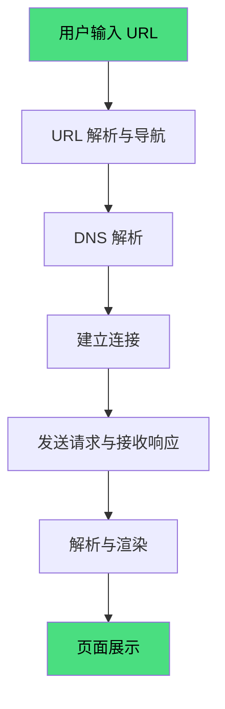
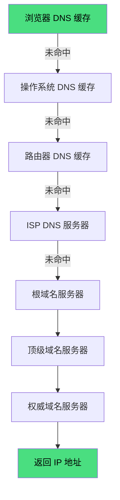
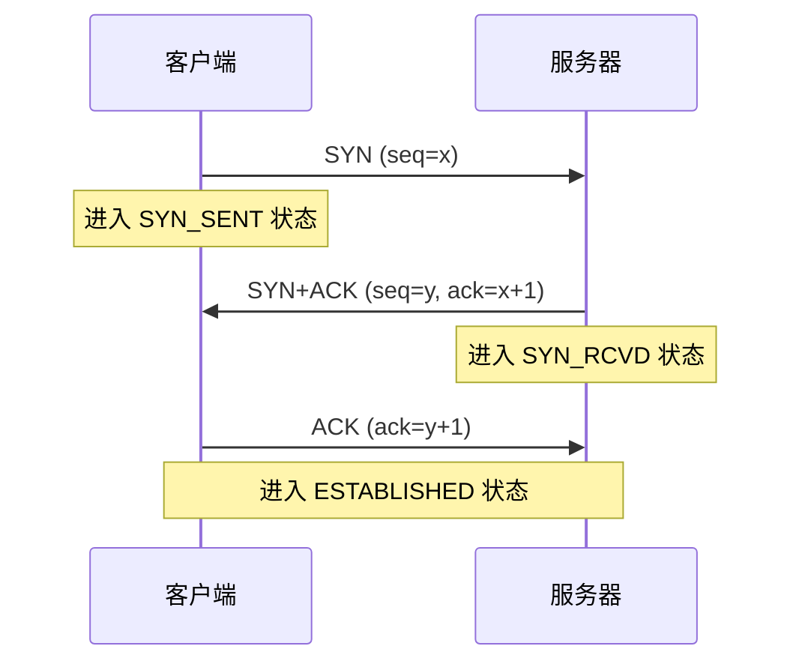
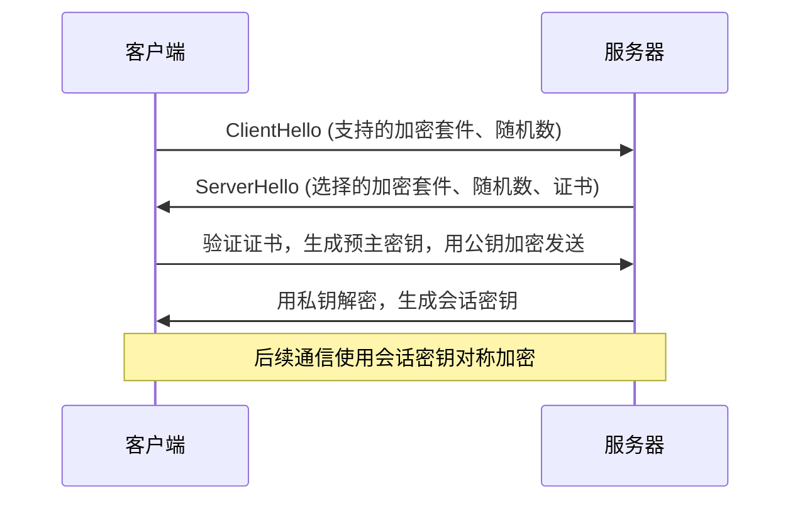
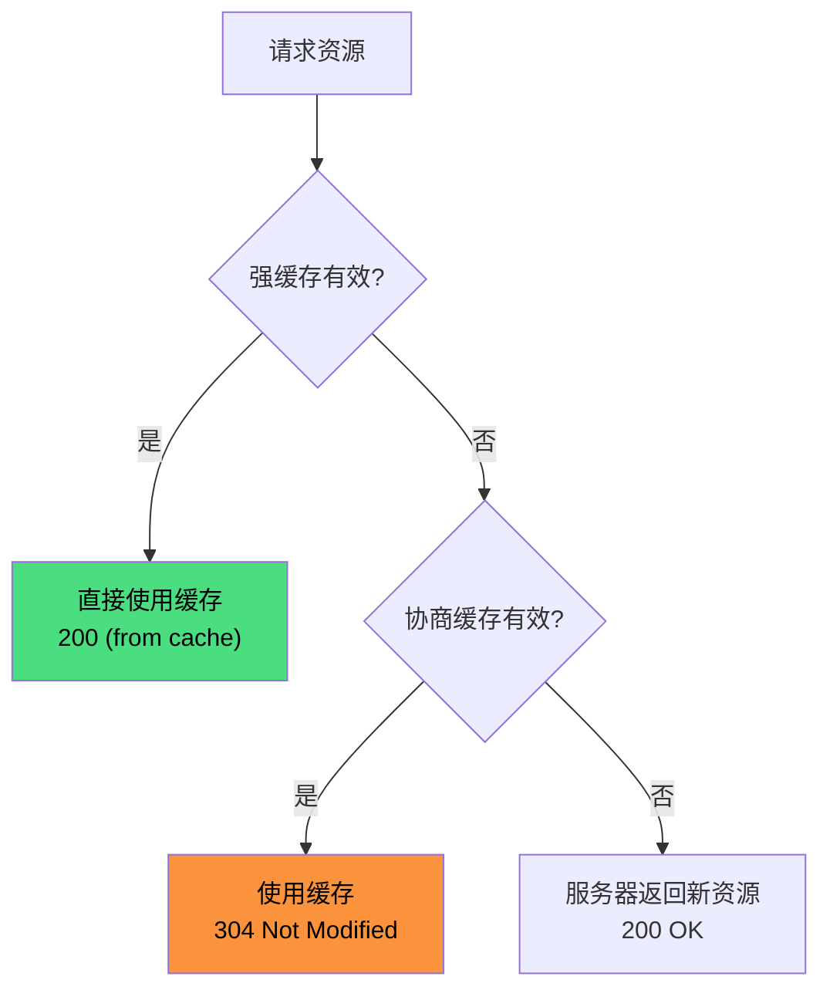
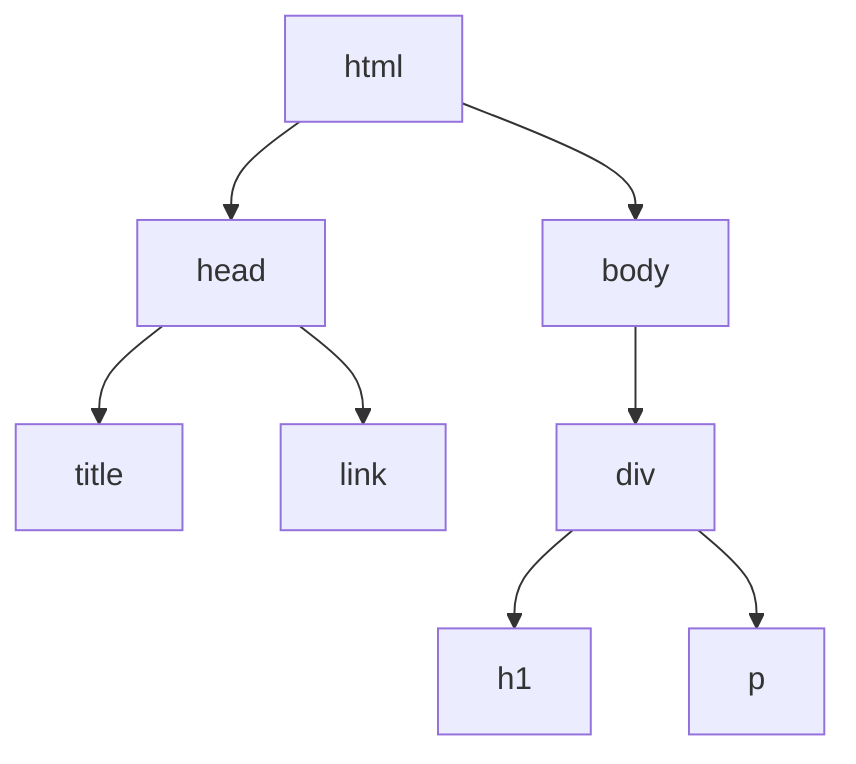

# 从输入 URL 到页面展示

用户在浏览器地址栏输入 URL 并回车后，到页面最终展示，经历了一系列复杂的流程。



---

## 1. URL 解析与导航

### URL 格式校验

浏览器首先判断输入内容是否符合 URL 规则：

- 包含协议（`http://`、`https://`）→ 直接导航
- 包含域名特征（如 `.com`、`.`）→ 自动补全 `https://` 后导航
- 纯文本 → 使用默认搜索引擎搜索

### 协议判断

| 协议 | 处理方式 |
|------|---------|
| `http/https` | 网络请求 |
| `file` | 读取本地文件 |
| `ftp` | FTP 协议下载 |
| `mailto` | 调用邮件客户端 |

### beforeunload 处理

如果当前页面有未保存的更改，浏览器会触发 `beforeunload` 事件：

```js
window.addEventListener('beforeunload', (e) => {
  if (hasUnsavedChanges) {
    e.preventDefault();
    e.returnValue = ''; // 弹出确认对话框
  }
});
```

### 进入加载状态

浏览器标签页显示加载动画，地址栏显示加载进度。

---

## 2. DNS 解析

将域名转换为 IP 地址。浏览器按以下顺序查找缓存：



> DNS 查询的递归/迭代机制、记录类型、缓存策略等详见 [DNS 域名系统](./dns)。

### 缓存层级

| 层级 | 缓存时间 | 说明 |
|------|---------|------|
| 浏览器缓存 | 几分钟 | Chrome 约 1 分钟 |
| 系统缓存 | 几分钟 | Windows/macOS 各自管理 |
| 路由器缓存 | 几小时 | 家用路由器通常有 DNS 缓存 |
| ISP 缓存 | 几小时到几天 | 运营商 DNS 服务器 |

### DNS 查询类型

- **A 记录**：域名 → IPv4 地址
- **AAAA 记录**：域名 → IPv6 地址
- **CNAME 记录**：域名别名 → 真实域名
- **MX 记录**：邮件服务器地址

### DNS 预解析

浏览器会预测用户可能访问的域名，提前进行 DNS 解析：

```html
<link rel="dns-prefetch" href="https://example.com">
```

---

## 3. 建立连接

### TCP 三次握手

建立可靠的 TCP 连接：



> TCP 头部结构、状态机、拥塞控制等详见 [TCP 协议](./tcp)。

### TLS 握手（HTTPS）

HTTPS 需要在 TCP 连接基础上进行 TLS 握手，建立加密通道：



**TLS 1.3 优化**：只需 1-RTT（甚至 0-RTT）即可完成握手，比 TLS 1.2 的 2-RTT 更快。

> TLS 握手细节、证书验证、中间人攻击等详见 [HTTPS](./https)。

### HTTP/2 多路复用

HTTP/2 在单个 TCP 连接上支持多个请求/响应并行传输：

- **多路复用**：多个请求共享一个连接，避免队头阻塞
- **头部压缩**：HPACK 算法压缩请求头
- **服务器推送**：服务器主动推送资源

---

## 4. 发送请求与接收响应

### 请求报文结构

```
GET /index.html HTTP/1.1
Host: example.com
User-Agent: Mozilla/5.0...
Accept: text/html,application/xhtml+xml
Accept-Language: zh-CN,zh;q=0.9
Cookie: session_id=xxx
```

### 缓存策略

浏览器缓存分为**强缓存**和**协商缓存**：



#### 强缓存

| 响应头 | 说明 |
|--------|------|
| `Cache-Control: max-age=3600` | 缓存 3600 秒（优先级高） |
| `Expires: Thu, 01 Jan 2026 00:00:00 GMT` | 过期时间（HTTP/1.0） |

#### 协商缓存

| 请求头 | 响应头 | 说明 |
|--------|--------|------|
| `If-Modified-Since` | `Last-Modified` | 基于修改时间 |
| `If-None-Match` | `ETag` | 基于文件指纹（优先级高） |

### 响应报文结构

```
HTTP/1.1 200 OK
Content-Type: text/html; charset=utf-8
Content-Length: 1234
Cache-Control: max-age=3600
ETag: "abc123"

<!DOCTYPE html>
<html>...</html>
```

---

## 5. 解析与渲染

### HTML 解析 → DOM Tree

浏览器从上到下解析 HTML，构建 DOM 树：

```html
<html>
  <head>
    <title>页面</title>
    <link rel="stylesheet" href="style.css">
  </head>
  <body>
    <div>
      <h1>标题</h1>
      <p>内容</p>
    </div>
  </body>
</html>
```



**关键点**：
- HTML 解析是**增量**的，不需要等整个文档下载完
- 遇到 `<script>` 会阻塞解析（除非 `async` 或 `defer`）
- 遇到 `<link rel="stylesheet">` 会阻塞渲染，但不阻塞解析

### CSS 解析 → CSSOM Tree

解析 CSS 生成 CSSOM 树，结构与 DOM 树类似：

```css
body { font-size: 16px; }
div { color: red; }
h1 { font-size: 24px; }
```

### 合并 → Render Tree

将 DOM 树和 CSSOM 树合并为渲染树，**排除不可见元素**：

- `display: none` 的元素不在渲染树中
- `visibility: hidden` 的元素在渲染树中（占据空间）
- `<head>` 中的元素不在渲染树中

### Layout 布局

计算每个可见元素的位置和大小：

- 采用**流式布局**，从上到下、从左到右
- 元素位置变化会触发**重排**（Reflow）
- 重排成本较高，应尽量减少

### Paint 绘制

将渲染树绘制到屏幕上：

- 填充颜色、绘制文字、边框、阴影等
- 样式变化（如颜色、背景）会触发**重绘**（Repaint）
- 重绘成本低于重排

### 合成与显示

现代浏览器采用**多进程架构**：

- **浏览器进程**：负责 UI、导航
- **渲染进程**：负责解析、布局、绘制
- **GPU 进程**：负责合成、加速

渲染进程将页面分层，GPU 进程合成图层后显示到屏幕。

---

## 6. 后续处理

### 资源预加载

浏览器会根据 `<link rel="preload">` 或 `<link rel="prefetch">` 预加载资源：

```html
<!-- 当前页面需要的资源，高优先级 -->
<link rel="preload" href="font.woff2" as="font" crossorigin>

<!-- 未来页面可能需要的资源，低优先级 -->
<link rel="prefetch" href="next-page.js">
```

### 事件绑定

JavaScript 执行，绑定事件监听器：

```js
document.addEventListener('DOMContentLoaded', () => {
  // DOM 解析完成，可以操作 DOM
});

window.addEventListener('load', () => {
  // 所有资源（包括图片）加载完成
});
```

### 异步脚本执行

- `async`：下载完立即执行，不保证顺序
- `defer`：DOM 解析完成后按顺序执行

```html
<script src="a.js" async></script>  <!-- 下载完就执行 -->
<script src="b.js" defer></script>  <!-- DOM 解析完后按顺序执行 -->
```

---

## 性能优化建议

| 阶段 | 优化手段 |
|------|---------|
| DNS | `dns-prefetch`、`preconnect` |
| 连接 | HTTP/2、TLS 1.3、连接复用 |
| 请求 | 缓存策略、资源压缩、CDN |
| 解析 | 减少 DOM 深度、避免阻塞脚本 |
| 渲染 | 减少重排重绘、使用 `transform`/`opacity` 动画 |
| 加载 | `preload`、`prefetch`、懒加载 |
