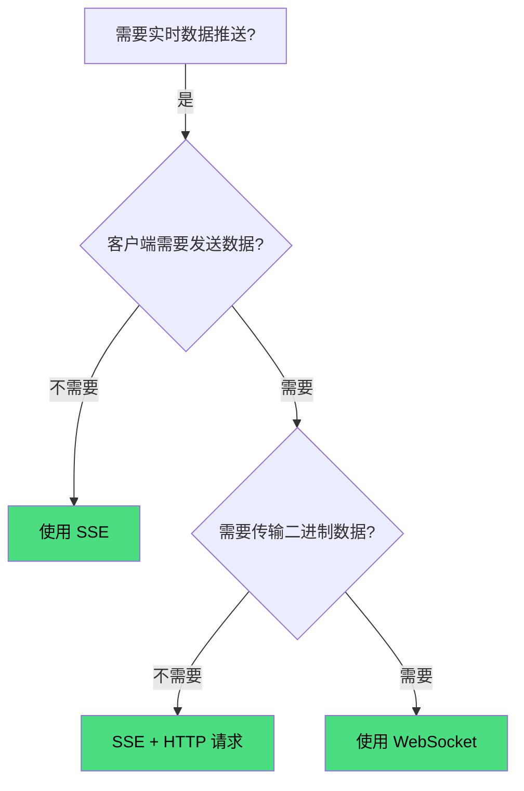

SSE（Server-Sent Events）是一种基于 HTTP 的**服务器单向推送**技术。客户端建立连接后，服务器可以持续向客户端推送数据，但客户端无法通过同一连接向服务器发送数据。

### 与 WebSocket 的区别

| 维度 | SSE | WebSocket |
|------|-----|-----------|
| 通信方向 | 服务器→客户端（单向） | 全双工（双向） |
| 协议 | 基于 HTTP | 独立协议（ws/wss） |
| 数据格式 | 纯文本（UTF-8） | 文本或二进制 |
| 断线重连 | 浏览器内置自动重连 | 需自行实现 |
| 代理兼容 | 好（基于 HTTP） | 部分代理不支持 |
| 实现复杂度 | 低 | 较高 |

> SSE 适合"服务器推、客户端听"的场景，WebSocket 适合需要双向通信的场景。

---

## 工作原理

### 客户端

浏览器提供 `EventSource` API：

```js
const source = new EventSource('/api/events');

// 连接建立
source.onopen = () => {
  console.log('连接已建立');
};

// 接收消息
source.onmessage = (event) => {
  console.log('收到消息：', event.data);
};

// 接收自定义事件
source.addEventListener('update', (event) => {
  console.log('收到 update 事件：', event.data);
});

// 发生错误
source.onerror = (error) => {
  console.error('SSE 错误：', error);
};
```

### 服务端

服务器返回特殊的响应头，并保持连接不关闭，持续推送数据：

```http
HTTP/1.1 200 OK
Content-Type: text/event-stream
Cache-Control: no-cache
Connection: keep-alive
```

数据格式（每条消息以 `data:` 开头，以两个换行结束）：

```
data: 第一条消息

data: 第二条消息

event: update
data: {"type": "price", "value": 100}

```

### 数据格式说明

| 字段 | 说明 | 示例 |
|------|------|------|
| `data:` | 消息内容（必填） | `data: hello` |
| `event:` | 自定义事件名（可选） | `event: update` |
| `id:` | 消息 ID，用于断线恢复（可选） | `id: 123` |
| `retry:` | 重连间隔（毫秒）（可选） | `retry: 3000` |

完整示例：

```
id: 1
event: price
data: {"symbol": "AAPL", "price": 150.25}

id: 2
retry: 5000
data: 普通消息

```

---

## 断线重连

SSE 的一大优势是**浏览器内置自动重连**：

- 连接断开后，`EventSource` 会自动尝试重新连接
- 默认重连间隔约 3 秒，服务器可通过 `retry:` 字段自定义
- 重连时，浏览器会发送 `Last-Event-ID` 请求头，告知服务器上次收到的最后一条消息 ID

```http
GET /api/events HTTP/1.1
Last-Event-ID: 123
```

服务器可据此从断点继续推送，避免消息丢失。

---

## 使用场景

| 场景 | 说明 |
|------|------|
| AI 流式输出 | ChatGPT 等 AI 对话的逐字输出效果 |
| 实时通知 | 系统通知、消息提醒 |
| 股票行情 | 实时价格推送 |
| 日志监控 | 服务器日志实时推送到前端 |
| 构建状态 | CI/CD 构建过程实时反馈 |
| 社交动态 | 新消息、新评论实时推送 |

### AI 流式输出示例

```js
const source = new EventSource('/api/chat/stream?prompt=你好');

source.onmessage = (event) => {
  // 逐字追加到页面
  document.getElementById('response').textContent += event.data;
};

source.addEventListener('done', () => {
  source.close(); // 生成完毕，关闭连接
  console.log('生成完成');
});
```

---

## 代码示例

### 服务端（Node.js）

```js
const http = require('http');

http.createServer((req, res) => {
  if (req.url === '/events') {
    // SSE 响应头
    res.writeHead(200, {
      'Content-Type': 'text/event-stream',
      'Cache-Control': 'no-cache',
      'Connection': 'keep-alive',
    });

    // 定时推送数据
    let id = 0;
    const timer = setInterval(() => {
      res.write(`id: ${++id}\n`);
      res.write(`data: 当前时间 ${new Date().toLocaleTimeString()}\n\n`);
    }, 1000);

    // 客户端断开时清理
    req.on('close', () => {
      clearInterval(timer);
    });
  }
}).listen(3000);
```

### 客户端

```js
const source = new EventSource('http://localhost:3000/events');

source.onmessage = (event) => {
  console.log('收到：', event.data);
};
```

---

## 限制与注意事项

| 限制 | 说明 |
|------|------|
| 单向通信 | 只能服务器→客户端，客户端发数据需另起 HTTP 请求 |
| 文本格式 | 只支持 UTF-8 文本，不支持二进制数据 |
| 连接数限制 | 浏览器对每个域名的 SSE 连接数有限制（通常 6 个） |
| 代理缓冲 | 某些代理可能缓冲 SSE 响应，需设置正确的响应头 |

### 代理缓冲问题

如果 SSE 被代理或 CDN 缓冲，消息可能无法实时到达客户端。解决方法：

```http
Content-Type: text/event-stream
Cache-Control: no-cache, no-transform
Connection: keep-alive
X-Accel-Buffering: no    # Nginx 禁用缓冲
```

---

## SSE vs WebSocket 选择指南



**总结**：
- 只需服务器推送 → **SSE**（简单、内置重连、兼容性好）
- 需要双向通信 → **WebSocket**（功能强大、支持二进制）
- 需要双向 + 偶尔传二进制 → **SSE 接收 + HTTP 发送**（折中方案）
