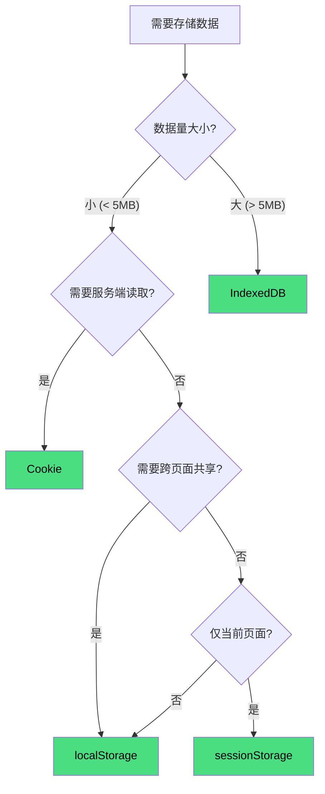
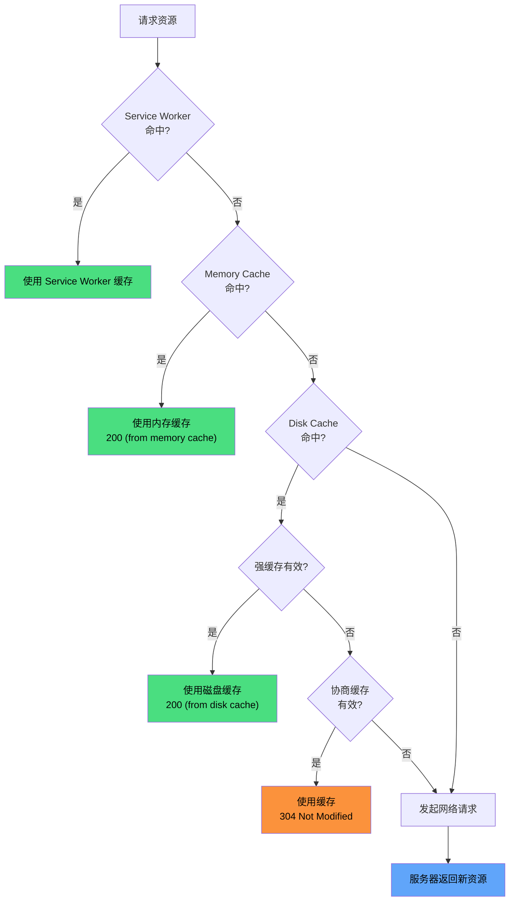
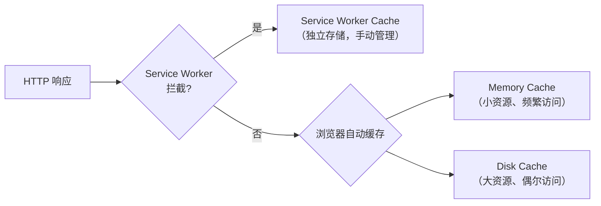

## 存储方式对比

| 特性 | Cookie | localStorage | sessionStorage | IndexedDB |
|------|--------|--------------|----------------|-----------|
| 容量 | ~4KB | ~5MB | ~5MB | 较大（通常 50MB+） |
| 生命周期 | 可设置过期时间 | 永久（需手动清除） | 页面关闭即清除 | 永久（需手动清除） |
| 作用域 | 同源 + 子域共享 | 同源共享 | 标签页独享 | 同源共享 |
| 与服务端通信 | 每次请求自动携带 | 不参与 | 不参与 | 不参与 |
| 数据类型 | 字符串 | 字符串 | 字符串 | 键值对（支持多种类型） |
| API | 原生不友好 | 简单易用 | 简单易用 | 异步 API，较复杂 |

---

## Cookie

### 基本用法

```js
// 设置 Cookie
document.cookie = 'name=value; expires=Thu, 01 Jan 2026 00:00:00 GMT; path=/';

// 读取 Cookie（所有 Cookie 拼成的字符串，需自行解析）
console.log(document.cookie);
```

### 属性

| 属性 | 说明 |
|------|------|
| `expires` | 过期时间（绝对时间），不设置则会话结束即失效 |
| `max-age` | 过期时间（相对秒数），优先级高于 `expires` |
| `path` | 生效路径，默认当前路径 |
| `domain` | 生效域名，可设置父域（如 `.example.com`） |
| `secure` | 仅 HTTPS 传输 |
| `HttpOnly` | JS 无法读取，防止 XSS 窃取 |
| `SameSite` | 跨站请求是否发送（`Strict`/`Lax`/`None`） |

### 缺点

- **容量小**：仅 4KB
- **性能开销**：每次 HTTP 请求都会携带，浪费带宽
- **操作复杂**：原生 API 不友好，需自行封装
- **安全风险**：明文传输，`HttpOnly` 为 false 时可被 JS 读取

---

## Web Storage

### localStorage

```js
localStorage.setItem('user', JSON.stringify({ name: 'Jun' }));
const user = JSON.parse(localStorage.getItem('user'));
localStorage.removeItem('user');
localStorage.clear(); // 清除所有
```

- 永久存储，除非手动清除
- 同源共享（同协议 + 同域名 + 同端口）
- 存储的是字符串，复杂数据需 `JSON.stringify` / `JSON.parse`

### sessionStorage

```js
sessionStorage.setItem('temp', 'data');
```

- 页面关闭即清除（注意：**刷新页面不会清除**）
- **标签页独享**：即使同域的新标签页也无法访问
- 适合临时数据，如表单填写中途关闭可恢复

---

## IndexedDB

浏览器内置的**结构化数据库**，适合存储大量数据。

```js
// 打开数据库
const request = indexedDB.open('myDB', 1);

request.onupgradeneeded = (event) => {
  const db = event.target.result;
  // 创建对象仓库（类似表）
  if (!db.objectStoreNames.contains('users')) {
    db.createObjectStore('users', { keyPath: 'id' });
  }
};

request.onsuccess = (event) => {
  const db = event.target.result;
  const tx = db.transaction('users', 'readwrite');
  const store = tx.objectStore('users');

  // 写入数据
  store.put({ id: 1, name: 'Jun' });

  // 读取数据
  const getRequest = store.get(1);
  getRequest.onsuccess = () => {
    console.log(getRequest.result);
  };
};
```

### 特点

- **大容量**：通常 50MB+，远超 Web Storage
- **异步操作**：不阻塞主线程
- **支持索引**：可高效查询
- **同源策略**：跨域无法访问

### 适用场景

- 离线应用（PWA）
- 大量结构化数据（如邮件客户端、文档编辑器）
- 文件/Blob 存储

---

## 选择指南



---

## HTTP 缓存

浏览器收到响应后，根据响应头决定是否缓存、缓存多久、如何使用缓存。



> 缓存查找优先级：Service Worker → Memory Cache → Disk Cache → 网络请求

---

## 强缓存

命中强缓存时，浏览器直接使用本地缓存，**不发送请求**，状态码显示 `200 (from cache)`。

| 响应头 | 说明 |
|--------|------|
| `Cache-Control: max-age=31536000` | 相对时间（秒），优先级高 |
| `Expires: Thu, 01 Jan 2026 00:00:00 GMT` | 绝对时间，HTTP/1.0 产物 |

### Cache-Control 常用指令

| 指令 | 说明 |
|------|------|
| `max-age=秒数` | 缓存有效期（秒），相对于请求时间 |
| `s-maxage=秒数` | 仅用于共享缓存（CDN），优先级高于 `max-age` |
| `no-cache` | 跳过强缓存，每次都要向服务器**验证**（不是不缓存） |
| `no-store` | 完全不缓存，每次都要请求新资源 |
| `public` | 任何中间节点（CDN、代理）都可缓存 |
| `private` | 仅浏览器可缓存，中间节点不可缓存（默认值） |
| `must-revalidate` | 缓存过期后必须向服务器验证 |
| `immutable` | 内容永不变化（配合文件指纹使用） |

---

## 协商缓存

强缓存失效后，浏览器携带标识向服务器验证，若资源未更新则返回 `304 Not Modified`，使用本地缓存。

| 请求头 | 响应头 | 说明 |
|--------|--------|------|
| `If-Modified-Since` | `Last-Modified` | 基于最后修改时间 |
| `If-None-Match` | `ETag` | 基于内容哈希（优先级高） |

### ETag vs Last-Modified

| 维度 | ETag | Last-Modified |
|------|------|---------------|
| 精度 | 高（基于内容哈希） | 低（秒级时间戳） |
| 性能 | 需计算哈希，略慢 | 直接读取文件属性，快 |
| 适用场景 | 内容变化需立即感知 | 对精度要求不高 |

> 两者同时存在时，ETag 优先级更高。

---

## 缓存存储位置

| 位置 | 说明 |
|------|------|
| **Service Worker** | 可编程的缓存层，自由控制缓存策略，需 HTTPS |
| **Memory Cache** | 内存缓存，速度最快，进程结束即失效 |
| **Disk Cache** | 磁盘缓存，速度较慢，持久化存储 |
| **Push Cache** | HTTP/2 服务器推送的缓存，会话结束即失效 |

### 存储位置的关系

- **Service Worker 缓存**是独立的存储，通过 Cache API 手动管理，不属于浏览器的 Memory/Disk Cache
- **Memory Cache 和 Disk Cache** 是浏览器内建的自动缓存，根据 HTTP 响应头（Cache-Control 等）自动决定缓存策略和存储位置
- 浏览器根据资源大小、访问频率、内存压力等因素自动决定放 Memory 还是 Disk，开发者无法控制



### Service Worker 缓存

Service Worker 是运行在浏览器背后的独立线程，可以拦截请求、自定义缓存策略。

```js
// 注册 Service Worker
navigator.serviceWorker.register('/sw.js');
```

```js
// sw.js
const CACHE_NAME = 'v1';
const urlsToCache = ['/', '/style.css', '/app.js'];

// 安装时缓存资源
self.addEventListener('install', (event) => {
  event.waitUntil(
    caches.open(CACHE_NAME).then((cache) => cache.addAll(urlsToCache))
  );
});

// 拦截请求，优先返回缓存
self.addEventListener('fetch', (event) => {
  event.respondWith(
    caches.match(event.request).then((response) => {
      return response || fetch(event.request);
    })
  );
});
```

> Service Worker 必须使用 HTTPS，防止恶意脚本劫持请求。

---

## 缓存策略实践

### HTML 文件

使用**协商缓存**，确保用户总能获取最新内容：

```http
Cache-Control: no-cache
```

### 静态资源（JS/CSS/图片）

使用**强缓存 + 文件指纹**，实现长期缓存与即时更新：

```http
Cache-Control: public, max-age=31536000, immutable
```

文件名带 hash（如 `app.a1b2c3.js`），内容变化时生成新 URL，浏览器会请求新资源而非命中旧缓存。

```html
<!-- 打包前 -->
<script src="app.js"></script>

<!-- 打包后（带文件指纹） -->
<script src="app.a1b2c3.js"></script>
```

#### hash 的最佳实践

文件名 hash 有几种粒度，选错不会出错，但会白白浪费缓存：

| 类型 | 计算粒度 | 内容变了文件名变不变 | 特点 |
|------|----------|---------------------|------|
| `hash` | 整个构建一个值 | 变（所有文件一起变） | 改一个文件全站缓存作废，过度失效（最差） |
| `chunkhash` | 按 chunk 计算 | 变（整个 chunk 一起变） | chunk 内无关模块被牵连失效 |
| `contenthash` | 按单个文件内容 | 变（只有自身变） | 失效粒度最小，缓存利用率最高（**最佳实践**） |

**关键认知**：三者都是基于内容的哈希——**内容变了重新构建，文件名必变**（哈希碰撞概率工程上可忽略）；内容没变时两次构建 hash 相同是正常现象（确定性构建）。所以 `hash`/`chunkhash` 的问题不是"该失效没失效"，而是**失效粒度太粗、白白浪费缓存**。

```javascript
// webpack 推荐配置
module.exports = {
  output: {
    filename: '[name].[contenthash:8].js',
    chunkFilename: '[name].[contenthash:8].js'
  }
}
```

Vite 生产构建默认就是内容 hash 文件名（如 `app.a1b2c3d4.js`），无需额外配置。

**完整闭环**（三个缺一不可）：

1. **contenthash**：文件名随内容变化，内容更新 = 新 URL = 缓存自动失效
2. **HTML `no-cache`**：保证用户每次拿到最新 HTML，引用最新文件名
3. **带 hash 资源 `max-age=31536000, immutable`**：旧文件不会回源，缓存利用率最大化

#### 访问到旧版本怎么办

**现象**：发版后用户仍加载旧 JS/CSS。

**根因**：打包产物只要用了基于内容的 hash，内容变了文件名必变——"文件名没变"的真实原因通常是：

| 原因 | 说明 |
|------|------|
| **资源没走 hash 流程** | `public/` 目录直接拷贝的文件、asset 未配 `[hash]` 占位符、HTML 硬编码外部固定 URL——文件名固定，内容变了也不变 |
| **发布没生效** | 构建没重跑（CI 缓存/旧产物）、部署失败、回滚——文件内容根本没更新 |
| **HTML 被缓存** | 用户拿到旧 HTML → 引用旧文件名 → 命中旧文件缓存（HTML 配 `no-cache` 是闭环前提） |

| 方案 | 操作 | 说明 |
|------|------|------|
| **根治** | 改构建配置用 contenthash，重新发版 | 文件名随内容自动变化，问题不再复发 |
| **应急** | CDN 强制刷新 + HTML 引用加 `?v=2` | 几分钟内生效，JS 产物不用重新构建 |

**应急原理**：浏览器缓存的 key 是完整 URL——`app.a1b2c3.js` 和 `app.a1b2c3.js?v=2` 是两个不同的缓存条目，新 URL 必然缓存 miss、重新拉取。CDN 强制刷新清掉 CDN 边缘节点的旧缓存，`?v=2` 绕过浏览器本地缓存，两层各管一层。

```html
<!-- 应急：只改 HTML 里的引用，JS 文件本身不动 -->
<script src="app.a1b2c3.js?v=2"></script>
```

**应急注意事项**：

- 部分 CDN 默认忽略 query string 作为缓存 key（如 CloudFront），`?v=2` 在 CDN 层可能无效，务必**两个动作配合**
- 应急只是绕过缓存，没有修复上面的根因（资源未走 hash 流程 / 发布链路），**尽快排期根治**
- 手改产物 HTML 会被下次构建覆盖，改动要留痕；有条件优先用部署系统的版本注入

### 典型配置

| 资源类型 | 缓存策略 | 说明 |
|---------|---------|------|
| HTML | `no-cache` | 协商缓存，确保最新 |
| JS/CSS（带 hash） | `max-age=31536000, immutable` | 强缓存，一年有效 |
| 图片/字体（带 hash） | `max-age=31536000` | 强缓存 |
| API 响应 | `no-store` 或短 `max-age` | 视业务需求 |
