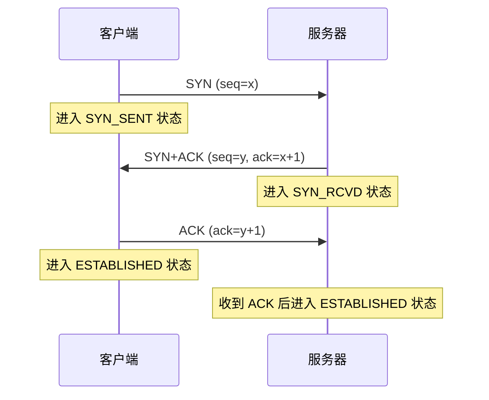
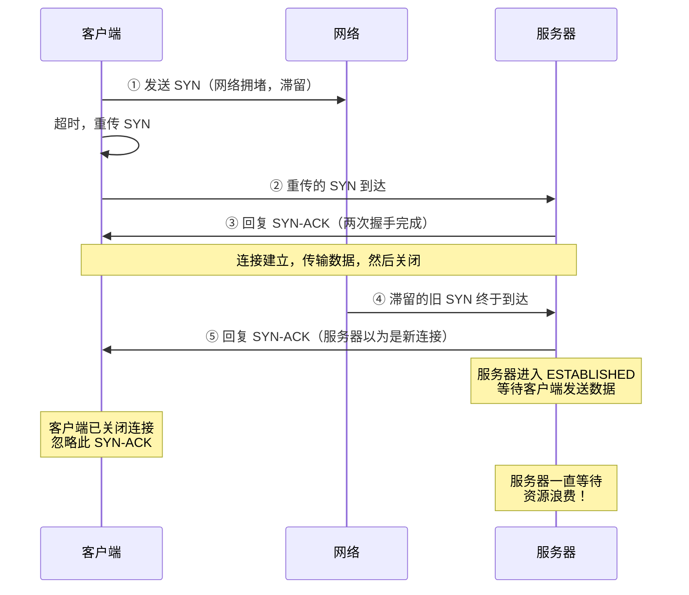
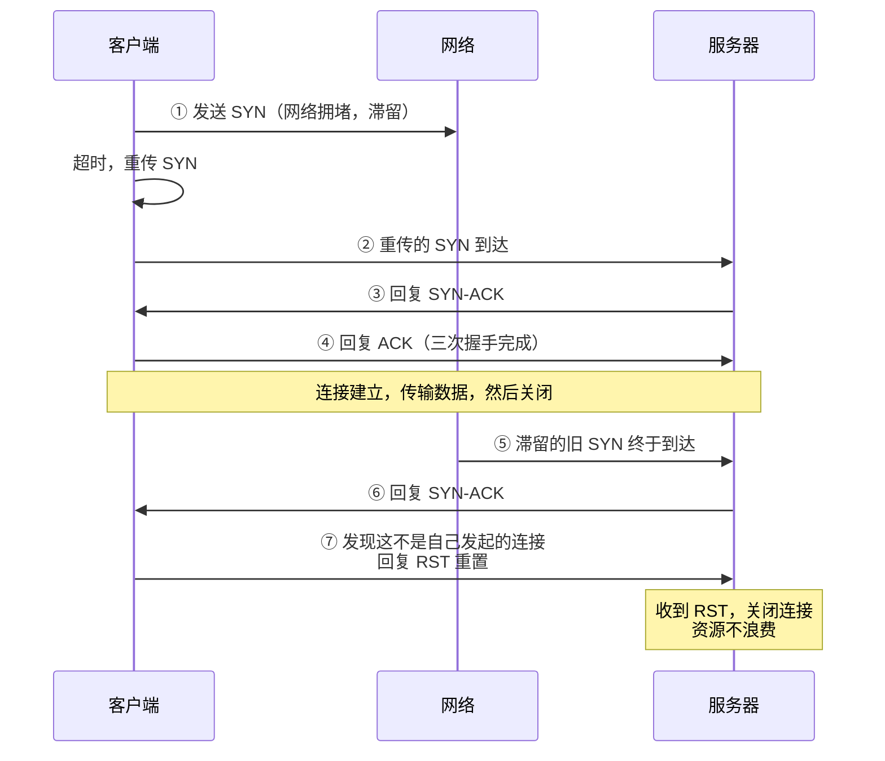
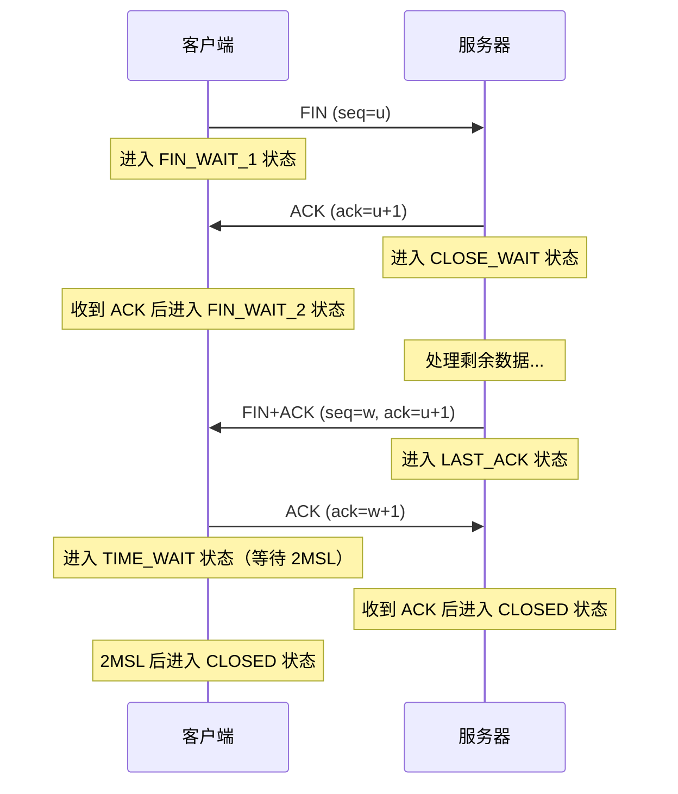
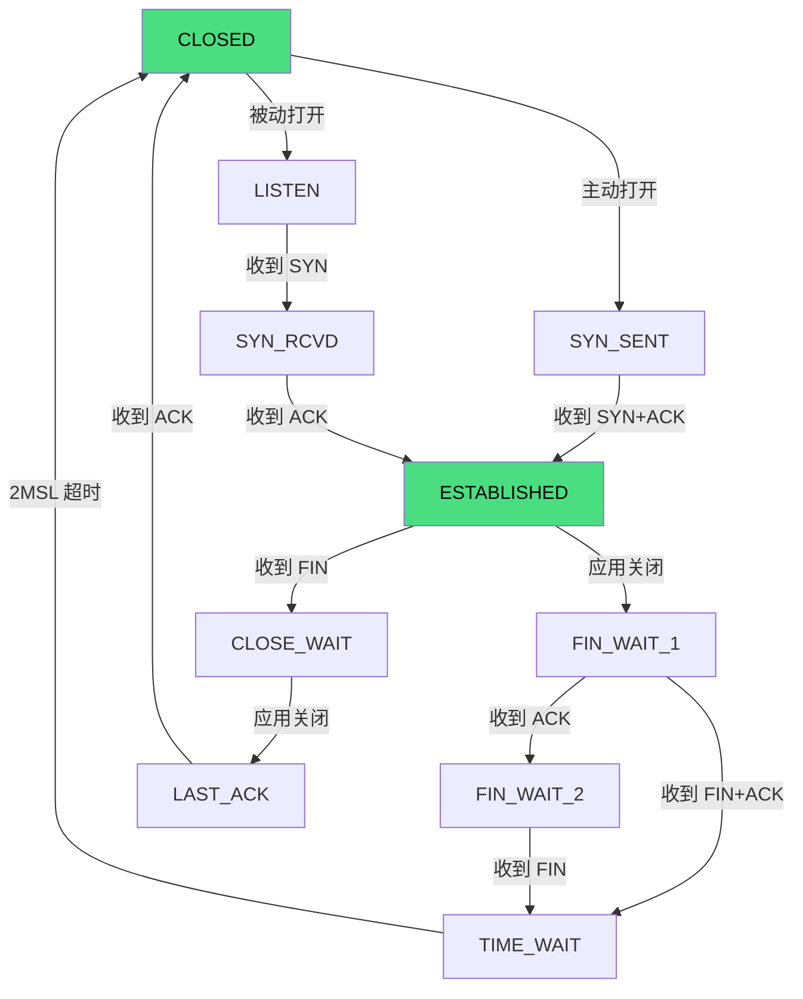
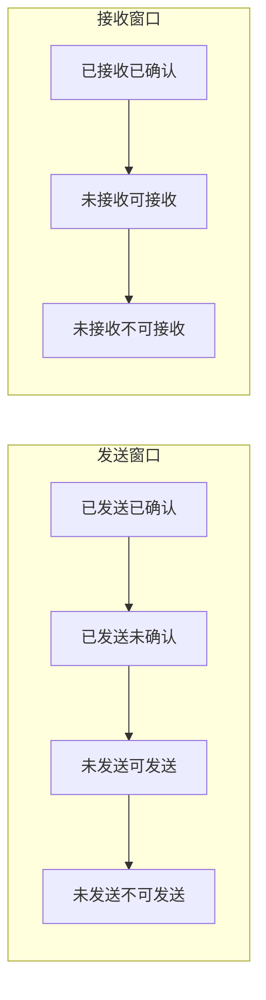
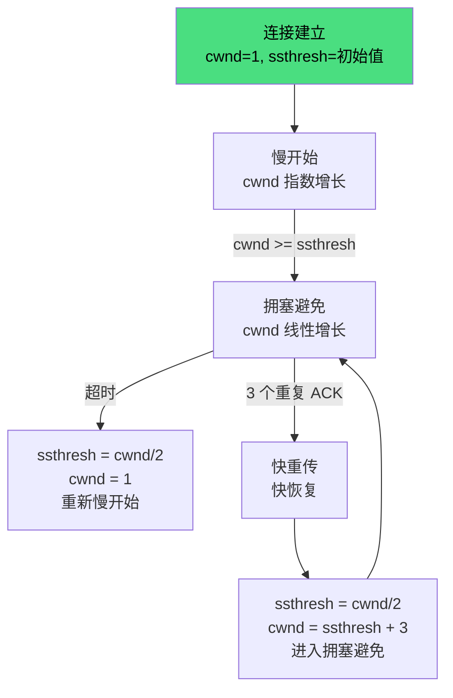

# TCP 协议

TCP（Transmission Control Protocol）是面向连接的、可靠的、基于字节流的传输层协议。

---

## TCP 头部结构

```
 0                   1                   2                   3
 0 1 2 3 4 5 6 7 8 9 0 1 2 3 4 5 6 7 8 9 0 1 2 3 4 5 6 7 8 9 0 1
+-+-+-+-+-+-+-+-+-+-+-+-+-+-+-+-+-+-+-+-+-+-+-+-+-+-+-+-+-+-+-+-+
|          源端口号             |          目的端口号             |
+-+-+-+-+-+-+-+-+-+-+-+-+-+-+-+-+-+-+-+-+-+-+-+-+-+-+-+-+-+-+-+-+
|                        序列号 (Sequence Number)               |
+-+-+-+-+-+-+-+-+-+-+-+-+-+-+-+-+-+-+-+-+-+-+-+-+-+-+-+-+-+-+-+-+
|                     确认号 (Acknowledgment Number)            |
+-+-+-+-+-+-+-+-+-+-+-+-+-+-+-+-+-+-+-+-+-+-+-+-+-+-+-+-+-+-+-+-+
|  数据偏移 |  保留  | 标志位 (Flags) |         窗口大小          |
+-+-+-+-+-+-+-+-+-+-+-+-+-+-+-+-+-+-+-+-+-+-+-+-+-+-+-+-+-+-+-+-+
|           校验和             |         紧急指针                |
+-+-+-+-+-+-+-+-+-+-+-+-+-+-+-+-+-+-+-+-+-+-+-+-+-+-+-+-+-+-+-+-+
|                    选项 + 填充 (Options + Padding)            |
+-+-+-+-+-+-+-+-+-+-+-+-+-+-+-+-+-+-+-+-+-+-+-+-+-+-+-+-+-+-+-+-+
```

### 关键字段

| 字段 | 长度 | 说明 |
|------|------|------|
| **源/目的端口** | 16 bit | 标识发送/接收应用 |
| **序列号** | 32 bit | 字节流编号，用于排序和去重 |
| **确认号** | 32 bit | 期望收到的下一个字节序号 |
| **数据偏移** | 4 bit | 头部长度（单位：4 字节） |
| **标志位** | 6 bit | SYN、ACK、FIN、RST、PSH、URG |
| **窗口大小** | 16 bit | 接收方剩余缓冲区大小（流量控制） |
| **校验和** | 16 bit | 检验数据完整性 |
| **紧急指针** | 16 bit | 紧急数据末尾位置 |

### 标志位与序号通俗解释

| 字段 | 含义 | 通俗理解 |
|------|------|---------|
| **SYN** | 同步序号 | "我想连接" |
| **ACK** | 确认号有效 | "我收到了" |
| **FIN** | 结束连接 | "我想断开" |
| **RST** | 重置连接 | "出错了，重置" |
| **seq** | 序列号 | "我从这里开始发" |
| **ack** | 确认号 | "我期望你下次从这里发" |

**示例**：

```
客户端 → 服务器：SYN=1, seq=100
  意思：我要建立连接，我的数据从第 100 号字节开始

服务器 → 客户端：SYN=1, ACK=1, seq=300, ack=101
  意思：我也要建立连接；我收到了你的 100 号字节，期望下一个是 101；
        我的数据从第 300 号字节开始

客户端 → 服务器：ACK=1, seq=101, ack=301
  意思：我收到了你的 300 号字节，期望下一个是 301；
        我的数据从第 101 号字节开始
```

---

## 三次握手

建立可靠的 TCP 连接：



### 详细过程

| 步骤 | 发送方 | 标志位 | 序列号 | 确认号 | 状态变化 |
|------|--------|--------|--------|--------|---------|
| 1 | 客户端 | SYN=1 | seq=x | - | CLOSED → SYN_SENT |
| 2 | 服务器 | SYN=1, ACK=1 | seq=y | ack=x+1 | LISTEN → SYN_RCVD |
| 3 | 客户端 | ACK=1 | seq=x+1 | ack=y+1 | SYN_SENT → ESTABLISHED |

### 为什么是三次握手，而不是两次？

**核心问题**：防止**失效的旧连接请求**导致服务器资源浪费。

#### 假设只有两次握手



#### 三次握手如何解决



**关键区别**：三次握手中，客户端会检查服务器的 SYN-ACK 是否对应自己发起的连接。如果不是，会发送 RST 重置，避免服务器空等。

### 为什么不是四次或五次？

三次是满足"双方都确认对方收到自己请求"的最小次数：
- 第一次：客户端 → 服务器（客户端确认服务器能收）
- 第二次：服务器 → 客户端（服务器确认客户端能收，且客户端确认服务器能收）
- 第三次：客户端 → 服务器（服务器确认客户端能收）

更多次握手不会增加可靠性，只会增加延迟。

---

## 四次挥手

断开 TCP 连接：



### 详细过程

| 步骤 | 发送方 | 标志位 | 序列号 | 确认号 | 状态变化 |
|------|--------|--------|--------|--------|---------|
| 1 | 客户端 | FIN=1 | seq=u | - | ESTABLISHED → FIN_WAIT_1 |
| 2 | 服务器 | ACK=1 | seq=v | ack=u+1 | CLOSE_WAIT |
| 3 | 服务器 | FIN=1, ACK=1 | seq=w | ack=u+1 | LAST_ACK |
| 4 | 客户端 | ACK=1 | seq=u+1 | ack=w+1 | TIME_WAIT → (2MSL 后) CLOSED |

### 为什么是四次挥手，而不是三次？

因为 TCP 是**全双工**的，每个方向必须单独关闭。

服务器收到客户端的 FIN 后：
- 可能还有数据要发送
- 不能立即发送 FIN

所以 ACK 和 FIN 分开发送，多了一次挥手。

**特殊情况**：如果服务器没有剩余数据，可以将 ACK 和 FIN 合并发送，变成"三次挥手"。

### 为什么客户端最后要等待 2MSL？

**MSL**（Maximum Segment Lifetime）：报文段在网络中的最大生存时间。

**原因一：确保服务器收到最后一个 ACK**

```
客户端发送 ACK → 可能丢失
服务器未收到 ACK → 重传 FIN
客户端在 2MSL 内收到重传的 FIN → 重新发送 ACK
```

**原因二：防止旧连接的报文干扰新连接**

等待 2MSL 确保本连接的所有报文都从网络中消失，新连接不会收到旧报文。

---

## TCP 状态机



### 状态说明

| 状态 | 说明 |
|------|------|
| **CLOSED** | 初始状态，无连接 |
| **LISTEN** | 服务器监听连接请求 |
| **SYN_SENT** | 客户端已发送 SYN，等待响应 |
| **SYN_RCVD** | 服务器收到 SYN，已发送 SYN+ACK |
| **ESTABLISHED** | 连接已建立，可传输数据 |
| **FIN_WAIT_1** | 已发送 FIN，等待 ACK |
| **FIN_WAIT_2** | 已收到 ACK，等待 FIN |
| **CLOSE_WAIT** | 已收到 FIN，等待应用关闭 |
| **LAST_ACK** | 已发送 FIN，等待最后 ACK |
| **TIME_WAIT** | 已发送最后 ACK，等待 2MSL |

---

## 可靠传输机制

### 序列号与确认号

- **序列号**：每个字节都有编号，用于排序和去重
- **确认号**：期望收到的下一个字节序号，表示之前的都已收到

```
客户端发送：seq=100, 数据长度=50
服务器确认：ack=150（表示 100-149 已收到，期望下一个是 150）
```

### 超时重传

发送方发送数据后启动定时器，超时未收到 ACK 则重传。

- **RTO**（Retransmission Timeout）：重传超时时间
- 动态计算，基于 RTT（Round Trip Time）

### 滑动窗口（流量控制）

接收方通过**窗口大小**字段告诉发送方自己还能接收多少数据：



- 发送窗口大小 = min(发送方缓存, 接收方窗口)
- 接收方窗口为 0 时，发送方停止发送（零窗口）

---

## 拥塞控制

防止过多数据注入网络，导致网络拥塞。

### 慢开始（Slow Start）

- 拥塞窗口 `cwnd` 从 1 开始
- 每收到一个 ACK，`cwnd` 加倍（指数增长）
- 达到**慢开始阈值** `ssthresh` 后进入拥塞避免

### 拥塞避免（Congestion Avoidance）

- `cwnd` 每经过一个 RTT 加 1（线性增长）
- 缓慢增加，避免网络拥塞

### 快重传（Fast Retransmit）

- 收到**3 个重复 ACK** 时，立即重传丢失的报文段
- 不等超时，减少等待时间

### 快恢复（Fast Recovery）

- 收到 3 个重复 ACK 时：
  - `ssthresh = cwnd / 2`
  - `cwnd = ssthresh + 3`
  - 进入拥塞避免（而非慢开始）

### 拥塞控制流程图



---

## TCP vs UDP

| 特性 | TCP | UDP |
|------|-----|-----|
| **连接** | 面向连接 | 无连接 |
| **可靠性** | 可靠传输 | 不可靠 |
| **有序性** | 保证顺序 | 不保证 |
| **速度** | 较慢（握手、确认、重传） | 快 |
| **头部** | 20-60 字节 | 8 字节 |
| **流量控制** | 有（滑动窗口） | 无 |
| **拥塞控制** | 有 | 无 |
| **适用场景** | 文件传输、网页、邮件 | 视频、语音、DNS、游戏 |

---

## 调试工具

### netstat

查看 TCP 连接状态：

```bash
netstat -an | grep ESTABLISHED    # 查看已建立连接
netstat -an | grep TIME_WAIT      # 查看 TIME_WAIT 状态连接
netstat -s                        # 查看 TCP 统计信息
```

### tcpdump

抓包分析 TCP 报文：

```bash
tcpdump -i eth0 tcp port 80       # 抓取 80 端口 TCP 流量
tcpdump -i eth0 -X tcp port 443   # 十六进制显示
```

### Wireshark

图形化抓包工具，支持 TCP 流追踪、重传分析、拥塞窗口可视化。

### 浏览器开发者工具

Chrome DevTools → Network → 点击请求 → Timing 标签页查看 TCP 连接耗时。
