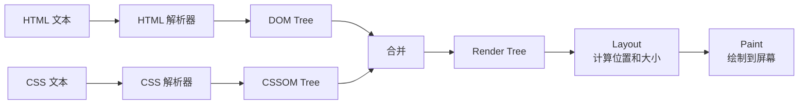
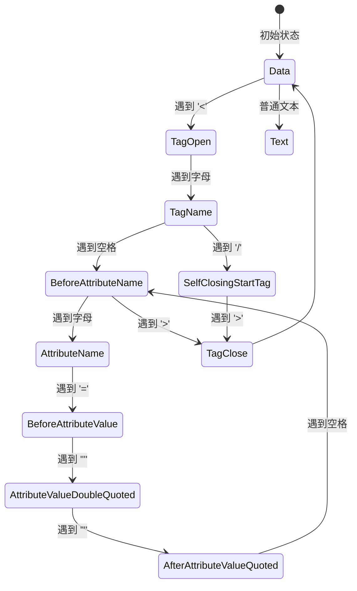

```mermaid
stateDiagram-v2
    [*] --> Initial: 初始状态
    Initial --> Selector: 遇到选择器字符
    Selector --> Selector: 继续读取选择器
    Selector --> BlockStart: 遇到 '{'
    BlockStart --> PropertyName: 遇到属性名
    PropertyName --> PropertyValue: 遇到 ':'
    PropertyValue --> PropertyEnd: 遇到 ';'
    PropertyEnd --> PropertyName: 继续下一个属性
    PropertyEnd --> BlockEnd: 遇到 '}'
    BlockEnd --> Initial
```

# 实现一个简易浏览器

通过实现一个简易的 HTML/CSS 渲染引擎，深入理解浏览器的工作原理。本文不涉及 JavaScript 执行，只关注 HTML 解析、CSS 解析、DOM 构建、渲染树生成、布局和绘制。

> 浏览器渲染的完整流程详见 [从输入 URL 到页面展示](./overview#解析与渲染)。

---

## 整体流程



---

## HTML 解析：构建 DOM 树

HTML 解析的核心是**词法分析**，使用状态机逐字符读取 HTML，识别标签、属性、文本等内容，构建 DOM 树。

### 状态机设计

HTML 解析器通过状态机识别不同的词法单元：



### 核心实现

```js
class HTMLParser {
  constructor(html) {
    this.html = html;
    this.currentNode = null;
    this.stack = [];
    this.root = { nodeType: 9, childNodes: [] }; // Document
    this.currentNode = this.root;
  }

  parse() {
    let state = this.dataState;
    
    for (let i = 0; i < this.html.length; i++) {
      const char = this.html[i];
      state = state.call(this, char);
    }
    
    return this.root;
  }

  // 数据状态：读取文本或遇到 '<'
  dataState(char) {
    if (char === '<') {
      return this.tagOpenState;
    }
    // 追加文本节点
    this.appendText(char);
    return this.dataState;
  }

  // 标签开始状态
  tagOpenState(char) {
    if (/[a-zA-Z]/.test(char)) {
      this.tagName = char;
      return this.tagNameState;
    }
    if (char === '/') {
      return this.endTagOpenState;
    }
    return this.dataState;
  }

  // 标签名状态
  tagNameState(char) {
    if (/\s/.test(char)) {
      this.createTag();
      return this.beforeAttributeNameState;
    }
    if (char === '>') {
      this.createTag();
      this.currentNode = this.stack[this.stack.length - 1];
      return this.dataState;
    }
    this.tagName += char;
    return this.tagNameState;
  }

  // 创建标签节点
  createTag() {
    const node = {
      nodeType: 1,
      tagName: this.tagName,
      attributes: {},
      childNodes: [],
      parentNode: this.currentNode,
    };
    this.currentNode.childNodes.push(node);
    this.stack.push(node);
  }

  // 追加文本节点
  appendText(char) {
    const lastChild = this.currentNode.childNodes[this.currentNode.childNodes.length - 1];
    if (lastChild && lastChild.nodeType === 3) {
      lastChild.data += char;
    } else {
      this.currentNode.childNodes.push({
        nodeType: 3,
        data: char,
        parentNode: this.currentNode,
      });
    }
  }
}
```

### 解析结果

```html
<!-- 输入 -->
<div class="box">
  <p>hello</p>
</div>
```

```json
// 输出 DOM Tree
{
  "nodeType": 9,
  "childNodes": [
    {
      "nodeType": 1,
      "tagName": "div",
      "attributes": { "class": "box" },
      "childNodes": [
        { "nodeType": 3, "data": "\n  " },
        {
          "nodeType": 1,
          "tagName": "p",
          "childNodes": [
            { "nodeType": 3, "data": "hello" }
          ]
        },
        { "nodeType": 3, "data": "\n" }
      ]
    }
  ]
}
```

---

## CSS 解析：构建 CSSOM 树

CSS 解析同样使用状态机，识别选择器和样式规则，构建 CSSOM 树。

### 状态机设计



### 核心实现

```js
class CSSParser {
  constructor(css) {
    this.css = css;
    this.rules = [];
  }

  parse() {
    let i = 0;
    
    while (i < this.css.length) {
      // 跳过空白
      while (/\s/.test(this.css[i])) i++;
      
      // 读取选择器
      let selector = '';
      while (this.css[i] !== '{' && i < this.css.length) {
        selector += this.css[i++];
      }
      
      // 读取样式块
      let declarations = '';
      i++; // 跳过 '{'
      while (this.css[i] !== '}' && i < this.css.length) {
        declarations += this.css[i++];
      }
      i++; // 跳过 '}'
      
      // 解析样式
      const style = this.parseDeclarations(declarations);
      this.rules.push({ selector: selector.trim(), style });
    }
    
    return this.rules;
  }

  parseDeclarations(str) {
    const style = {};
    const pairs = str.split(';');
    
    for (const pair of pairs) {
      const [prop, value] = pair.split(':').map(s => s.trim());
      if (prop && value) {
        style[prop] = value;
      }
    }
    
    return style;
  }
}
```

### 解析结果

```css
/* 输入 */
.box {
  color: red;
  font-size: 16px;
}
```

```js
// 输出 CSSOM
[
  {
    selector: '.box',
    style: {
      color: 'red',
      'font-size': '16px',
    },
  },
];
```

---

## 渲染树：应用样式

将 CSS 规则应用到 DOM 树，生成渲染树。渲染树只包含可见节点，每个节点带有计算后的样式。

```js
class RenderTreeBuilder {
  constructor(dom, cssom) {
    this.dom = dom;
    this.cssom = cssom;
  }

  build() {
    return this.buildNode(this.dom);
  }

  buildNode(node) {
    // 跳过不可见节点
    if (this.isHidden(node)) return null;

    const renderNode = {
      node,
      style: this.computeStyle(node),
      children: [],
    };

    for (const child of node.childNodes || []) {
      const renderChild = this.buildNode(child);
      if (renderChild) {
        renderNode.children.push(renderChild);
      }
    }

    return renderNode;
  }

  computeStyle(node) {
    const style = {};
    
    // 遍历 CSS 规则，匹配选择器
    for (const rule of this.cssom) {
      if (this.matches(node, rule.selector)) {
        Object.assign(style, rule.style);
      }
    }
    
    return style;
  }

  matches(node, selector) {
    // 简化的选择器匹配
    if (selector.startsWith('.')) {
      return node.attributes?.class === selector.slice(1);
    }
    if (selector.startsWith('#')) {
      return node.attributes?.id === selector.slice(1);
    }
    return node.tagName === selector;
  }

  isHidden(node) {
    // 跳过 script、style、display:none 等
    return ['script', 'style', 'head'].includes(node.tagName?.toLowerCase());
  }
}
```

---

## 布局（Layout）

计算每个节点的位置和大小。简化的布局算法：

```js
class Layouter {
  constructor(renderTree, viewportWidth) {
    this.renderTree = renderTree;
    this.viewportWidth = viewportWidth;
  }

  layout() {
    this.layoutNode(this.renderTree, { x: 0, y: 0, width: this.viewportWidth });
  }

  layoutNode(node, bounds) {
    node.layout = {
      x: bounds.x,
      y: bounds.y,
      width: bounds.width,
      height: 0,
    };

    let currentY = bounds.y;

    for (const child of node.children) {
      // 简化的块级布局：每个子元素占一行
      this.layoutNode(child, {
        x: bounds.x,
        y: currentY,
        width: bounds.width,
      });
      currentY += child.layout.height;
    }

    node.layout.height = currentY - bounds.y;
  }
}
```

---

## 绘制（Paint）

将布局后的渲染树绘制到 Canvas 或屏幕上：

```js
class Painter {
  constructor(ctx) {
    this.ctx = ctx;
  }

  paint(node) {
    const { x, y, width, height } = node.layout;
    const { color, 'background-color': bg } = node.style || {};

    // 绘制背景
    if (bg) {
      this.ctx.fillStyle = bg;
      this.ctx.fillRect(x, y, width, height);
    }

    // 绘制文本
    if (node.node.nodeType === 3) {
      this.ctx.fillStyle = color || 'black';
      this.ctx.fillText(node.node.data, x, y + 16);
    }

    // 递归绘制子节点
    for (const child of node.children) {
      this.paint(child);
    }
  }
}
```

---

## 总结

通过实现这个简易浏览器，可以深入理解：

| 阶段 | 核心概念 |
|------|---------|
| HTML 解析 | 状态机、词法分析、DOM 树构建 |
| CSS 解析 | 选择器匹配、样式规则解析、CSSOM 树 |
| 渲染树 | 样式计算、可见性判断 |
| 布局 | 盒模型、流式布局算法 |
| 绘制 | 图形渲染、图层合成 |

实际浏览器的实现远比这复杂（处理各种边界情况、优化性能、支持 JavaScript 等），但核心思路是一致的。

> 推荐进一步阅读：[How Browsers Work](https://web.dev/how-browsers-work/)
