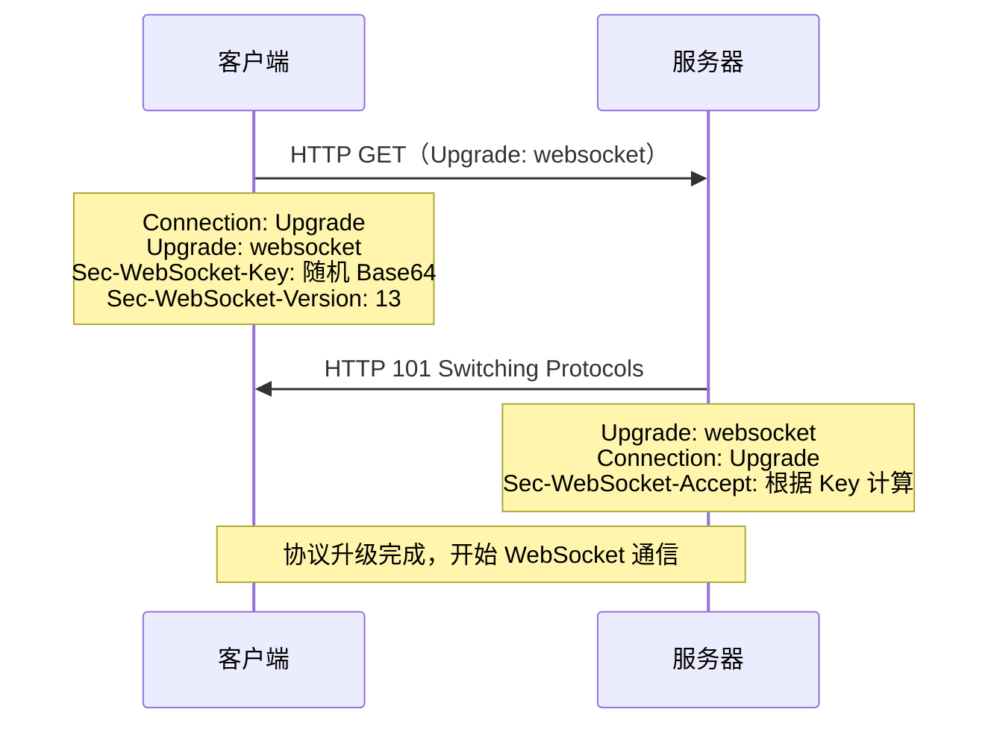
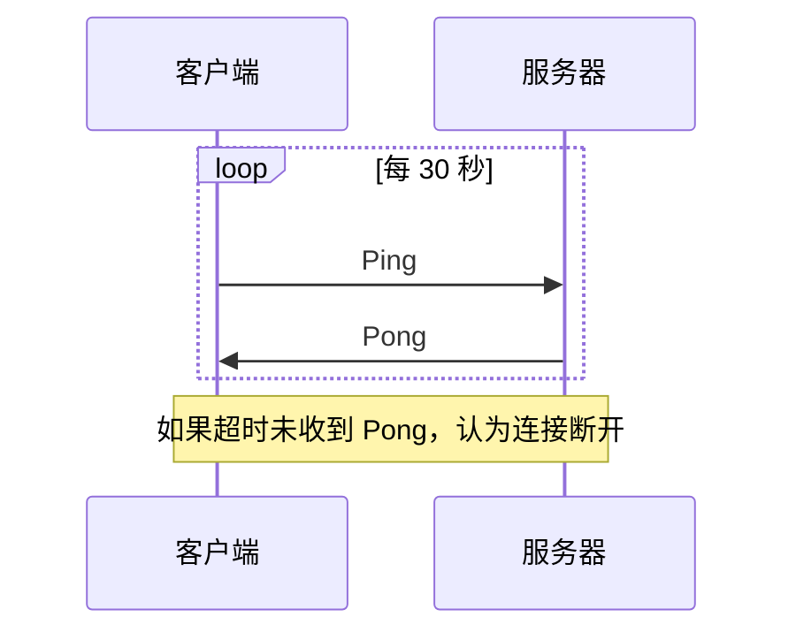

WebSocket 是一种在单个 TCP 连接上进行**全双工通信**的协议。HTTP 是"请求-响应"模式，客户端必须主动发起请求才能获取数据；WebSocket 建立连接后，服务器可以**随时主动推送**数据给客户端。

### 为什么需要 WebSocket？

以股票行情为例：用户需要实时看到价格变化。

| 方案 | 原理 | 缺点 |
|------|------|------|
| 短轮询 | 客户端每隔几秒发一次请求 | 大量无效请求，浪费带宽和服务器资源 |
| 长轮询 | 服务器收到请求后不立即响应，等数据变化后再返回 | 服务器需维持大量挂起请求，连接频繁断开重建 |
| SSE | 服务器单向推送，基于 HTTP | 只能服务器→客户端，不支持客户端发送数据 |
| **WebSocket** | 全双工，持久连接 | 需要额外协议升级，不适合简单场景 |

---

## 连接建立

WebSocket 连接通过 HTTP 请求进行**协议升级**：



### 请求头

```http
GET /chat HTTP/1.1
Host: example.com
Upgrade: websocket
Connection: Upgrade
Sec-WebSocket-Key: dGhlIHNhbXBsZSBub25jZQ==
Sec-WebSocket-Version: 13
```

- `Upgrade: websocket`：请求切换到 WebSocket 协议
- `Connection: Upgrade`：当前连接需要切换协议
- `Sec-WebSocket-Key`：客户端生成的随机 Base64 字符串，用于防止缓存代理误判
- `Sec-WebSocket-Version: 13`：WebSocket 协议版本（目前只有 13）

### 响应头

```http
HTTP/1.1 101 Switching Protocols
Upgrade: websocket
Connection: Upgrade
Sec-WebSocket-Accept: s3pPLMBiTxaQ9kYGzzhZRbK+xOo=
```

- `101 Switching Protocols`：服务器同意切换协议
- `Sec-WebSocket-Accept`：服务器将客户端的 `Sec-WebSocket-Key` 与固定 GUID 拼接后做 SHA-1 哈希再 Base64 编码，客户端据此验证响应确实来自目标服务器

> 握手阶段使用 HTTP，完成后底层切换为 WebSocket 协议帧通信。

---

## 与 HTTP 的对比

| 维度 | HTTP | WebSocket |
|------|------|-----------|
| 通信方式 | 请求-响应（半双工） | 全双工 |
| 连接 | 短连接（HTTP/1.1 可 Keep-Alive） | 持久连接 |
| 数据格式 | 文本（JSON、HTML 等） | 文本或二进制帧 |
| 头部开销 | 每次请求携带完整 HTTP 头 | 握手后帧头仅 2-14 字节 |
| 服务器推送 | 不支持（需轮询/SSE） | 原生支持 |
| 状态 | 无状态 | 有状态 |
| 端口 | 80/443 | 80/443（与 HTTP 共用） |

---

## 数据帧格式

WebSocket 通信以**帧（Frame）** 为单位传输数据：

```
 0               1               2               3
 0 1 2 3 4 5 6 7 0 1 2 3 4 5 6 7 0 1 2 3 4 5 6 7 0 1 2 3 4 5 6 7
+-+-+-+-+-------+-+-------------+-------------------------------+
|F|R|R|R| Opcode|M| Payload Len |    Extended payload length    |
|I|S|S|S|  (4)  |A|     (7)     |             (16/64)           |
|N|V|V|V|       |S|             |                               |
| |1|2|3|       |K|             |                               |
+-+-+-+-+-------+-+-------------+-------------------------------+
```

关键字段：
- **FIN**：是否为消息的最后一帧（支持分片传输）
- **Opcode**：帧类型（`0x1` 文本、`0x2` 二进制、`0x8` 关闭、`0x9` Ping、`0xA` Pong）
- **MASK**：客户端发送的帧必须掩码（4 字节掩码密钥），服务器发送的帧不需要
- **Payload Length**：负载长度（7 bit / 7+16 bit / 7+64 bit）

> 帧头最小仅 2 字节，远小于 HTTP 每次请求数百字节的头部开销。

---

## 心跳检测

WebSocket 协议定义了 **Ping/Pong** 帧用于心跳：

- 任一方发送 Ping 帧，对方必须尽快回复 Pong 帧
- 用于检测连接是否存活



实际应用中，也常用**应用层心跳**（定时发送 JSON 消息）代替协议层 Ping/Pong，因为某些代理/防火墙会丢弃长时间无数据的 TCP 连接。

---

## 断线重连

WebSocket 连接可能因网络波动断开，客户端需要实现自动重连：

```js
function createWebSocket(url) {
  let ws;
  let retryCount = 0;
  const maxRetry = 5;

  function connect() {
    ws = new WebSocket(url);

    ws.onopen = () => {
      retryCount = 0;
      console.log('连接成功');
    };

    ws.onclose = () => {
      if (retryCount < maxRetry) {
        const delay = Math.min(1000 * 2 ** retryCount, 30000);
        retryCount++;
        console.log(`${delay}ms 后第 ${retryCount} 次重连`);
        setTimeout(connect, delay);
      }
    };

    ws.onerror = () => ws.close();
  }

  connect();
  return ws;
}
```

使用**指数退避**（Exponential Backoff）策略：每次重连间隔翻倍，避免服务器恢复后大量客户端同时重连造成冲击。

---

## 使用场景

| 场景 | 说明 |
|------|------|
| 实时聊天 | 即时通讯、客服系统 |
| 协同编辑 | 多人同时编辑文档（如 Google Docs） |
| 实时行情 | 股票、加密货币价格推送 |
| 在线游戏 | 低延迟的玩家状态同步 |
| 实时通知 | 服务器主动推送消息给客户端 |
| 日志监控 | 实时推送服务器日志到前端面板 |

---

## 代码示例

### 基本使用

```js
const ws = new WebSocket('wss://example.com/chat');

ws.onopen = () => {
  console.log('连接已建立');
  ws.send('Hello Server');
};

ws.onmessage = (event) => {
  console.log('收到消息：', event.data);
};

ws.onclose = (event) => {
  console.log(`连接关闭：code=${event.code}, reason=${event.reason}`);
};

ws.onerror = (error) => {
  console.error('WebSocket 错误：', error);
};
```

### 协议标识

- `ws://`：未加密的 WebSocket（对应 HTTP）
- `wss://`：加密的 WebSocket（对应 HTTPS），生产环境应始终使用 `wss://`

---

## WebSocket vs SSE vs 长轮询

| 维度 | WebSocket | SSE（Server-Sent Events） | 长轮询 |
|------|-----------|--------------------------|--------|
| 通信方向 | 全双工 | 服务器→客户端（单向） | 请求-响应 |
| 协议 | 独立协议 | 基于 HTTP | 基于 HTTP |
| 数据格式 | 文本/二进制 | 文本（UTF-8） | 任意 |
| 断线重连 | 需自行实现 | 浏览器内置自动重连 | 需自行实现 |
| 代理兼容 | 部分代理不支持 | 兼容性好（基于 HTTP） | 兼容性最好 |
| 适用场景 | 双向实时通信 | 服务器单向推送（通知、行情） | 简单实时性需求 |

> SSE 适合"服务器推、客户端听"的场景（如 AI 流式输出），WebSocket 适合需要双向通信的场景。
