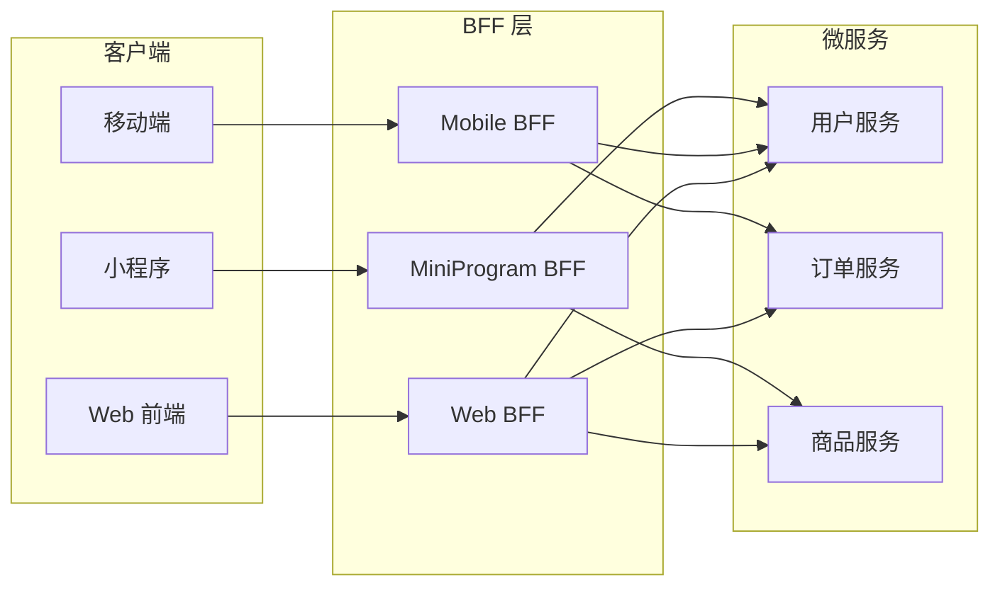
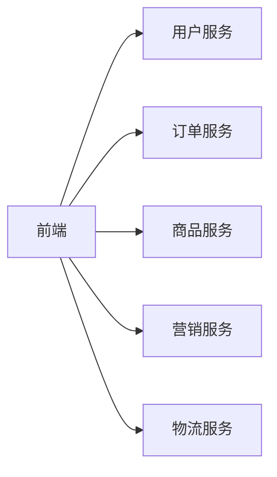
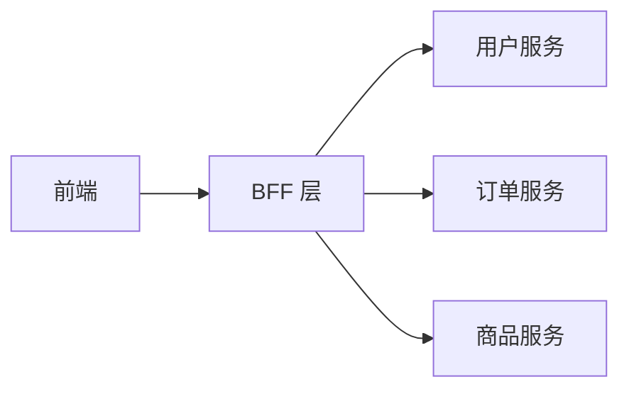
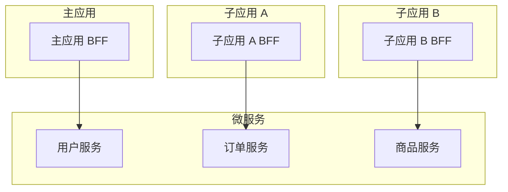

## 什么是 BFF

BFF（Backend For Frontend）是前后端之间的聚合层，为前端提供定制化的 API 接口。



## 为什么需要 BFF

### 问题：微服务架构下的前端困境



| 问题 | 说明 |
|------|------|
| 接口碎片化 | 一个页面需要调用多个微服务接口 |
| 数据格式不统一 | 各服务返回格式不一致，前端需要多次转换 |
| 网络开销大 | 多次 HTTP 请求，移动端网络不稳定时体验差 |
| 前端逻辑重 | 数据聚合、裁剪逻辑都在前端，代码复杂 |

### BFF 的解决方案



| 收益 | 说明 |
|------|------|
| 接口聚合 | 一次请求获取多个服务的数据 |
| 数据裁剪 | 只返回前端需要的字段，减少传输量 |
| 格式统一 | 统一错误处理、数据格式 |
| 逻辑下沉 | 数据聚合逻辑从前端移到 BFF |

## BFF vs 传统后端

| 维度 | 传统后端 | BFF |
|------|----------|-----|
| 服务对象 | 通用，服务所有客户端 | 专用，为特定前端定制 |
| 接口设计 | 面向资源，RESTful | 面向页面/场景，GraphQL 或定制 REST |
| 数据聚合 | 前端自行聚合 | BFF 层聚合 |
| 技术栈 | Java/Go/Python 等 | Node.js/TypeScript（与前端同栈） |
| 部署 | 独立部署 | 可与前端一起部署，或独立部署 |

## BFF 实现方案

### 方案一：Node.js + Express/Koa

```typescript
// BFF 接口：获取订单详情页数据
app.get('/api/order/detail/:orderId', async (ctx) => {
  const { orderId } = ctx.params;
  const userId = ctx.state.user.id;

  // 并行请求多个微服务
  const [order, user, products] = await Promise.all([
    fetch(`${ORDER_SERVICE}/orders/${orderId}`),
    fetch(`${USER_SERVICE}/users/${userId}`),
    fetch(`${PRODUCT_SERVICE}/products?orderIds=${orderId}`),
  ]);

  // 数据聚合和裁剪
  ctx.body = {
    order: {
      id: order.id,
      status: order.status,
      createTime: order.createTime,
    },
    user: {
      name: user.name,
      avatar: user.avatar,
    },
    products: products.map(p => ({
      name: p.name,
      price: p.price,
      quantity: p.quantity,
    })),
  };
});
```

### 方案二：GraphQL

**什么是 GraphQL**：GraphQL 是一种 API 查询语言，前端可以精确指定需要哪些字段，后端只返回这些字段。

**核心概念**：
- **Schema**：定义数据类型和关系，类似数据库表结构
- **Query**：查询操作，前端声明需要什么数据
- **Resolver**：解析函数，负责从数据源获取数据

**优势**：
- 前端按需获取，避免字段冗余
- 一次请求获取关联数据，避免多次请求
- 类型安全，Schema 即文档

```graphql
# 前端查询
query GetOrderDetail($orderId: ID!) {
  order(id: $orderId) {
    id
    status
    createTime
    user {
      name
      avatar
    }
    products {
      name
      price
      quantity
    }
  }
}
```

```typescript
// BFF 层 GraphQL Resolver
const resolvers = {
  Query: {
    order: async (_, { id }) => {
      const order = await fetchOrder(id);
      const user = await fetchUser(order.userId);
      const products = await fetchProducts(id);
      return { ...order, user, products };
    },
  },
};
```

**适用场景**：数据结构复杂、多端需求差异大、需要灵活查询的项目。

### 方案三：Serverless Functions

**什么是 Serverless**：无需管理服务器，写一个函数部署到云平台（Vercel、AWS Lambda、阿里云函数计算），平台自动处理扩缩容、运维。

**核心特点**：
- **按需计费**：按调用次数和执行时间计费，不用不花钱
- **自动扩缩容**：流量大时自动扩容，流量小时缩到零
- **免运维**：不用管服务器、部署、监控

```typescript
// Vercel / AWS Lambda
export default async function handler(req, res) {
  const { orderId } = req.query;

  const [order, user, products] = await Promise.all([
    fetchOrder(orderId),
    fetchUser(req.user.id),
    fetchProducts(orderId),
  ]);

  res.json({
    order: pick(order, ['id', 'status', 'createTime']),
    user: pick(user, ['name', 'avatar']),
    products: products.map(p => pick(p, ['name', 'price', 'quantity'])),
  });
}
```

**适用场景**：中小项目、快速原型、流量波动大的场景。

**局限**：
- 冷启动延迟（函数首次调用需要初始化）
- 执行时间限制（通常 15 分钟以内）
- 不适合长连接、WebSocket 场景

## BFF 与微前端的配合

微前端架构下，每个子应用可能需要独立的 BFF：



| 方案 | 说明 | 适用场景 |
|------|------|----------|
| 统一 BFF | 所有子应用共享一个 BFF | 子应用较少，接口重叠多 |
| 独立 BFF | 每个子应用独立 BFF | 子应用独立部署，技术栈不同 |
| 混合模式 | 公共接口用统一 BFF，业务接口用独立 BFF | 大型项目，平衡复用和独立性 |

## BFF 的代价

| 代价 | 说明 |
|------|------|
| 额外维护成本 | 多了一层服务，需要部署、监控、运维 |
| 数据一致性 | BFF 层缓存可能导致数据不一致 |
| 性能开销 | 多了一跳网络请求（但可通过内网调用优化） |
| 团队分工 | 前端需要承担部分后端工作，职责边界模糊 |

## 何时需要 BFF

| 场景 | 是否需要 BFF |
|------|--------------|
| 简单项目，接口少 | 不需要，直接调用微服务 |
| 多端（Web/App/小程序） | 需要，每端一个 BFF |
| 微服务架构，接口碎片化 | 需要，聚合接口 |
| 前端团队有 Node.js 能力 | 适合，前端自己维护 BFF |
| 后端团队能提供聚合接口 | 不需要，让后端做 |

## 最佳实践

1. **BFF 由前端团队维护**：BFF 是前端的后端，前端最清楚自己需要什么数据
2. **接口面向页面设计**：一个页面对应一个 BFF 接口，避免前端多次调用
3. **数据裁剪**：只返回前端需要的字段，减少传输量
4. **错误统一处理**：BFF 层统一错误格式，前端不需要处理各服务的错误差异
5. **缓存策略**：对不常变化的数据做缓存，减少微服务调用
6. **监控告警**：BFF 层需要监控接口耗时、错误率，及时发现下游服务问题
7. **渐进式引入**：不需要一开始就建 BFF，等接口碎片化问题出现再引入
