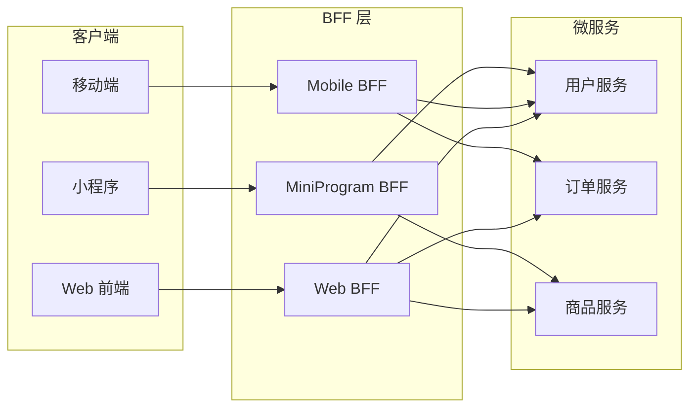
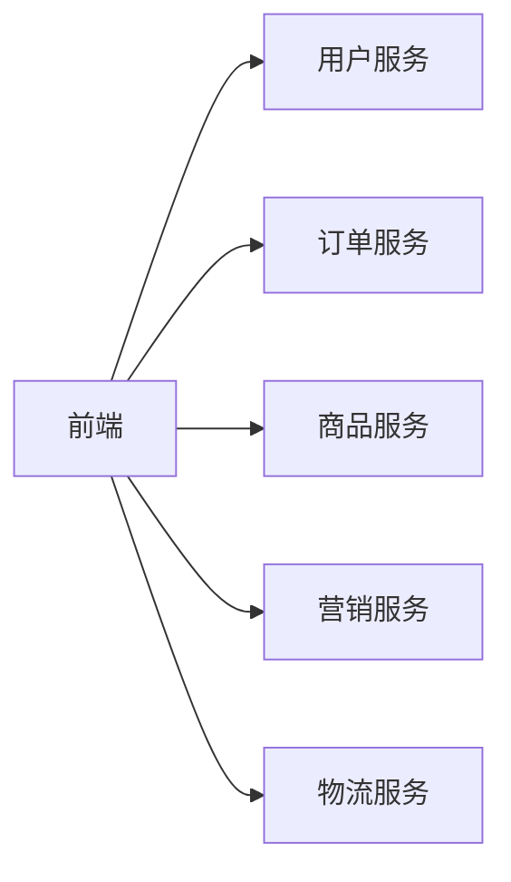
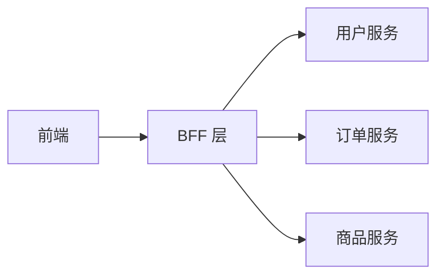
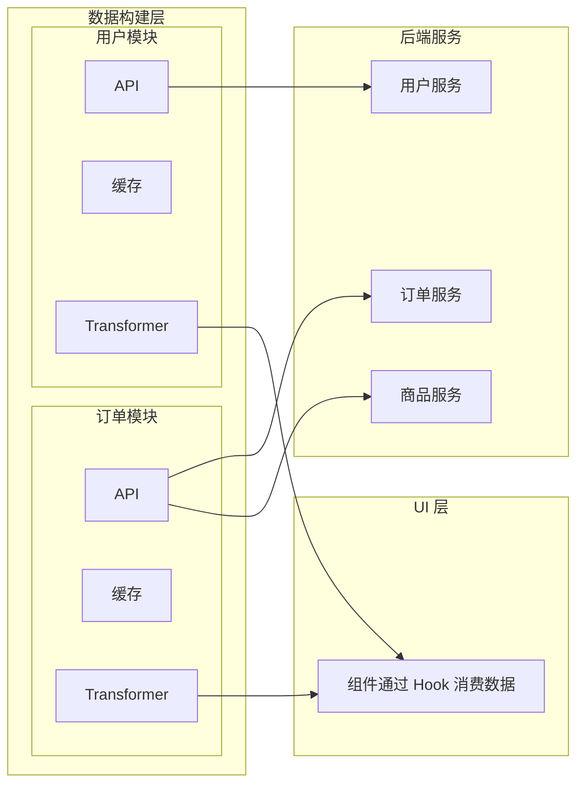
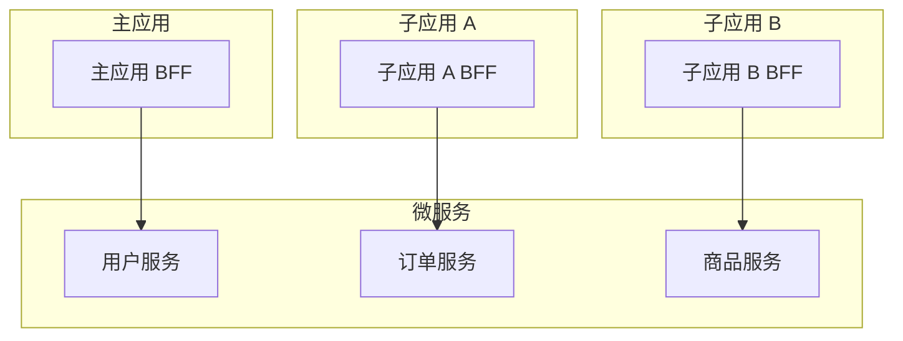

## 什么是 BFF

BFF（Backend For Frontend）是前后端之间的聚合层，为前端提供定制化的 API 接口。



## 为什么需要 BFF

### 问题：微服务架构下的前端困境



| 问题 | 说明 |
|------|------|
| 接口碎片化 | 一个页面需要调用多个微服务接口 |
| 数据格式不统一 | 各服务返回格式不一致，前端需要多次转换 |
| 网络开销大 | 多次 HTTP 请求，移动端网络不稳定时体验差 |
| 前端逻辑重 | 数据聚合、裁剪逻辑都在前端，代码复杂 |

### BFF 的解决方案



| 收益 | 说明 |
|------|------|
| 接口聚合 | 一次请求获取多个服务的数据 |
| 数据裁剪 | 只返回前端需要的字段，减少传输量 |
| 格式统一 | 统一错误处理、数据格式 |
| 逻辑下沉 | 数据聚合逻辑从前端移到 BFF |

## 替代方案：前端数据构建层

BFF 需要额外的服务器资源和维护成本。对于**单端项目**或**后端配合度高**的团队，可以在前端内部做分层，达到类似 BFF 的效果。

### 核心思路

将前端拆成**数据构建层**和**UI 层**。数据构建层按业务模块组织，每个模块封装 API 请求、缓存、数据适配，对外统一暴露 hook 函数。UI 层只负责渲染，不关心数据从哪来、怎么转换。



数据流：**API 请求 → 缓存层 → Transformer 适配 → UI 层直接使用**

### 目录结构

按业务模块划分，每个模块自包含 api、transformer、hooks，缓存由全局 store 统一管理：

```
src/
├── modules/
│   ├── order/                  # 订单模块
│   │   ├── api.ts              # API 请求定义
│   │   ├── transformer.ts      # 数据适配（入参/出参转换）
│   │   └── hooks.ts            # 对外暴露的 hook
│   ├── user/                   # 用户模块
│   │   ├── api.ts
│   │   ├── transformer.ts
│   │   └── hooks.ts
│   └── product/                # 商品模块
│       ├── api.ts
│       ├── transformer.ts
│       └── hooks.ts
├── store/                      # 全局缓存（Zustand 等）
│   └── cacheStore.ts
├── components/                 # UI 层：只引用 hooks
│   ├── OrderList.tsx
│   └── UserCard.tsx
└── shared/                     # 跨模块公共工具
    └── request.ts              # 请求工具（baseUrl、token、错误处理）
```

### 各层职责

#### 1. API 层 — 定义接口，不做任何业务逻辑

```typescript
// modules/order/api.ts
import { request } from '@/shared/request';

export function fetchOrderList(params: OrderListParams) {
  return request<OrderRaw[]>('/api/orders', { method: 'GET', params });
}

export function fetchOrderDetail(orderId: string) {
  return request<OrderDetailRaw>(`/api/orders/${orderId}`);
}
```

#### 2. 缓存层 — 全局 store 统一管理

缓存是全局共享的，不需要每个模块单独维护。通常用 Zustand 等轻量状态库实现，**只缓存 GET 请求**（POST/PUT/DELETE 会改变数据，缓存无意义）：

```typescript
// store/cacheStore.ts
import { create } from 'zustand';

interface CacheEntry {
  data: unknown;
  timestamp: number;
}

interface CacheState {
  cache: Record<string, CacheEntry>;
  get: <T>(key: string, ttl?: number) => T | null;
  set: (key: string, data: unknown) => void;
  invalidate: (key: string) => void;
  invalidateByPrefix: (prefix: string) => void;
}

const DEFAULT_TTL = 60_000; // 1 分钟

export const useCacheStore = create<CacheState>((set, get) => ({
  cache: {},

  get: <T>(key: string, ttl = DEFAULT_TTL): T | null => {
    const entry = get().cache[key];
    if (!entry) return null;
    if (Date.now() - entry.timestamp > ttl) {
      // 过期则清除
      const { [key]: _, ...rest } = get().cache;
      set({ cache: rest });
      return null;
    }
    return entry.data as T;
  },

  set: (key: string, data: unknown) =>
    set(state => ({
      cache: { ...state.cache, [key]: { data, timestamp: Date.now() } },
    })),

  invalidate: (key: string) =>
    set(state => {
      const { [key]: _, ...rest } = state.cache;
      return { cache: rest };
    }),

  invalidateByPrefix: (prefix: string) =>
    set(state => {
      const rest = Object.fromEntries(
        Object.entries(state.cache).filter(([k]) => !k.startsWith(prefix))
      );
      return { cache: rest };
    }),
}));
```

#### 3. Transformer 层 — 入参和出参的适配

这是数据构建层的核心。Transformer 负责两件事：

- **入参转换**：UI 层的参数 → API 需要的参数
- **出参转换**：API 返回的原始数据 → UI 可直接渲染的数据

同一份原始数据可以通过不同的 Transformer 产出不同格式，适配不同 UI 场景：

```typescript
// modules/order/transformer.ts

// ── 入参转换 ──
export function transformOrderListParams(uiParams: UIOrderListParams): OrderListParams {
  return {
    page: uiParams.page,
    pageSize: uiParams.pageSize,
    status: uiParams.statusFilter,
    sortBy: uiParams.sortField,
    createTimeFrom: formatDate(uiParams.dateRange?.[0]),
    createTimeTo: formatDate(uiParams.dateRange?.[1]),
  };
}

// ── 出参转换：列表视图 ──
export function transformOrderForList(raw: OrderRaw): OrderListItem {
  return {
    id: raw.id,
    statusText: ORDER_STATUS_MAP[raw.status],
    totalAmount: formatPrice(raw.totalAmount),
    productCount: raw.items.length,
    createTime: formatDateTime(raw.createTime),
  };
}

// ── 出参转换：详情视图（同一份数据，不同格式）──
export function transformOrderForDetail(raw: OrderDetailRaw): OrderDetail {
  return {
    id: raw.id,
    status: { text: ORDER_STATUS_MAP[raw.status], color: ORDER_STATUS_COLOR[raw.status] },
    buyer: { name: raw.buyerName, phone: maskPhone(raw.buyerPhone) },
    seller: { name: raw.sellerName, shopName: raw.shopName },
    items: raw.items.map(item => ({
      name: item.productName,
      spec: item.specText,
      price: formatPrice(item.unitPrice),
      quantity: item.quantity,
      subtotal: formatPrice(item.unitPrice * item.quantity),
    })),
    amount: {
      subtotal: formatPrice(raw.subtotal),
      shipping: formatPrice(raw.shippingFee),
      discount: formatPrice(raw.discount),
      total: formatPrice(raw.totalAmount),
    },
    timeline: raw.statusLogs.map(log => ({
      status: ORDER_STATUS_MAP[log.status],
      time: formatDateTime(log.time),
      remark: log.remark,
    })),
  };
}
```

#### 4. Hook 层 — 组合前三层，对外暴露

```typescript
// modules/order/hooks.ts
import { useCacheStore } from '@/store/cacheStore';

export function useOrderList(params: UIOrderListParams) {
  const [data, setData] = useState<OrderListItem[]>([]);
  const [loading, setLoading] = useState(true);
  const cache = useCacheStore();

  useEffect(() => {
    const apiParams = transformOrderListParams(params);
    const cacheKey = `orderList:${JSON.stringify(apiParams)}`;

    // 读缓存
    const cached = cache.get<OrderListItem[]>(cacheKey);
    if (cached) {
      setData(cached);
      setLoading(false);
      return;
    }

    // GET 请求，结果写入缓存
    fetchOrderList(apiParams).then(rawList => {
      const result = rawList.map(transformOrderForList);
      cache.set(cacheKey, result);
      setData(result);
      setLoading(false);
    });
  }, [params]);

  return { data, loading };
}

export function useOrderDetail(orderId: string) {
  const [data, setData] = useState<OrderDetail | null>(null);
  const [loading, setLoading] = useState(true);
  const cache = useCacheStore();

  useEffect(() => {
    const cacheKey = `orderDetail:${orderId}`;
    const cached = cache.get<OrderDetail>(cacheKey);
    if (cached) {
      setData(cached);
      setLoading(false);
      return;
    }

    fetchOrderDetail(orderId).then(raw => {
      const result = transformOrderForDetail(raw);
      cache.set(cacheKey, result);
      setData(result);
      setLoading(false);
    });
  }, [orderId]);

  return { data, loading };
}

// POST/PUT/DELETE 操作后，清除相关缓存，保证下次 GET 拿到最新数据
export function useOrderMutations() {
  const cache = useCacheStore();

  const createOrder = async (params: CreateOrderParams) => {
    const result = await createOrderApi(params);
    cache.invalidateByPrefix('orderList'); // 清除列表缓存
    return result;
  };

  const updateOrder = async (orderId: string, params: UpdateOrderParams) => {
    const result = await updateOrderApi(orderId, params);
    cache.invalidate(`orderDetail:${orderId}`); // 清除该订单详情缓存
    cache.invalidateByPrefix('orderList');       // 清除列表缓存
    return result;
  };

  return { createOrder, updateOrder };
}
```

#### 5. UI 层 — 纯渲染，零数据逻辑

```tsx
// components/OrderList.tsx
function OrderList({ filters }: { filters: UIOrderListParams }) {
  const { data, loading } = useOrderList(filters);

  if (loading) return <Spinner />;

  return (
    <table>
      {data.map(order => (
        <tr key={order.id}>
          <td>{order.id}</td>
          <td>{order.statusText}</td>
          <td>{order.totalAmount}</td>
          <td>{order.productCount} 件</td>
        </tr>
      ))}
    </table>
  );
}
```

### 设计要点

1. **UI 组件禁止直接调用 API** — 所有数据通过 hook 获取，保证数据逻辑集中
2. **Transformer 是纯函数** — 不依赖 DOM 和组件状态，同一份数据可产出多种格式，方便单元测试
3. **入参和出参都走 Transformer** — UI 参数和 API 参数解耦，后端接口变更时只改 transformer，不影响 UI 组件
4. **缓存全局统一管理，只缓存 GET** — POST/PUT/DELETE 操作后主动 invalidate 相关缓存，避免脏数据
5. **模块间通过 hook 通信** — 模块 A 需要模块 B 的数据时，引用 B 的 hook，而不是直接调用 B 的 api

### BFF vs 前端数据构建层

| 维度 | BFF（服务端） | 前端数据构建层 |
|------|-------------|--------------|
| **运行环境** | Node 服务器 | 浏览器 |
| **接口聚合** | 服务端并行请求，一次返回 | `Promise.all` 并行请求，多次往返 |
| **网络开销** | 前端只发 1 次请求 | 前端发 N 次请求（N = 微服务数量） |
| **数据裁剪** | 服务端裁剪后传输，省带宽 | 全量传输，前端 pick 字段 |
| **缓存** | 服务端缓存，所有用户共享 | 浏览器缓存，每用户独立 |
| **SSR 支持** | 天然支持，服务端直接拿数据 | 不支持，数据在浏览器里获取 |
| **多端复用** | 一套 BFF 服务多端 | 每端各自实现数据层 |
| **维护成本** | 需要服务器、部署、监控 | 零额外成本，随前端一起部署 |
| **适用场景** | 多端、SSR、接口碎片化严重 | 单端、CSR、后端配合度高 |

### 如何选择

| 项目特征 | 推荐方案 |
|---------|---------|
| 单端 H5 / 管理后台，CSR 渲染 | 前端数据构建层 |
| 多端（Web + App + 小程序） | BFF |
| 需要 SSR / SSG | BFF |
| 后端接口粒度细，一个页面要调 5+ 接口 | BFF |
| 团队小，没有 Node 服务运维能力 | 前端数据构建层 |
| 弱网环境（移动端） | BFF（减少请求次数） |

两者不是互斥的。常见做法是**核心聚合逻辑用 BFF，前端内部仍然做数据层分层** — BFF 负责跨服务的接口聚合和数据裁剪，前端数据层负责 Transformer 适配、缓存管理和业务状态。

## BFF vs 传统后端

| 维度 | 传统后端 | BFF |
|------|----------|-----|
| 服务对象 | 通用，服务所有客户端 | 专用，为特定前端定制 |
| 接口设计 | 面向资源，RESTful | 面向页面/场景，GraphQL 或定制 REST |
| 数据聚合 | 前端自行聚合 | BFF 层聚合 |
| 技术栈 | Java/Go/Python 等 | Node.js/TypeScript（与前端同栈） |
| 部署 | 独立部署 | 可与前端一起部署，或独立部署 |

## BFF 实现方案

### 方案一：Node.js + Express/Koa

```typescript
// BFF 接口：获取订单详情页数据
app.get('/api/order/detail/:orderId', async (ctx) => {
  const { orderId } = ctx.params;
  const userId = ctx.state.user.id;

  // 并行请求多个微服务
  const [order, user, products] = await Promise.all([
    fetch(`${ORDER_SERVICE}/orders/${orderId}`),
    fetch(`${USER_SERVICE}/users/${userId}`),
    fetch(`${PRODUCT_SERVICE}/products?orderIds=${orderId}`),
  ]);

  // 数据聚合和裁剪
  ctx.body = {
    order: {
      id: order.id,
      status: order.status,
      createTime: order.createTime,
    },
    user: {
      name: user.name,
      avatar: user.avatar,
    },
    products: products.map(p => ({
      name: p.name,
      price: p.price,
      quantity: p.quantity,
    })),
  };
});
```

### 方案二：GraphQL

**什么是 GraphQL**：GraphQL 是一种 API 查询语言，前端可以精确指定需要哪些字段，后端只返回这些字段。

**核心概念**：
- **Schema**：定义数据类型和关系，类似数据库表结构
- **Query**：查询操作，前端声明需要什么数据
- **Resolver**：解析函数，负责从数据源获取数据

**优势**：
- 前端按需获取，避免字段冗余
- 一次请求获取关联数据，避免多次请求
- 类型安全，Schema 即文档

```graphql
# 前端查询
query GetOrderDetail($orderId: ID!) {
  order(id: $orderId) {
    id
    status
    createTime
    user {
      name
      avatar
    }
    products {
      name
      price
      quantity
    }
  }
}
```

```typescript
// BFF 层 GraphQL Resolver
const resolvers = {
  Query: {
    order: async (_, { id }) => {
      const order = await fetchOrder(id);
      const user = await fetchUser(order.userId);
      const products = await fetchProducts(id);
      return { ...order, user, products };
    },
  },
};
```

**适用场景**：数据结构复杂、多端需求差异大、需要灵活查询的项目。

### 方案三：Serverless Functions

**什么是 Serverless**：无需管理服务器，写一个函数部署到云平台（Vercel、AWS Lambda、阿里云函数计算），平台自动处理扩缩容、运维。

**核心特点**：
- **按需计费**：按调用次数和执行时间计费，不用不花钱
- **自动扩缩容**：流量大时自动扩容，流量小时缩到零
- **免运维**：不用管服务器、部署、监控

```typescript
// Vercel / AWS Lambda
export default async function handler(req, res) {
  const { orderId } = req.query;

  const [order, user, products] = await Promise.all([
    fetchOrder(orderId),
    fetchUser(req.user.id),
    fetchProducts(orderId),
  ]);

  res.json({
    order: pick(order, ['id', 'status', 'createTime']),
    user: pick(user, ['name', 'avatar']),
    products: products.map(p => pick(p, ['name', 'price', 'quantity'])),
  });
}
```

**适用场景**：中小项目、快速原型、流量波动大的场景。

**局限**：
- 冷启动延迟（函数首次调用需要初始化）
- 执行时间限制（通常 15 分钟以内）
- 不适合长连接、WebSocket 场景

## BFF 与微前端的配合

微前端架构下，每个子应用可能需要独立的 BFF：



| 方案 | 说明 | 适用场景 |
|------|------|----------|
| 统一 BFF | 所有子应用共享一个 BFF | 子应用较少，接口重叠多 |
| 独立 BFF | 每个子应用独立 BFF | 子应用独立部署，技术栈不同 |
| 混合模式 | 公共接口用统一 BFF，业务接口用独立 BFF | 大型项目，平衡复用和独立性 |

## BFF 的代价

| 代价 | 说明 |
|------|------|
| 额外维护成本 | 多了一层服务，需要部署、监控、运维 |
| 数据一致性 | BFF 层缓存可能导致数据不一致 |
| 性能开销 | 多了一跳网络请求（但可通过内网调用优化） |
| 团队分工 | 前端需要承担部分后端工作，职责边界模糊 |

## 何时需要 BFF

| 场景 | 是否需要 BFF |
|------|--------------|
| 简单项目，接口少 | 不需要，直接调用微服务 |
| 多端（Web/App/小程序） | 需要，每端一个 BFF |
| 微服务架构，接口碎片化 | 需要，聚合接口 |
| 前端团队有 Node.js 能力 | 适合，前端自己维护 BFF |
| 后端团队能提供聚合接口 | 不需要，让后端做 |

## 最佳实践

1. **BFF 由前端团队维护**：BFF 是前端的后端，前端最清楚自己需要什么数据
2. **接口面向页面设计**：一个页面对应一个 BFF 接口，避免前端多次调用
3. **数据裁剪**：只返回前端需要的字段，减少传输量
4. **错误统一处理**：BFF 层统一错误格式，前端不需要处理各服务的错误差异
5. **缓存策略**：对不常变化的数据做缓存，减少微服务调用
6. **监控告警**：BFF 层需要监控接口耗时、错误率，及时发现下游服务问题
7. **渐进式引入**：不需要一开始就建 BFF，等接口碎片化问题出现再引入
