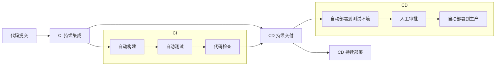
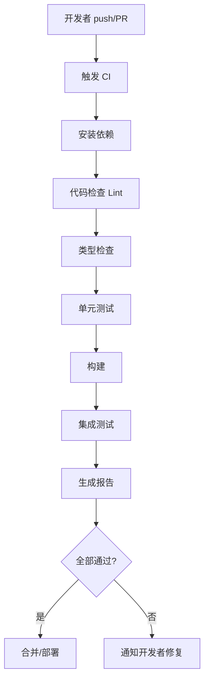
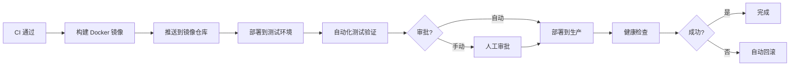
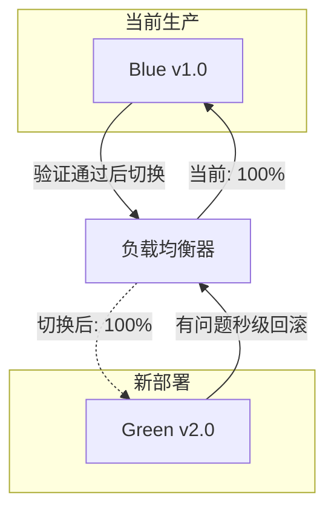
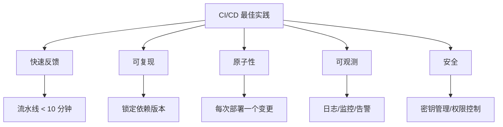
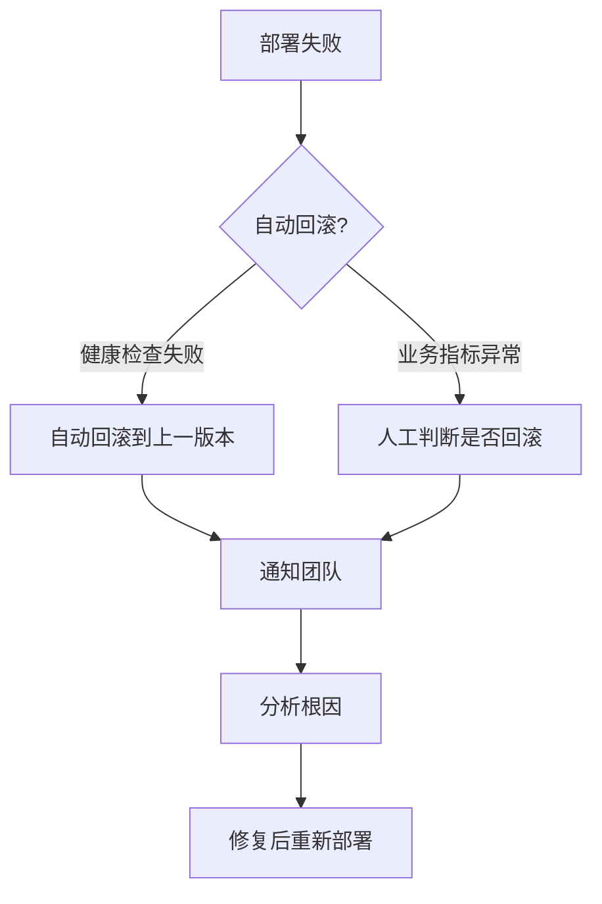

# CI/CD 持续集成与持续部署

## 核心概念



| 概念 | 全称 | 核心目标 |
|------|------|----------|
| **CI** | Continuous Integration | 频繁集成代码，尽早发现问题 |
| **CD（交付）** | Continuous Delivery | 代码随时可部署，但需人工触发 |
| **CD（部署）** | Continuous Deployment | 代码自动部署到生产，无人工干预 |

## 为什么需要 CI/CD

| 痛点 | 没有 CI/CD | 有 CI/CD |
|------|-----------|----------|
| 集成问题 | 合并时冲突爆炸 | 每次提交自动集成 |
| 质量保障 | 上线后才发现 bug | 测试在流水线中自动执行 |
| 部署风险 | 手动部署，容易出错 | 自动化，可回滚 |
| 发布频率 | 几周/月一次 | 每天/小时一次 |
| 反馈速度 | 几天后才知道结果 | 几分钟内得到反馈 |

## CI 流水线设计

### 典型前端 CI 流程



### 各阶段说明

| 阶段 | 工具示例 | 作用 |
|------|---------|------|
| 安装依赖 | `npm ci` | 锁定版本，确保可复现 |
| 代码检查 | ESLint, Prettier | 代码风格与规范 |
| 类型检查 | `tsc --noEmit` | TypeScript 类型安全 |
| 单元测试 | Jest, Vitest | 函数/组件级别测试 |
| 构建 | Vite, Webpack | 打包产物 |
| 集成测试 | Playwright, Cypress | E2E 端到端测试 |
| 产物上传 | S3, OSS | 存储构建产物 |

## CD 部署策略

### 部署流程



### 常见部署策略

| 策略 | 说明 | 风险 | 适用场景 |
|------|------|------|----------|
| **滚动更新** | 逐步替换旧实例 | 低 | 大多数场景 |
| **蓝绿部署** | 两套环境切换 | 极低，可秒级回滚 | 关键业务 |
| **金丝雀发布** | 先放少量流量验证 | 低 | 大流量应用 |
| **A/B 测试** | 不同版本对比效果 | 低 | 产品功能验证 |

### 蓝绿部署示意



## 前端 CI/CD 实践

### GitHub Actions 示例

```yaml
name: CI/CD Pipeline

on:
  push:
    branches: [main, develop]
  pull_request:
    branches: [main]

jobs:
  ci:
    runs-on: ubuntu-latest
    steps:
      - uses: actions/checkout@v4

      - name: Setup Node
        uses: actions/setup-node@v4
        with:
          node-version: 20
          cache: npm

      - name: Install Dependencies
        run: npm ci

      - name: Lint
        run: npm run lint

      - name: Type Check
        run: npx tsc --noEmit

      - name: Unit Test
        run: npm run test -- --coverage

      - name: Build
        run: npm run build

      - name: Upload Artifact
        uses: actions/upload-artifact@v4
        with:
          name: dist
          path: dist/

  deploy:
    needs: ci
    if: github.ref == 'refs/heads/main'
    runs-on: ubuntu-latest
    steps:
      - uses: actions/checkout@v4
      - uses: actions/download-artifact@v4
        with:
          name: dist
          path: dist/

      - name: Deploy to Production
        run: |
          # 部署脚本，如上传到 CDN/OSS
          echo "Deploying to production..."
```

### 环境管理


| 环境 | 触发条件 | 用途 |
|------|---------|------|
| **Preview** | PR 创建/更新 | 开发预览、Code Review |
| **Staging** | 合并到 develop | QA 测试、集成验证 |
| **Production** | 合并到 main + 审批 | 线上生产 |

## 常用工具对比

| 工具 | 类型 | 特点 |
|------|------|------|
| **GitHub Actions** | SaaS | 与 GitHub 深度集成，生态丰富 |
| **GitLab CI** | SaaS/自托管 | 内置 CI/CD，功能完整 |
| **Jenkins** | 自托管 | 插件丰富，灵活但维护成本高 |
| **CircleCI** | SaaS | 配置简单，并行构建快 |
| **ArgoCD** | GitOps | Kubernetes 原生，声明式部署 |
| **Vercel/Netlify** | 前端专用 | 零配置部署，适合静态站点 |

## 主流服务商

### GitHub Actions

**定位：** GitHub 生态的 CI/CD 平台

**优势：**
- 与 GitHub 仓库无缝集成，PR 自动触发
- Marketplace 有大量现成 Action（10000+）
- 免费额度充足（公共仓库无限，私有仓库 2000 分钟/月）
- 支持矩阵构建、缓存、Artifact

**劣势：**
- 深度绑定 GitHub，迁移成本高
- 复杂流水线 YAML 可读性差
- 自托管 Runner 需要自己维护

**适用场景：** GitHub 托管的项目，前端/全栈团队

---

### GitLab CI

**定位：** 一体化 DevOps 平台

**优势：**
- 代码托管 + CI/CD + 容器registry 一体
- `.gitlab-ci.yml` 配置直观
- 支持 Auto DevOps（自动检测技术栈）
- 可自托管，数据可控

**劣势：**
- 功能多但学习曲线陡
- 社区版功能有限制
- 生态不如 GitHub 丰富

**适用场景：** 已用 GitLab 的团队，需要私有化部署

---

### Jenkins

**定位：** 老牌开源 CI/CD 服务器

**优势：**
- 插件生态极其丰富（1500+ 插件）
- 完全自托管，高度可定制
- 支持几乎所有语言和平台
- 社区成熟，资料多

**劣势：**
- 界面老旧，用户体验差
- 插件质量参差不齐，升级容易冲突
- 需要专人维护服务器
- 配置复杂（Groovy 脚本）

**适用场景：** 大型企业，复杂定制化需求，已有 Jenkins 基础设施

---

### CircleCI

**定位：** 专注速度的 SaaS CI/CD

**优势：**
- 构建速度快，并行能力强
- 配置简洁（`.circleci/config.yml`）
- 缓存机制优秀
- 与 GitHub/Bitbucket 集成好

**劣势：**
- 免费额度较少（2500 分钟/月）
- 功能相对单一
- 不支持自托管

**适用场景：** 追求构建速度的团队，中小型项目

---

### Vercel / Netlify

**定位：** 前端/静态站点专属部署平台

**优势：**
- 零配置，Git push 自动部署
- 每个 PR 自动生成 Preview URL
- 全球 CDN，访问速度快
- 支持 Serverless Functions

**劣势：**
- 只适合前端/静态站点
- 后端能力有限
- 高级功能收费贵
- 锁定平台，迁移困难

**适用场景：** 前端项目、静态站点、Jamstack 架构

---

### ArgoCD

**定位：** Kubernetes 原生 GitOps 工具

**优势：**
- 声明式部署，Git 即真相源
- 自动同步， drift detection
- K8s 原生，支持 Helm/Kustomize
- 可视化界面清晰

**劣势：**
- 必须基于 Kubernetes
- 学习成本高
- 不适合非容器化项目

**适用场景：** K8s 环境，微服务架构，GitOps 实践

---

### 能力对比

| 维度 | GitHub Actions | GitLab CI | Jenkins | CircleCI | Vercel/Netlify | ArgoCD |
|------|---------------|-----------|---------|----------|----------------|--------|
| **部署方式** | SaaS | SaaS/自托管 | 自托管 | SaaS | SaaS | 自托管 |
| **学习成本** | 中 | 中 | 高 | 低 | 极低 | 高 |
| **免费额度** | 充足 | 一般 | 无限制* | 较少 | 充足 | 无限制* |
| **构建速度** | 快 | 快 | 取决于服务器 | 很快 | 很快 | 取决于集群 |
| **生态丰富度** | ⭐⭐⭐⭐ | ⭐⭐⭐ | ⭐⭐⭐ | ⭐⭐⭐ | ⭐⭐ | ⭐⭐ |
| **前端友好度** | ⭐⭐⭐⭐ | ⭐⭐⭐ | ⭐⭐ | ⭐⭐⭐ | ⭐⭐⭐⭐⭐ | ⭐⭐ |
| **K8s 支持** | 一般 | 一般 | 插件支持 | 一般 | 不支持 | ⭐⭐⭐⭐ |
| **Preview 环境** | 需配置 | 内置 | 需配置 | 需配置 | 开箱即用 | 需配置 |

*自托管无限制，但需要自己的服务器资源

## 最佳实践

### 流水线设计原则



| 原则 | 实践 |
|------|------|
| **快速反馈** | 并行执行独立任务，慢测试放后面 |
| **可复现** | 使用 `npm ci` 而非 `npm install`，锁定 lock 文件 |
| **原子性** | 每次部署一个功能/修复，便于回滚 |
| **幂等性** | 重复执行结果一致，支持重试 |
| **可观测** | 部署后自动健康检查，接入监控告警 |
| **安全** | 密钥用 Secret 管理，最小权限原则 |
| **缓存优化** | 缓存 node_modules、构建产物加速流水线 |

### 分支与部署映射

| 分支 | CI 触发 | CD 目标 |
|------|---------|---------|
| `feature/*` | Lint + 测试 + 构建 | Preview 环境 |
| `develop` | 全量测试 + 构建 | Staging 环境 |
| `main` | 全量测试 + 构建 + E2E | Production（需审批） |
| `hotfix/*` | 全量测试 + 构建 | Production（快速通道） |

### 回滚策略



| 回滚方式 | 速度 | 适用场景 |
|---------|------|----------|
| 重新部署旧镜像 | 秒级 | Docker/K8s 环境 |
| Git revert + 重新部署 | 分钟级 | 代码级回滚 |
| 流量切换回旧版本 | 秒级 | 蓝绿/金丝雀部署 |
| 数据库迁移回滚 | 需谨慎 | 涉及数据变更时 |

## 关键指标

| 指标 | 目标 | 说明 |
|------|------|------|
| **部署频率** | 每天多次 | 衡量交付速度 |
| **变更前置时间** | < 1 小时 | 从提交到上线的时间 |
| **变更失败率** | < 5% | 部署后需要回滚的比例 |
| **故障恢复时间** | < 1 小时 | 从故障到恢复的时间 |
| **流水线时长** | < 10 分钟 | CI 从触发到完成的时间 |
