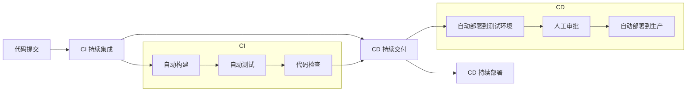
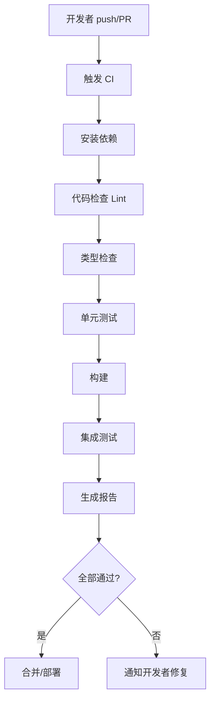
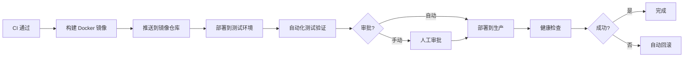
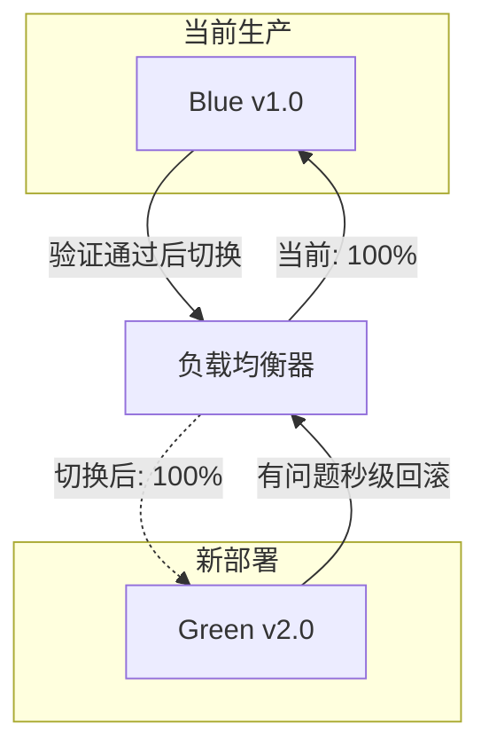
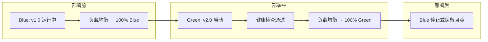
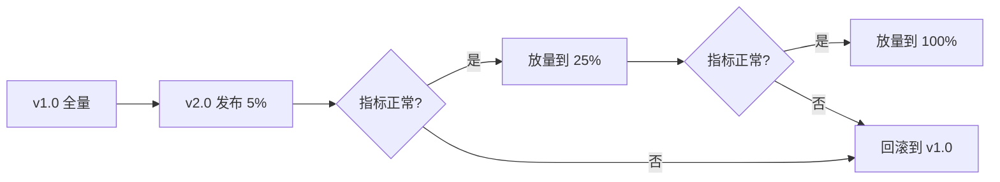
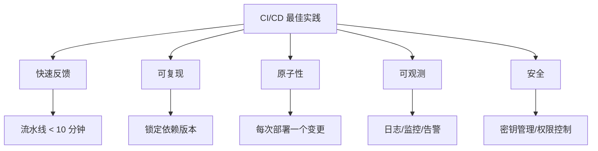
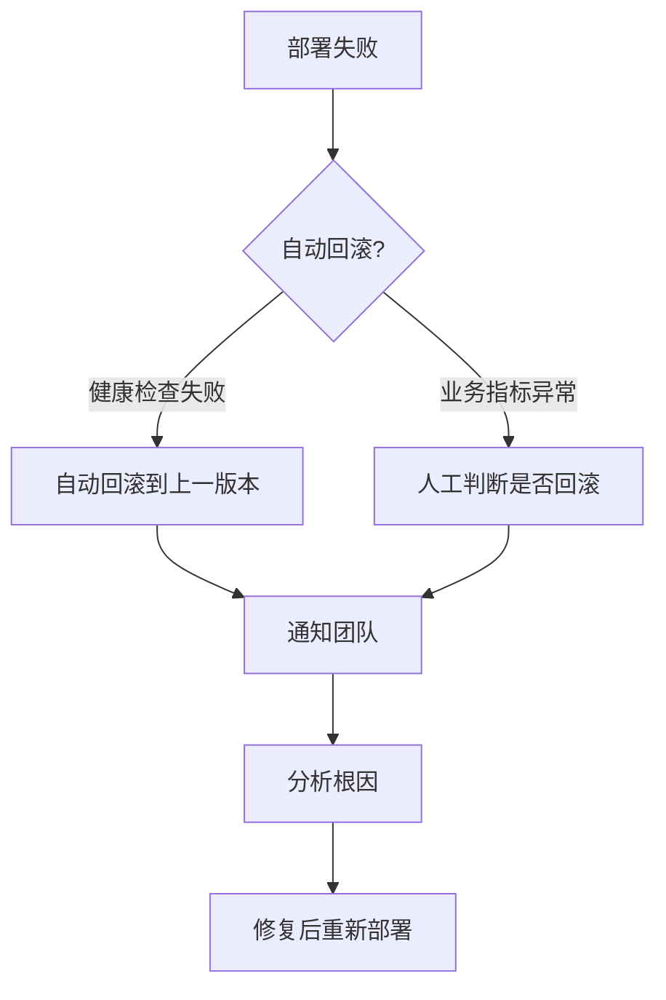

# CI/CD 持续集成与持续部署

## 核心概念



| 概念 | 全称 | 核心目标 |
|------|------|----------|
| **CI** | Continuous Integration | 频繁集成代码，尽早发现问题 |
| **CD（交付）** | Continuous Delivery | 代码随时可部署，但需人工触发 |
| **CD（部署）** | Continuous Deployment | 代码自动部署到生产，无人工干预 |

## 为什么需要 CI/CD

| 痛点 | 没有 CI/CD | 有 CI/CD |
|------|-----------|----------|
| 集成问题 | 合并时冲突爆炸 | 每次提交自动集成 |
| 质量保障 | 上线后才发现 bug | 测试在流水线中自动执行 |
| 部署风险 | 手动部署，容易出错 | 自动化，可回滚 |
| 发布频率 | 几周/月一次 | 每天/小时一次 |
| 反馈速度 | 几天后才知道结果 | 几分钟内得到反馈 |

## CI 流水线设计

### 典型前端 CI 流程



### 各阶段说明

| 阶段 | 工具示例 | 作用 |
|------|---------|------|
| 安装依赖 | `npm ci` | 锁定版本，确保可复现 |
| 代码检查 | ESLint, Prettier | 代码风格与规范 |
| 类型检查 | `tsc --noEmit` | TypeScript 类型安全 |
| 单元测试 | Jest, Vitest | 函数/组件级别测试 |
| 构建 | Vite, Webpack | 打包产物 |
| 集成测试 | Playwright, Cypress | E2E 端到端测试 |
| 产物上传 | S3, OSS | 存储构建产物 |

## CD 部署策略

### 部署流程



### 常见部署策略

| 策略 | 说明 | 风险 | 适用场景 |
|------|------|------|----------|
| **滚动更新** | 逐步替换旧实例 | 低 | 大多数场景 |
| **蓝绿部署** | 两套环境切换 | 极低，可秒级回滚 | 关键业务 |
| **金丝雀发布** | 先放少量流量验证 | 低 | 大流量应用 |
| **A/B 测试** | 不同版本对比效果 | 低 | 产品功能验证 |

### 蓝绿部署示意



## 前端 CI/CD 实践

### GitHub Actions 示例

```yaml
# 流水线名称，显示在 GitHub Actions 面板中
name: CI/CD Pipeline

# 触发条件：什么情况下自动运行
on:
  push:
    branches: [main, develop]  # 推送到 main 或 develop 分支时触发
  pull_request:
    branches: [main]           # 向 main 发起 PR 时触发

jobs:
  # ========== CI 阶段：代码检查与构建 ==========
  ci:
    runs-on: ubuntu-latest     # 运行环境：最新 Ubuntu
    steps:
      # 1. 检出代码（必须的第一步）
      - uses: actions/checkout@v4

      # 2. 安装 Node.js 环境，并启用 npm 缓存加速
      - name: Setup Node
        uses: actions/setup-node@v4
        with:
          node-version: 20     # Node 版本
          cache: npm           # 自动缓存 node_modules，加速后续运行

      # 3. 安装依赖（用 npm ci 而非 npm install，确保版本完全一致）
      - name: Install Dependencies
        run: npm ci

      # 4. 代码风格检查（ESLint/Prettier）
      - name: Lint
        run: npm run lint

      # 5. TypeScript 类型检查（不生成文件，只检查类型）
      - name: Type Check
        run: npx tsc --noEmit

      # 6. 单元测试（生成覆盖率报告）
      - name: Unit Test
        run: npm run test -- --coverage

      # 7. 构建生产产物
      - name: Build
        run: npm run build

      # 8. 上传构建产物，供后续部署 job 下载
      - name: Upload Artifact
        uses: actions/upload-artifact@v4
        with:
          name: dist           # 产物名称
          path: dist/          # 产物路径

  # ========== CD 阶段：部署到 Preview 环境（PR 场景） ==========
  deploy-preview:
    needs: ci                  # 依赖 ci job 完成后才执行
    if: github.event_name == 'pull_request'  # 仅在 PR 场景下运行
    runs-on: ubuntu-latest
    steps:
      # 下载 CI 阶段上传的构建产物
      - uses: actions/download-artifact@v4
        with:
          name: dist
          path: dist/

      # 部署到 Vercel Preview 环境（每个 PR 自动生成独立预览链接）
      - name: Deploy to Vercel Preview
        uses: amondnet/vercel-action@v25
        with:
          vercel-token: ${{ secrets.VERCEL_TOKEN }}        # Vercel API Token（在仓库 Settings → Secrets 中配置）
          vercel-org-id: ${{ secrets.VERCEL_ORG_ID }}      # Vercel 组织 ID
          vercel-project-id: ${{ secrets.VERCEL_PROJECT_ID }}  # Vercel 项目 ID
          working-directory: ./dist                        # 部署目录

  # ========== CD 阶段：部署到生产环境（main 分支） ==========
  deploy-production:
    needs: ci                  # 依赖 ci job 完成后才执行
    if: github.ref == 'refs/heads/main'  # 仅在 main 分支触发
    runs-on: ubuntu-latest
    environment: production    # 关联 GitHub Environment，可配置人工审批 + 独立 Secrets
    steps:
      # 下载构建产物
      - uses: actions/download-artifact@v4
        with:
          name: dist
          path: dist/

      # 部署到生产环境
      - name: Deploy to Production
        run: |
          # 同步文件到 S3（--delete 会删除 S3 中本地不存在的文件，保持完全一致）
          aws s3 sync dist/ s3://my-frontend-bucket/ --delete
          # 刷新 CloudFront CDN 缓存，确保用户立即看到新版本
          aws cloudfront create-invalidation --distribution-id ${{ secrets.CF_DIST_ID }} --paths "/*"
```

### 静态站点部署（Vercel / Netlify）

前端项目最简单的 CD 方案——零配置，Git push 自动部署。

> **与 GitHub Actions 部署的区别：**
> - **GitHub Actions 方式**：你在 CI 流水线中手动控制部署流程（如上面的示例），适合需要自定义逻辑、多步骤验证的场景
> - **Vercel 原生方式**：直接连接 Git 仓库，Vercel 自动检测 push 并部署，无需写 CI 配置，适合快速上线
>
> 两者可以共存：用 GitHub Actions 做 CI 检查，用 Vercel 原生做 CD 部署。

**vercel.json 配置：**
```json
{
  "buildCommand": "npm run build",
  "outputDirectory": "dist",
  "installCommand": "npm ci",
  "rewrites": [
    { "source": "/(.*)", "destination": "/index.html" }
  ],
  "headers": [
    {
      "source": "/assets/(.*)",
      "headers": [
        { "key": "Cache-Control", "value": "public, max-age=31536000, immutable" }
      ]
    }
  ]
}
```

**核心能力：**
- 每个 PR 自动生成 Preview URL，方便 Code Review
- 合并到 main 自动部署到生产
- 全球 CDN 加速，支持自定义域名
- 自动 HTTPS，支持 Serverless Functions

### Docker 部署

适用于需要自托管或 SSR 的前端项目。

**Dockerfile（多阶段构建）：**
```dockerfile
# 构建阶段
FROM node:20-alpine AS builder
WORKDIR /app
COPY package*.json ./
RUN npm ci
COPY . .
RUN npm run build

# 生产阶段
FROM nginx:alpine
COPY --from=builder /app/dist /usr/share/nginx/html
COPY nginx.conf /etc/nginx/conf.d/default.conf
EXPOSE 80
```

**nginx.conf（前端完整配置）：**
```nginx
# ========== 全局优化 ==========
worker_processes auto;          # 自动匹配 CPU 核心数
events {
    worker_connections 1024;    # 每个 worker 最大连接数
}

http {
    # 基础优化
    sendfile on;                # 启用高效文件传输
    tcp_nopush on;              # 合并小包，减少网络碎片
    tcp_nodelay on;             # 禁用 Nagle 算法，降低延迟
    keepalive_timeout 65;       # 长连接超时时间
    types_hash_max_size 2048;   # MIME 类型哈希表大小

    # MIME 类型
    include /etc/nginx/mime.types;
    default_type application/octet-stream;

    # gzip 压缩（减少传输体积，提升加载速度）
    gzip on;
    gzip_vary on;               # 添加 Vary: Accept-Encoding 头
    gzip_proxied any;           # 代理请求也压缩
    gzip_comp_level 6;          # 压缩级别 1-9，6 是性价比最优
    gzip_min_length 256;        # 小于 256 字节不压缩（压缩反而更大）
    gzip_types
        text/plain
        text/css
        text/javascript
        application/javascript
        application/json
        application/xml
        image/svg+xml;          # 注意：不要压缩图片（已压缩格式如 jpg/png 无需再压）

    # 日志格式
    log_format main '$remote_addr - $remote_user [$time_local] '
                    '"$request" $status $body_bytes_sent '
                    '"$http_referer" "$http_user_agent"';
    access_log /var/log/nginx/access.log main;
    error_log /var/log/nginx/error.log warn;

    # ========== 服务器配置 ==========
    server {
        listen 80;
        server_name example.com www.example.com;  # 域名，多个用空格分隔
        root /usr/share/nginx/html;
        index index.html;

        # ===== 安全头 =====
        add_header X-Frame-Options "SAMEORIGIN" always;           # 防止点击劫持（只允许同源 iframe）
        add_header X-Content-Type-Options "nosniff" always;       # 禁止 MIME 类型嗅探
        add_header X-XSS-Protection "1; mode=block" always;       # XSS 防护（老浏览器）
        add_header Referrer-Policy "strict-origin-when-cross-origin" always;  # 控制 referer 泄露

        # ===== 静态资源缓存策略 =====

        # HTML 文件：不缓存，确保用户拿到最新版本
        location ~* \.html$ {
            expires 0;
            add_header Cache-Control "no-cache, no-store, must-revalidate";
            add_header Pragma "no-cache";
        }

        # JS/CSS/图片等带 hash 的资源：长期缓存（文件名变了就是新版本）
        location ~* \.(js|css|png|jpg|jpeg|gif|ico|svg|woff|woff2|ttf|eot)$ {
            expires 1y;
            add_header Cache-Control "public, immutable";
        }

        # 构建产物目录（如 /assets/）：长期缓存
        location /assets/ {
            expires 1y;
            add_header Cache-Control "public, immutable";
        }

        # ===== SPA 路由 fallback =====
        # 所有找不到的路径都返回 index.html，让前端路由处理
        location / {
            try_files $uri $uri/ /index.html;
        }

        # ===== API 反向代理 =====
        # 前端请求 /api/xxx 时，转发到后端服务
        location /api/ {
            proxy_pass http://backend:3000/;     # 后端地址（Docker 内用容器名）
            proxy_set_header Host $host;
            proxy_set_header X-Real-IP $remote_addr;
            proxy_set_header X-Forwarded-For $proxy_add_x_forwarded_for;
            proxy_set_header X-Forwarded-Proto $scheme;

            # 超时设置
            proxy_connect_timeout 60s;
            proxy_send_timeout 60s;
            proxy_read_timeout 60s;
        }

        # ===== 跨域配置（CORS）=====
        # 如果前端和后端不同域，需要配置 CORS
        # 注意：通常 CORS 由后端配置，前端 Nginx 配置仅用于特殊情况
        location /cors-api/ {
            add_header Access-Control-Allow-Origin "https://frontend.com" always;
            add_header Access-Control-Allow-Methods "GET, POST, OPTIONS" always;
            add_header Access-Control-Allow-Headers "Content-Type, Authorization" always;
            add_header Access-Control-Allow-Credentials "true" always;

            # 预检请求直接返回 204
            if ($request_method = OPTIONS) {
                return 204;
            }

            proxy_pass http://backend:3000/;
        }

        # ===== 限流配置 =====
        # 防止恶意刷接口（需要在 http 块定义 limit_req_zone）
        # limit_req_zone $binary_remote_addr zone=api_limit:10m rate=10r/s;
        # location /api/ {
        #     limit_req zone=api_limit burst=20 nodelay;  # 允许突发 20 个请求
        #     proxy_pass http://backend:3000/;
        # }

        # ===== 请求体大小限制 =====
        client_max_body_size 10m;   # 上传文件大小限制（默认 1m）

        # ===== 自定义错误页面 =====
        error_page 404 /404.html;
        error_page 500 502 503 504 /50x.html;
        location = /50x.html {
            root /usr/share/nginx/html;
        }
    }

    # ========== HTTPS 配置（生产环境必备）==========
    # server {
    #     listen 443 ssl http2;
    #     server_name example.com;
    #
    #     # SSL 证书（可用 Let's Encrypt 免费申请）
    #     ssl_certificate /etc/nginx/ssl/cert.pem;
    #     ssl_certificate_key /etc/nginx/ssl/key.pem;
    #
    #     # SSL 优化
    #     ssl_protocols TLSv1.2 TLSv1.3;
    #     ssl_ciphers HIGH:!aNULL:!MD5;
    #     ssl_prefer_server_ciphers on;
    #     ssl_session_cache shared:SSL:10m;
    #     ssl_session_timeout 10m;
    #
    #     # ... 其他配置同上 ...
    # }

    # HTTP 自动跳转 HTTPS
    # server {
    #     listen 80;
    #     server_name example.com;
    #     return 301 https://$host$request_uri;
    # }
}
```

**部署脚本：**
```bash
#!/bin/bash
# build-and-deploy.sh
IMAGE="my-frontend:$GITHUB_SHA"

# 构建镜像
docker build -t $IMAGE .

# 推送到镜像仓库
docker push $IMAGE

# 部署到服务器
ssh deploy@server "docker pull $IMAGE && docker stop frontend || true && docker run -d -p 80:80 --name frontend $IMAGE"

# 健康检查
sleep 5
HTTP_CODE=$(curl -s -o /dev/null -w "%{http_code}" http://server/)
if [ "$HTTP_CODE" != "200" ]; then
    echo "部署失败，回滚..."
    ssh deploy@server "docker stop frontend && docker run -d -p 80:80 --name frontend my-frontend:previous"
    exit 1
fi
echo "部署成功"
```

### 蓝绿部署实践



**Nginx 蓝绿切换脚本：**
```bash
#!/bin/bash
# blue-green-deploy.sh

BLUE_DIR="/var/www/blue"
GREEN_DIR="/var/www/green"
CURRENT_LINK="/var/www/current"
NEW_VERSION=$1

# 1. 部署新版本到 Green
rsync -avz dist/ $GREEN_DIR/$NEW_VERSION/

# 2. 健康检查
HTTP_CODE=$(curl -s -o /dev/null -w "%{http_code}" "http://localhost:8080/$NEW_VERSION/health")
if [ "$HTTP_CODE" != "200" ]; then
    echo "健康检查失败，中止部署"
    exit 1
fi

# 3. 切换 symlink（原子操作）
ln -sfn $GREEN_DIR/$NEW_VERSION $CURRENT_LINK

# 4. 重载 Nginx
nginx -s reload

echo "部署完成，已切换到 $NEW_VERSION"

# 5. 清理旧版本（保留最近 2 个）
ls -t $GREEN_DIR | tail -n +3 | xargs -I {} rm -rf $GREEN_DIR/{}
```

### 金丝雀发布

逐步放量，观察指标后再全量。



**Nginx 金丝雀配置（百分比分流）：**
```nginx
upstream backend_v1 {
    server 127.0.0.1:3001;
}

upstream backend_v2 {
    server 127.0.0.1:3002;
}

# 根据用户 IP 哈希做百分比分流
# 同一个用户 IP 哈希值固定，始终看到同一版本
split_clients "${remote_addr}AAA" $canary_version {
    5%   "v2";      # 5% 的流量走 v2（金丝雀版本）
    *    "v1";      # 剩余 95% 走 v1（稳定版本）
}

server {
    listen 80;

    location / {
        # 根据分流结果选择后端
        if ($canary_version = "v2") {
            proxy_pass http://backend_v2;
        }
        if ($canary_version = "v1") {
            proxy_pass http://backend_v1;
        }
    }
}
```

**放量步骤：** 修改 `split_clients` 中的百分比，逐步调整：
```nginx
# 第一阶段：5% 金丝雀
5%   "v2";
*    "v1";

# 第二阶段：25% 放量
25%  "v2";
*    "v1";

# 第三阶段：100% 全量
100% "v2";
```

### 部署后验证

部署完成后自动验证，确保服务正常。

```yaml
# GitHub Actions 部署后验证步骤
- name: Health Check
  run: |
    for i in {1..10}; do
      HTTP_CODE=$(curl -s -o /dev/null -w "%{http_code}" https://my-app.com)
      if [ "$HTTP_CODE" == "200" ]; then
        echo "健康检查通过"
        exit 0
      fi
      echo "等待服务启动... ($i/10)"
      sleep 10
    done
    echo "健康检查失败"
    exit 1

- name: Smoke Test
  run: |
    # 关键页面可访问
    curl -f https://my-app.com/
    curl -f https://my-app.com/about
    curl -f https://my-app.com/login

    # 关键 API 正常
    curl -f https://api.my-app.com/health

- name: Visual Regression Test
  run: |
    # 使用 Playwright 截图对比
    npx playwright test --grep "visual"
```

### 环境管理


| 环境 | 触发条件 | 用途 |
|------|---------|------|
| **Preview** | PR 创建/更新 | 开发预览、Code Review |
| **Staging** | 合并到 develop | QA 测试、集成验证 |
| **Production** | 合并到 main + 审批 | 线上生产 |

## 常用工具对比

| 工具 | 类型 | 特点 |
|------|------|------|
| **GitHub Actions** | SaaS | 与 GitHub 深度集成，生态丰富 |
| **GitLab CI** | SaaS/自托管 | 内置 CI/CD，功能完整 |
| **Jenkins** | 自托管 | 插件丰富，灵活但维护成本高 |
| **CircleCI** | SaaS | 配置简单，并行构建快 |
| **ArgoCD** | GitOps | Kubernetes 原生，声明式部署 |
| **Vercel/Netlify** | 前端专用 | 零配置部署，适合静态站点 |

## 主流服务商

### GitHub Actions

**定位：** GitHub 生态的 CI/CD 平台

**优势：**
- 与 GitHub 仓库无缝集成，PR 自动触发
- Marketplace 有大量现成 Action（10000+）
- 免费额度充足（公共仓库无限，私有仓库 2000 分钟/月）
- 支持矩阵构建、缓存、Artifact

**劣势：**
- 深度绑定 GitHub，迁移成本高
- 复杂流水线 YAML 可读性差
- 自托管 Runner 需要自己维护

**适用场景：** GitHub 托管的项目，前端/全栈团队

---

### GitLab CI

**定位：** 一体化 DevOps 平台

**优势：**
- 代码托管 + CI/CD + 容器registry 一体
- `.gitlab-ci.yml` 配置直观
- 支持 Auto DevOps（自动检测技术栈）
- 可自托管，数据可控

**劣势：**
- 功能多但学习曲线陡
- 社区版功能有限制
- 生态不如 GitHub 丰富

**适用场景：** 已用 GitLab 的团队，需要私有化部署

---

### Jenkins

**定位：** 老牌开源 CI/CD 服务器

**优势：**
- 插件生态极其丰富（1500+ 插件）
- 完全自托管，高度可定制
- 支持几乎所有语言和平台
- 社区成熟，资料多

**劣势：**
- 界面老旧，用户体验差
- 插件质量参差不齐，升级容易冲突
- 需要专人维护服务器
- 配置复杂（Groovy 脚本）

**适用场景：** 大型企业，复杂定制化需求，已有 Jenkins 基础设施

---

### CircleCI

**定位：** 专注速度的 SaaS CI/CD

**优势：**
- 构建速度快，并行能力强
- 配置简洁（`.circleci/config.yml`）
- 缓存机制优秀
- 与 GitHub/Bitbucket 集成好

**劣势：**
- 免费额度较少（2500 分钟/月）
- 功能相对单一
- 不支持自托管

**适用场景：** 追求构建速度的团队，中小型项目

---

### Vercel / Netlify

**定位：** 前端/静态站点专属部署平台

**优势：**
- 零配置，Git push 自动部署
- 每个 PR 自动生成 Preview URL
- 全球 CDN，访问速度快
- 支持 Serverless Functions

**劣势：**
- 只适合前端/静态站点
- 后端能力有限
- 高级功能收费贵
- 锁定平台，迁移困难

**适用场景：** 前端项目、静态站点、Jamstack 架构

---

### ArgoCD

**定位：** Kubernetes 原生 GitOps 工具

**优势：**
- 声明式部署，Git 即真相源
- 自动同步， drift detection
- K8s 原生，支持 Helm/Kustomize
- 可视化界面清晰

**劣势：**
- 必须基于 Kubernetes
- 学习成本高
- 不适合非容器化项目

**适用场景：** K8s 环境，微服务架构，GitOps 实践

---

### 能力对比

| 维度 | GitHub Actions | GitLab CI | Jenkins | CircleCI | Vercel/Netlify | ArgoCD |
|------|---------------|-----------|---------|----------|----------------|--------|
| **部署方式** | SaaS | SaaS/自托管 | 自托管 | SaaS | SaaS | 自托管 |
| **学习成本** | 中 | 中 | 高 | 低 | 极低 | 高 |
| **免费额度** | 充足 | 一般 | 无限制* | 较少 | 充足 | 无限制* |
| **构建速度** | 快 | 快 | 取决于服务器 | 很快 | 很快 | 取决于集群 |
| **生态丰富度** | ⭐⭐⭐⭐ | ⭐⭐⭐ | ⭐⭐⭐ | ⭐⭐⭐ | ⭐⭐ | ⭐⭐ |
| **前端友好度** | ⭐⭐⭐⭐ | ⭐⭐⭐ | ⭐⭐ | ⭐⭐⭐ | ⭐⭐⭐⭐⭐ | ⭐⭐ |
| **K8s 支持** | 一般 | 一般 | 插件支持 | 一般 | 不支持 | ⭐⭐⭐⭐ |
| **Preview 环境** | 需配置 | 内置 | 需配置 | 需配置 | 开箱即用 | 需配置 |

*自托管无限制，但需要自己的服务器资源

## 最佳实践

### 流水线设计原则



| 原则 | 实践 |
|------|------|
| **快速反馈** | 并行执行独立任务，慢测试放后面 |
| **可复现** | 使用 `npm ci` 而非 `npm install`，锁定 lock 文件 |
| **原子性** | 每次部署一个功能/修复，便于回滚 |
| **幂等性** | 重复执行结果一致，支持重试 |
| **可观测** | 部署后自动健康检查，接入监控告警 |
| **安全** | 密钥用 Secret 管理，最小权限原则 |
| **缓存优化** | 缓存 node_modules、构建产物加速流水线 |

### 分支与部署映射

| 分支 | CI 触发 | CD 目标 |
|------|---------|---------|
| `feature/*` | Lint + 测试 + 构建 | Preview 环境 |
| `develop` | 全量测试 + 构建 | Staging 环境 |
| `main` | 全量测试 + 构建 + E2E | Production（需审批） |
| `hotfix/*` | 全量测试 + 构建 | Production（快速通道） |

### 回滚策略



| 回滚方式 | 速度 | 适用场景 |
|---------|------|----------|
| 重新部署旧镜像 | 秒级 | Docker/K8s 环境 |
| Git revert + 重新部署 | 分钟级 | 代码级回滚 |
| 流量切换回旧版本 | 秒级 | 蓝绿/金丝雀部署 |
| 数据库迁移回滚 | 需谨慎 | 涉及数据变更时 |

## 关键指标

| 指标 | 目标 | 说明 |
|------|------|------|
| **部署频率** | 每天多次 | 衡量交付速度 |
| **变更前置时间** | < 1 小时 | 从提交到上线的时间 |
| **变更失败率** | < 5% | 部署后需要回滚的比例 |
| **故障恢复时间** | < 1 小时 | 从故障到恢复的时间 |
| **流水线时长** | < 10 分钟 | CI 从触发到完成的时间 |
