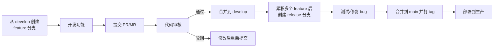
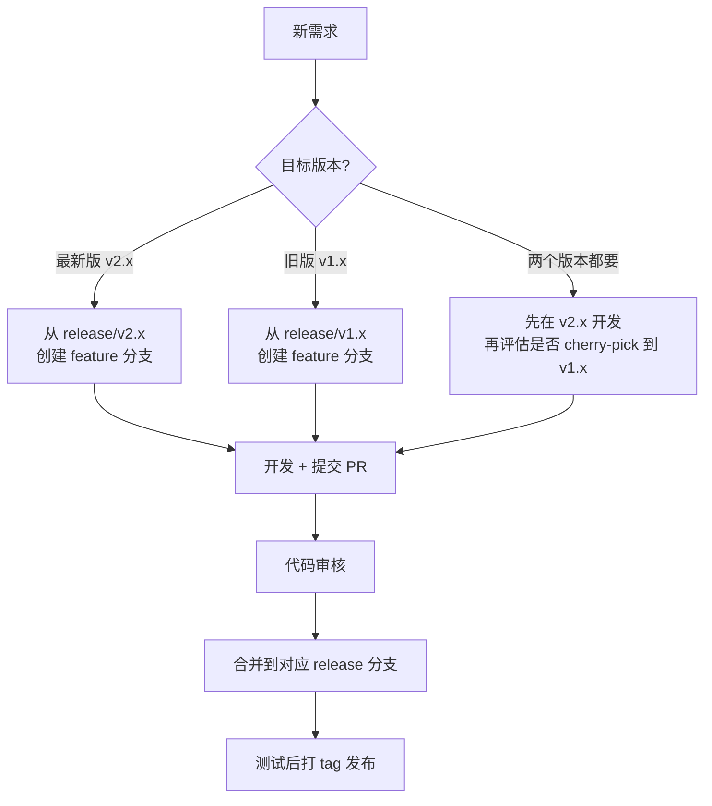
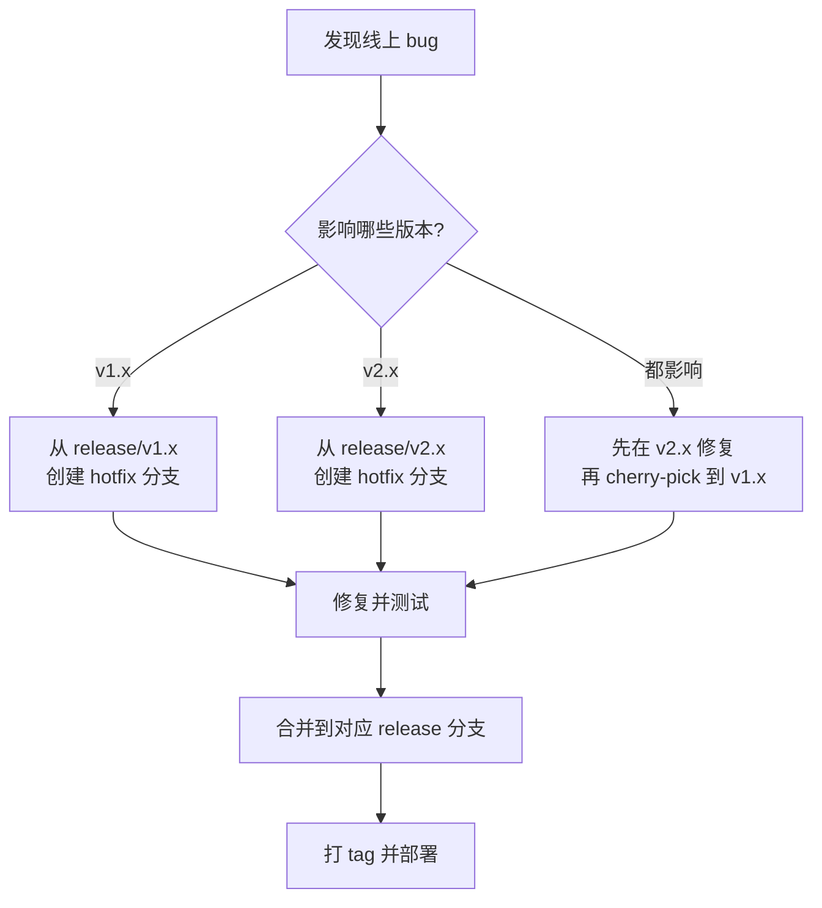

## 为什么需要 Git Flow

团队协作中，代码管理需要解决以下问题：

| 问题 | 说明 |
|------|------|
| 并行开发 | 多人同时开发不同功能，互不干扰 |
| 代码审核 | 确保代码质量，避免低级错误 |
| 版本管理 | 多版本并行维护，hotfix 同步 |
| 发布流程 | 可控的发布节奏，支持回滚 |

## 场景一：简单场景（单版本、单团队）

### 分支模型

```
main          ────────────────────────────────────────
                 ↗         ↗         ↗
develop       ──┼─────────┼─────────┼────────────────
                        ↗         ↗
feature/A    ──┼─────────┼         │
feature/B    ──┼─────────┼─────────┼────────────────
```

| 分支 | 说明 | 生命周期 |
|------|------|----------|
| `main` | 生产环境代码，随时可部署 | 永久 |
| `develop` | 开发主分支，集成所有功能 | 永久 |
| `feature/*` | 功能开发分支 | 临时，合并后删除 |
| `release/*` | 发布准备分支，修复发布前 bug | 临时，发布后删除 |
| `hotfix/*` | 紧急修复分支 | 临时，修复后删除 |

### 日常开发流程



### PR 审核规范

| 检查项 | 说明 |
|--------|------|
| 代码逻辑 | 功能实现是否正确 |
| 代码风格 | 是否符合团队规范 |
| 测试覆盖 | 是否有单元测试，覆盖率是否达标 |
| 性能影响 | 是否有性能退化风险 |
| 安全性 | 是否有安全漏洞风险 |

## 场景二：多版本并行

### 为什么需要多版本

- 客户不升级：部分客户停留在旧版本，需要持续维护
- 向后兼容：新版本有 breaking changes，需要保留旧版本 API
- 长期支持（LTS）：某些版本需要长期维护

### 分支模型扩展

```
main          ────────────────────────────────────────────
               ↓tag:v1.0    ↓tag:v2.0
release/v1.x  ────────────────────────────────────────────
                              ↓
release/v2.x  ────────────────────────────────────────────
```

| 分支 | 说明 |
|------|------|
| `main` | 最新稳定版本的代码，每次发布后从对应 release 分支同步，不参与日常开发 |
| `release/v1.x` | v1 系列版本维护分支 |
| `release/v2.x` | v2 系列版本维护分支 |
| `hotfix/v1.x/*` | v1 版本的紧急修复 |
| `hotfix/v2.x/*` | v2 版本的紧急修复 |

### Feature 多版本开发

新功能开发需要明确目标版本，不同版本的 feature 从对应的 release 分支创建：



```bash
# 为 v2.x 开发新功能
git checkout release/v2.x
git checkout -b feature/v2.x/user-dashboard
# 开发...
git commit -m "feat: 添加用户仪表盘"
# 提交 PR，合并到 release/v2.x

# 如果该功能也需要在 v1.x 上线
git checkout release/v1.x
git checkout -b feature/v1.x/user-dashboard
git cherry-pick <commit-hash>
# 解决可能的冲突，合并到 release/v1.x
```

**原则**：
- 新功能默认在最新版本开发，旧版本按需同步
- 如果功能依赖新版本的 API 或基础设施，不适合 cherry-pick 到旧版本，应在旧版本单独实现或不实现
- feature 分支命名带版本号（`feature/v2.x/xxx`），避免混淆目标版本

### Hotfix 多版本同步



### Cherry-pick 策略

当同一个 bug 需要修复多个版本时：

```bash
# 1. 在最新版本（v2.x）修复
git checkout release/v2.x
git checkout -b hotfix/v2.x/fix-login
# 修复代码...
git commit -m "fix: 修复登录问题"
git merge --no-ff hotfix/v2.x/fix-login

# 2. Cherry-pick 到旧版本（v1.x）
git checkout release/v1.x
git checkout -b hotfix/v1.x/fix-login
git cherry-pick <commit-hash>
# 可能有冲突，手动解决
git merge --no-ff hotfix/v1.x/fix-login
```

**原则**：
- 优先在最新版本修复，再 cherry-pick 到旧版本
- 如果旧版本代码差异大，cherry-pick 冲突多，则在每个版本分别修复

## 分支命名规范

| 分支类型 | 命名格式 | 示例 |
|----------|----------|------|
| 功能分支 | `feature/<功能描述>` | `feature/user-login` |
| 发布分支 | `release/<版本号>` | `release/v2.1.0` |
| 修复分支 | `hotfix/<版本>/<问题描述>` | `hotfix/v2.1/fix-login` |

## Commit Message 规范

采用 [Conventional Commits](https://www.conventionalcommits.org/) 规范：

```
<type>(<scope>): <subject>

<body>

<footer>
```

| Type | 说明 |
|------|------|
| `feat` | 新功能 |
| `fix` | Bug 修复 |
| `docs` | 文档变更 |
| `style` | 代码格式（不影响逻辑） |
| `refactor` | 重构 |
| `test` | 测试相关 |
| `chore` | 构建/工具变更 |

示例：

```
feat(order): 添加订单导出功能

- 支持 Excel 格式导出
- 支持按日期范围筛选

Closes #123
```

## 自动化集成

### CI/CD 集成

| 阶段 | 自动化内容 |
|------|------------|
| PR 提交 | 自动运行 lint、单元测试、构建 |
| 合并到 develop | 自动部署到测试环境 |
| 合并到 release | 自动部署到 UAT 环境 |
| 合并到 main | 自动部署到生产环境 |

### 分支保护规则

| 规则 | 说明 |
|------|------|
| 禁止直接推送 | 必须通过 PR 合并 |
| 至少 1 人审核 | PR 需要至少 1 人 approve |
| CI 通过 | 所有检查必须通过 |
| 禁止强制推送 | 防止历史被改写 |

## 最佳实践总结

1. **分支策略匹配业务**：简单项目用简单流程，多版本只在代码无法统一时才需要
2. **及时合并**：feature 分支不要长期脱离 develop，避免合并冲突
3. **小步提交**：每个 commit 只做一件事，便于 review 和回滚
4. **语义化版本**：遵循 [SemVer](https://semver.org/) 规范（MAJOR.MINOR.PATCH）
5. **自动化优先**：能自动化的流程不要手动操作（lint、测试、部署）
6. **文档同步**：分支策略和发布流程要有文档，新成员能快速上手

## 多版本的本质

### 为什么会有多版本

Web 应用天然支持即时更新，不像 App 需要下载安装包。如果只有一类客户，一个版本就够了。多版本的存在通常意味着**多类客户有不同的功能需求**：

- 客户 A 需要功能 A
- 客户 B 需要功能 B
- 两者共享基础功能 C

这本质上就是多租户场景 — "版本"强调时间维度（v1 vs v2），"租户"强调空间维度（客户 A vs 客户 B），但核心问题相同：**一套代码如何适配不同的产品形态**。

### 多版本是中间状态

多版本分支策略是在**代码层面无法统一**时的过渡方案。常见于：

- 私有化部署，代码在客户服务器上，无法远程更新
- 合同锁定，客户要求在固定版本上维护
- 产品架构尚未成熟，用分支隔离差异

当产品架构演进到足够成熟，通过 [Product Feature 架构](/engineering/product-feature)（Rule Engine + Schema 等手段）让一套代码具备多态特性后，多版本分支就不再需要了：

```
演进路径：

if-else 硬编码    →   多分支多版本    →   一套代码 + Product Feature 架构
   代码乱               分支乱                 干净
                                              ↓
                                    单版本 git flow 即可
                                    差异由规则和数据控制
```

### 最佳状态

配合 Product Feature 架构，最终只需要**单版本 git flow**：

- 一套代码，所有租户共用
- 功能差异通过 Rule Engine 的规则控制，不是通过分支
- "版本"变成产品概念（给客户看什么），不再是工程概念（跑哪份代码）
- `main` 始终指向最新代码，每次发布后更新

多版本分支只在代码确实无法统一时才需要（如私有化部署）。对于纯 SaaS 项目，目标应该是用架构手段消灭多版本，而不是用分支管理多版本。
