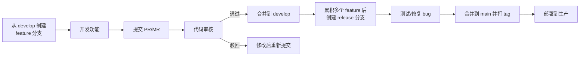
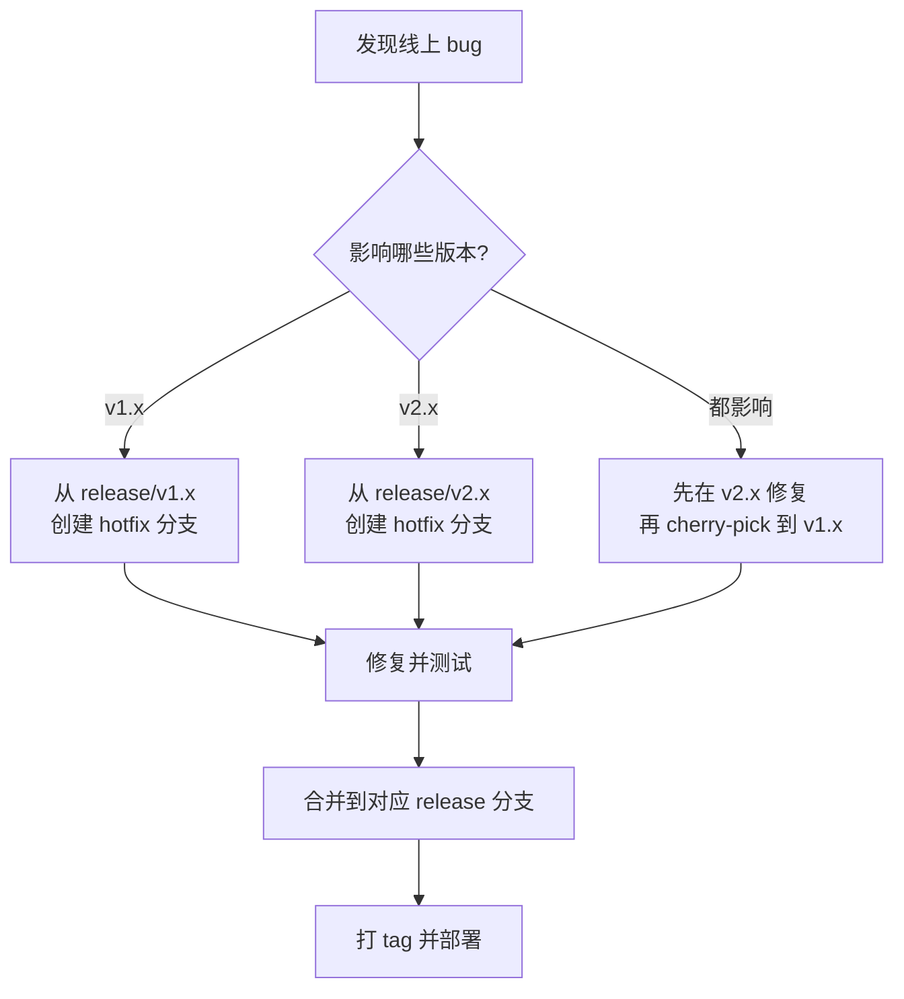
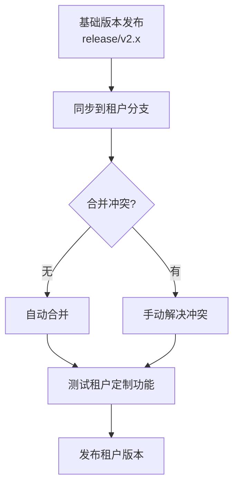

## 为什么需要 Git Flow

团队协作中，代码管理需要解决以下问题：

| 问题 | 说明 |
|------|------|
| 并行开发 | 多人同时开发不同功能，互不干扰 |
| 代码审核 | 确保代码质量，避免低级错误 |
| 版本管理 | 多版本并行维护，hotfix 同步 |
| 发布流程 | 可控的发布节奏，支持回滚 |

## 场景一：简单场景（单版本、单团队）

### 分支模型

```
main          ────────────────────────────────────────
                 ↗         ↗         ↗
develop       ──┼─────────┼─────────┼────────────────
                        ↗         ↗
feature/A    ──┼─────────┼         │
feature/B    ──┼─────────┼─────────┼────────────────
```

| 分支 | 说明 | 生命周期 |
|------|------|----------|
| `main` | 生产环境代码，随时可部署 | 永久 |
| `develop` | 开发主分支，集成所有功能 | 永久 |
| `feature/*` | 功能开发分支 | 临时，合并后删除 |
| `release/*` | 发布准备分支，修复发布前 bug | 临时，发布后删除 |
| `hotfix/*` | 紧急修复分支 | 临时，修复后删除 |

### 日常开发流程



### PR 审核规范

| 检查项 | 说明 |
|--------|------|
| 代码逻辑 | 功能实现是否正确 |
| 代码风格 | 是否符合团队规范 |
| 测试覆盖 | 是否有单元测试，覆盖率是否达标 |
| 性能影响 | 是否有性能退化风险 |
| 安全性 | 是否有安全漏洞风险 |

## 场景二：多版本并行

### 为什么需要多版本

- 客户不升级：部分客户停留在旧版本，需要持续维护
- 向后兼容：新版本有 breaking changes，需要保留旧版本 API
- 长期支持（LTS）：某些版本需要长期维护

### 分支模型扩展

```
main          ────────────────────────────────────────────
               ↓tag:v1.0    ↓tag:v2.0
release/v1.x  ────────────────────────────────────────────
                              ↓
release/v2.x  ────────────────────────────────────────────
```

| 分支 | 说明 |
|------|------|
| `main` | 最新稳定版本 |
| `release/v1.x` | v1 系列版本维护分支 |
| `release/v2.x` | v2 系列版本维护分支 |
| `hotfix/v1.x/*` | v1 版本的紧急修复 |
| `hotfix/v2.x/*` | v2 版本的紧急修复 |

### Hotfix 多版本同步



### Cherry-pick 策略

当同一个 bug 需要修复多个版本时：

```bash
# 1. 在最新版本（v2.x）修复
git checkout release/v2.x
git checkout -b hotfix/v2.x/fix-login
# 修复代码...
git commit -m "fix: 修复登录问题"
git merge --no-ff hotfix/v2.x/fix-login

# 2. Cherry-pick 到旧版本（v1.x）
git checkout release/v1.x
git checkout -b hotfix/v1.x/fix-login
git cherry-pick <commit-hash>
# 可能有冲突，手动解决
git merge --no-ff hotfix/v1.x/fix-login
```

**原则**：
- 优先在最新版本修复，再 cherry-pick 到旧版本
- 如果旧版本代码差异大，cherry-pick 冲突多，则在每个版本分别修复

## 场景三：多版本多租户（SaaS）

### 租户定制化场景

SaaS 平台中，不同租户可能有定制化需求：

| 层级 | 说明 | 示例 |
|------|------|------|
| 基础版本 | 所有租户共享的核心功能 | 用户管理、订单系统 |
| 租户定制 | 特定租户的定制化功能 | 品牌 UI、特殊业务逻辑 |

### 分支模型

```
main                  ────────────────────────────────────
                      ↓
release/v2.x          ────────────────────────────────────
                      ↓
tenant/tenantA        ────────────────────────────────────
tenant/tenantB        ────────────────────────────────────
```

| 分支 | 说明 | 同步方向 |
|------|------|----------|
| `main` | 最新稳定版本 | ← |
| `release/v2.x` | 基础版本维护 | ← main |
| `tenant/tenantA` | 租户 A 定制版本 | ← release/v2.x |
| `tenant/tenantB` | 租户 B 定制版本 | ← release/v2.x |

### 同步机制



```bash
# 1. 基础版本发布后，同步到租户分支
git checkout tenant/tenantA
git merge release/v2.x

# 2. 解决冲突（如果有）
# 3. 测试租户定制功能
# 4. 发布租户版本
git tag tenantA/v2.1.0
```

### 合并冲突处理

**冲突类型**：

| 类型 | 说明 | 处理方式 |
|------|------|----------|
| 基础功能修改 | 基础版本修改了租户也修改的文件 | 保留租户定制，手动合并基础功能改进 |
| 新增文件 | 基础版本新增文件，租户也有同名文件 | 根据业务判断保留哪个 |
| 删除文件 | 基础版本删除文件，租户还在使用 | 评估租户是否需要该功能 |

**原则**：
- 租户定制优先：租户的定制化修改不应被基础版本覆盖
- 基础功能改进：基础版本的 bug 修复和性能改进应同步到租户

### 发布流程


## 分支命名规范

| 分支类型 | 命名格式 | 示例 |
|----------|----------|------|
| 功能分支 | `feature/<功能描述>` | `feature/user-login` |
| 发布分支 | `release/<版本号>` | `release/v2.1.0` |
| 修复分支 | `hotfix/<版本>/<问题描述>` | `hotfix/v2.1/fix-login` |
| 租户分支 | `tenant/<租户名>` | `tenant/tenantA` |

## Commit Message 规范

采用 [Conventional Commits](https://www.conventionalcommits.org/) 规范：

```
<type>(<scope>): <subject>

<body>

<footer>
```

| Type | 说明 |
|------|------|
| `feat` | 新功能 |
| `fix` | Bug 修复 |
| `docs` | 文档变更 |
| `style` | 代码格式（不影响逻辑） |
| `refactor` | 重构 |
| `test` | 测试相关 |
| `chore` | 构建/工具变更 |

示例：

```
feat(order): 添加订单导出功能

- 支持 Excel 格式导出
- 支持按日期范围筛选

Closes #123
```

## 自动化集成

### CI/CD 集成

| 阶段 | 自动化内容 |
|------|------------|
| PR 提交 | 自动运行 lint、单元测试、构建 |
| 合并到 develop | 自动部署到测试环境 |
| 合并到 release | 自动部署到 UAT 环境 |
| 合并到 main | 自动部署到生产环境 |

### 分支保护规则

| 规则 | 说明 |
|------|------|
| 禁止直接推送 | 必须通过 PR 合并 |
| 至少 1 人审核 | PR 需要至少 1 人 approve |
| CI 通过 | 所有检查必须通过 |
| 禁止强制推送 | 防止历史被改写 |

## 最佳实践总结

1. **分支策略匹配业务**：简单项目用简单流程，复杂项目才需要多版本多租户分支
2. **及时合并**：feature 分支不要长期脱离 develop，避免合并冲突
3. **小步提交**：每个 commit 只做一件事，便于 review 和回滚
4. **语义化版本**：遵循 [SemVer](https://semver.org/) 规范（MAJOR.MINOR.PATCH）
5. **自动化优先**：能自动化的流程不要手动操作（lint、测试、部署）
6. **文档同步**：分支策略和发布流程要有文档，新成员能快速上手
