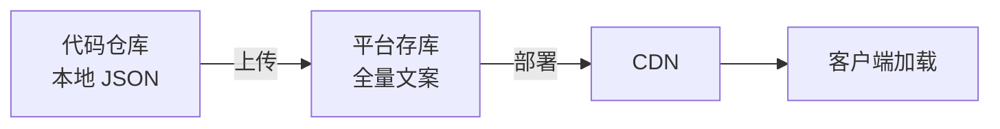
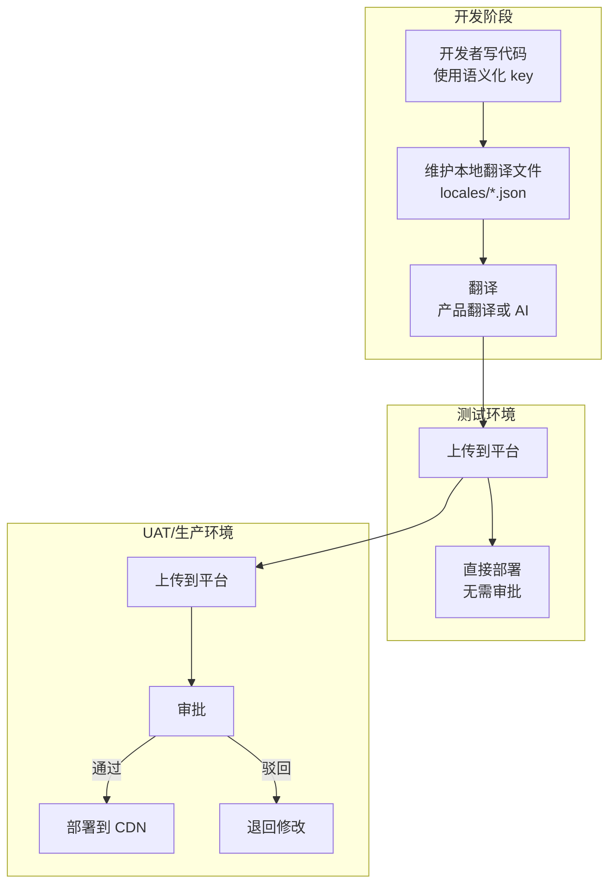
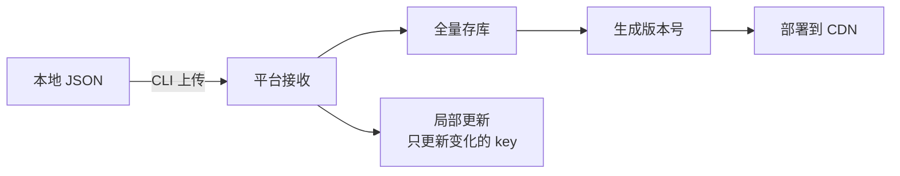
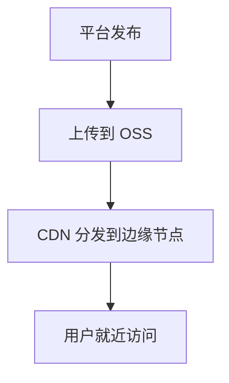

## 什么是前端国际化

国际化（i18n，internationalization 的缩写，首尾字母之间 18 个字符）是指让应用支持多语言的能力。前端国际化主要解决以下问题：

| 问题 | 说明 |
|------|------|
| 文案翻译 | 界面文本的多语言切换 |
| 日期/时间格式 | 不同地区的日期格式差异（如 MM/DD/YYYY vs DD/MM/YYYY） |
| 数字/货币格式 | 千分位符号、小数点、货币符号的差异 |
| 复数规则 | 英文有单复数，中文无复数，阿拉伯语复数规则更复杂 |
| 文本方向 | 部分语言（如阿拉伯语、希伯来语）从右到左书写（RTL） |

## 主流国际化库对比

| 方案 | 适用框架 | 特点 |
|------|----------|------|
| **Vue I18n** | Vue | Vue 官方推荐，与 Vue 深度集成，支持 Composition API，编译优化好 |
| **react-i18next** | React | 基于 i18next 的 React 绑定，React 生态最流行的 i18n 方案 |
| **react-intl** | React | FormatJS 的 React 绑定，ICU 消息语法，标准化程度高 |
| **i18next** | 框架无关 | 生态最完善，插件丰富，支持懒加载，微前端友好 |
| **next-intl** | Next.js | Next.js App Router 原生支持，服务端/客户端统一 |

**选型建议**：Vue 项目选 Vue I18n，React 项目选 react-i18next，跨框架/微前端选 i18next。

## Key 设计方案

Key 的设计是国际化工程化的核心问题，需要同时满足四个要求：**语义化**（翻译人员能看懂）、**命名空间**（按模块组织避免冲突）、**动态变量**（支持插值）、**性能好**（查找快、体积小）。

### 推荐方案：语义化 key + 本地翻译文件

开发者在代码中直接使用语义化 key，配合本地 JSON 翻译文件，通过构建工具同步到管理平台。

#### Key 格式规范

```
{namespace}.{module}.{page}.{description}
```

- **namespace**：应用或业务域标识，如 `mall`、`admin`
- **module**：功能模块，如 `order`、`user`、`product`
- **page**：页面或组件，如 `list`、`detail`、`confirm`
- **description**：文案语义描述，如 `title`、`submitBtn`、`emptyTip`

示例：

```
mall.order.confirm.title        → '确认订单'
mall.order.confirm.submitBtn    → '提交订单'
mall.order.list.emptyTip        → '暂无订单'
mall.user.profile.nickname      → '昵称'
admin.user.list.deleteConfirm   → '确定删除该用户吗？'
```

#### 开发者体验

```javascript
// 代码中直接使用语义化 key
const title = t('order.confirm.title');           // '确认订单'
const tip = t('order.confirm.submitTip');         // '确认提交此订单吗？'
const welcome = t('order.list.welcome', {         // 支持动态变量
  name: userName,
  count: orderCount,
});

// 本地翻译文件 locales/zh-CN/order.json
{
  "order": {
    "confirm": {
      "title": "确认订单",
      "submitTip": "确认提交此订单吗？"
    },
    "list": {
      "welcome": "你好，{name}，你有 {count} 个订单",
      "emptyTip": "暂无订单"
    }
  }
}
```

#### 一词多译

有了命名空间，一词多译天然解决——不同上下文使用不同的 key 路径即可：

```javascript
// 命名空间区分
t('menu.open');     // '打开'（菜单项）
t('button.open');   // '开启'（操作按钮）
```

## 国际化管理平台设计

### 核心设计原则

**文案源唯一化**：代码仓库中的本地 JSON 文件是唯一真相源，平台只负责接收、存储和部署。



### 平台定位

平台不需要设计得太复杂，核心功能就三个：

| 功能 | 说明 | 必选 |
|------|------|------|
| 文案上传 | 接收本地 JSON，全量存库 | 是 |
| CDN 部署 | 发布后推送到 CDN | 是 |
| 审批流程 | 上传后 deploy 前审批 | 可选（仅 uat+ 环境） |
| 租户定制化 | 覆盖基础文案 | 可选（SaaS 场景） |

### 工作流程



**关键约束**：
- 测试通过后，基础文案冻结，不再修改
- 换环境（test → uat）时，用代码仓库的本地 JSON 重新上传
- 唯一会持续更新的是租户定制化文案（如果有）

### 文案同步

上传时全量文案存库，支持局部更新：



- **全量存库**：每次上传都将完整文案存入数据库，保证数据完整性
- **局部更新**：支持只上传变化的 key，提升测试阶段效率
- **版本管理**：每次上传生成新版本，支持回滚

### 租户定制化（可选）

SaaS 场景下，不同租户可能需要不同的文案（如品牌名、行业术语）：

```
加载优先级：租户定制化 > 基础文案
```

```javascript
// 加载策略
async function loadI18n(tenantId, locale, namespace) {
  // 1. 加载基础文案
  const base = await fetch(`/i18n/base/${locale}/${namespace}.json`);
  // 2. 加载租户定制化（覆盖基础）
  const tenant = await fetch(`/i18n/${tenantId}/${locale}/${namespace}.json`);
  return tenant ? deepMerge(base, tenant) : base;
}
```

| 层级 | 说明 | 谁管理 |
|------|------|--------|
| 基础文案 | 所有租户共享 | 开发团队（本地 JSON） |
| 租户定制化 | 特定租户的定制文案 | 租户管理员（平台操作） |

### 文案定位与调试

**问题**：如何快速找到页面上某段文字对应的 key？

#### 方案一：调试模式 key 标注

```javascript
// 调试模式下，t() 函数返回带标注的文本
// 正常模式：'确认订单'
// 调试模式：'[order.confirm.title] 确认订单'

function t(key, ...args) {
  const text = originalT(key, ...args);
  if (isDebugMode) {
    return `[${key}] ${text}`;
  }
  return text;
}
```

#### 方案二：浏览器插件 / DevTools 面板

- **hover 高亮**：鼠标悬停展示对应 key
- **点击跳转**：点击文案跳转到管理平台编辑页
- **key 搜索**：在 DevTools 中搜索 key 定位 DOM 元素

#### 方案三：管理平台翻转视图

| 正常视图 | 翻转视图 |
|----------|----------|
| key → 文案 | 文案 → key |
| 按 key 排序 | 按文案排序 |

### 部署方案

#### CDN 部署



**语言包 URL 设计**：

```
https://cdn.example.com/i18n/{tenantId}/{locale}/{namespace}.json

示例：
https://cdn.example.com/i18n/base/zh-CN/order.json
https://cdn.example.com/i18n/tenantA/zh-CN/order.json
```

**缓存策略**：

| 策略 | 说明 |
|------|------|
| 版本号隔离 | URL 含版本号，新版本自动失效旧缓存 |
| 长期缓存 | 已发布语言包设置 `Cache-Control: max-age=31536000, immutable` |
| 按需加载 | 只加载当前语言 + 当前模块 |

**容灾方案**：

```javascript
async function loadLocale(tenantId, locale, namespace) {
  try {
    // 1. 优先从 CDN 加载
    const res = await fetch(
      `https://cdn.example.com/i18n/${tenantId}/${locale}/${namespace}.json`,
      { signal: AbortSignal.timeout(3000) }
    );
    return await res.json();
  } catch {
    try {
      // 2. CDN 失败，回源到业务服务器
      const res = await fetch(`/api/i18n/${locale}/${namespace}`);
      return await res.json();
    } catch {
      // 3. 全部失败，使用本地兜底翻译
      return fallbackMessages[locale];
    }
  }
}
```

### 缺失翻译检测

```bash
# CI 中运行检测命令
$ npm run i18n:check

Missing translations detected:
  - order.confirm.tip: missing in [ja, ko, zh-TW]
  - user.profile.nickname: missing in [ar]

Total: 2 keys missing in 4 locales
```

## 最佳实践

1. **语言包按需加载**：按模块拆分语言包，只加载当前页面需要的部分
2. **文案源唯一化**：语言包由代码仓库统一管理（本地 JSON），不硬编码在组件中
3. **CI/CD 集成**：构建时自动检测缺失翻译、未使用的 key、术语不一致
4. **日期/数字用 Intl API**：使用浏览器原生的 `Intl.DateTimeFormat`、`Intl.NumberFormat`，不要手写格式化
5. **RTL 支持**：使用 CSS 逻辑属性（`margin-inline-start` 替代 `margin-left`），配合 `dir="rtl"` 属性
6. **基础文案冻结**：测试通过后基础文案不再修改，如需变更需重新走完整流程（修改本地 JSON → 上传 → 审批 → 部署）
7. **本地兜底翻译**：在代码中打包一份基础翻译作为兜底，CDN 全部挂掉时仍可用
