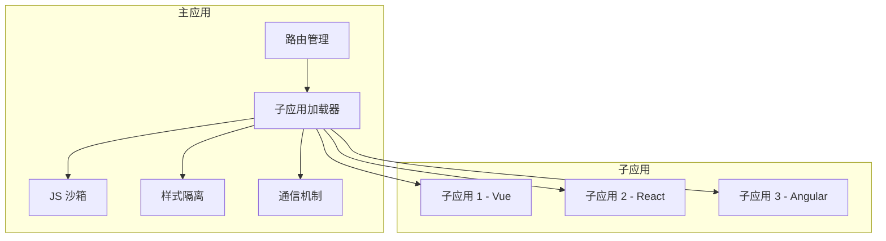

# 微前端架构

微前端是一种将大型前端应用拆分成多个独立子应用的架构方案，每个子应用可以独立开发、独立部署、独立运行。

## 什么是微前端

### 定义

微前端（Micro Frontends）是将微服务架构思想应用到前端领域的架构模式。它将一个大型单体前端应用拆分成多个小型、独立的子应用，这些子应用可以：

- **独立开发**：不同团队使用不同技术栈
- **独立部署**：每个子应用单独发布
- **独立运行**：子应用可以单独访问，也可以组合运行

### 与微服务的关系

```
后端：微服务架构
├── 用户服务
├── 订单服务
└── 支付服务

前端：微前端架构
├── 用户中心（子应用）
├── 订单管理（子应用）
└── 支付中心（子应用）
```

**对应关系**：每个微服务对应一个前端子应用，前后端都按业务域拆分。

### 架构图



## 为什么需要微前端

### 巨石应用的问题

| 问题 | 说明 |
|------|------|
| **构建慢** | 代码量大，构建时间长 |
| **部署风险** | 一个小改动需要部署整个应用 |
| **技术栈固化** | 难以迁移到新技术 |
| **团队协作** | 多团队修改同一代码库，冲突多 |
| **代码维护** | 历史包袱重，难以重构 |

### 微前端的价值

1. **技术栈无关**：不同子应用可以用不同框架（Vue、React、Angular）
2. **独立部署**：每个子应用单独发布，降低风险
3. **渐进式重构**：老项目可以逐步迁移，不需要一次性重写
4. **团队自治**：不同团队独立开发，互不干扰
5. **业务整合**：统一入口，统一权限，统一交互风格

## 微前端的核心特性

一个好的微前端架构应具备以下特性：

| 特性 | 说明 |
|------|------|
| **框架无关** | 支持 Vue、React、Angular 等不同技术栈 |
| **独立开发部署** | 子应用可以独立运行，也可以组合运行 |
| **JS 沙箱隔离** | 子应用之间 JS 变量不冲突 |
| **样式隔离** | 子应用样式不互相污染 |
| **通信机制** | 主子应用、子子应用之间可以通信 |
| **易于接入** | 子应用改造成本低 |
| **性能优秀** | 加载快，切换流畅 |
| **生态完善** | 社区活跃，持续维护 |

## 为什么不直接用 iframe

iframe 是浏览器原生的硬隔离方案，但有以下问题：

### iframe 的优点

- **硬隔离**：JS、CSS 完全隔离
- **简单**：浏览器原生支持

### iframe 的缺点

| 缺点 | 说明 |
|------|------|
| **路由不同步** | 浏览器前进后退无法作用于子应用 |
| **DOM 割裂** | 弹窗、下拉框等无法跨 iframe 显示 |
| **通信困难** | 需要 postMessage，需定义规范 |
| **加载慢** | 每次都要重新加载资源，白屏时间长 |
| **无法预加载** | 不能提前缓存 iframe 内容 |
| **性能差** | 多个 iframe 保活时内存占用高 |

## 主流方案对比

### single-spa

**定位**：微前端**路由框架**（不是完整解决方案）  
**官网**：https://single-spa.js.org/

**核心能力**：

| 能力 | 说明 |
|------|------|
| **路由分发** | 根据 URL 加载/卸载对应的子应用 |
| **子应用生命周期** | 定义 `bootstrap`、`mount`、`unmount` 钩子 |
| **技术栈无关** | 支持 Vue、React、Angular 等混用 |
| **懒加载** | 按需加载子应用资源 |

**不提供的能力**（需要自己实现或借助其他库）：

- ❌ JS 沙箱隔离
- ❌ 样式隔离
- ❌ 主子应用通信机制
- ❌ 预加载/预执行

**简单示例**：

```javascript
import { registerApplication, start } from 'single-spa'

// 注册子应用
registerApplication({
  name: 'vueApp',
  app: () => import('./vue-app/main.js'),
  activeWhen: '/vue'  // 路由匹配时加载
})

registerApplication({
  name: 'reactApp',
  app: () => import('./react-app/main.js'),
  activeWhen: '/react'
})

// 启动
start()
```

**适用场景**：想要完全自定义隔离方案、通信机制的团队。

**与 qiankun 的关系**：qiankun 在 single-spa 基础上封装了 JS 沙箱、样式隔离、预加载等能力，开箱即用。

### qiankun（乾坤）

**出品**：蚂蚁集团  
**基础**：基于 single-spa  
**GitHub Stars**：20k+

**优点**：
- 社区强大，生态完善
- 与 Umi 整套体系兼容
- 文档齐全

**缺点**：
- 改造成本较高（需要配置 webpack）
- 不支持保活（切换子应用会销毁，但社区已有 [qiankun-keep-alive](https://github.com/chenbj5515/qiankun-keep-alive) 等方案可实现子应用缓存）
- JS 沙箱有性能损耗（快照/代理）
- CSS 隔离不彻底（严格模式有兼容问题）

### micro-app

**出品**：京东  
**基础**：Web Component + qiankun sandbox

**优点**：
- 接入成本比 qiankun 低
- 基于 Web Component，DOM 隔离好

**缺点**：
- 多应用激活后无法保持状态
- CSS 无法绝对隔离
- 不支持 Web Component 的浏览器无降级方案
- Vite 支持不完善（JS 沙箱失效）

### EMP

**出品**：社区  
**基础**：Webpack 5 Module Federation

**优点**：
- 去中心化，模块共享
- 基于 webpack5 原生能力

**缺点**：
- 版本管理复杂（类似 npm）
- 无 JS/CSS 隔离
- 无保活机制
- 只能用于 webpack 项目，旧项目升级成本高

### 无界（wujie）

**出品**：腾讯  
**基础**：Web Component + iframe  
**官网**：https://wujie-micro.github.io/doc/

**优点**：
- 改造成本最低（只需支持跨域）
- JS 隔离性好（iframe 天然隔离）
- 支持保活
- 兼容 IE
- 支持 Vite
- 首屏加载快（预加载 + 预执行）

**缺点**：
- 基于 iframe，有 iframe 的部分缺点
- 跨域要求（子应用必须支持跨域）

**核心原理**：
- **JS 隔离**：子应用 JS 在 iframe 运行，通过 Proxy 劫持 document
- **DOM 隔离**：子应用 DOM 在 Web Component 的 Shadow DOM 中
- **路由同步**：劫持 history.pushState，同步到主应用 URL 参数

### Module Federation（模块联邦）

**出品**：Webpack 官方  
**基础**：Webpack 5 原生支持

**优点**：
- 去中心化，无需主应用
- 模块级共享（组件、工具库）
- 运行时依赖共享

**缺点**：
- 只能用于 webpack 5+ 项目
- 无 JS/CSS 隔离
- 无保活机制
- 版本管理复杂

### 对比表格

| 方案 | 隔离性 | 保活 | 接入成本 | Vite 支持 | 社区活跃度 |
|------|--------|------|---------|----------|-----------|
| **qiankun** | 中 | ❌ | 中 | ⚠️ | ⭐⭐⭐⭐⭐ |
| **micro-app** | 中 | ❌ | 低 | ⚠️ | ⭐⭐⭐⭐ |
| **EMP** | 低 | ❌ | 高 | ❌ | ⭐⭐⭐ |
| **无界** | 高 | ✅ | 低 | ✅ | ⭐⭐⭐⭐ |
| **Module Federation** | 低 | ❌ | 中 | ❌ | ⭐⭐⭐⭐ |

## JS 沙箱隔离实现

### 基本手段

| 方案 | 原理 | 隔离性 | 性能 |
|------|------|--------|------|
| **eval** | 在独立作用域执行代码 | 低 | 中 |
| **with** | 扩展作用域链 | 中 | 中 |
| **Proxy** | 代理 window 对象 | 高 | 高 |

### 单实例沙箱

**方案**：Proxy + 快照

```javascript
class Sandbox {
  constructor() {
    this.proxy = new Proxy(window, {
      set(target, prop, value) {
        // 记录子应用修改的属性
        this.modifiedProps[prop] = value;
        return true;
      }
    });
  }
  
  // 激活时快照
  activate() {
    this.snapshot = { ...window };
  }
  
  // 卸载时还原
  deactivate() {
    Object.keys(this.modifiedProps).forEach(key => {
      delete window[key];
    });
    Object.assign(window, this.snapshot);
  }
}
```

### 多实例沙箱

**方案**：每个子应用维护独立的 fakeWindow

**核心思路**：每个子应用创建独立的 `MultiSandbox` 实例，每个实例有自己的 `fakeWindow`，互不干扰。

```javascript
class MultiSandbox {
  constructor() {
    this.fakeWindow = {}; // 每个子应用独立的上下文
  }
  
  getProxy() {
    return new Proxy(this.fakeWindow, {
      get(target, prop) {
        // 先从 fakeWindow 找，找不到再到 window
        return prop in target ? target[prop] : window[prop];
      },
      set(target, prop, value) {
        // 所有属性都设置到 fakeWindow
        target[prop] = value;
        return true;
      }
    });
  }
}

// 使用：每个子应用创建独立的沙箱实例
const app1Sandbox = new MultiSandbox()  // app1 的 fakeWindow
const app2Sandbox = new MultiSandbox()  // app2 的 fakeWindow

const app1Proxy = app1Sandbox.getProxy()
const app2Proxy = app2Sandbox.getProxy()

app1Proxy.name = 'App1'  // 设置到 app1 的 fakeWindow
app2Proxy.name = 'App2'  // 设置到 app2 的 fakeWindow

console.log(app1Proxy.name)  // 'App1'
console.log(app2Proxy.name)  // 'App2'
```

### 为什么多实例方案更优？

| 对比项 | 单实例（快照） | 多实例（fakeWindow） |
|--------|--------------|---------------------|
| **性能** | 需要快照/还原，有开销 | 无需快照，性能更好 |
| **并发** | 同一时间只能运行一个子应用 | 多个子应用可同时运行 |
| **实现** | 需要记录修改、还原逻辑 | 天然隔离，逻辑简单 |
| **现代框架** | 仅作为降级方案 | qiankun、micro-app 默认方案 |

**结论**：优先使用多实例 fakeWindow 方案，单实例快照方案仅在浏览器不支持 Proxy 时作为降级使用。

### 降级方案

当浏览器不支持 Proxy 时，使用 **diff + 快照**：

```javascript
class LegacySandbox {
  activate() {
    // 给 window 拍照
    this.snapshot = { ...window };
  }
  
  deactivate() {
    // diff 找出修改的属性
    const modified = {};
    for (let key in window) {
      if (window[key] !== this.snapshot[key]) {
        modified[key] = window[key];
      }
    }
    
    // 还原 window
    Object.assign(window, this.snapshot);
    
    // 记录修改，下次激活时快速还原
    this.modified = modified;
  }
}
```

**注意**：降级方案只能支持单实例（多个子应用会冲突）。

## 样式隔离实现

### 方案对比

| 方案 | 原理 | 隔离性 | 性能 | 兼容性 |
|------|------|--------|------|--------|
| **CSS Modules** | 类名哈希化 | 中 | 高 | 好 |
| **CSS Scoped** | 属性选择器 | 中 | 高 | 好 |
| **Shadow DOM** | 浏览器原生隔离 | 高 | 中 | 一般 |
| **CSS 前缀** | 手动加命名空间 | 低 | 高 | 好 |
| **动态加载/卸载** | 子应用激活时插入样式，卸载时移除 | 中 | 中 | 好 |

### CSS Modules

**原理**：编译时给类名加哈希，避免冲突。

```css
/* 源码 */
.title { color: red; }

/* 编译后 */
.title_abc123 { color: red; }
```

**实现方式**：依赖构建工具（Webpack、Vite、Rollup 等）

```javascript
// Webpack 配置
module.exports = {
  module: {
    rules: [
      {
        test: /\.css$/,
        use: [
          'style-loader',
          {
            loader: 'css-loader',
            options: {
              modules: {
                localIdentName: '[name]_[hash:base64:5]'  // 类名格式
              }
            }
          }
        ]
      }
    ]
  }
}
```

**React 中使用**：

```jsx
// styles.module.css
.title { color: red; }
.btn { background: blue; }

// Component.jsx
import styles from './styles.module.css'

function Component() {
  return (
    <div>
      <h1 className={styles.title}>Hello</h1>  {/* 编译后：title_abc123 */}
      <button className={styles.btn}>Click</button>
    </div>
  )
}
```

**Vite 中**：开箱即用，无需配置，`.module.css` 文件自动启用 CSS Modules。

**优点**：性能好，兼容性强，React 生态标配  
**缺点**：只能隔离类名，无法隔离标签选择器（如 `div`、`h1`）

### CSS Scoped（Vue 风格）

**原理**：给 DOM 元素加唯一属性，CSS 选择器也加对应属性选择器。

```html
<!-- 编译前 -->
<div class="title">Hello</div>
<style>.title { color: red; }</style>

<!-- 编译后 -->
<div class="title" data-v-abc123>Hello</div>
<style>.title[data-v-abc123] { color: red; }</style>
```

**Vue 中**：开箱即用，`<style scoped>` 自动处理。

```vue
<template>
  <div class="title">Hello</div>
</template>

<style scoped>
.title { color: red; }  /* 自动变成 .title[data-v-xxx] */
</style>
```

**非 Vue 应用如何实现**：

方案 1：**PostCSS 插件**（推荐）

```javascript
// postcss.config.js
module.exports = {
  plugins: [
    require('postcss-scoped')({
      attribute: 'data-scope',  // 自定义属性名
      hash: 'abc123'            // 唯一标识
    })
  ]
}
```

方案 2：**Webpack 插件**

```javascript
// webpack.config.js
const ScopedCssPlugin = require('scoped-css-webpack-plugin')

module.exports = {
  plugins: [
    new ScopedCssPlugin({
      attribute: 'data-scope',
      hash: 'abc123'
    })
  ]
}
```

方案 3：**运行时动态添加**（微前端框架常用）

```javascript
function scopeStyles(container, styles, scopeId) {
  // 给容器加属性
  container.setAttribute(`data-scope-${scopeId}`, '')
  
  // 重写 CSS 选择器
  const scopedStyles = styles.replace(/([^{}]+)\{/g, (match, selector) => {
    const scoped = selector.split(',').map(s => 
      `${s.trim()}[data-scope-${scopeId}]`
    ).join(', ')
    return `${scoped} {`
  })
  
  // 插入样式
  const styleEl = document.createElement('style')
  styleEl.textContent = scopedStyles
  container.appendChild(styleEl)
}

// 使用
scopeStyles(
  document.getElementById('app'),
  '.title { color: red; }',
  'abc123'
)
```

**优点**：实现简单，兼容性好  
**缺点**：无法隔离全局样式（如 `body`、`*`），子应用无法影响父应用样式

### Shadow DOM

**原理**：浏览器原生的 DOM 隔离机制，样式天然隔离。

```javascript
// 创建 Shadow DOM
const shadow = element.attachShadow({ mode: 'open' })

// 样式只作用于 Shadow DOM 内部
shadow.innerHTML = `
  <style>
    .title { color: red; }  /* 只影响 Shadow 内的 .title */
  </style>
  <div class="title">Hello</div>
`
```

**优点**：隔离性最强，样式完全独立  
**缺点**：
- 弹窗、下拉框等无法突破 Shadow 边界显示
- 部分全局样式（如字体、重置样式）需要手动穿透
- 旧浏览器兼容性差

**样式穿透**（让父应用样式影响子应用）：

```css
/* 父应用 */
::slotted(.title) {
  color: blue;  /* 影响子应用中 slot 里的 .title */
}
```

### 动态加载/卸载

**原理**：子应用激活时插入 `<style>` 或 `<link>`，卸载时移除。

```javascript
class StyleIsolation {
  constructor() {
    this.styleElements = new Map()  // 记录每个子应用的样式
  }
  
  // 子应用激活时
  mount(appName, styles) {
    const styleEl = document.createElement('style')
    styleEl.textContent = styles
    document.head.appendChild(styleEl)
    this.styleElements.set(appName, styleEl)
  }
  
  // 子应用卸载时
  unmount(appName) {
    const styleEl = this.styleElements.get(appName)
    if (styleEl) {
      styleEl.remove()  // 移除样式
      this.styleElements.delete(appName)
    }
  }
}
```

**优点**：实现简单，兼容性好  
**缺点**：
- 多个子应用同时激活时样式会冲突
- 只能隔离样式文件，无法隔离内联样式

### qiankun 的样式隔离方案

qiankun 提供两种模式：

```javascript
// 1. 实验性严格模式（基于 Shadow DOM）
start({ sandbox: { strictStyleIsolation: true } })

// 2. 实验性 Scoped 模式（基于属性选择器）
start({ sandbox: { experimentalStyleIsolation: true } })
```

**严格模式**：
- 每个子应用包裹在 Shadow DOM 中
- 隔离性最强，但有 Shadow DOM 的所有限制

**Scoped 模式**：
- 给子应用容器加唯一类名（如 `.qiankun-micro-app`）
- 重写 CSS 选择器，加上容器类名前缀
- 例如 `.title` → `.qiankun-micro-app .title`

### 选型建议

| 场景 | 推荐方案 |
|------|---------|
| **需要最强隔离** | Shadow DOM |
| **兼容旧浏览器** | CSS Scoped 或动态加载/卸载 |
| **Vue 项目** | CSS Scoped（内置支持） |
| **React 项目** | CSS Modules 或 Shadow DOM |
| **快速接入** | qiankun 的 Scoped 模式 |

## 选型建议

| 场景 | 推荐方案 |
|------|---------|
| **新项目，webpack 技术栈** | qiankun 或 Module Federation |
| **老项目渐进式迁移** | 无界（改造成本最低） |
| **需要保活场景** | 无界 |
| **需要支持 Vite** | 无界 |
| **需要支持 IE** | 无界 |
| **团队技术实力强** | micro-app 或自研 |

### 决策流程

```
需要微前端？
├── 是 → 需要保活？
│       ├── 是 → 无界
│       └── 否 → 技术栈？
│               ├── webpack → qiankun
│               ├── vite → 无界
│               └── 混合 → 无界
└── 否 → 考虑单体应用或 Module Federation
```

## 总结

| 要点 | 说明 |
|------|------|
| **微前端价值** | 解决巨石应用问题，支持渐进式重构 |
| **核心特性** | 框架无关、独立部署、沙箱隔离、通信机制 |
| **主流方案** | qiankun、无界、micro-app、Module Federation |
| **选型关键** | 保活、Vite 支持、IE 兼容、接入成本 |
