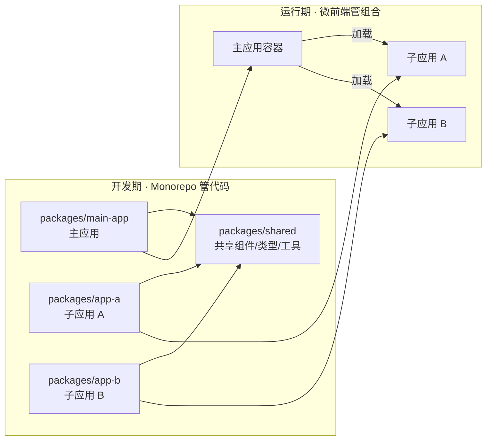

# Monorepo 介绍与实践

Monorepo（单一仓库）是一种将多个项目/包放在同一个 Git 仓库中管理的策略。

## 一句话总结

**Monorepo 不是银弹，是取舍**——用仓库复杂度换协作效率，适合多包项目但需要工具链支持。

## 为什么需要 Monorepo

### 多包项目的痛点

假设你有一个组件库 + 一个工具库 + 一个示例应用：

```
传统多仓库（Multirepo）：
  component-lib/     ← 仓库 1
  utils/             ← 仓库 2
  demo-app/          ← 仓库 3

问题：
  - 跨仓库依赖管理麻烦（npm link / 发布到 npm）
  - 代码复用困难（复制粘贴 or 发版）
  - 统一构建/测试配置重复
  - PR 涉及多个仓库时无法原子提交
```

### Monorepo 的优势

```
Monorepo：
  packages/
    component-lib/   ← 包 1
    utils/           ← 包 2
    demo-app/        ← 包 3

优势：
  - 跨包依赖本地引用（即时生效）
  - 代码复用简单（直接 import）
  - 统一工具链（构建/测试/ lint）
  - 原子提交（一个 PR 改多个包）
  - 统一版本管理（可选）
```

## Monorepo vs Multirepo

| 维度 | Monorepo | Multirepo |
|------|---------|-----------|
| **仓库数量** | 1 个 | 多个 |
| **依赖管理** | 本地引用 / 工具链 | npm 发布 / npm link |
| **代码复用** | 直接 import | 发版 or link |
| **构建配置** | 统一 | 每个仓库独立 |
| **权限控制** | 粗粒度（仓库级） | 细粒度（仓库级） |
| **CI/CD** | 需按需构建 | 独立构建 |
| **适合场景** | 多包项目、组件库、微前端 | 独立项目、团队隔离 |

## Monorepo 与微前端的关系

一句话：**两者是不同维度的问题，但常常被混为一谈。**

- **Monorepo 是"代码怎么放"**——开发期/构建期的仓库组织策略
- **微前端是"应用怎么跑"**——运行期把多个独立部署的前端应用组合成一个页面的架构

Monorepo 解决不了微前端的运行时问题（JS 沙箱、样式隔离、应用通信），微前端也解决不了代码仓库的组织问题。



### 核心区别

| 维度 | Monorepo | 微前端 |
|------|----------|--------|
| **解决的问题** | 仓库怎么组织（开发期） | 应用怎么组合（运行期） |
| **技术栈** | pnpm / Turborepo / Nx | qiankun / Module Federation / iframe |
| **隔离粒度** | 包级（构建隔离） | 应用级（运行时沙箱） |
| **部署方式** | 不保证独立部署 | **必须**独立部署 |
| **共享代码** | 开发期直接 import | 运行时加载（如 MF 远程模块） |

### 组合矩阵

| 组合 | 适用场景 |
|------|---------|
| **Monorepo + 微前端** | 子应用同团队、共享代码诉求强（最常见组合） |
| **Multirepo + 微前端** | 子应用独立团队、独立技术栈、独立发版节奏 |
| **Monorepo 不用微前端** | 单体应用多包（组件库 + 业务应用） |
| **Multirepo 不用微前端** | 传统多项目各自为政 |

### 为什么微前端项目常配 Monorepo

1. **共享代码直达**：子应用间的组件/类型/工具函数直接 `import`，不用发 npm 包（qiankun 场景的典型痛点）
2. **原子提交**：一个 PR 同时改主应用 + 子应用 + 共享包
3. **依赖升级一次到位**：所有子应用统一升级 React/公共依赖版本，避免各应用版本漂移
4. **统一工具链**：构建、lint、测试配置一份

### 两个常见误区

❌ **"放进一个仓库就是微前端了"**
> 只是"多包管理"，没有独立部署、运行时隔离，就不是微前端。

❌ **"微前端必须用 Monorepo"**
> 子应用间共享代码少、团队完全独立时，Multirepo 更合适——Monorepo 反而会让不同技术栈的构建配置互相干扰。**共享诉求强才选 Monorepo。**

## 主流工具对比

| 工具 | 出品 | 核心能力 | 适合场景 |
|------|------|---------|---------|
| **pnpm workspace** | pnpm | 包管理 + 依赖提升 | 轻量级 Monorepo |
| **Turborepo** | Vercel | 远程缓存 + 增量构建 | 大型项目、CI 优化 |
| **Nx** | Nrwl | 全功能工具链 + 图分析 | 企业级、复杂依赖 |
| **Lerna** | 社区 | 版本管理 + 发布 | 多包发布（现推荐配合 pnpm） |
| **Rush** | Microsoft | 严格模式 + 企业级 | 超大型仓库 |

## pnpm Workspace 实践

### 1. 初始化项目

```bash
# 创建项目
mkdir my-monorepo && cd my-monorepo

# 初始化 pnpm workspace
pnpm init

# 创建 pnpm-workspace.yaml
cat > pnpm-workspace.yaml << 'EOF'
packages:
  - 'packages/*'
EOF

# 创建包目录
mkdir -p packages/utils packages/components packages/app
```

### 2. 配置包

```
packages/
  utils/
    package.json    # name: "@my/utils"
    src/
      index.ts
  components/
    package.json    # name: "@my/components"
    src/
      Button.tsx
  app/
    package.json    # name: "@my/app"
    src/
      main.tsx
```

```json
// packages/utils/package.json
{
  "name": "@my/utils",
  "version": "1.0.0",
  "main": "src/index.ts"
}
```

```json
// packages/components/package.json
{
  "name": "@my/components",
  "version": "1.0.0",
  "dependencies": {
    "@my/utils": "workspace:*"  // 本地引用
  }
}
```

### 3. 安装依赖

```bash
# 在根目录执行，pnpm 会自动处理 workspace 依赖
pnpm install
```

### 4. 运行脚本

```json
// package.json (根目录)
{
  "scripts": {
    "dev": "pnpm -r run dev",          // 递归运行所有包的 dev
    "build": "pnpm -r run build",      // 递归构建
    "test": "pnpm -r run test",        // 递归测试
    "dev:app": "pnpm --filter @my/app run dev"  // 只运行 app
  }
}
```

## Turborepo 实践

### 为什么需要 Turborepo？

pnpm workspace 解决了**依赖管理**，但没解决**构建优化**：

```
问题：
  - 每次 build 都要全量构建所有包
  - CI 上重复构建未改动的包
  - 包之间的构建顺序需要手动管理
```

### 1. 初始化 Turborepo

```bash
# 在已有 pnpm workspace 项目中
npx turbo init

# 生成 turbo.json
```

### 2. 配置 turbo.json

```json
{
  "$schema": "https://turbo.build/schema.json",
  "pipeline": {
    "build": {
      "dependsOn": ["^build"],  // 依赖其他包的 build
      "outputs": ["dist/**"]    // 缓存输出
    },
    "test": {
      "dependsOn": ["build"]    // 测试前需要构建
    },
    "dev": {
      "cache": false,           // 开发不缓存
      "persistent": true        // 长驻进程
    }
  }
}
```

### 3. 使用

```bash
# 构建（自动处理依赖顺序 + 缓存）
turbo run build

# 只构建改动的包 + 依赖它的包
turbo run build --filter=...@my/components

# 查看依赖图
turbo run build --graph
```

### 依赖关系如何工作？

Turborepo **自动分析** `package.json` 中的依赖，构建依赖图：

```json
// packages/components/package.json
{
  "dependencies": {
    "@my/utils": "workspace:*"  // ← Turborepo 知道 components 依赖 utils
  }
}
```

**构建顺序**：
```
turbo run build
  ↓
分析依赖图：components → utils
  ↓
先构建 utils（无依赖）
  ↓
再构建 components（依赖 utils）
  ↓
最后构建 app（依赖 components + utils）
```

**`turbo.json` 中的 `dependsOn`**：
```json
{
  "build": {
    "dependsOn": ["^build"]  // ^ 表示"所有依赖此包的其他包"
  }
}
```

| 语法 | 含义 |
|------|------|
| `^build` | 依赖此包的其他包的 build 任务 |
| `build` | 此包自己的 build 任务 |
| `utils#build` | 指定 utils 包的 build 任务 |

**示例**：
```
packages/
  utils/        → 无依赖，先构建
  components/   → 依赖 utils，等 utils 构建完再构建
  app/          → 依赖 components，最后构建
```

Turborepo 自动分析出这个顺序，**不需要手动配置**。

### 4. 远程缓存（团队协作）

```bash
# 登录 Turborepo
npx turbo login

# 关联仓库
npx turbo link

# CI 上自动使用远程缓存
# 别人构建过的包，本地直接下载缓存
```

## Nx 实践

### Nx 的特点

- **智能依赖分析**：自动分析包依赖图
- **受影响项目**：只构建/测试改动的包及其依赖
- **全功能工具链**：生成器、插件、E2E 测试

### 1. 初始化

```bash
npx create-nx-workspace@latest my-workspace
```

### 2. 添加包

```bash
# 添加 React 库
nx generate @nx/react:library packages/components

# 添加 Node 库
nx generate @nx/node:library packages/utils
```

### 3. 受影响项目

```bash
# 只构建改动的包及其依赖
nx affected:build

# 只测试改动的包
nx affected:test

# 查看依赖图
nx graph
```

## 版本管理策略

### 独立版本（Independent）

每个包独立版本号：

```
packages/
  utils/        → 1.2.3
  components/   → 2.0.1
  app/          → 0.5.0
```

**工具**：Changesets、Lerna

```bash
# 使用 Changesets
npx @changesets/cli init
npx @changesets/cli add      # 添加变更说明
npx @changesets/cli version  # 根据变更升级版本
npx @changesets/cli publish  # 发布到 npm
```

### 统一版本（Fixed）

所有包共享版本号：

```
packages/
  utils/        → 1.0.0
  components/   → 1.0.0
  app/          → 1.0.0
```

**工具**：Lerna（传统方式）

```bash
# Lerna 统一版本
npx lerna version  # 所有包升级到同一版本
npx lerna publish
```

## 最佳实践

### 1. 包结构规范

```
packages/
  ui/                    # 按功能域划分
    Button/
      Button.tsx
      Button.test.tsx
      index.ts
    Input/
      ...
  utils/                 # 工具库
    src/
      date.ts
      string.ts
      index.ts
  app/                   # 应用
    src/
      main.tsx
```

### 2. 依赖规则

| 规则 | 说明 |
|------|------|
| **应用依赖包** | app → components, utils |
| **包依赖包** | components → utils |
| **禁止循环依赖** | utils 不能依赖 components |
| **禁止应用被依赖** | 其他包不能依赖 app |

### 3. 构建优化

```json
// turbo.json
{
  "pipeline": {
    "build": {
      "dependsOn": ["^build"],
      "outputs": ["dist/**"],
      "cache": true
    }
  }
}
```

- **增量构建**：只构建改动的包
- **远程缓存**：团队共享构建缓存
- **并行构建**：无依赖的包同时构建

### 4. CI/CD 优化

```yaml
# GitHub Actions 示例
- name: Build
  run: turbo run build --filter=...[origin/main]
  # 只构建相对 main 分支改动的包
```

## 常见误区

❌ **Monorepo 适合所有项目**
> 单包项目用 Monorepo 是过度设计，增加复杂度。

❌ **Monorepo 性能一定差**
> 用对工具（Turborepo/Nx）+ 增量构建，性能优于多仓库。

❌ **Monorepo 无法权限控制**
> 可以用 CODEOWNERS + 目录级权限，只是不如多仓库细粒度。

 **Monorepo 必须统一版本**
> 独立版本更灵活，Changesets 是主流方案。

## 选型建议

| 场景 | 推荐方案 |
|------|---------|
| **轻量级多包项目** | pnpm workspace |
| **需要构建优化** | pnpm workspace + Turborepo |
| **企业级复杂项目** | Nx |
| **多包发布管理** | pnpm workspace + Changesets |
| **超大型仓库（100+ 包）** | Rush |

## 总结

| 要点 | 说明 |
|------|------|
| **Monorepo 本质** | 用仓库复杂度换协作效率 |
| **核心优势** | 跨包依赖、代码复用、原子提交 |
| **核心挑战** | 构建性能、工具链配置 |
| **主流工具** | pnpm workspace + Turborepo/Nx |
| **适用场景** | 多包项目、组件库、微前端 |
