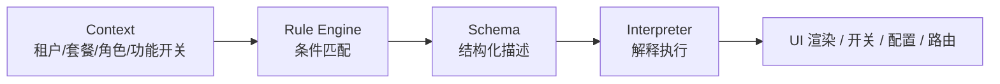

# Product Feature 架构

解决多租户 SaaS 产品中，因功能差异导致的代码膨胀问题。通过 Rule Engine + Schema 等手段，让一套代码具备多态特性，不同租户/套餐/功能开关看到不同的产品形态。

## 问题：巨石代码

多租户 SaaS 中，不同租户/套餐/功能开关导致同一页面有多种表现。最直观的实现方式是 if-else：

```typescript
function OrderDetail({ tenant, plan, features }) {
  return (
    <div>
      <OrderHeader />

      {/* 企业版才显示分析面板 */}
      {plan === 'enterprise' && <AnalyticsPanel />}

      {/* 租户 A 的定制计价逻辑 */}
      {tenant === 'tenantA' ? (
        <PriceCalculator type="bulk" />
      ) : tenant === 'tenantB' ? (
        <PriceCalculator type="tiered" />
      ) : (
        <PriceCalculator type="standard" />
      )}

      {/* 功能开关控制导出按钮 */}
      {features.includes('export') && <ExportButton />}

      {/* 租户 B 独有的审核流程 */}
      {tenant === 'tenantB' && <AuditFlow />}

      <OrderFooter />
    </div>
  );
}
```

租户和特性越多，if-else 越深，最终变成无法维护的巨石代码。新增一个租户要改几十个文件，改一处可能影响其他租户。

## 核心思路

把"变"的部分从代码里抽出来，用数据描述。架构只保留三个概念：

```
Context（当前是谁）→ Rule Engine（匹配规则）→ Schema（描述结果）→ Interpreter（解释执行）
```



- **Context**：描述当前环境（哪个租户、什么套餐、开了哪些功能）
- **Rule Engine**：根据 Context 匹配规则，返回对应的 Schema
- **Schema**：结构化数据，描述"要什么"
- **Interpreter**：解释 Schema，执行具体动作

四个组件各司其职，Rule Engine 不关心结果是什么，Interpreter 不关心条件是什么。

## Context

一个普通对象，描述"当前状态"。业务需要什么维度就加什么字段：

```typescript
interface Context {
  tenant: string;       // 租户标识
  plan: string;         // 套餐：basic / pro / enterprise
  features: string[];   // 已开通的功能列表
  role: string;         // 用户角色
  region: string;       // 区域
  // 无限扩展，按需添加
}
```

Context 通常从登录态、租户配置、功能开关服务中组装，在应用初始化时注入全局。

## Rule Engine

核心是一个**带优先级的条件匹配表**。只有三种节点：

```typescript
// 匹配项：某个字段满足某个条件
type MatchCondition = {
  field: string;
  op: 'eq' | 'neq' | 'in' | 'notIn' | 'exists';
  value: any;
};

// 组合项：逻辑与/或，递归组合
type ComboCondition = {
  and?: Condition[];
  or?: Condition[];
};

type Condition = MatchCondition | ComboCondition;

// 规则：条件 + 结果 + 优先级
interface Rule<T = any> {
  priority: number;    // 数字越大越优先
  condition: Condition;
  result: T;           // 命中后返回的值，类型不限
}
```

解析器不到 30 行：

```typescript
function match(condition: Condition, ctx: Context): boolean {
  if ('field' in condition) {
    const val = ctx[condition.field];
    switch (condition.op) {
      case 'eq':    return val === condition.value;
      case 'neq':   return val !== condition.value;
      case 'in':    return val?.includes(condition.value);
      case 'notIn': return !val?.includes(condition.value);
      case 'exists':return val !== undefined && val !== null;
    }
  }
  if ('and' in condition) return condition.and!.every(c => match(c, ctx));
  if ('or' in condition)  return condition.or!.some(c => match(c, ctx));
  return false;
}

function resolve<T>(ctx: Context, rules: Rule<T>[]): T {
  const sorted = [...rules].sort((a, b) => b.priority - a.priority);
  const hit = sorted.find(rule => match(rule.condition, ctx));
  return hit?.result;
}
```

## Schema

Schema 是结构化数据，描述"要什么"。它不绑定任何具体用途 — 可以描述 UI、开关、配置、路由，任何需要因租户而异的东西。

### 描述 UI

```typescript
const orderPageSchema = {
  type: 'page',
  children: [
    { type: 'header', props: { title: '订单详情' } },
    {
      type: 'table',
      props: { dataSource: '/api/orders' },
      columns: [
        { key: 'id', title: '订单号' },
        { key: 'status', title: '状态', render: 'statusTag' },
        { key: 'amount', title: '金额', render: 'price' },
      ],
    },
    { type: 'chart', props: { api: '/api/order-trend' } },
  ],
};
```

### 描述开关

```typescript
// Schema 也可以只是一个布尔值
const featureSchema = true;  // 开启
const featureSchema = false; // 关闭
```

### 描述配置

```typescript
const configSchema = {
  pageSize: 50,
  showAnalytics: true,
  allowExport: true,
  theme: { primaryColor: '#1890ff' },
};
```

## Interpreter

Interpreter 负责把 Schema 变成实际动作。不同类型的 Schema 对应不同的 Interpreter：

### UI 渲染器

```typescript
const componentRegistry: Record<string, ComponentType> = {
  page: PageLayout,
  table: DataTable,
  chart: ChartPanel,
  header: PageHeader,
};

function SchemaRenderer({ schema }: { schema: any }) {
  if (!schema) return null;

  // 原子值（布尔、字符串）直接返回
  if (typeof schema !== 'object') return schema;

  // 对象类型：从注册表找组件渲染
  const Component = componentRegistry[schema.type];
  if (!Component) return null;

  return (
    <Component {...schema.props}>
      {schema.children?.map((child: any, i: number) => (
        <SchemaRenderer key={i} schema={child} />
      ))}
    </Component>
  );
}
```

### 开关解释器

```typescript
function useFeature(featureName: string): boolean {
  const ctx = useAppContext();
  const rules = getFeatureRules(featureName);
  return resolve(ctx, rules);
}

// 使用
const canExport = useFeature('export');
if (canExport) { /* 渲染导出按钮 */ }
```

### 配置解释器

```typescript
function useConfig<T>(configName: string): T {
  const ctx = useAppContext();
  const rules = getConfigRules(configName);
  return resolve(ctx, rules);
}

// 使用
const { pageSize, showAnalytics } = useConfig<PageConfig>('order-list');
```

## 统一架构：一套机制覆盖所有场景

Rule Engine + Schema 的组合可以统一替代传统的多种方案：

| 传统方案 | 问题 | Product Feature 方案 |
|---------|------|----------------|
| **if-else 控制显隐** | 代码膨胀，改一处影响全局 | Rule 返回 UI Schema，渲染器解释 |
| **Feature Flag 库** | 只能返回布尔值，场景单一 | Rule 返回任意 Schema，开关只是其中一种 |
| **配置文件** | 配置和代码分离，难以表达复杂逻辑 | Rule 的条件组合能力覆盖复杂场景 |
| **策略模式** | 每个差异点都要定义接口和实现类 | Rule 返回策略 Schema，解释器执行 |

### 完整示例

```typescript
// ── 1. 定义规则（可存数据库，后台配置）──
const rules: Rule[] = [
  // 企业版：完整功能
  {
    priority: 100,
    condition: { field: 'plan', op: 'eq', value: 'enterprise' },
    result: {
      ui: 'order-page-full',
      features: { export: true, analytics: true, audit: true },
      config: { pageSize: 50, showTrend: true },
    },
  },
  // 专业版：部分功能
  {
    priority: 50,
    condition: { field: 'plan', op: 'eq', value: 'pro' },
    result: {
      ui: 'order-page-standard',
      features: { export: true, analytics: false, audit: false },
      config: { pageSize: 20, showTrend: false },
    },
  },
  // 基础版：最小功能
  {
    priority: 10,
    condition: { field: 'plan', op: 'eq', value: 'basic' },
    result: {
      ui: 'order-page-minimal',
      features: { export: false, analytics: false, audit: false },
      config: { pageSize: 10, showTrend: false },
    },
  },
  // 兜底
  {
    priority: 0,
    condition: { field: 'tenant', op: 'exists', value: true },
    result: {
      ui: 'order-page-default',
      features: { export: false, analytics: false, audit: false },
      config: { pageSize: 10, showTrend: false },
    },
  },
];

// ── 2. 应用层：一次匹配，处处使用 ──
function App({ ctx }: { ctx: Context }) {
  const result = resolve(ctx, rules);

  return (
    <SchemaRegistryProvider schemas={schemaMap}>
      <SchemaRenderer schema={loadSchema(result.ui)} />
    </SchemaRegistryProvider>
  );
}

// ── 3. 组件内：按需取用 ──
function OrderTable() {
  const config = useConfig('order-list');  // 复用同一套 rules
  return <DataTable pageSize={config.pageSize} />;
}

function Toolbar() {
  const canExport = useFeature('export');  // 复用同一套 rules
  return canExport ? <ExportButton /> : null;
}
```

## 规则管理

规则是纯数据，可以存储在数据库中，通过管理后台配置：

```typescript
// 规则可以按模块分组管理
const ruleModules = {
  'order-page': orderPageRules,
  'dashboard': dashboardRules,
  'feature-flags': featureRules,
  'page-configs': configRules,
};

// 后台管理界面只需要提供：
// 1. 条件编辑器（选择字段、操作符、值）
// 2. 结果编辑器（选择 Schema 或填写配置值）
// 3. 优先级排序
```

## 设计原则

1. **Rule Engine 不关心结果类型** — 返回 Schema ID、布尔值、配置对象都可以，它是一个通用的条件匹配器
2. **Schema 不绑定用途** — 同一套 Schema 格式可以描述 UI、开关、配置、路由，由不同的 Interpreter 解释
3. **Interpreter 不关心条件** — 只负责把 Schema 变成实际动作，不知道也不关心为什么选了这个 Schema
4. **规则是数据不是代码** — 存数据库、可后台配置、支持版本管理，新增租户不需要改代码
5. **优先级兜底** — 每条规则有优先级，最通用的放最低优先级作为兜底，避免未匹配时崩溃

## 适用场景

| 场景 | 适合度 | 说明 |
|------|--------|------|
| **多租户 SaaS** | ✅ 最适合 | 租户间功能差异大，需要灵活控制 |
| **多版本维护** | ✅ 适合 | 不同版本的功能范围不同 |
| **A/B 测试** | ✅ 适合 | 规则条件加个 `abGroup` 字段即可 |
| **灰度发布** | ✅ 适合 | 按租户/区域/百分比灰度 |
| **单租户标准产品** | ️ 过度设计 | 没有差异化需求时，直接写代码更简单 |
| **C 端复杂交互** | ️ 有限 | Schema 难以描述复杂的手势、动画等交互 |

## 统一决策层

Rule Engine + Context 的本质是一个**通用决策引擎** — 给定上下文，返回决策结果。只要业务中存在"根据不同条件做不同决策"的场景，都可以用它来统一。

### 替代权限系统（RBAC）

传统权限模型是"用户 → 角色 → 权限 → 资源"，维度单一，只能表达"什么角色能做什么"。用 Rule Engine 可以表达更复杂的权限逻辑：

```typescript
const permissionRules: Rule<boolean>[] = [
  // 企业版的管理员可以导出数据
  {
    priority: 100,
    condition: {
      and: [
        { field: 'role', op: 'eq', value: 'admin' },
        { field: 'plan', op: 'eq', value: 'enterprise' },
      ],
    },
    result: true,
  },
  // 租户 A 的特殊权限：普通成员也能看财务报表
  {
    priority: 80,
    condition: {
      and: [
        { field: 'tenant', op: 'eq', value: 'tenantA' },
        { field: 'role', op: 'eq', value: 'member' },
      ],
    },
    result: true,
  },
  // 兜底：未匹配的一律拒绝
  {
    priority: 0,
    condition: { field: 'role', op: 'exists', value: true },
    result: false,
  },
];

const canExport = resolve(ctx, permissionRules);
```

| 维度 | 传统 RBAC | Rule Engine 权限 |
|------|----------|-----------------|
| 判断依据 | 只有角色 | 角色 + 租户 + 套餐 + 任意字段 |
| 表达能力 | 角色→权限，一对一 | 多条件组合，支持优先级覆盖 |
| 跨租户差异 | 需要为每个租户建角色 | 一条规则搞定 |

**注意**：权限规则必须以后端为唯一数据源。前端缓存规则只用于控制 UI 显隐（性能优化），真正的权限校验必须在后端 API 层再做一次。前后端共用同一套规则数据，各自运行解析器，保证逻辑一致。

### 还能替代什么

只要符合"根据上下文做决策"这个模式，都可以纳入 Rule Engine：

| 传统方案 | 用 Rule Engine 怎么做 | 示例 |
|---------|---------------------|------|
| **Feature Flag** | Rule 返回布尔值 | `resolve(ctx, featureRules)` → true/false |
| **权限系统（RBAC）** | Rule 返回布尔值，Context 加 role | 上面已说明 |
| **A/B 测试** | Rule 条件加 `abGroup` 字段 | 不同实验组返回不同 Schema |
| **灰度发布** | Rule 条件按租户/区域/百分比 | 逐步扩大 `result` 覆盖范围 |
| **定价/计费规则** | Rule 返回价格策略 Schema | 不同套餐不同计价公式 |
| **审批流程** | Rule 返回流程 Schema | 不同金额/类型走不同审批链 |
| **数据访问控制** | Rule 返回数据过滤条件 | 不同角色看到不同数据范围 |
| **通知规则** | Rule 返回通知策略 | 什么条件下发什么通知、发给谁 |
| **配额/限流** | Rule 返回限额配置 | 不同套餐的 API 调用次数限制 |
| **国际化** | Rule 返回语言/区域配置 | 不同区域显示不同内容 |

### 统一后的架构

所有这些场景共享同一套基础设施：

```
Context（租户/角色/套餐/区域/...）
    ↓
Rule Engine（同一套解析器）
    ↓
┌──────────┬────────────────────┬──────────┐
│ UI Schema│ 权限开关  │ 定价策略  │ 审批流程  │ ...
│ Interpreter│Interpreter│Interpreter│Interpreter│
└──────────┴──────────┴──────────┴──────────┘
```

不同场景只是 Rule 的 `result` 类型不同，Interpreter 不同，**Rule Engine 和 Context 完全复用**。新增一个决策场景不需要新框架，只需要加一组规则和对应的 Interpreter。

### 规则必须放在后端

只要规则涉及权限、计费、数据访问等安全相关逻辑，就必须以后端数据库为唯一数据源：

- **后端**：规则的真实来源，API 层用规则做安全校验
- **前端**：启动时拉取规则缓存到内存，用于 UI 决策（性能优化）
- **管理后台**：配置规则数据，修改后所有端下次刷新生效

前后端共用同一套规则 JSON，各自运行解析器，保证决策逻辑一致。前端缓存过期或被篡改不影响安全，因为后端是最终防线。

## 总结

| 要点 | 说明 |
|------|------|
| **问题** | 多租户差异导致 if-else 膨胀，代码无法维护 |
| **方案** | Context → Rule Engine → Schema → Interpreter |
| **核心** | Rule Engine 是通用条件匹配器，Schema 是通用描述格式 |
| **优势** | 新增租户/功能零代码，规则可后台配置，一套机制覆盖 UI/权限/配置/路由/定价/审批等 |
| **扩展** | 可替代 Feature Flag、RBAC、A/B 测试、灰度发布、定价策略、审批流程等所有"条件决策"场景 |
| **规则存储** | 后端数据库为唯一数据源，前端缓存用于性能优化，安全校验在后端兜底 |
| **代价** | 渲染引擎和规则管理后台有初始开发成本 |
| **原则** | 把"变"的部分抽成数据，代码只保留"不变"的核心流程 |
