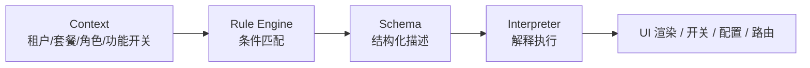

# Product Feature 架构

解决多租户 SaaS 产品中，因功能差异导致的代码膨胀问题。通过 Rule Engine + Schema 等手段，让一套代码具备多态特性，不同租户/套餐/功能开关看到不同的产品形态。

## 问题：巨石代码

多租户 SaaS 中，不同租户/套餐/功能开关导致同一页面有多种表现。最直观的实现方式是 if-else：

```typescript
function OrderDetail({ tenant, plan, features }) {
  return (
    <div>
      <OrderHeader />

      {/* 企业版才显示分析面板 */}
      {plan === 'enterprise' && <AnalyticsPanel />}

      {/* 租户 A 的定制计价逻辑 */}
      {tenant === 'tenantA' ? (
        <PriceCalculator type="bulk" />
      ) : tenant === 'tenantB' ? (
        <PriceCalculator type="tiered" />
      ) : (
        <PriceCalculator type="standard" />
      )}

      {/* 功能开关控制导出按钮 */}
      {features.includes('export') && <ExportButton />}

      {/* 租户 B 独有的审核流程 */}
      {tenant === 'tenantB' && <AuditFlow />}

      <OrderFooter />
    </div>
  );
}
```

租户和特性越多，if-else 越深，最终变成无法维护的巨石代码。新增一个租户要改几十个文件，改一处可能影响其他租户。

## 核心思路

把"变"的部分从代码里抽出来，用数据描述。架构只保留三个概念：

```
Context（当前是谁）→ Rule Engine（匹配规则）→ Schema（描述结果）→ Interpreter（解释执行）
```



- **Context**：描述当前环境（哪个租户、什么套餐、开了哪些功能）
- **Rule Engine**：根据 Context 匹配规则，返回对应的 Schema
- **Schema**：结构化数据，描述"要什么"
- **Interpreter**：解释 Schema，执行具体动作

四个组件各司其职，Rule Engine 不关心结果是什么，Interpreter 不关心条件是什么。

## Context

一个普通对象，描述"当前状态"。业务需要什么维度就加什么字段：

```typescript
interface Context {
  tenant: string;       // 租户标识
  plan: string;         // 套餐：basic / pro / enterprise
  features: string[];   // 已开通的功能列表
  role: string;         // 用户角色
  region: string;       // 区域
  // 无限扩展，按需添加
}
```

Context 通常从登录态、租户配置、功能开关服务中组装，在应用初始化时注入全局。

## Rule Engine

核心是一个**带优先级的条件匹配器**。封装成类，对外提供统一的决策接口。

### 类型定义

```typescript
// 匹配项：某个字段满足某个条件
type MatchCondition = {
  field: string;
  op: 'eq' | 'neq' | 'in' | 'notIn' | 'exists';
  value: any;
};

// 组合项：逻辑与/或，递归组合
type ComboCondition = {
  and?: Condition[];
  or?: Condition[];
};

type Condition = MatchCondition | ComboCondition;

// 规则：条件 + 结果 ID + 优先级
interface Rule {
  priority: number;    // 数字越大越优先
  condition: Condition;
  result_id: number;   // 关联 rule_result 表的 ID
}
```

### RuleEngine 类

```typescript
class RuleEngine {
  private rules: Rule[];

  constructor(rules: Rule[]) {
    // 按优先级降序排序，确保高优先级规则先匹配
    this.rules = [...rules].sort((a, b) => b.priority - a.priority);
  }

  /**
   * 根据上下文评估规则，返回命中的 result_id
   * @param context 当前上下文（租户/套餐/角色/功能开关等）
   * @returns 命中的规则结果 ID，未命中返回 null
   */
  evaluate(context: Context): number | null {
    const hit = this.rules.find(rule => this.match(rule.condition, context));
    return hit?.result_id ?? null;
  }

  /**
   * 递归匹配条件
   */
  private match(condition: Condition, context: Context): boolean {
    // 原子条件：字段匹配
    if ('field' in condition) {
      const value = context[condition.field];
      switch (condition.op) {
        case 'eq':    return value === condition.value;
        case 'neq':   return value !== condition.value;
        case 'in':    return value?.includes(condition.value);
        case 'notIn': return !value?.includes(condition.value);
        case 'exists':return value !== undefined && value !== null;
      }
    }

    // 组合条件：逻辑与
    if ('and' in condition) {
      return condition.and!.every(c => this.match(c, context));
    }

    // 组合条件：逻辑或
    if ('or' in condition) {
      return condition.or!.some(c => this.match(c, context));
    }

    return false;
  }
}
```

### 使用示例

```typescript
// 1. 创建规则引擎实例（规则可从数据库加载）
const engine = new RuleEngine(rules);

// 2. 评估决策
const resultId = engine.evaluate(context);

// 3. 根据 result_id 加载具体内容
if (resultId !== null) {
  const ruleResult = await loadRuleResult(resultId);
  const content = await loadContent(ruleResult.ref_table, ruleResult.ref_id);
}
```

**关键**：`RuleEngine` 只负责"根据上下文找到命中的规则"，返回 `result_id`。不关心结果是什么类型，也不负责加载具体内容。

## Schema

Schema 是结构化数据，描述"要什么"。它不绑定任何具体用途 — 可以描述 UI、开关、配置、路由，任何需要因租户而异的东西。

### 描述 UI

```typescript
const orderPageSchema = {
  type: 'page',
  children: [
    { type: 'header', props: { title: '订单详情' } },
    {
      type: 'table',
      props: { dataSource: '/api/orders' },
      columns: [
        { key: 'id', title: '订单号' },
        { key: 'status', title: '状态', render: 'statusTag' },
        { key: 'amount', title: '金额', render: 'price' },
      ],
    },
    { type: 'chart', props: { api: '/api/order-trend' } },
  ],
};
```

### 描述开关

```typescript
// Schema 也可以只是一个布尔值
const featureSchema = true;  // 开启
const featureSchema = false; // 关闭
```

### 描述配置

```typescript
const configSchema = {
  pageSize: 50,
  showAnalytics: true,
  allowExport: true,
  theme: { primaryColor: '#1890ff' },
};
```

## Interpreter

Interpreter 负责把 Schema 变成实际动作。不同类型的 Schema 对应不同的 Interpreter：

### UI 渲染器

```typescript
const componentRegistry: Record<string, ComponentType> = {
  page: PageLayout,
  table: DataTable,
  chart: ChartPanel,
  header: PageHeader,
};

function SchemaRenderer({ schema }: { schema: any }) {
  if (!schema) return null;

  // 原子值（布尔、字符串）直接返回
  if (typeof schema !== 'object') return schema;

  // 对象类型：从注册表找组件渲染
  const Component = componentRegistry[schema.type];
  if (!Component) return null;

  return (
    <Component {...schema.props}>
      {schema.children?.map((child: any, i: number) => (
        <SchemaRenderer key={i} schema={child} />
      ))}
    </Component>
  );
}
```

### 开关解释器

```typescript
// 简化示例：实际使用时调用后端 API
function useFeature(featureName: string): boolean {
  const ctx = useAppContext();
  const rules = getFeatureRules(featureName);
  const engine = new RuleEngine(rules);
  const resultId = engine.evaluate(ctx);

  // 根据 result_id 加载布尔值内容
  return loadBooleanContent(resultId);
}

// 使用
const canExport = useFeature('export');
if (canExport) { /* 渲染导出按钮 */ }
```

### 配置解释器

```typescript
// 简化示例：实际使用时调用后端 API
function useConfig<T>(configName: string): T {
  const ctx = useAppContext();
  const rules = getConfigRules(configName);
  const engine = new RuleEngine(rules);
  const resultId = engine.evaluate(ctx);

  // 根据 result_id 加载配置内容
  return loadConfigContent<T>(resultId);
}

// 使用
const { pageSize, showAnalytics } = useConfig<PageConfig>('order-list');
```

## 统一架构：一套机制覆盖所有场景

Rule Engine + Schema 的组合可以统一替代传统的多种方案：

| 传统方案 | 问题 | Product Feature 方案 |
|---------|------|----------------|
| **if-else 控制显隐** | 代码膨胀，改一处影响全局 | Rule 返回 UI Schema，渲染器解释 |
| **Feature Flag 库** | 只能返回布尔值，场景单一 | Rule 返回任意 Schema，开关只是其中一种 |
| **配置文件** | 配置和代码分离，难以表达复杂逻辑 | Rule 的条件组合能力覆盖复杂场景 |
| **策略模式** | 每个差异点都要定义接口和实现类 | Rule 返回策略 Schema，解释器执行 |

### 完整示例

```typescript
// ── 1. 定义规则（实际存在数据库，这里简化展示）──
const rules: Rule[] = [
  // 企业版：完整功能
  {
    priority: 100,
    condition: { field: 'plan', op: 'eq', value: 'enterprise' },
    result_id: 1,  // 指向 rule_result 表
  },
  // 专业版：部分功能
  {
    priority: 50,
    condition: { field: 'plan', op: 'eq', value: 'pro' },
    result_id: 2,
  },
  // 基础版：最小功能
  {
    priority: 10,
    condition: { field: 'plan', op: 'eq', value: 'basic' },
    result_id: 3,
  },
  // 兜底
  {
    priority: 0,
    condition: { field: 'tenant', op: 'exists', value: true },
    result_id: 4,
  },
];

// ─ 2. 应用层：创建引擎，评估决策 ──
const engine = new RuleEngine(rules);

function App({ ctx }: { ctx: Context }) {
  const resultId = engine.evaluate(ctx);  // 返回 result_id

  // 根据 result_id 查询 rule_result 表，加载具体内容
  const ruleResult = loadRuleResult(resultId);  // { result_type, ref_table, ref_id }
  const content = loadContent(ruleResult.ref_table, ruleResult.ref_id);

  return (
    <SchemaRegistryProvider schemas={schemaMap}>
      <SchemaRenderer schema={content} />
    </SchemaRegistryProvider>
  );
}

// ── 3. 组件内：按需取用（实际调用后端 API）──
function OrderTable() {
  const config = useConfig('order-list');  // 内部调用 /api/decision
  return <DataTable pageSize={config.pageSize} />;
}

function Toolbar() {
  const canExport = useFeature('export');  // 内部调用 /api/decision
  return canExport ? <ExportButton /> : null;
}
```

**注意**：实际使用时，规则存储在数据库中，通过后端 API 调用。这里简化展示 Rule Engine 的匹配逻辑。完整的数据存储和 API 设计见后文"数据存储设计"和"最佳实践"章节。

## 规则管理

规则是纯数据，可以存储在数据库中，通过管理后台配置：

```typescript
// 规则可以按模块分组管理
const ruleModules = {
  'order-page': orderPageRules,
  'dashboard': dashboardRules,
  'feature-flags': featureRules,
  'page-configs': configRules,
};

// 后台管理界面只需要提供：
// 1. 条件编辑器（选择字段、操作符、值）
// 2. 结果编辑器（选择 Schema 或填写配置值）
// 3. 优先级排序
```

## 数据存储设计

### 核心思路

Rule Engine 架构本身只关心三件事：**规则（Rule）**、**结果关联（Rule Result）**、**规则分组（Rule Module）**。至于结果指向的具体内容（Schema、配置、布尔值等），由业务层自行设计存储。

```
Context（任意 JSON，业务层定义）
    ↓
Rule（条件 + 优先级 + 指向 result_id）
    ↓
Rule Result（result_type + ref_table + ref_id，纯粹关联表）
    ↓
Content 表（业务层自定义：schema_content / config_content / boolean_content ...）
```

### 核心表

```sql
-- 规则表
CREATE TABLE rule (
  id          BIGINT PRIMARY KEY,
  module      VARCHAR(64) NOT NULL,      -- 模块标识：feature-flag / ui-schema / config
  feature_key VARCHAR(128) NOT NULL,     -- 功能/场景标识：export / order-page / order-list
  priority    INT NOT NULL DEFAULT 0,    -- 优先级，数字越大越优先
  condition   JSON NOT NULL,             -- 条件表达式（JSON 存储）
  result_id   BIGINT,                    -- 关联 rule_result 表
  is_enabled  BOOLEAN DEFAULT true,      -- 是否启用（软删除/临时禁用）
  created_at  TIMESTAMP DEFAULT NOW(),
  updated_at  TIMESTAMP DEFAULT NOW()
);

-- 规则结果表（纯粹关联表）
CREATE TABLE rule_result (
  id          BIGINT PRIMARY KEY,
  result_type VARCHAR(32) NOT NULL,      -- 结果类型：boolean / schema / config / strategy / permission
  ref_table   VARCHAR(64) NOT NULL,      -- 关联表名
  ref_id      BIGINT NOT NULL,           -- 关联表主键 ID
  created_at  TIMESTAMP DEFAULT NOW()
);
```

**关键设计**：

- `rule` 表的 `module` + `feature_key` 明确这条规则是控制什么的
- `rule_result` 表不包含任何业务字段，只做"类型 + 引用"
- `result_type` + `ref_table` + `ref_id` 三个字段组合，可以指向任意内容表

### 可选表

```sql
-- 规则分组（管理后台分类展示用）
CREATE TABLE rule_module (
  id          BIGINT PRIMARY KEY,
  key         VARCHAR(64) NOT NULL,      -- feature-flag / ui-schema / config
  name        VARCHAR(128) NOT NULL,
  description TEXT
);

-- 规则版本历史（回滚/审计用）
CREATE TABLE rule_version (
  id          BIGINT PRIMARY KEY,
  rule_id     BIGINT NOT NULL,
  version     INT NOT NULL,
  condition   JSON NOT NULL,
  result_id   BIGINT NOT NULL,
  changed_by  VARCHAR(128),              -- 修改人
  changed_at  TIMESTAMP DEFAULT NOW(),
  change_note TEXT                       -- 变更说明
);
```

### 查询示例

```sql
-- 查询某个模块的规则，并关联出具体内容
SELECT
  r.id AS rule_id,
  r.priority,
  r.condition,
  rr.result_type,
  rr.ref_table,
  rr.ref_id
FROM rule r
LEFT JOIN rule_result rr ON r.result_id = rr.id
WHERE r.module = 'feature-flag'
  AND r.feature_key = 'export'
  AND r.is_enabled = true
ORDER BY r.priority DESC;
```

### Context 来源

Context 是任意 JSON 对象，由业务层组装。常见的 Context 维度：

| 维度 | 来源 | 示例 |
|------|------|------|
| 租户信息 | 租户表 | `tenant: 'tenantA'` |
| 套餐信息 | 租户 - 套餐关联表 | `plan: 'enterprise'` |
| 功能开关 | 租户 - 功能关联表 | `features: ['export', 'analytics']` |
| 用户角色 | 用户 - 角色关联表 | `role: 'admin'` |
| 区域信息 | 用户/租户配置 | `region: 'cn-north'` |
| 应用标识 | 应用配置 | `app: 'web'` |

这些表都是业务层的，不属于 Rule Engine 架构本身。架构只要求 Context 是一个对象，字段名和值由业务定义。

## 设计原则

1. **Rule Engine 不关心结果类型** — 返回 Schema ID、布尔值、配置对象都可以，它是一个通用的条件匹配器
2. **Schema 不绑定用途** — 同一套 Schema 格式可以描述 UI、开关、配置、路由，由不同的 Interpreter 解释
3. **Interpreter 不关心条件** — 只负责把 Schema 变成实际动作，不知道也不关心为什么选了这个 Schema
4. **规则是数据不是代码** — 存数据库、可后台配置、支持版本管理，新增租户不需要改代码
5. **优先级兜底** — 每条规则有优先级，最通用的放最低优先级作为兜底，避免未匹配时崩溃

## 适用场景

| 场景 | 适合度 | 说明 |
|------|--------|------|
| **多租户 SaaS** | ✅ 最适合 | 租户间功能差异大，需要灵活控制 |
| **多版本维护** | ✅ 适合 | 不同版本的功能范围不同 |
| **A/B 测试** | ✅ 适合 | 规则条件加个 `abGroup` 字段即可 |
| **灰度发布** | ✅ 适合 | 按租户/区域/百分比灰度 |
| **单租户标准产品** | ️ 过度设计 | 没有差异化需求时，直接写代码更简单 |
| **C 端复杂交互** | ️ 有限 | Schema 难以描述复杂的手势、动画等交互 |

## 统一决策层

Rule Engine + Context 的本质是一个**通用决策引擎** — 给定上下文，返回决策结果。只要业务中存在"根据不同条件做不同决策"的场景，都可以用它来统一。

## 最佳实践：订单详情页

通过一个完整的业务例子，展示这套架构从数据库到前端的完整流程。

### 业务需求

订单详情页需要根据租户/套餐/功能开关展示不同的内容：

| 套餐 | UI | 功能 | 配置 |
|------|-----|------|------|
| **企业版** | 完整版（含分析面板） | 导出、分析、审核 | 每页 50 条，显示趋势图 |
| **专业版** | 标准版 | 导出 | 每页 20 条 |
| **基础版** | 精简版 | 无 | 每页 10 条 |

### 第一步：组装 Context

用户登录后，后端从数据库组装 Context：

```typescript
// 从业务表查询
const tenant = await db.query('SELECT * FROM tenant WHERE id = ?', [userId]);
const plan = await db.query('SELECT * FROM plan WHERE tenant_id = ?', [tenant.id]);
const features = await db.query('SELECT key FROM tenant_feature WHERE tenant_id = ? AND enabled = true', [tenant.id]);

// 组装 Context
const context = {
  tenant: tenant.key,        // 'tenantA'
  plan: plan.name,           // 'enterprise'
  features: features.map(f => f.key),  // ['export', 'analytics', 'audit']
  role: user.role,           // 'admin'
  region: tenant.region,     // 'cn-north'
};
```

### 第二步：定义规则（存数据库）

```sql
-- 插入规则：企业版订单页 UI
INSERT INTO rule (module, feature_key, priority, condition, result_id)
VALUES ('ui-schema', 'order-page', 100,
  '{"field": "plan", "op": "eq", "value": "enterprise"}',
  1);

-- 插入规则：专业版订单页 UI
INSERT INTO rule (module, feature_key, priority, condition, result_id)
VALUES ('ui-schema', 'order-page', 50,
  '{"field": "plan", "op": "eq", "value": "pro"}',
  2);

-- 插入规则：基础版订单页 UI
INSERT INTO rule (module, feature_key, priority, condition, result_id)
VALUES ('ui-schema', 'order-page', 10,
  '{"field": "plan", "op": "eq", "value": "basic"}',
  3);

-- 插入规则：导出功能开关
INSERT INTO rule (module, feature_key, priority, condition, result_id)
VALUES ('feature-flag', 'export', 100,
  '{"field": "features", "op": "in", "value": "export"}',
  4);
```

### 第三步：定义 Rule Result（关联表）

```sql
-- UI Schema 结果
INSERT INTO rule_result (id, result_type, ref_table, ref_id) VALUES (1, 'schema', 'schema_content', 1);
INSERT INTO rule_result (id, result_type, ref_table, ref_id) VALUES (2, 'schema', 'schema_content', 2);
INSERT INTO rule_result (id, result_type, ref_table, ref_id) VALUES (3, 'schema', 'schema_content', 3);

-- 布尔值结果
INSERT INTO rule_result (id, result_type, ref_table, ref_id) VALUES (4, 'boolean', 'boolean_content', 1);
```

### 第四步：定义内容表

```sql
-- Schema 内容：企业版订单页
INSERT INTO schema_content (id, name, content) VALUES (1, 'order-page-enterprise', '{
  "type": "page",
  "children": [
    {"type": "header", "props": {"title": "订单详情"}},
    {"type": "table", "props": {"dataSource": "/api/orders"}},
    {"type": "chart", "props": {"api": "/api/order-trend"}},
    {"type": "analytics-panel", "props": {"api": "/api/analytics"}}
  ]
}');

-- Schema 内容：专业版订单页
INSERT INTO schema_content (id, name, content) VALUES (2, 'order-page-pro', '{
  "type": "page",
  "children": [
    {"type": "header", "props": {"title": "订单详情"}},
    {"type": "table", "props": {"dataSource": "/api/orders"}}
  ]
}');

-- Schema 内容：基础版订单页
INSERT INTO schema_content (id, name, content) VALUES (3, 'order-page-basic', '{
  "type": "page",
  "children": [
    {"type": "header", "props": {"title": "订单详情"}},
    {"type": "table", "props": {"dataSource": "/api/orders", "simple": true}}
  ]
}');

-- 布尔值内容：导出开关
INSERT INTO boolean_content (id, value, comment) VALUES (1, true, '允许导出订单');
```

### 第五步：后端 API（规则匹配 + 内容返回）

后端提供统一的决策 API，前端传入 Context，后端返回匹配结果：

```typescript
// 后端 API：POST /api/decision
// 请求体
interface DecisionRequest {
  module: string;        // 'ui-schema' / 'feature-flag' / 'config'
  feature_key: string;   // 'order-page' / 'export' / 'order-list'
  context: Context;      // 当前上下文
}

// 响应体
interface DecisionResponse {
  result_type: string;   // 'boolean' / 'schema' / 'config' / 'strategy' / 'permission'
  content: any;          // 具体内容（直接返回，不是 ID）
}

// 后端实现
app.post('/api/decision', async (req, res) => {
  const { module, feature_key, context } = req.body;

  // 1. 查询规则（按 module + feature_key 过滤，按优先级排序）
  const rules = await db.query(
    `SELECT r.*, rr.result_type, rr.ref_table, rr.ref_id
     FROM rule r
     LEFT JOIN rule_result rr ON r.result_id = rr.id
     WHERE r.module = ? AND r.feature_key = ? AND r.is_enabled = true
     ORDER BY r.priority DESC`,
    [module, feature_key]
  );

  // 2. Rule Engine 匹配
  const engine = new RuleEngine(rules);
  const resultId = engine.evaluate(context);
  if (resultId === null) return res.json({ result_type: null, content: null });

  // 3. 查询 rule_result 表，获取内容引用
  const ruleResult = await db.query(
    'SELECT result_type, ref_table, ref_id FROM rule_result WHERE id = ?',
    [resultId]
  );
  if (!ruleResult) return res.json({ result_type: null, content: null });

  // 4. 加载具体内容
  const content = await loadContent(ruleResult.ref_table, ruleResult.ref_id);

  // 5. 返回结果
  res.json({ result_type: ruleResult.result_type, content });
});

// 加载内容的通用方法
async function loadContent(ref_table: string, ref_id: number) {
  const tableMap = {
    'schema_content': 'SELECT content FROM schema_content WHERE id = ?',
    'boolean_content': 'SELECT value FROM boolean_content WHERE id = ?',
    'config_content': 'SELECT content FROM config_content WHERE id = ?',
    'strategy_content': 'SELECT strategy, params FROM strategy_content WHERE id = ?',
    'permission_content': 'SELECT allowed, reason, scope FROM permission_content WHERE id = ?',
  };
  const sql = tableMap[ref_table];
  if (!sql) throw new Error(`Unknown table: ${ref_table}`);
  return db.query(sql, [ref_id]);
}
```

### 第六步：前端调用

前端只需要调用后端 API，传入 Context，直接使用返回的内容：

```typescript
// 通用决策 Hook
function useDecision(module: string, feature_key: string) {
  const [result, setResult] = useState<{ result_type: string; content: any } | null>(null);

  useEffect(() => {
    const ctx = useAppContext();  // 从全局获取 Context
    fetch('/api/decision', {
      method: 'POST',
      headers: { 'Content-Type': 'application/json' },
      body: JSON.stringify({ module, feature_key, context: ctx }),
    })
      .then(res => res.json())
      .then(setResult);
  }, [module, feature_key]);

  return result;
}

// 使用示例：订单页 UI
function OrderPage() {
  const { content: schema } = useDecision('ui-schema', 'order-page');
  return <SchemaRenderer schema={schema} />;
}

// 使用示例：功能开关
function Toolbar() {
  const { content: allowed } = useDecision('feature-flag', 'export');
  return allowed ? <ExportButton /> : null;
}

// 使用示例：配置
function OrderTable() {
  const { content: config } = useDecision('config', 'order-list');
  return <DataTable pageSize={config?.pageSize || 10} />;
}
```

### 完整数据流

```
用户登录
    ↓
后端组装 Context（tenant/plan/features/role），注入前端全局状态
    ↓
用户访问订单页
    ↓
前端调用 POST /api/decision，传入 { module, feature_key, context }
    ↓
后端 Rule Engine 匹配：context + rules → 命中的 rule
    ↓
后端加载具体内容：rule_result → content 表
    ↓
后端返回 { result_type, content }
    ↓
前端 Interpreter 解释执行（渲染 UI / 控制开关 / 应用配置）
```

**关键**：前端不持有规则，不执行匹配逻辑。规则引擎在后端，前端只负责"问"和"用"。

### 新增租户怎么办？

不需要改代码。只需要：

1. 在 `tenant` 表插入新租户
2. 在 `tenant_plan` 表关联套餐
3. 在 `tenant_feature` 表开通功能
4. 如果需要定制 UI，在 `schema_content` 表插入新 Schema，在 `rule` 表加一条规则

**零代码变更**，规则是数据，不是代码。

### 还能替代什么

只要符合"根据上下文做决策"这个模式，都可以纳入 Rule Engine：

| 传统方案 | 用 Rule Engine 怎么做 | 示例 |
|---------|---------------------|------|
| **Feature Flag** | Rule 返回布尔值 | `resolve(ctx, featureRules)` → true/false |
| **权限系统（RBAC）** | Rule 返回布尔值，Context 加 role | 上面已说明 |
| **A/B 测试** | Rule 条件加 `abGroup` 字段 | 不同实验组返回不同 Schema |
| **灰度发布** | Rule 条件按租户/区域/百分比 | 逐步扩大 `result` 覆盖范围 |
| **定价/计费规则** | Rule 返回价格策略 Schema | 不同套餐不同计价公式 |
| **审批流程** | Rule 返回流程 Schema | 不同金额/类型走不同审批链 |
| **数据访问控制** | Rule 返回数据过滤条件 | 不同角色看到不同数据范围 |
| **通知规则** | Rule 返回通知策略 | 什么条件下发什么通知、发给谁 |
| **配额/限流** | Rule 返回限额配置 | 不同套餐的 API 调用次数限制 |
| **国际化** | Rule 返回语言/区域配置 | 不同区域显示不同内容 |

### 统一后的架构

所有这些场景共享同一套基础设施：

```
Context（租户/角色/套餐/区域/...）
    ↓
Rule Engine（同一套解析器）
    ↓
┌──────────┬────────────────────┬──────────┐
│ UI Schema│ 权限开关  │ 定价策略  │ 审批流程  │ ...
│ Interpreter│Interpreter│Interpreter│Interpreter│
└──────────┴──────────┴──────────┴──────────┘
```

不同场景只是 Rule 的 `result` 类型不同，Interpreter 不同，**Rule Engine 和 Context 完全复用**。新增一个决策场景不需要新框架，只需要加一组规则和对应的 Interpreter。

### 规则必须放在后端

只要规则涉及权限、计费、数据访问等安全相关逻辑，就必须以后端数据库为唯一数据源：

- **后端**：规则的真实来源，API 层用规则做安全校验
- **前端**：启动时拉取规则缓存到内存，用于 UI 决策（性能优化）
- **管理后台**：配置规则数据，修改后所有端下次刷新生效

前后端共用同一套规则 JSON，各自运行解析器，保证决策逻辑一致。前端缓存过期或被篡改不影响安全，因为后端是最终防线。

## 总结

| 要点 | 说明 |
|------|------|
| **问题** | 多租户差异导致 if-else 膨胀，代码无法维护 |
| **方案** | Context → Rule Engine → Schema → Interpreter |
| **核心** | Rule Engine 是通用条件匹配器，Schema 是通用描述格式 |
| **优势** | 新增租户/功能零代码，规则可后台配置，一套机制覆盖 UI/权限/配置/路由/定价/审批等 |
| **扩展** | 可替代 Feature Flag、RBAC、A/B 测试、灰度发布、定价策略、审批流程等所有"条件决策"场景 |
| **规则存储** | 后端数据库为唯一数据源，前端缓存用于性能优化，安全校验在后端兜底 |
| **代价** | 渲染引擎和规则管理后台有初始开发成本 |
| **原则** | 把"变"的部分抽成数据，代码只保留"不变"的核心流程 |
