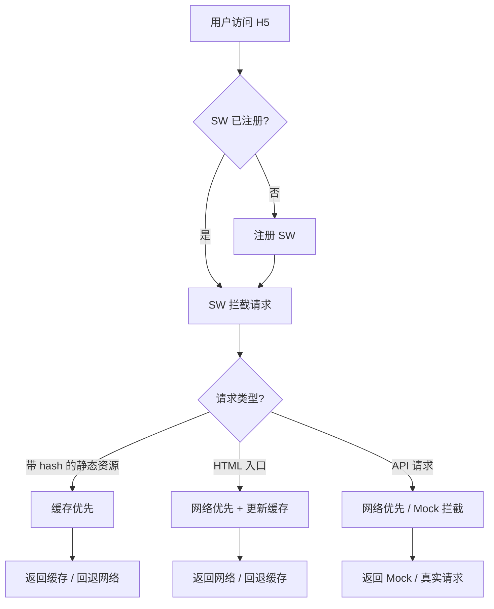
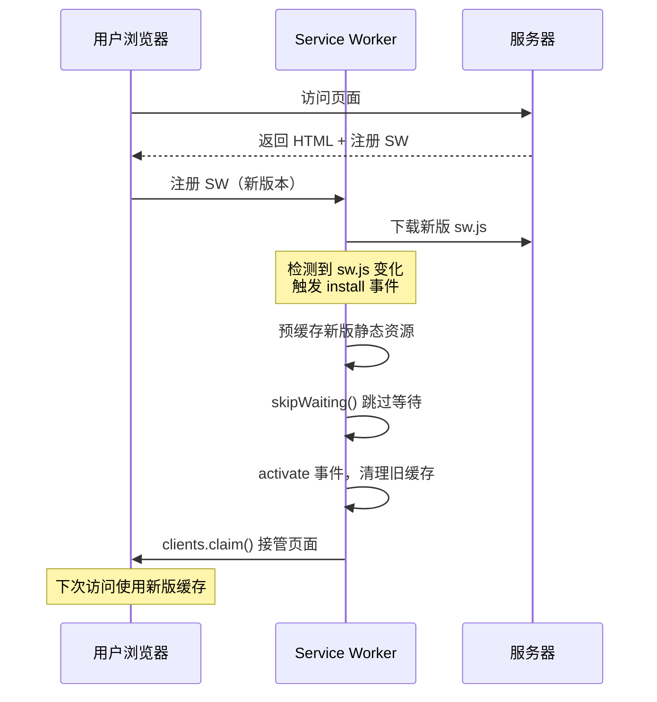

# PWA 最佳实践 — H5 多版本离线包与 Mock Service

本文基于 PWA 的 Service Worker 能力，解决两个实际工程问题：

1. **H5 多版本离线包方案** — 常规 H5 项目如何实现版本化缓存与平滑更新
2. **Mock Service** — 利用 Service Worker 的请求拦截能力实现前端 Mock

## H5 多版本离线包方案

### 背景

常规 H5 项目（非 PWA 安装场景）同样可以从 Service Worker 的缓存能力中获益：

- 静态资源（JS/CSS/图片）带 hash 文件名，适合长期缓存
- 不同版本之间需要隔离，避免旧版缓存污染新版
- 更新时需要平滑过渡，不能出现"半新半旧"的资源

### 整体架构



### 版本管理策略

核心思路：**每个部署版本对应一个独立的缓存命名空间**，通过版本号隔离，激活时清理旧缓存。

```javascript
// sw.js

// 版本号由构建工具注入，每次部署自动生成
const APP_VERSION = '__BUILD_VERSION__'; // 构建时替换，如 '20260710_abc1234'
const CACHE_PREFIX = 'h5-offline';
const CACHE_NAME = `${CACHE_PREFIX}-${APP_VERSION}`;

// 需要预缓存的静态资源清单，由构建工具生成
const PRECACHE_ASSETS = [
  // 构建时注入，如：
  // '/static/js/main.abc1234.js',
  // '/static/css/main.def5678.css',
];

// ── 安装阶段：预缓存当前版本的静态资源 ──
self.addEventListener('install', (event) => {
  event.waitUntil(
    caches.open(CACHE_NAME).then((cache) => cache.addAll(PRECACHE_ASSETS))
  );
  // 跳过等待，立即激活新版本
  self.skipWaiting();
});

// ── 激活阶段：清理旧版本缓存 ──
self.addEventListener('activate', (event) => {
  event.waitUntil(
    caches.keys().then((keys) =>
      Promise.all(
        keys
          .filter((key) => key.startsWith(CACHE_PREFIX) && key !== CACHE_NAME)
          .map((key) => caches.delete(key))
      )
    )
  );
  // 立即接管所有页面
  self.clients.claim();
});
```

### 请求拦截策略

不同类型的资源使用不同的缓存策略：

```javascript
self.addEventListener('fetch', (event) => {
  const url = new URL(event.request.url);

  // 只拦截同源请求
  if (url.origin !== self.location.origin) return;

  // 1. 带 hash 的静态资源 → 缓存优先
  if (isHashedAsset(url.pathname)) {
    event.respondWith(cacheFirst(event.request));
    return;
  }

  // 2. HTML 入口 → 网络优先，保证拿到最新版本
  if (url.pathname.endsWith('.html') || url.pathname === '/') {
    event.respondWith(networkFirst(event.request, CACHE_NAME));
    return;
  }

  // 3. API 请求 → 走 Mock 或网络优先（见下文 Mock Service 部分）
  if (url.pathname.startsWith('/api/')) {
    event.respondWith(handleApiRequest(event.request));
    return;
  }
});

function isHashedAsset(pathname) {
  // 匹配带 hash 的文件名，如 main.abc1234.js、style.def5678.css
  return /\.[a-f0-9]{8}\.(js|css|png|jpg|webp|svg)$/.test(pathname);
}

// 缓存优先
async function cacheFirst(request) {
  const cached = await caches.match(request);
  if (cached) return cached;
  const response = await fetch(request);
  if (response.ok) {
    const cache = await caches.open(CACHE_NAME);
    cache.put(request, response.clone());
  }
  return response;
}

// 网络优先
async function networkFirst(request, cacheName) {
  try {
    const response = await fetch(request);
    if (response.ok) {
      const cache = await caches.open(cacheName);
      cache.put(request, response.clone());
    }
    return response;
  } catch {
    return caches.match(request);
  }
}
```

### 构建工具集成

以 Vite 为例，在构建时生成版本号和预缓存清单，注入到 Service Worker 中：

```javascript
// vite.config.js
import { defineConfig } from 'vite';
import { resolve } from 'path';
import { writeFileSync } from 'fs';

const BUILD_VERSION = `${Date.now()}_${Math.random().toString(36).slice(2, 9)}`;

export default defineConfig({
  plugins: [
    {
      name: 'inject-sw-version',
      closeBundle() {
        // 读取 sw.js 模板，替换版本号占位符
        const swTemplate = readFileSync(resolve(__dirname, 'src/sw.js'), 'utf-8');
        const swContent = swTemplate
          .replace('__BUILD_VERSION__', BUILD_VERSION)
          .replace('__PRECACHE_ASSETS__', JSON.stringify(getHashedAssets()));

        writeFileSync(resolve(__dirname, 'dist/sw.js'), swContent);
      },
    },
  ],
});
```

### 更新流程



**关键细节**：

- `skipWaiting()` + `clients.claim()` 让新版 SW 立即生效，无需等用户关闭所有 tab
- 旧缓存只在 activate 阶段清理，确保切换过程中不会出现资源缺失
- HTML 入口始终走网络优先，保证用户拿到的是最新版本的 HTML，进而加载最新版本的带 hash 资源

### 离线兜底

当用户完全离线时，需要提供一个降级页面：

```javascript
const OFFLINE_PAGE = '/offline.html';

// 安装时预缓存离线页
self.addEventListener('install', (event) => {
  event.waitUntil(
    caches.open(CACHE_NAME).then((cache) =>
      cache.addAll([...PRECACHE_ASSETS, OFFLINE_PAGE])
    )
  );
  self.skipWaiting();
});

// 所有请求失败时的兜底
self.addEventListener('fetch', (event) => {
  // ... 其他策略 ...

  // 兜底：网络失败且无缓存时返回离线页
  event.respondWith(
    fetch(event.request).catch(() => caches.match(OFFLINE_PAGE))
  );
});
```

---

## Mock Service

### 背景

前端开发中经常需要 Mock 后端接口。传统方案有：

| 方案 | 优点 | 缺点 |
|------|------|------|
| **代码里写 if-else** | 简单 | 污染业务代码，上线前要删 |
| **Mock 服务器（如 json-server）** | 独立 | 需要额外启动服务，跨域问题 |
| **Webpack/Vite devServer proxy** | 方便 | 只在开发环境生效 |

Service Worker 可以拦截所有网络请求，是一个**天然的、环境无关的 Mock 层**。

### 基本实现

```javascript
// mock-data.js — Mock 数据定义
// 每条路由带 enabled 字段，可独立控制开关
const MOCK_ROUTES = {
  'GET /api/user/info': {
    enabled: true,
    response: {
      code: 0,
      data: { id: 1, name: '测试用户', avatar: '/default-avatar.png' },
    },
  },
  'POST /api/user/login': {
    enabled: true,
    response: {
      code: 0,
      data: { token: 'mock-token-xxx', expires: 7200 },
    },
  },
  'GET /api/product/list': {
    enabled: false, // 默认关闭，走真实请求
    response: {
      code: 0,
      data: [
        { id: 1, name: '商品A', price: 99 },
        { id: 2, name: '商品B', price: 199 },
      ],
    },
  },
};

self.__MOCK_ROUTES__ = MOCK_ROUTES;
```

```javascript
// sw.js — Mock 拦截逻辑

// 全局开关 + 单条路由开关，两级控制
let globalMockEnabled = false;

self.addEventListener('message', (event) => {
  const { type } = event.data;

  // 全局开关
  if (type === 'TOGGLE_MOCK') {
    globalMockEnabled = event.data.enabled;
  }

  // 单条路由开关
  if (type === 'TOGGLE_ROUTE_MOCK') {
    const route = self.__MOCK_ROUTES__?.[event.data.key];
    if (route) {
      route.enabled = event.data.enabled;
    }
  }
});

function handleApiRequest(request) {
  const method = request.method;
  const url = new URL(request.url);
  const key = `${method} ${url.pathname}`;
  const route = self.__MOCK_ROUTES__?.[key];

  // 全局关闭，或该路由未定义/未启用 → 走真实请求
  if (!globalMockEnabled || !route || !route.enabled) {
    return fetch(request);
  }

  const mockData = route.response;

  // 模拟网络延迟
  return new Promise((resolve) => {
    setTimeout(() => {
      resolve(
        new Response(JSON.stringify(mockData), {
          status: 200,
          headers: { 'Content-Type': 'application/json' },
        })
      );
    }, route.delay || 300);
  });
}
```

### Mock 开关控制

支持**全局开关**和**单条路由开关**两级控制：

```javascript
async function getSW() {
  const registration = await navigator.serviceWorker.ready;
  return registration.active;
}

// ── 全局开关 ──
async function enableGlobalMock() {
  const sw = await getSW();
  sw.postMessage({ type: 'TOGGLE_MOCK', enabled: true });
}

async function disableGlobalMock() {
  const sw = await getSW();
  sw.postMessage({ type: 'TOGGLE_MOCK', enabled: false });
}

// ── 单条路由开关 ──
async function enableRouteMock(key) {
  const sw = await getSW();
  sw.postMessage({ type: 'TOGGLE_ROUTE_MOCK', key, enabled: true });
}

async function disableRouteMock(key) {
  const sw = await getSW();
  sw.postMessage({ type: 'TOGGLE_ROUTE_MOCK', key, enabled: false });
}

// 使用示例：只 Mock 登录接口，其他走真实请求
enableGlobalMock();            // 先开全局
disableRouteMock('GET /api/product/list'); // 再单独关闭商品列表
```

### 进阶：支持动态 Mock 数据

上面的方案 Mock 数据是静态的。如果需要动态返回（比如根据请求参数返回不同结果），`response` 可以是一个函数：

```javascript
const MOCK_ROUTES = {
  'GET /api/user/info': {
    enabled: true,
    response: (request) => {
      const url = new URL(request.url);
      const userId = url.searchParams.get('id');
      return {
        code: 0,
        data: { id: Number(userId), name: `用户${userId}` },
      };
    },
  },
  'POST /api/user/login': {
    enabled: true,
    response: async (request) => {
      const body = await request.json();
      if (body.password === 'wrong') {
        return { code: -1, message: '密码错误' };
      }
      return { code: 0, data: { token: 'mock-token' } };
    },
  },
};
```

拦截逻辑中判断 `response` 是函数还是对象：

```javascript
function handleApiRequest(request) {
  const method = request.method;
  const url = new URL(request.url);
  const key = `${method} ${url.pathname}`;
  const route = self.__MOCK_ROUTES__?.[key];

  if (!globalMockEnabled || !route || !route.enabled) {
    return fetch(request);
  }

  const data = typeof route.response === 'function'
    ? route.response(request)
    : route.response;

  return Promise.resolve(data).then((result) =>
    new Response(JSON.stringify(result), {
      status: 200,
      headers: { 'Content-Type': 'application/json' },
    })
  );
}
```

### 进阶：Mock 延迟与异常模拟

测试边界情况时，经常需要模拟慢请求或网络异常。这些配置可以直接写在路由定义中：

```javascript
const MOCK_ROUTES = {
  'GET /api/product/list': {
    enabled: true,
    delay: 2000, // 该接口模拟 2s 延迟
    response: {
      code: 0,
      data: [{ id: 1, name: '商品A', price: 99 }],
    },
  },
  'POST /api/order/create': {
    enabled: true,
    error: { status: 500, body: 'Server Error' }, // 模拟服务端异常
    response: { code: 0, data: { orderId: 'xxx' } },
  },
  'GET /api/user/info': {
    enabled: true,
    delay: 300, // 默认 300ms 延迟
    response: { code: 0, data: { id: 1, name: '测试用户' } },
  },
};
```

拦截逻辑统一处理延迟和异常：

```javascript
function handleApiRequest(request) {
  const key = `${request.method} ${new URL(request.url).pathname}`;
  const route = self.__MOCK_ROUTES__?.[key];

  if (!globalMockEnabled || !route || !route.enabled) {
    return fetch(request);
  }

  // 模拟异常
  if (route.error) {
    return delay(route.delay || 300).then(() =>
      new Response(route.error.body, { status: route.error.status })
    );
  }

  // 正常 Mock
  const data = typeof route.response === 'function'
    ? route.response(request)
    : route.response;

  return Promise.resolve(data).then((result) =>
    delay(route.delay || 300).then(() =>
      new Response(JSON.stringify(result), {
        status: 200,
        headers: { 'Content-Type': 'application/json' },
      })
    )
  );
}

function delay(ms) {
  return new Promise((resolve) => setTimeout(resolve, ms));
}
```

### Mock 方案对比

| 维度 | SW Mock | json-server | devServer proxy |
|------|---------|-------------|-----------------|
| **环境无关** | ✅ 生产/开发都能用 | ❌ 需要额外服务 | ❌ 仅开发环境 |
| **跨域** | ✅ 无跨域问题 | ⚠️ 需要配置 CORS | ✅ proxy 解决 |
| **动态开关** | ✅ 全局 + 单条路由独立开关 | ❌ 需要重启服务 | ❌ 需要改配置 |
| **请求拦截粒度** | ✅ 可拦截所有请求 | ⚠️ 只能 mock 定义的接口 | ⚠️ 只能转发 |
| **延迟/异常模拟** | ✅ 路由级别配置 | ⚠️ 需要额外中间件 | ❌ 不支持 |
| **调试体验** | ⚠️ 需要在 DevTools 中看 | ✅ 独立服务，日志清晰 | ✅ 终端有日志 |

### 注意事项

- **生产环境务必关闭 Mock** — 建议通过环境变量控制 `globalMockEnabled` 的默认值，生产构建时强制为 `false`
- **SW 更新后 Mock 数据不会自动更新** — 需要配合版本管理，在 activate 阶段重新注入 Mock 数据
- **DevTools 调试** — Chrome DevTools > Application > Service Workers 中可以查看 SW 状态，勾选 "Update on reload" 方便调试

---

## 总结

| 实践 | 核心思路 | 关键点 |
|------|---------|--------|
| **多版本离线包** | 版本号隔离缓存命名空间 | 构建时注入版本、skipWaiting + claim 立即生效、HTML 网络优先 |
| **Mock Service** | SW 拦截 API 请求返回 Mock 数据 | postMessage 动态开关、支持函数式动态数据、可模拟延迟和异常 |

两者可以组合使用：Service Worker 同时承担**静态资源缓存**和**API Mock** 两个职责，一个文件解决 H5 项目的离线加速和开发调试问题。
