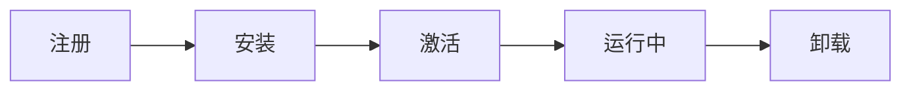

# PWA 渐进式 Web 应用

PWA（Progressive Web App）是一种利用现代 Web 技术提供类似原生应用体验的 Web 应用。

## 核心特性

| 特性 | 说明 |
|------|------|
| **可靠** | Service Worker 实现离线访问 |
| **快速** | 缓存策略加速加载 |
| **可安装** | 可添加到主屏幕，独立窗口运行 |
| **可发现** | 通过 URL 访问，可被搜索引擎索引 |
| **可链接** | 可通过链接分享 |
| **响应式** | 适配各种设备和屏幕尺寸 |
| **安全** | 必须通过 HTTPS 运行 |

## Service Worker

### 什么是 Service Worker

Service Worker 是运行在**独立线程**的脚本，不阻塞主线程，可以拦截网络请求、实现缓存、推送通知等。

### 生命周期



| 阶段 | 说明 |
|------|------|
| **注册** | `navigator.serviceWorker.register('/sw.js')` |
| **安装** | 下载 SW 脚本，缓存静态资源 |
| **激活** | 控制页面，可以拦截请求 |
| **运行中** | 监听 fetch、message 等事件 |
| **卸载** | 更新或删除 SW |

### 基本用法

```javascript
// 注册 Service Worker
if ('serviceWorker' in navigator) {
  navigator.serviceWorker.register('/sw.js')
    .then(registration => {
      console.log('SW 注册成功:', registration);
    })
    .catch(error => {
      console.log('SW 注册失败:', error);
    });
}

// sw.js
self.addEventListener('install', (event) => {
  // 缓存静态资源
  event.waitUntil(
    caches.open('v1').then(cache => {
      return cache.addAll([
        '/',
        '/styles/main.css',
        '/script/main.js',
      ]);
    })
  );
});

self.addEventListener('fetch', (event) => {
  // 拦截网络请求
  event.respondWith(
    caches.match(event.request)
      .then(response => {
        // 有缓存返回缓存，否则网络请求
        return response || fetch(event.request);
      })
  );
});
```

## 缓存策略

### 1. 缓存优先（Cache First）

```javascript
self.addEventListener('fetch', (event) => {
  event.respondWith(
    caches.match(event.request)
      .then(response => {
        // 有缓存直接用缓存
        return response || fetch(event.request);
      })
  );
});
```

**适用场景**：静态资源（CSS、JS、图片）  
**优点**：响应快  
**缺点**：内容可能过期

### 2. 网络优先（Network First）

```javascript
self.addEventListener('fetch', (event) => {
  event.respondWith(
    fetch(event.request)
      .then(response => {
        // 网络成功，更新缓存
        const responseClone = response.clone();
        caches.open('v1').then(cache => {
          cache.put(event.request, responseClone);
        });
        return response;
      })
      .catch(() => {
        // 网络失败，使用缓存
        return caches.match(event.request);
      })
  );
});
```

**适用场景**：API 请求、动态内容  
**优点**：内容新鲜  
**缺点**：首次加载慢

### 3. 带刷新的缓存优先（Stale While Revalidate）

```javascript
self.addEventListener('fetch', (event) => {
  event.respondWith(
    caches.match(event.request).then(cachedResponse => {
      // 同时发起网络请求更新缓存
      const fetchPromise = fetch(event.request).then(networkResponse => {
        const responseClone = networkResponse.clone();
        caches.open('v1').then(cache => {
          cache.put(event.request, responseClone);
        });
        return networkResponse;
      });
      
      // 优先返回缓存，网络返回后更新缓存
      return cachedResponse || fetchPromise;
    })
  );
});
```

**适用场景**：需要平衡速度和新鲜度的场景  
**优点**：响应快 + 内容会更新  
**缺点**：可能返回旧数据

### 缓存策略对比

| 策略 | 速度 | 新鲜度 | 适用场景 |
|------|------|--------|---------|
| **缓存优先** | ✅ 快 | ❌ 可能过期 | 静态资源 |
| **网络优先** | ❌ 慢 | ✅ 新鲜 | API 请求 |
| **带刷新的缓存优先** | ✅ 快 | ⚠️ 延迟更新 | 平衡场景 |

## 自定义更新策略

### 版本管理

```javascript
const CACHE_VERSION = 'v1.0.0';
const CACHE_NAME = `app-${CACHE_VERSION}`;

// 新版本激活时删除旧缓存
self.addEventListener('activate', (event) => {
  event.waitUntil(
    caches.keys().then(cacheNames => {
      return Promise.all(
        cacheNames
          .filter(name => name !== CACHE_NAME)
          .map(name => caches.delete(name))
      );
    })
  );
});
```

### 更新检测

```javascript
// 检查 SW 更新
navigator.serviceWorker.ready.then(registration => {
  registration.update();
});

// 监听更新
navigator.serviceWorker.addEventListener('controllerchange', () => {
  // SW 已更新，提示用户刷新
  if (confirm('新版本已发布，是否刷新？')) {
    window.location.reload();
  }
});
```

### 动态配置策略

```javascript
// 根据不同资源类型使用不同策略
self.addEventListener('fetch', (event) => {
  const url = new URL(event.request.url);
  
  // 静态资源：缓存优先
  if (url.pathname.endsWith('.js') || url.pathname.endsWith('.css')) {
    event.respondWith(cacheFirst(event.request));
  }
  // API 请求：网络优先
  else if (url.pathname.startsWith('/api/')) {
    event.respondWith(networkFirst(event.request));
  }
  // 图片：带刷新的缓存优先
  else if (url.pathname.match(/\.(jpg|png|webp)$/)) {
    event.respondWith(staleWhileRevalidate(event.request));
  }
});
```

## Manifest 文件

### 什么是 Manifest

Manifest 是 JSON 文件，定义应用的名称、图标、启动方式等，让 Web 应用可以像原生应用一样安装。

### 配置示例

```json
{
  "name": "我的 PWA 应用",
  "short_name": "PWA",
  "description": "一个渐进式 Web 应用",
  "start_url": "/",
  "display": "standalone",
  "background_color": "#ffffff",
  "theme_color": "#000000",
  "icons": [
    {
      "src": "/icons/icon-192.png",
      "sizes": "192x192",
      "type": "image/png"
    },
    {
      "src": "/icons/icon-512.png",
      "sizes": "512x512",
      "type": "image/png"
    }
  ]
}
```

### 引入 Manifest

```html
<link rel="manifest" href="/manifest.json">
<meta name="theme-color" content="#000000">
```

## 优缺点

### 优点

| 优点 | 说明 |
|------|------|
| **离线访问** | Service Worker 缓存，无网络也能用 |
| **加载快** | 缓存策略加速，省去 TCP 连接时间 |
| **可安装** | 添加到主屏幕，独立窗口运行 |
| **减少服务器负载** | 静态资源从缓存读取 |
| **跨平台** | 一套代码，多端运行 |
| **无需应用商店** | 直接通过 URL 访问 |

### 缺点

| 缺点 | 说明 |
|------|------|
| **数据不一致** | 缓存可能导致数据过期（需要更新策略） |
| **代码维护成本** | 需要管理缓存版本和更新逻辑 |
| **iOS 支持有限** | Safari 对 PWA 支持不如 Chrome |
| **推送通知限制** | iOS 不支持 Web Push |
| **存储空间限制** | 浏览器缓存空间有限 |

## 适用场景

| 场景 | 推荐度 | 说明 |
|------|--------|------|
| **内容型应用** | ✅ 推荐 | 新闻、博客、文档 |
| **电商应用** | ✅ 推荐 | 商品浏览、购物车 |
| **工具类应用** | ✅ 推荐 | 计算器、笔记、待办 |
| **社交应用** | ⚠️ 一般 | 需要实时推送（iOS 不支持） |
| **游戏** | ❌ 不推荐 | 性能要求高，适合原生 |

## 与其他方案对比

| 方案 | 离线 | 推送 | 安装 | 跨平台 | 开发成本 |
|------|------|------|------|--------|---------|
| **PWA** | ✅ | ️ iOS 不支持 | ✅ | ✅ | 低 |
| **原生应用** | ✅ | ✅ | ✅ | ❌ | 高 |
| **混合应用** | ✅ | ✅ | ✅ | ✅ | 中 |
| **小程序** | ✅ | ✅ | ❌ | ⚠️ 平台限制 | 中 |

## 总结

| 要点 | 说明 |
|------|------|
| **核心技术** | Service Worker + Manifest |
| **缓存策略** | 缓存优先、网络优先、带刷新的缓存优先 |
| **优势** | 离线访问、加载快、可安装、跨平台 |
| **劣势** | 数据一致性、iOS 支持有限 |
| **适用场景** | 内容型、电商、工具类应用 |
