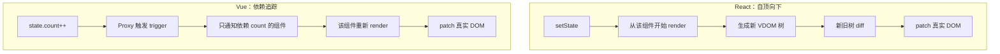

# React vs Vue：设计哲学与实现差异

> 一句话概括：**React 把复杂度交给开发者**（重运行时、手动优化），**Vue 把复杂度收进框架**（重编译时、自动优化）。
>
> 理解这句话，就能理解两者大部分差异的根源。

---

## 快速对比

| 维度 | React | Vue |
|------|-------|-----|
| 定位 | UI 库（只管视图层） | 渐进式框架（官方全家桶） |
| 模板 | JSX（JS 语法扩展） | SFC 模板（编译时静态分析） |
| 数据流 | 单向数据流 | 双向绑定（`v-model`） |
| 数据可变性 | 不可变（创建新对象） | 可变（Proxy 自动追踪） |
| 更新粒度 | 自顶向下 diff | 依赖追踪，精确到组件 |
| 性能优化 | 手动（`useMemo` / `memo`） | 自动（编译时优化） |
| 运行时体积 | React + ReactDOM 较大 | Vue 3 约为其 1/4 |
| 生态 | 社区主导 | 官方主导 |
| 学习曲线 | 较陡（Hooks 规则、依赖数组） | 较缓（模板语法直观） |

## 相同点

1. **数据驱动视图** —— 通过响应式机制更新 DOM，避免手动操作
2. **组件化** —— 组件复用与组合
3. **Virtual DOM** —— 跨平台 + 最小化真实 DOM 操作
4. **专注视图层** —— 路由、状态管理独立（React 靠社区，Vue 官方维护）
5. **支持 SSR** —— Next.js / Nuxt
6. **支持原生** —— React Native / Weex
7. **Diff 思想一致** —— 同层比较 + key 复用，动态列表都需唯一 key

## 核心差异

### 1. 数据流：单向 vs 双向

```jsx
// React：单向数据流，显式声明 onChange
function Input() {
  const [value, setValue] = useState('')
  return <input value={value} onChange={(e) => setValue(e.target.value)} />
}
```

```vue
<!-- Vue：v-model 双向绑定 -->
<template>
  <input v-model="value" />
</template>
```

**本质**：`v-model` 是语法糖，内部仍是 `:value` + `@input`。

**影响**：
- React 的数据流更**可预测**（调试时容易定位变更来源），但表单场景代码量大
- Vue 双向绑定**写起来简洁**，但数据来源不如单向流清晰

### 2. 响应式实现：不可变 vs 可变

```js
// React：不可变 —— 必须创建新对象，靠引用比较触发更新
setState((prev) => ({ ...prev, count: prev.count + 1 }))

// Vue 3：可变 —— 直接修改，Proxy 拦截并追踪依赖
state.count++
```

**React 的实现**：
- `useState` 用 `Object.is` 比较新旧值 → 直接改对象**不会**触发更新
- 必须创建新引用（`{ ...state, x: 1 }`）
- 好处：数据变更可追溯；坏处：深层嵌套时写法繁琐

**Vue 3 的实现**：
- `reactive()` 用 `Proxy` 拦截 `get` / `set`
- 读取时收集依赖（`track`），修改时触发更新（`trigger`）
- 好处：写法自然；坏处：依赖追踪有运行时开销

> **为什么 Vue 3 改用 Proxy？** Vue 2 用 `Object.defineProperty`，只能拦截**已声明**的属性（新增属性需要 `Vue.set`），且无法监听数组索引变化。

### 3. 更新粒度：全量 diff vs 依赖追踪



**React**：状态变化后从该组件开始自顶向下重新 render，生成新 VDOM 树再 diff。父组件更新会带动所有子组件（除非用 `memo` / `shouldComponentUpdate` 拦截）。

**Vue**：组件渲染时记录自己依赖了哪些响应式数据，数据变化时**只通知相关组件**更新。

**实际影响**：同样一次更新，React 可能 re-render 多个组件，Vue 通常只 re-render 一个。

### 4. 编译时 vs 运行时

**Vue 的编译时优化（AOT）**：
- 模板可静态分析出**哪些内容是静态的**（不会变）→ 提升为常量，跳过 diff
- `v-if` / `v-for` 编译成精确的更新逻辑
- 静态标记（PatchFlag）告诉运行时"这个节点只需更新 class，不用 diff 子节点"
- 实测：大部分 DOM 内容是静态的，Vue 3 的协调耗时约为 React 的 1/10

**React 的运行时方案**：
- JSX 本质是 JS，表达力强，但**编译期无法预知**哪些内容会变
- 只能靠运行时优化：Fiber 架构、并发模式（时间切片）
- 代价：Fiber 的链表遍历结构限制了 diff 算法的优化空间

> **时间切片的局限**：它主要解决"长任务阻塞渲染"的场景（如动画、可视化），但会**延长整体渲染时长**。对 99% 的场景来说，并不需要。

### 5. 重复渲染的处理

**React**：把优化 API 暴露给开发者

```jsx
// 需要手动指定依赖数组 —— 写错会导致 bug
const value = useMemo(() => compute(a, b), [a, b])
const Comp = memo(HeavyComponent)
```

- 默认就会 render 过多（Hooks 的心智负担）
- 盲目加 `useMemo` 反而可能导致"该更新的没更新"

**Vue**：框架自动处理
- 编译时把插槽编译为函数 → 避免 children 变化引发 re-render
- 自动缓存内联事件处理函数
- **无需手动优化**，Vue 3 也能防止子组件非必要 re-render

### 6. 生态策略

| | React | Vue |
|---|-------|-----|
| 核心 | 只有 React（视图层） | Vue + Router + Pinia 官方维护 |
| 路由 | React Router（社区） | Vue Router（官方） |
| 状态 | Redux / Zustand / Jotai（社区） | Pinia（官方） |
| 脚手架 | 社区方案 | Vue CLI / Vite（官方） |

- **React 的哲学**：核心保持精简，生态由社区竞争演化 → 方案多样，但选型成本高
- **Vue 的哲学**：官方提供完整方案 → 开箱即用，但灵活性略低

## 选型建议

| 场景 | 建议 | 理由 |
|------|------|------|
| 小团队 / 快速交付 | Vue | 约定优于配置，上手快 |
| 表单密集型应用 | Vue | `v-model` 双向绑定省代码 |
| 大量动态逻辑 / 复杂交互 | React | JSX 表达力强，不受模板限制 |
| 跨端（移动端） | React | React Native 生态成熟 |
| 大型长期项目 | React | 生态成熟、人才储备多 |
| 追求运行时性能 | Vue | 编译时优化 + 更小体积 |

## 总结

- **React 的哲学**：核心保持简单，把灵活性（和复杂度）交给开发者
- **Vue 的哲学**：通过编译时优化和约定，让开发者少操心性能

**没有绝对优劣**。React 适合需要极致灵活性和庞大生态的场景；Vue 适合追求开发效率和开箱即用的场景。

选型时更应该看：**团队技术栈、项目复杂度、长期维护成本**。

## 延伸阅读

- [React 设计理念](/react/concept)
- [Vue 双向绑定原理](/vue/double-binding)
