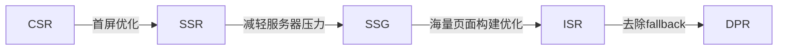
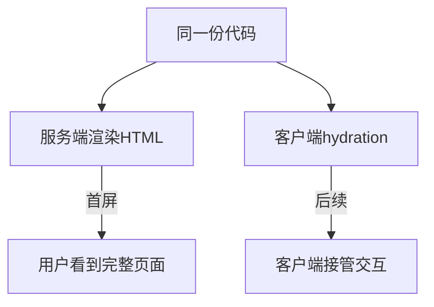

## 渲染方式概览

| 缩写 | 全称 | 核心思想 | 代表框架 |
|------|------|----------|----------|
| CSR | Client Side Rendering | 浏览器下载 JS 后自行渲染页面 | React/Vue SPA |
| SSR | Server Side Rendering | 服务器返回完整 HTML，客户端激活交互 | Next.js、Nuxt.js |
| SSG | Static Site Generation | 构建时预渲染静态 HTML，部署到 CDN | Hugo、Hexo、VitePress |
| ISR | Incremental Site Rendering | SSG 升级版，按需逐页增量构建 | Next.js (getStaticProps + revalidate) |
| DPR | Distributed Persistent Rendering | ISR 改进版，去除 fallback，按需构建器响应 | Vercel |

## CSR 客户端渲染

服务器返回空 HTML + JS/CSS，浏览器下载并执行脚本后自行构建页面。

```
浏览器请求 → 服务器返回空HTML+JS/CSS → 浏览器执行JS → 请求API数据 → 渲染页面
```

**特点**：
- 切换页面通过前端路由控制，无需重新请求服务器
- SPA 的典型实现方式
- 首屏白屏时间长，SEO 不友好

## SSR 服务端渲染

服务器接收请求后执行 JS，将组件渲染成 HTML 字符串返回给浏览器。

```
浏览器请求 → 服务器执行JS渲染HTML → 返回完整HTML → 浏览器展示 → 客户端JS激活交互(hydration)
```

**优势**：
- 首屏速度快：用户直接看到完整页面，无需等待 JS 下载执行
- SEO 友好：搜索引擎爬虫可以直接抓取完整 HTML

**代价**：

| 代价 | 说明 |
|------|------|
| 服务器成本 | 需要额外服务器，需视流量扩容 |
| 部署地域受限 | 距离服务器较远的用户响应慢（CSR 可从就近 CDN 取资源） |
| 运维负担 | 需要监控告警、日志、容灾等，增加人力成本 |
| TTI 未提升 | 客户端仍需下载 JS 并执行 hydration 后才能交互 |

## SSG 静态站点生成

在构建阶段预渲染所有页面，生成静态 HTML 部署到 CDN。

```
构建时渲染HTML → 部署到CDN → 用户请求直接从CDN获取
```

**适用场景**：内容更新不频繁的网站（博客、文档站、官网）

**局限**：每次内容变更都需要重新构建全量页面，页面数量多时构建时间很长

## ISR 增量式静态生成

SSG 的升级版，解决海量页面构建慢的问题。

```
用户访问页面 → 返回缓存的HTML
  → 页面未过期：直接返回缓存
  → 页面已过期：返回缓存 + 异步重新构建 → 更新CDN缓存
```

**核心机制**：
- 页面有过期时间（revalidate）
- 过期时仍先返回缓存内容（不阻塞用户）
- 后台异步重新构建，完成后更新 CDN

**适用场景**：页面数量大、内容有一定更新频率但不要求实时的站点（电商商品页、新闻站）

## DPR 分布式持续渲染

在 ISR 基础上改进，由 Vercel 提出：

| 改进点 | ISR | DPR |
|--------|-----|-----|
| 未缓存页面 | 回退到 SSG 构建 | 用 On-demand Builder 实时渲染并缓存 |
| 页面过期 | 返回过期缓存 + 异步更新 | 回源到 Builder 渲染最新内容 |
| 版本发布 | 需手动清缓存 | 自动清除 CDN 缓存 |

**问题**：
1. 新页面首次访问可能触发同步渲染，响应较慢
2. 难以防御 DoS 攻击（大量访问新页面导致 Builder 并行运行）

## 渲染方式演进



## 综合对比

| 维度 | CSR | SSR | SSG | ISR |
|------|-----|-----|-----|-----|
| 首屏速度 | 慢 | 快 | 快 | 快 |
| SEO | 差 | 好 | 好 | 好 |
| 服务器成本 | 低（静态资源） | 高（需实时计算） | 低（CDN） | 低（CDN + 按需构建） |
| 内容实时性 | 高（客户端请求） | 高（每次实时渲染） | 低（构建时确定） | 中（缓存 + 异步更新） |
| 构建时间 | 快 | 慢（每次请求） | 慢（全量构建） | 快（按需构建） |
| 部署方式 | 静态资源/CDN | Node 服务器 | CDN | CDN + Builder |

## 同构

同构是指**同一份代码**既能在客户端运行也能在服务端运行，实现路由共享、组件共享、数据共享。



**核心价值**：结合 CSR + SSR 的优势——首屏用 SSR 提高速度和 SEO，后续交互用 CSR 保证体验。

### 主流同构框架

| 框架 | 基于 | 特点 |
|------|------|------|
| **Next.js** | React | 最成熟的 React SSR 框架，支持 SSR/SSG/ISR 混合，App Router |
| **Nuxt.js** | Vue | Vue 生态首选，支持 SSR/SSG，模块丰富 |
| **Remix** | React | 强调 Web 标准，嵌套路由，数据加载与路由绑定 |
| **Astro** | 框架无关 | Islands 架构，默认零 JS，支持多框架混用 |

## 如何选择

| 场景 | 推荐方案 |
|------|----------|
| 后台管理系统、工具类应用 | CSR |
| 内容型网站、电商首页、需要 SEO | SSR |
| 博客、文档站、官网 | SSG |
| 大型内容站、电商商品页 | ISR |
| 超大规模内容平台 | DPR |

实际项目中通常**混合使用**：如首页 SSG + 动态页 SSR + 后台 CSR，根据页面特性选择最合适的渲染方式。

### 混合渲染示例

```
电商网站：
├── 首页/活动页 → SSG（内容固定，构建时生成，CDN 加速）
├── 商品详情页 → ISR（海量商品，按需构建，定期更新）
├── 搜索结果页 → SSR（实时数据，需要 SEO）
└── 购物车/订单页 → CSR（纯交互，无需 SEO）
```
