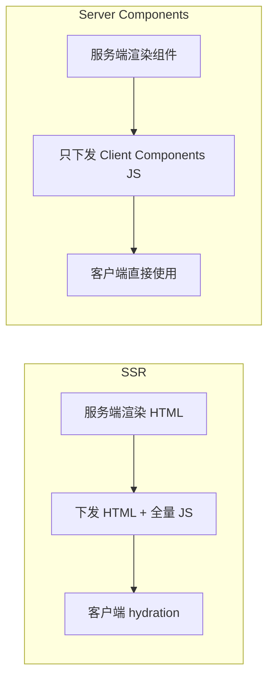

## 什么是 Server Components

Server Components（服务端组件）是一种新的组件模型，组件在服务端渲染，只将必要的交互部分发送到客户端。

**核心思想**：能静态的留在服务端，需要交互的才到客户端。

## 与 SSR 的区别

| 维度 | SSR | Server Components |
|------|-----|-------------------|
| 渲染时机 | 请求时服务端渲染 HTML | 构建时或请求时服务端渲染组件 |
| 客户端 JS | 需要下载全量 JS 并 hydration | 只下载需要交互的组件 JS |
| 数据获取 | 可在服务端获取，但 hydration 后客户端可能重新获取 | 服务端获取，结果序列化后传给客户端，不重新获取 |
| Bundle 大小 | 全量组件代码都要下发 | 只有 Client Components 的代码下发 |
| 代表框架 | Next.js Pages Router | Next.js App Router、React Server Components |



## 与 Islands 架构的对比

| 维度 | Islands（Astro） | Server Components（React） |
|------|------------------|---------------------------|
| 默认行为 | 默认静态，需声明交互组件 | 默认服务端，需声明交互组件 |
| 框架绑定 | 框架无关，支持多框架 | React 生态 |
| 交互组件 | 使用 `client:load` 等指令 | 使用 `"use client"` 声明 |
| 数据获取 | 构建时获取 | 请求时获取（可缓存） |
| 适用场景 | 内容型网站 | 复杂交互应用 |

**共同点**：都是"默认静态/服务端，按需加载交互部分"。

## React Server Components 示例

### Server Component（默认）

```tsx
// 这个组件只在服务端运行
async function BlogPost({ id }) {
  // 可以直接访问数据库、文件系统等
  const post = await db.posts.find(id);
  const author = await db.authors.find(post.authorId);

  return (
    <article>
      <h1>{post.title}</h1>
      <p>By {author.name}</p>
      <div>{post.content}</div>
    </article>
  );
}
```

### Client Component（需要交互时）

```tsx
// 使用 "use client" 声明为客户端组件
"use client";

import { useState } from 'react';

function LikeButton({ postId }) {
  const [count, setCount] = useState(0);

  return (
    <button onClick={() => setCount(count + 1)}>
      👍 {count}
    </button>
  );
}
```

### 混合使用

```tsx
// Server Component
async function BlogPage({ id }) {
  const post = await db.posts.find(id);

  return (
    <article>
      <h1>{post.title}</h1>
      <div>{post.content}</div>
      {/* Client Component 只在需要交互时使用 */}
      <LikeButton postId={id} />
    </article>
  );
}
```

## 数据获取模式

### 服务端获取（推荐）

```tsx
// Server Component 中直接获取数据
async function UserProfile({ userId }) {
  const user = await fetch(`https://api.example.com/users/${userId}`);

  return <div>{user.name}</div>;
}
```

### 客户端获取（需要交互时）

```tsx
"use client";

import { useEffect, useState } from 'react';

function UserProfile({ userId }) {
  const [user, setUser] = useState(null);

  useEffect(() => {
    fetch(`/api/users/${userId}`).then(res => res.json()).then(setUser);
  }, [userId]);

  return <div>{user?.name}</div>;
}
```

## 缓存策略

### 请求缓存（Request Memoization）

同一个请求在单次渲染中只执行一次：

```tsx
// 即使多个组件调用，getUser 只执行一次
async function getUser(id) {
  return fetch(`https://api.example.com/users/${id}`);
}

// Component A 和 Component B 都调用 getUser(1)
// 实际只发一次请求
```

### 全路由缓存（Full Route Cache）

构建时或首次访问时缓存整个路由的渲染结果：

```typescript
// Next.js App Router
export const revalidate = 3600; // 1 小时重新验证

export default async function Page() {
  const data = await fetchData();
  return <div>{data}</div>;
}
```

### 路由器缓存（Router Cache）

客户端导航时缓存已访问的路由：

```tsx
// 从 /about 导航到 /home，再回到 /about
// /about 的内容从缓存读取，不重新渲染
```

## 适用场景

| 场景 | 是否适合 |
|------|----------|
| 内容型网站（博客、文档） | 适合，大部分内容静态 |
| 电商商品页 | 适合，商品信息服务端获取，购物车按钮客户端 |
| 后台管理系统 | 部分适合，列表页适合，复杂表单不适合 |
| 实时应用（聊天、协作） | 不适合，需要大量客户端交互 |
| 数据可视化 | 不适合，图表库需要客户端运行 |

## 最佳实践

1. **默认使用 Server Component**：除非需要交互，否则都写成服务端组件
2. **Client Component 尽量叶子化**：交互组件放在组件树底部，减少客户端 JS
3. **数据获取放在 Server Component**：避免客户端重复请求
4. **合理使用缓存**：根据数据更新频率设置 revalidate
5. **避免在 Server Component 中使用浏览器 API**：如 `window`、`localStorage`
6. **第三方库兼容性**：使用浏览器 API 的库需要包在 Client Component 中

## 与 Islands 架构的选择

| 项目特点 | 推荐方案 |
|----------|----------|
| React 技术栈，复杂交互 | Server Components |
| 框架无关，内容为主 | Islands（Astro） |
| 已有 React 项目，渐进式迁移 | Server Components |
| 新项目，追求极致性能 | Islands |
| 多框架混用 | Islands |
