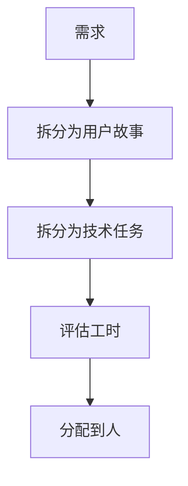
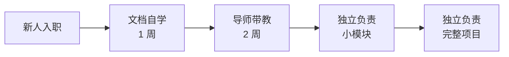
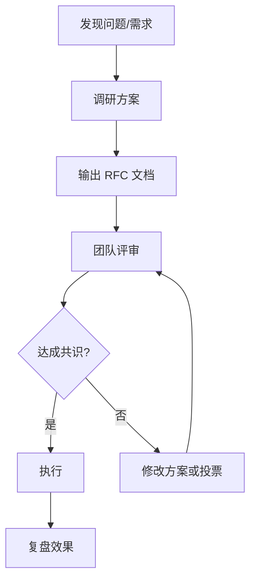

## 为什么需要团队管理

技术能力决定下限，团队协作决定上限。好的团队管理能：

| 收益 | 说明 |
|------|------|
| 提升效率 | 减少沟通成本，避免重复劳动 |
| 保证质量 | 代码审查、规范约束、知识传承 |
| 降低风险 | 避免单点依赖，新人快速上手 |
| 促进成长 | 成员能力提升，团队整体进步 |

## 沟通机制

### 日常沟通

| 形式 | 频率 | 参与人 | 内容 |
|------|------|--------|------|
| 站会 | 每天 15 分钟 | 全组 | 昨天做了什么、今天做什么、有什么阻塞 |
| 周会 | 每周 1 小时 | 全组 | 本周进展、下周计划、问题讨论 |
| 技术分享 | 每两周 1 小时 | 轮流主讲 | 技术调研、项目复盘、新技术学习 |
| 一对一 | 每月 30 分钟 | 主管 + 成员 | 个人成长、工作困难、职业规划 |

### 沟通原则

1. **异步优先**：能用文档/消息说清的不开会
2. **会议有议程**：提前发议程，控制时间，有结论有 action item
3. **信息透明**：项目进展、技术决策对全组可见
4. **对事不对人**：讨论问题聚焦事情本身，不针对个人

## 任务管理

### 任务拆分



**拆分原则**：
- 每个任务不超过 2 天，超过继续拆
- 任务边界清晰，减少依赖
- 有明确的完成标准（Definition of Done）

### 任务看板

| 状态 | 说明 |
|------|------|
| 待办 | 已评估，等待开始 |
| 进行中 | 正在开发，负责人明确 |
| 待审核 | 开发完成，等待 PR 审核 |
| 测试中 | 已合并，等待测试 |
| 已完成 | 测试通过，已部署 |

### 工时评估

| 方法 | 说明 | 适用场景 |
|------|------|----------|
| 故事点 | 相对复杂度评估（1/2/3/5/8/13） | 敏捷团队，长期项目 |
| 人天 | 绝对时间评估 | 短期项目，外包合作 |
| T-shirt 尺码 | S/M/L/XL 粗略评估 | 早期规划，需求不明确 |

**评估技巧**：
- 让实际执行的人评估，不要代估
- 参考历史任务，避免过度乐观
- 预留 buffer（通常 20-30%）

## 代码审查文化

### 审查原则

| 原则 | 说明 |
|------|------|
| 及时响应 | PR 提交后 24 小时内完成审核 |
| 建设性反馈 | 指出问题的同时给出建议 |
| 小步提交 | 每个 PR 不超过 500 行，便于 review |
| 自动化优先 | lint、测试、构建由 CI 完成，人工聚焦逻辑 |

### 审查清单

```markdown
## 功能
- [ ] 功能实现是否正确
- [ ] 边界情况是否处理
- [ ] 错误处理是否完善

## 代码质量
- [ ] 命名是否清晰
- [ ] 是否有重复代码
- [ ] 是否符合团队规范

## 性能
- [ ] 是否有性能退化风险
- [ ] 是否有不必要的计算/请求

## 安全
- [ ] 是否有注入风险
- [ ] 敏感信息是否暴露

## 测试
- [ ] 是否有单元测试
- [ ] 测试覆盖率是否达标
```

### 反馈话术

| 场景 | 推荐话术 | 避免话术 |
|------|----------|----------|
| 指出问题 | "这里可以考虑..." | "你这样写不对" |
| 建议优化 | "如果...会不会更好？" | "你应该..." |
| 不理解代码 | "我没看懂这段的逻辑，能解释下吗？" | "这写的什么" |
| 认可代码 | "这个方案很巧妙" | （沉默） |

## 知识管理

### 文档规范

| 文档类型 | 内容 | 维护频率 |
|----------|------|----------|
| 项目 README | 项目介绍、启动方式、部署流程 | 项目初始化时 |
| 架构文档 | 系统架构、技术选型、核心设计 | 架构变更时 |
| API 文档 | 接口定义、请求/响应格式 | 接口变更时 |
| 故障复盘 | 问题描述、根因分析、改进措施 | 每次故障后 |
| 技术分享 | 分享 PPT、demo 代码 | 每次分享后 |

### 知识传承



**导师制度**：
- 每位新人指定一位导师
- 导师负责：环境搭建、代码规范、项目介绍、答疑
- 导师激励：纳入绩效考核，给予认可

### 技术分享

| 形式 | 频率 | 内容 |
|------|------|------|
| 组内分享 | 每两周 | 技术调研、项目复盘、工具推荐 |
| 部门分享 | 每月 | 跨组交流、最佳实践、失败案例 |
| 外部分享 | 每季度 | 技术大会、社区活动、开源贡献 |

## 技术决策

### 决策流程



### RFC 文档模板

```markdown
# RFC: [标题]

## 背景
为什么需要这个变更？

## 方案
具体怎么做？

## 替代方案
考虑过哪些其他方案？为什么没选？

## 风险
可能有什么问题？如何缓解？

## 迁移计划
如何从现状过渡到新方案？
```

### 决策原则

1. **数据驱动**：用数据说话，避免"我觉得"
2. **可逆优先**：优先选择可逆的决策，降低试错成本
3. **渐进式**：大变更分阶段实施，每阶段验证效果
4. **记录决策**：决策原因记录下来，避免日后重复讨论

## 冲突处理

### 常见冲突类型

| 类型 | 示例 | 处理方式 |
|------|------|----------|
| 技术方案分歧 | 用 React 还是 Vue | RFC 文档 + 团队评审 |
| 任务分配不均 | 某人任务过多 | 站会暴露 + 重新分配 |
| 代码风格争议 | 用 tab 还是 space | 制定规范 + 工具强制 |
| 优先级冲突 | 需求 A 还是需求 B | 产品排序 + 透明沟通 |

### 处理原则

1. **及时暴露**：问题不要憋着，尽早提出
2. **聚焦问题**：讨论事情本身，不针对个人
3. **寻求共识**：找到双方都能接受的方案
4. **升级机制**：无法达成共识时，由主管或更高层决策

## 绩效管理

### 考核维度

| 维度 | 权重 | 说明 |
|------|------|------|
| 业务交付 | 40% | 任务完成质量、按时交付率 |
| 技术能力 | 30% | 代码质量、技术深度、问题解决 |
| 团队协作 | 20% | 沟通配合、知识分享、帮助他人 |
| 成长进步 | 10% | 学习能力、主动性、改进意识 |

### 反馈机制

| 形式 | 频率 | 内容 |
|------|------|------|
| 即时反馈 | 随时 | 具体行为的正面/负面反馈 |
| 一对一 | 每月 | 个人成长、工作困难、职业规划 |
| 绩效评估 | 每季度/半年 | 综合表现、改进方向、晋升讨论 |

### 反馈话术

**正面反馈**（SBI 模型）：
- **Situation**（情境）：上周的线上故障
- **Behavior**（行为）：你主动加班排查，快速定位了问题
- **Impact**（影响）：避免了更大的损失，团队都很认可

**改进反馈**：
- **观察**：我注意到最近两个 PR 都有类似的边界问题
- **影响**：这可能导致线上 bug
- **建议**：要不要一起看看怎么写测试覆盖这些场景？

## 远程协作

### 工具推荐

| 类别 | 工具 | 用途 |
|------|------|------|
| 即时通讯 | 飞书/Slack | 日常沟通、问题讨论 |
| 文档协作 | 飞书文档/Notion | 需求文档、技术方案 |
| 任务管理 | Jira/Linear | 任务跟踪、进度管理 |
| 代码协作 | GitHub/GitLab | 代码审查、版本管理 |
| 视频会议 | 飞书会议/Zoom | 站会、评审、分享 |

### 远程协作原则

1. **默认异步**：不期望即时回复，尊重专注时间
2. **文档先行**：重要决策和讨论结果写成文档
3. **视频优先**：复杂讨论用视频，避免文字误解
4. **时区透明**：明确每个人的工作时间，合理安排会议

## 最佳实践总结

1. **沟通透明**：信息对全组可见，避免信息差
2. **规范约束**：用工具和流程保证底线，不依赖个人自觉
3. **持续改进**：定期复盘，小步优化
4. **以人为本**：关注成员成长，营造安全氛围
5. **结果导向**：关注交付质量，不纠结过程细节
6. **知识沉淀**：文档化、可传承，避免单点依赖
