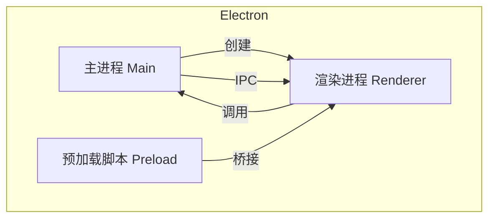

# 桌面端应用

前端技术不仅可以开发 Web 应用，还可以开发跨平台桌面应用。主流方案有 Electron、Tauri、NW.js 等。

## 核心架构



**多进程模型：**
- **主进程**：Node.js 环境，管理窗口、系统交互、文件操作
- **渲染进程**：Chromium 环境，负责 UI 渲染
- **预加载脚本**：在渲染进程加载前执行，暴露安全 API

## Electron

### 项目结构

```
electron-app/
── main.js             # 主进程入口
├── preload.js          # 预加载脚本
├── index.html          # 渲染进程页面
├── renderer.js         # 渲染进程逻辑
├── package.json
└── electron-builder.yml  # 打包配置
```

### 主进程

```javascript
// main.js
const { app, BrowserWindow, ipcMain } = require('electron');
const path = require('path');

let mainWindow;

app.whenReady().then(() => {
  // 创建窗口
  mainWindow = new BrowserWindow({
    width: 1200,
    height: 800,
    webPreferences: {
      preload: path.join(__dirname, 'preload.js'),
      contextIsolation: true,  // 安全：隔离上下文
      nodeIntegration: false   // 安全：禁用 Node 集成
    }
  });

  mainWindow.loadFile('index.html');

  // 监听渲染进程消息
  ipcMain.on('get-file-path', (event) => {
    event.reply('file-path', app.getPath('userData'));
  });
});

app.on('window-all-closed', () => {
  if (process.platform !== 'darwin') {
    app.quit();
  }
});
```

### 预加载脚本

```javascript
// preload.js
const { contextBridge, ipcRenderer } = require('electron');

// 安全地暴露 API 给渲染进程
contextBridge.exposeInMainWorld('electronAPI', {
  getUserDataPath: () => ipcRenderer.invoke('get-user-data-path'),
  onFilePath: (callback) => ipcRenderer.on('file-path', callback),
  openFile: () => ipcRenderer.invoke('dialog:openFile')
});
```

### 渲染进程

```javascript
// renderer.js
// 使用预加载脚本暴露的 API
const path = await window.electronAPI.getUserDataPath();
console.log('用户数据路径:', path);

// 监听主进程消息
window.electronAPI.onFilePath((event, path) => {
  console.log('文件路径:', path);
});
```

```html
<!-- index.html -->
<!DOCTYPE html>
<html>
<head>
  <meta charset="UTF-8">
  <title>我的桌面应用</title>
</head>
<body>
  <h1>Electron 应用</h1>
  <button id="openFile">打开文件</button>
  <script src="renderer.js"></script>
</body>
</html>
```

### 常用 API

```javascript
const { app, BrowserWindow, dialog, shell, clipboard } = require('electron');

// 文件对话框
const result = await dialog.showOpenDialog({
  properties: ['openFile'],
  filters: [
    { name: 'Images', extensions: ['jpg', 'png', 'gif'] }
  ]
});

// 打开外部链接
shell.openExternal('https://example.com');

// 剪贴板操作
clipboard.writeText('复制的文本');
const text = clipboard.readText();

// 系统通知
const { Notification } = require('electron');
new Notification({ title: '提醒', body: '任务完成' }).show();
```

## Tauri

Tauri 是 Rust + Web 技术的桌面应用框架，比 Electron 更轻量。

### 对比

| 维度 | Electron | Tauri |
|------|---------|-------|
| **体积** | ~150MB | ~10MB |
| **内存** | ~200MB | ~50MB |
| **后端** | Node.js | Rust |
| **前端** | 任意 | 任意 |
| **安全性** | 中 | 高 |
| **生态** | 成熟 | 成长中 |

### 项目结构

```
tauri-app/
├── src/
│   ├── main.rs         # Rust 后端
│   └── lib.rs
├── src-tauri/
│   ├── Cargo.toml      # Rust 依赖
│   ├── tauri.conf.json # Tauri 配置
│   └── build.rs
├── index.html          # 前端页面
└── package.json
```

### Rust 后端

```rust
// src/main.rs
use tauri::Manager;

#[tauri::command]
fn greet(name: &str) -> String {
    format!("Hello, {}!", name)
}

#[tauri::command]
fn read_file(path: String) -> Result<String, String> {
    std::fs::read_to_string(&path)
        .map_err(|e| e.to_string())
}

fn main() {
    tauri::Builder::default()
        .invoke_handler(tauri::generate_handler![greet, read_file])
        .run(tauri::generate_context!())
        .expect("error while running tauri application");
}
```

### 前端调用

```javascript
// 使用 Tauri API
import { invoke } from '@tauri-apps/api/tauri';

// 调用 Rust 函数
const greeting = await invoke('greet', { name: 'World' });
console.log(greeting); // "Hello, World!"

// 读取文件
const content = await invoke('read_file', { path: '/path/to/file.txt' });
```

## 打包分发

### Electron Builder

```yaml
# electron-builder.yml
appId: com.example.myapp
productName: 我的应用

files:
  - main.js
  - preload.js
  - index.html
  - renderer.js

mac:
  target: dmg
  category: public.app-category.productivity

win:
  target: nsis
  artifactName: ${productName}-Setup-${version}.exe

linux:
  target: AppImage
  category: Office
```

```bash
# 打包
npm run build
npx electron-builder --mac --win --linux
```

### 自动更新

```javascript
const { autoUpdater } = require('electron-updater');

// 检查更新
autoUpdater.checkForUpdatesAndNotify();

// 监听更新事件
autoUpdater.on('update-available', (info) => {
  console.log('发现新版本:', info.version);
});

autoUpdater.on('update-downloaded', (info) => {
  // 提示用户重启更新
  dialog.showMessageBox({
    type: 'info',
    message: '更新已下载，重启应用以应用更新',
    buttons: ['重启', '稍后']
  }).then(result => {
    if (result.response === 0) {
      autoUpdater.quitAndInstall();
    }
  });
});
```

## 性能优化

### 窗口优化

```javascript
// 使用硬件加速
app.disableHardwareAcceleration();  // 如果有渲染问题

// 窗口创建优化
const win = new BrowserWindow({
  show: false,  // 先不显示
  webPreferences: {
    // 禁用不需要的特性
    backgroundThrottling: false,
    offscreen: false
  }
});

// 准备好再显示
win.once('ready-to-show', () => {
  win.show();
});
```

### 内存优化

```javascript
// 及时销毁窗口
win.on('closed', () => {
  win = null;
});

// 垃圾回收
global.gc();  // 需要 --expose-gc 参数

// 避免内存泄漏
// 移除不再使用的监听器
ipcMain.removeAllListeners('some-event');
```

## 安全最佳实践

| 措施 | 说明 |
|------|------|
| **contextIsolation** | 隔离预加载脚本和渲染进程 |
| **nodeIntegration: false** | 禁用渲染进程的 Node 集成 |
| **sandbox** | 启用沙箱模式 |
| **内容安全策略** | 限制资源加载来源 |
| **HTTPS** | 远程内容必须用 HTTPS |

```javascript
// 安全配置
const win = new BrowserWindow({
  webPreferences: {
    contextIsolation: true,
    nodeIntegration: false,
    sandbox: true,
    webSecurity: true
  }
});

// 内容安全策略
win.webContents.session.webRequest.onHeadersReceived((details, callback) => {
  callback({
    responseHeaders: {
      ...details.responseHeaders,
      'Content-Security-Policy': ["default-src 'self'"]
    }
  });
});
```

## 选型建议

| 场景 | 推荐方案 |
|------|---------|
| **快速开发，生态优先** | Electron |
| **追求体积和性能** | Tauri |
| **简单小工具** | NW.js |
| **跨平台 + 移动端** | Flutter Desktop |

**核心原则：** 根据团队技术栈选择，Electron 生态最成熟，Tauri 是未来趋势。
