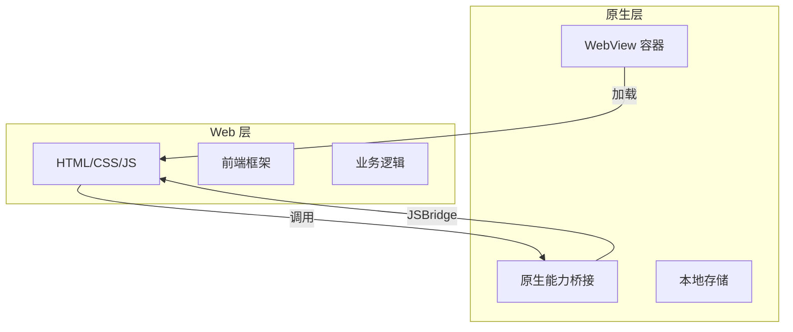

# Hybrid App 开发

Hybrid App 是介于原生 App 和 Web App 之间的混合应用，用 Web 技术开发，通过原生容器包装，兼具两者的优势。

## 核心架构



## JSBridge 原理

JSBridge 是 Hybrid App 的核心，让 Web 和原生可以互相通信。

### Web 调用原生

```javascript
// 方式 1：URL Scheme（iOS/Android 通用）
window.location.href = 'myapp://camera/scan';

// 方式 2：iOS WebView 拦截
window.webkit.messageHandlers.camera.postMessage({
  action: 'scan',
  callback: 'handleScanResult'
});

// 方式 3：Android WebView 注入
window.AndroidBridge.callCamera('scan');

// 封装统一调用
function callNative(action, params = {}) {
  if (window.webkit?.messageHandlers?.[action]) {
    // iOS
    window.webkit.messageHandlers[action].postMessage(params);
  } else if (window.AndroidBridge?.[action]) {
    // Android
    window.AndroidBridge[action](JSON.stringify(params));
  } else {
    // 降级：URL Scheme
    window.location.href = `myapp://${action}?${JSON.stringify(params)}`;
  }
}

// 使用
callNative('camera', { action: 'scan' });
```

### 原生调用 Web

```javascript
// Web 暴露全局方法供原生调用
window.handleScanResult = (data) => {
  console.log('扫码结果:', data);
  // 处理业务逻辑
};

// 原生端调用（iOS）
NSString *js = @"handleScanResult({'code': '123456'})";
[webView evaluateJavaScript:js completionHandler:nil];

// 原生端调用（Android）
webView.evaluateJavascript("handleScanResult({'code': '123456'})", null);
```

## 主流方案对比

| 方案 | 代表 | 原理 | 优势 | 劣势 |
|------|------|------|------|------|
| **WebView 容器** | Cordova | 原生 WebView + JSBridge | 生态成熟，插件多 | 性能一般，体验差 |
| **小程序容器** | 微信小程序 | 双线程 + 原生渲染 | 体验好，生态大 | 平台锁定 |
| **跨平台框架** | React Native | JS 驱动原生组件 | 接近原生体验 | 学习成本高 |
| **现代 Hybrid** | Capacitor | 现代 WebView + 插件系统 | 开发体验好 | 生态较小 |

## Capacitor 实践

Capacitor 是 Ionic 团队推出的现代 Hybrid 方案，替代 Cordova。

### 项目结构

```
my-app/
├── android/          # 原生 Android 项目
├── ios/              # 原生 iOS 项目
├── src/              # Web 代码（React/Vue）
├── capacitor.config.json
└── package.json
```

### 常用插件

```javascript
import { Camera, CameraResultType } from '@capacitor/camera';
import { Geolocation } from '@capacitor/geolocation';
import { LocalNotifications } from '@capacitor/local-notifications';

// 调用相机
const image = await Camera.getPhoto({
  quality: 90,
  allowEditing: true,
  resultType: CameraResultType.Uri
});

// 获取定位
const position = await Geolocation.getCurrentPosition();
console.log('位置:', position.coords);

// 本地通知
await LocalNotifications.schedule({
  notifications: [{
    title: '提醒',
    body: '该喝水了',
    id: 1,
    schedule: { at: new Date(Date.now() + 1000 * 60 * 60) }
  }]
});
```

### 自定义原生插件

```typescript
// 定义插件接口
import { registerPlugin } from '@capacitor/core';

export interface MyPlugin {
  echo(options: { value: string }): Promise<{ value: string }>;
}

const MyPlugin = registerPlugin<MyPlugin>('MyPlugin');

// iOS 实现（Swift）
@objc(MyPlugin)
public class MyPlugin: CAPPlugin {
  @objc func echo(_ call: CAPPluginCall) {
    let value = call.getString("value") ?? ""
    call.resolve(["value": value])
  }
}

// Android 实现（Kotlin）
@CapacitorPlugin(name = "MyPlugin")
class MyPlugin : Plugin() {
  @PluginMethod
  fun echo(call: PluginCall) {
    val value = call.getString("value") ?: ""
    call.resolve(JSObject().put("value", value))
  }
}
```

## 性能优化

### 首屏加载优化

```html
<!-- 预加载关键资源 -->
<link rel="preload" href="/js/app.js" as="script">
<link rel="preload" href="/css/app.css" as="style">

<!-- 骨架屏 -->
<div id="skeleton">
  <div class="skeleton-header"></div>
  <div class="skeleton-content"></div>
</div>
```

### 离线缓存

```javascript
// Service Worker 缓存
self.addEventListener('install', (event) => {
  event.waitUntil(
    caches.open('v1').then((cache) => {
      return cache.addAll([
        '/',
        '/js/app.js',
        '/css/app.css',
        '/images/logo.png'
      ]);
    })
  );
});

// 离线时返回缓存
self.addEventListener('fetch', (event) => {
  event.respondWith(
    caches.match(event.request).then((response) => {
      return response || fetch(event.request);
    })
  );
});
```

## 调试技巧

| 平台 | 调试方式 |
|------|---------|
| **iOS** | Safari → 开发 → 选择设备 → WebView |
| **Android** | Chrome → chrome://inspect → 选择 WebView |
| **通用** | vConsole / eruda（移动端调试面板） |

### vConsole 集成

```javascript
import VConsole from 'vconsole';

// 仅在开发环境启用
if (process.env.NODE_ENV === 'development') {
  new VConsole();
}
```

## 选型建议

| 场景 | 推荐方案 |
|------|---------|
| **简单展示型** | WebView + JSBridge |
| **需要原生能力** | Capacitor / Cordova |
| **追求原生体验** | React Native / Flutter |
| **国内生态** | 微信小程序 / uni-app |

**核心原则：** 能用 Web 实现的用 Web，必须用原生的用插件，避免过度依赖原生。
