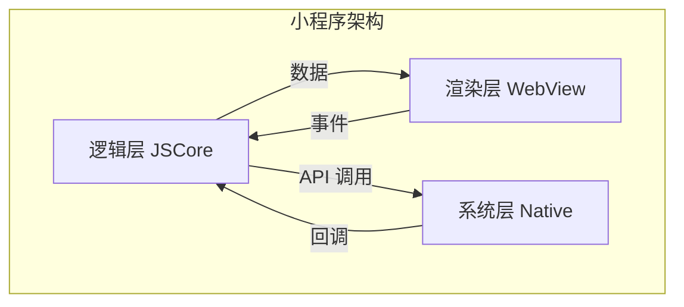
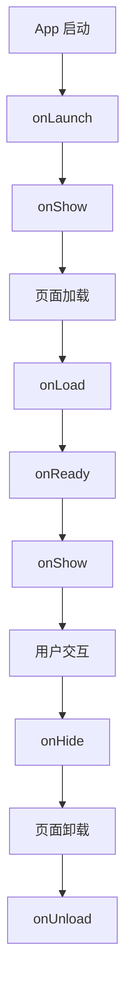

# 小程序开发

小程序是一种不需要下载安装即可使用的应用，运行在宿主 App（微信/支付宝/抖音等）的 WebView 容器中。

## 核心架构



**双线程模型：**
- **逻辑层**：运行在 JSCore，处理业务逻辑
- **渲染层**：运行在 WebView，负责 UI 渲染
- **通信**：通过 Native 层中转，不能直接通信

## 微信小程序

### 项目结构

```
miniprogram/
├── app.json          # 全局配置
├── app.js            # 全局逻辑
├── app.wxss          # 全局样式
├── pages/
│   ├── index/
│   │   ├── index.json    # 页面配置
│   │   ├── index.js      # 页面逻辑
│   │   ├── index.wxml    # 页面结构
│   │   └── index.wxss    # 页面样式
│   └── detail/
├── components/       # 自定义组件
├── utils/            # 工具函数
└── static/           # 静态资源
```

### 生命周期



**App 生命周期：**
| 钩子 | 时机 |
|------|------|
| `onLaunch` | 小程序初始化完成（全局只触发一次） |
| `onShow` | 小程序启动或从后台进入前台 |
| `onHide` | 小程序从前台进入后台 |
| `onError` | 发生脚本错误或 API 调用失败 |

**Page 生命周期：**
| 钩子 | 时机 |
|------|------|
| `onLoad` | 页面加载（只触发一次） |
| `onShow` | 页面显示 |
| `onReady` | 页面初次渲染完成 |
| `onHide` | 页面隐藏 |
| `onUnload` | 页面卸载 |

### 数据绑定

```html
<!-- WXML 模板 -->
<view class="container">
  <text>{{message}}</text>
  <view wx:if="{{show}}">条件渲染</view>
  <view wx:for="{{list}}" wx:key="id">
    {{item.name}}
  </view>
</view>
```

```javascript
// JS 逻辑
Page({
  data: {
    message: 'Hello',
    show: true,
    list: [{ id: 1, name: 'Item 1' }]
  },

  // 修改数据必须用 setData
  onLoad() {
    this.setData({
      message: 'Hello World',
      list: [...this.data.list, { id: 2, name: 'Item 2' }]
    });
  }
});
```

**注意：** 不能直接修改 `this.data`，必须用 `setData`，否则视图不会更新。

### 组件化

```json
// component.json
{
  "component": true,
  "usingComponents": {}
}
```

```javascript
// component.js
Component({
  properties: {
    title: {
      type: String,
      value: '默认标题'
    }
  },

  data: {
    count: 0
  },

  methods: {
    onTap() {
      this.setData({ count: this.data.count + 1 });
      this.triggerEvent('myevent', { count: this.data.count });
    }
  }
});
```

```html
<!-- component.wxml -->
<view class="my-component">
  <text>{{title}}</text>
  <text>点击次数：{{count}}</text>
  <button bindtap="onTap">点击</button>
</view>
```

## 跨端框架

| 框架 | 原理 | 支持平台 | 特点 |
|------|------|---------|------|
| **Taro** | 编译时转换 | 微信/支付宝/抖音/H5/RN | 京东出品，React 语法 |
| **uni-app** | 运行时 + 编译时 | 微信/支付宝/百度/App/H5 |  Vue 语法，生态丰富 |
| **Remax** | 运行时渲染 | 微信/支付宝/抖音 | 真正的 React，无 DSL 限制 |

### Taro 示例

```bash
# 安装
npm install -g @tarojs/cli

# 创建项目
taro init my-app

# 运行
npm run dev:weapp    # 微信小程序
npm run dev:h5       # H5
```

```jsx
// React 语法写小程序
import { View, Text, Button } from '@tarojs/components';
import { useState } from 'react';

function Counter() {
  const [count, setCount] = useState(0);

  return (
    <View className="counter">
      <Text>计数：{count}</Text>
      <Button onClick={() => setCount(count + 1)}>
        加 1
      </Button>
    </View>
  );
}
```

## 性能优化

### 首屏优化

```javascript
// 分包加载
// app.json
{
  "pages": ["pages/index/index"],
  "subpackages": [
    {
      "root": "packageA",
      "pages": ["pages/detail/detail"]
    }
  ]
}

// 按需加载
wx.navigateTo({
  url: '/packageA/pages/detail/detail'
});
```

### 数据预取

```javascript
// 页面跳转时预取数据
wx.navigateTo({
  url: '/pages/detail/detail',
  success() {
    // 提前请求数据
    wx.request({
      url: 'https://api.example.com/data',
      success(res) {
        // 存储到全局或页面
        getApp().globalData.prefetchData = res.data;
      }
    });
  }
});
```

### 图片优化

```html
<!-- 使用官方 image 组件，支持懒加载 -->
<image 
  src="/images/photo.jpg" 
  mode="aspectFill"
  lazy-load="{{true}}"
  show-menu-by-longpress="{{true}}"
/>

<!-- CDN 图片裁剪 -->
<image src="https://cdn.example.com/photo.jpg?width=300&quality=80" />
```

## 调试工具

| 工具 | 用途 |
|------|------|
| **微信开发者工具** | 官方 IDE，支持调试/预览/上传 |
| **vConsole** | 移动端调试面板 |
| **小程序性能监控** | 官方性能分析工具 |

### 真机调试

1. 微信开发者工具 → 真机调试
2. 手机微信扫码
3. 在开发者工具中查看控制台和网络请求

## 限制与注意事项

| 限制项 | 限制值 |
|--------|--------|
| **包体积** | 主包 2MB，总包 20MB |
| **请求域名** | 必须 HTTPS，需在后台配置 |
| **WebView** | 仅企业主体可用，有域名限制 |
| **支付** | 需接入微信支付，审核严格 |

**常见坑：**
- `setData` 不能传 undefined，会报错
- 页面栈最多 10 层，超出会报错
- 不能直接操作 DOM，只能用数据驱动
- 不能动态加载远程代码（审核限制）
