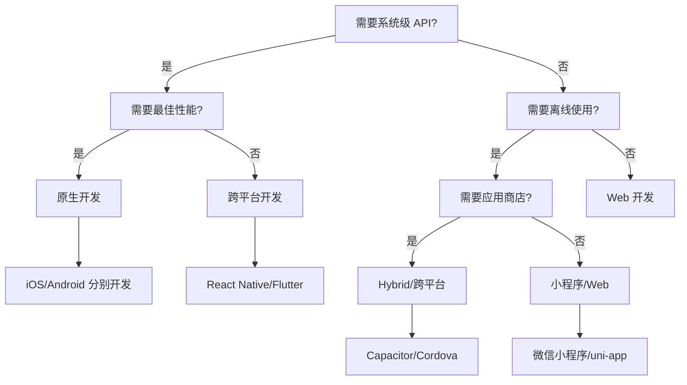

# 原生 App 对比

前端开发者经常面临技术选型：Web、Hybrid、小程序、还是原生？本文对比各方案的核心差异。

## 技术栈对比

```mermaid
graph LR
    subgraph 前端技术
        A1[Web App]
        A2[Hybrid App]
        A3[小程序]
    end

    subgraph 原生技术
        B1[iOS - Swift]
        B2[Android - Kotlin]
        B3[跨平台 - RN/Flutter]
    end

    A1 -->|最灵活| C[选择]
    A2 -->|平衡] C
    A3 -->|生态锁定] C
    B1 -->|性能最好] C
    B2 -->|性能最好] C
    B3 -->|接近原生] C
```

| 维度 | Web | Hybrid | 小程序 | 原生 | 跨平台 |
|------|-----|--------|--------|------|--------|
| **开发语言** | HTML/CSS/JS | HTML/CSS/JS | 平台 DSL | Swift/Kotlin | JS/Dart |
| **性能** | ⭐⭐ | ⭐⭐⭐ | ⭐⭐⭐ | ⭐⭐⭐⭐⭐ | ⭐⭐⭐⭐ |
| **开发成本** | ⭐⭐⭐⭐⭐ | ⭐⭐⭐ | ⭐⭐⭐⭐ | ⭐ | ⭐⭐⭐ |
| **发布审核** | 无需 | 需应用商店 | 需平台审核 | 需应用商店 | 需应用商店 |
| **更新方式** | 实时 | 需发版 | 需审核 | 需发版 | 需发版 |
| **系统能力** | 有限 | 中等 | 受限 | 完整 | 较完整 |

## 性能对比

### 启动速度

| 类型 | 冷启动 | 热启动 |
|------|--------|--------|
| **Web** | 1-3s（依赖网络） | 0.5-1s |
| **Hybrid** | 1-2s | 0.3-0.5s |
| **小程序** | 0.5-1s | 0.2-0.3s |
| **原生** | 0.3-0.5s | 0.1-0.2s |
| **跨平台** | 0.5-1s | 0.2-0.4s |

### 渲染性能

| 类型 | 帧率 | 动画流畅度 |
|------|------|-----------|
| **Web** | 30-60fps | 复杂动画卡顿 |
| **Hybrid** | 30-60fps | 依赖 WebView 性能 |
| **小程序** | 50-60fps | 双线程优化 |
| **原生** | 60fps | 最流畅 |
| **跨平台** | 55-60fps | 接近原生 |

## 开发体验对比

### Web 开发

```javascript
// ✅ 优势
- 热更新，实时预览
- 丰富的 DevTools
- npm 生态，海量库
- 跨平台，一次开发多端运行

// ❌ 劣势
- 无法访问系统 API
- 性能有上限
- 依赖网络
```

### 原生开发

```swift
// iOS (Swift)
struct ContentView: View {
    var body: some View {
        Text("Hello, World!")
    }
}

// ✅ 优势
- 完整系统 API 访问
- 最佳性能
- 最佳用户体验
- 离线可用

// ❌ 劣势
- 学习成本高
- 开发周期长
- 需分别开发 iOS/Android
- 发版需审核
```

### 跨平台开发

```jsx
// React Native
function App() {
  return (
    <View style={styles.container}>
      <Text>Hello, World!</Text>
    </View>
  );
}

// ✅ 优势
- 一套代码多端运行
- 接近原生性能
- 可访问原生 API
- 热更新支持

// ❌ 劣势
- 需要原生知识
- 平台差异处理
- 第三方库兼容性
```

## 成本对比

### 人力成本

| 方案 | iOS 开发 | Android 开发 | Web 开发 | 总计 |
|------|---------|-------------|---------|------|
| **原生** | 1 人 | 1 人 | - | 2 人 |
| **跨平台** | - | - | 1-2 人 | 1-2 人 |
| **Hybrid** | - | - | 1-2 人 | 1-2 人 |
| **小程序** | - | - | 1 人 | 1 人 |
| **Web** | - | - | 1 人 | 1 人 |

### 时间成本

| 功能 | 原生 | 跨平台 | Hybrid | 小程序 | Web |
|------|------|--------|--------|--------|-----|
| **简单应用** | 2-3 月 | 1-2 月 | 1-2 月 | 0.5-1 月 | 0.5-1 月 |
| **中等应用** | 4-6 月 | 3-4 月 | 3-4 月 | 2-3 月 | 2-3 月 |
| **复杂应用** | 6-12 月 | 4-8 月 | 4-6 月 | 3-6 月 | 3-6 月 |

## 选型决策树



## 典型场景

### 选 Web

- 内容展示型（新闻、博客）
- 工具型（计算器、转换器）
- 需要快速迭代
- 预算有限

### 选 Hybrid

- 需要部分原生能力（相机、定位）
- 已有 Web 团队
- 需要快速上线

### 选小程序

- 依赖微信/支付宝生态
- 轻量级工具
- 电商/服务类

### 选原生

- 游戏/高性能应用
- 深度系统集成
- 对体验要求极高
- 预算充足

### 选跨平台

- 需要多端覆盖
- 团队有前端背景
- 平衡性能和成本

## 混合方案

实际项目中，经常混合使用多种技术：

```
┌─────────────────────────────────────┐
│              原生 App                │
─────────────────────────────────────┤
│  核心功能：原生开发（性能优先）       │
│  营销活动：WebView（灵活更新）        │
│  客服聊天：小程序（生态引流）         │
│  官网展示：Web（SEO 友好）           │
└─────────────────────────────────────┘
```

**案例：**
- **淘宝**：原生 + WebView + 小程序
- **美团**：原生 + React Native
- **京东**：原生 + Taro 小程序

## 总结

| 方案 | 一句话总结 |
|------|-----------|
| **Web** | 最灵活，性能有上限 |
| **Hybrid** | 平衡之选，快速上线 |
| **小程序** | 生态红利，体验较好 |
| **原生** | 性能最佳，成本最高 |
| **跨平台** | 未来趋势，接近原生 |

**核心原则：** 没有最好的方案，只有最适合的方案。根据业务需求、团队能力、预算时间综合选择。
