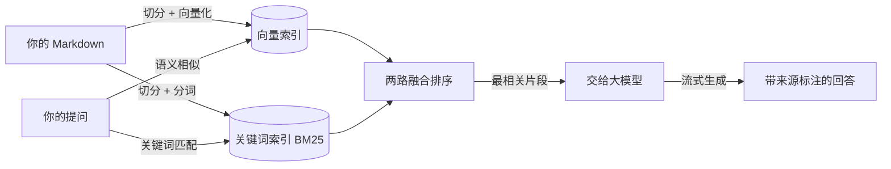

# 快速上手：搭一个你自己的知识库

> `@minijun/kb-*` 是一套**基座**：把一堆 Markdown 笔记，变成一个可浏览、可搜索、**可对话**的网站。
>
> **默认全部在你自己电脑上跑**（本地模型 + 本地向量库）：不花钱、不联网、数据不出本机。
> 需要时也可以切到**远程大模型 / 远程向量库**，只改配置、不用改代码。

## 它能做什么

| 能力 | 说明 |
|------|------|
| **文档站点** | 把 Markdown 丢进目录，自动生成带导航、搜索、侧边栏的网站 |
| **AI 问答** | 右下角助手，基于**你自己的笔记**回答，并在句末标注可点击的来源 |
| **防幻觉** | 检索不到就说"没找到"，不会硬编；引用编号不会指向不存在的来源 |
| **质量保障** | 基座自带评估体系（回归测试 + 阈值门禁），由它自己持续校准检索与回答 —— **你不用配置，也不用准备什么** |
| **本地 / 远程皆可** | 模型与向量库默认本地，也可指向 OpenAI 兼容的远程服务 |

它解决的核心问题是：**你的笔记越写越多，却越来越找不到、用不起来。** 这个基座把它变成"能问的"。

## 它是怎么工作的



一句话：**文档切块后同时建"向量索引"和"关键词索引"；提问时两路并行检索、融合排序，再让大模型"看着资料"回答。**

为什么要两路：**纯向量在精确词上最弱** —— 英文缩写、专有名词、代码标识符这类词容易和无关内容"飘"到一起。
加上关键词一路（BM25）正好补上这个短板，两路结果归一化后加权融合。

---

## 一、上手前：你要装什么

| 依赖 | 作用 | 怎么装 |
|------|------|--------|
| **Node.js ≥ 20.6** + **pnpm ≥ 9** | 跑前后端与 CLI | 官网下载 Node；`npm i -g pnpm` |
| **Docker** | 跑 Chroma 向量库 | 装 Docker Desktop，保持运行 |
| **Ollama** | 跑本地大模型 | 官网下载，装完确保服务在运行 |

> 只装一次。模型首次需要下载（约 6.5GB），之后就一直本地可用了。
> 如果你打算用**远程大模型**，可以跳过 Ollama 与模型下载。

## 二、三步搭起来

### ① 装包

只装**一个包**就够了（`@minijun/kb-core` 提供 CLI，装完就有 `kb` 命令）：

```bash
mkdir my-kb && cd my-kb
pnpm add @minijun/kb-core
```

> **结尾如果报 `ERR_PNPM_IGNORED_BUILDS`（说 `protobufjs` 的构建脚本被忽略了）—— 可以无视**，
> 包已经装好了。下面 ② 会生成一份 `pnpm-workspace.yaml` 把这件事定下来，之后就不再报。
>
> 也支持全局装（`pnpm add -g @minijun/kb-core`），但那样实例里的版本容易和全局混，不推荐。

### ② 用 `kb` 初始化

```bash
npx kb init --install
```

⚠️ **这里必须写 `npx`，不能写 `pnpm kb init`。**

`pnpm <脚本>` 在执行前会先做一次依赖状态检查（内部跑 `pnpm install`）。① 那步留下的
「有构建脚本未批准」状态会让这次检查直接失败，于是 `kb` 根本没启动 —— 你会看到
`Command failed with exit code 1: pnpm install`。
`npx` 只是在 `node_modules/.bin` 里找到 `kb` 执行，不经过这层检查。

（生成出骨架之后就没事了：`pnpm-workspace.yaml` 里的 `allowBuilds` 会让后续所有
`pnpm install` / `pnpm kb xxx` 正常工作。）

它会在当前目录生成实例骨架：`knowledge.config.mjs`（配置）+ `docs/`（含首页与快速上手）+ `package.json` 脚本
+ `.env.example`（环境变量示例，接远程模型 / 向量库时才用得上）。

骨架是**自包含**的，所以刚才只装了 `@minijun/kb-core` 也能完整生成；实例真正需要的两个依赖
（`@minijun/kb-core` + `@minijun/kb-site`）由它自动写好，你不用管。`--install` 会顺带把依赖装好。

> **想在本地基座源码上开发 / 调试**（不装 npm 上的发布版），加 `--local` 指向基座目录：
> `npx kb init --local ../kb-base --install`
>
> 也支持生成到子目录（`npx kb init my-kb`）；不加 `--yes` 时会交互式问你几个问题。

### ③ 放你的内容，然后跑起来

```bash
# 下载本地模型（首次，约 6.5GB；配的是远程模型会自动跳过）
pnpm ollama:pull          # 按配置拉取聊天 + 向量模型，缺什么拉什么

pnpm chroma:start         # 启动向量库（需 Docker 正在运行；容器按实例命名，见「五、遇到问题」）
pnpm kb index             # 建立向量索引
pnpm dev                  # 启动 → http://localhost:5173
```

打开就能看到站点；右下角的助手可以直接提问。

> 文档有更新时，重新跑一次 `pnpm kb index` 即可（增量，只处理改动过的文件）。
> 命令分两类：`dev` / `build` / `preview` 是脚本；`kb index` 这类是基座 CLI `kb` 的子命令，用 `pnpm kb <子命令>` 调用。

## 三、放你的内容

**把你的 Markdown 放进 `docs/` 就行** —— 一个目录，没有别的概念。

```js
export default {
  name: 'my-knowledge',
  collectionName: 'my_kb',    // 向量集合名（一个实例一个库）
  models: {
    baseUrl: 'http://localhost:11434/v1',  // 默认本地 Ollama
    apiKeyEnv: 'OPENAI_API_KEY',           // 远程时 Key 从这个环境变量读
    chat: 'qwen3:8b',
    embedding: 'bge-m3',
  },
  chroma: { host: 'localhost', port: 8000 },
  // ...
}
```

几个要点：

- **目录即分类**：`docs/` 下每建一个目录，站点的侧边栏就多一块、菜单也多一项，不用手写。
- **菜单**：一级目录各一项，名字取目录名（想改显示名用 `categories`）。
- **侧边栏**：**一级目录各一份，整棵子树都在里面**（只有 1 篇的目录不给 —— 一条的导航没意义）。
  子目录是这一份里的嵌套分组，**不会**在点进去时把父侧边栏顶掉。
- **想让内容"只在本地产出"**（线上不构建、不进菜单/侧边栏）：列在 `knowledge.config.mjs` 的 `site.onlyLocal` 里。这是**内容策略**，和菜单是两件事：

  ```js
  site: {
    // 相对 docs/ 的路径，目录或文件都行（可省略 .md）
    onlyLocal: ['私人笔记', 'notes/draft.md'],
  }
  ```

- **想完全接管菜单/侧边栏**（分组、外链、自定义顺序、改名字）：

  ```bash
  pnpm kb menu:export          # 按当前目录结构导出一份 menu.config.mjs
  pnpm kb menu:export --check  # 只看"目录里有什么"和"配置里写了什么"的差异
  ```

  有了 `menu.config.mjs` 之后，站点**完全按它渲染**（不再按目录推导）—— 新增/改名/删除文件时要跟着改；
  想回到全自动，删掉该文件即可。

- **首页**：就是 `docs/index.md`（hero 大标题、特性卡、命令清单），当成普通页面改就行。
  想让首页出现 **GitHub 按钮**，不用改首页 —— 在配置里写一次仓库地址，右上角图标和首页按钮会同时出现：

  ```js
  site: {
    socialLinks: [{ icon: 'github', link: 'https://github.com/你的用户名/你的仓库' }],
  }
  ```

### 想换成远程大模型 / 远程向量库？

默认走本地，**只改这几行**即可切到远程（密钥只从环境变量读，不写进配置）：

```js
models: {
  chat:      { baseUrl: 'https://api.deepseek.com/v1',   model: 'deepseek-chat',        apiKeyEnv: 'DEEPSEEK_API_KEY' },
  embedding: { baseUrl: 'https://api.siliconflow.cn/v1', model: 'BAAI/bge-m3',          apiKeyEnv: 'SILICONFLOW_API_KEY' },
},
chroma: {
  url: 'https://xxx.chromadb.cloud',   // 远程用 url（http/https）+ token
  tokenEnv: 'CHROMA_TOKEN',
  tenant: '…', database: '…',
},
```

- 聊天模型支持**任意 OpenAI 兼容接口**（DeepSeek / 硅基流动 / OpenAI…），向量模型同理
- 本地 Ollama 会自动走原生接口（可用 `think:false` 提速）；远程则走标准接口
- 配好后**重新 `pnpm kb index`**（换了向量模型必须重建索引，向量空间不同）

> **密钥在哪**：`apiKeyEnv` / `tokenEnv` 写的是"环境变量名"，**密钥本身放项目根目录的 `.env`**。
> 骨架里带了一份 `.env.example`（里面列了这些变量名和说明），复制一份改名即可：
>
> ```bash
> cp .env.example .env    # 然后填上真实值
> ```
>
> `.env` 已被 `.gitignore` 排除，不会入库 —— 配置里**也没有"直接写密钥"的字段**，所以密钥不可能被误提交。

### 已经有笔记了？用「导入 + 归档」搬进来

以前写过的笔记**不用手动复制粘贴** —— 站点右下角的 **➕「内容管理」** 就是干这个的（本地开发时才显示）。

**第一步：导入**（把文件搬进来）
- 把 Markdown **拖进去**，或点「选择文件夹」/「选择文件」——**可以反复选，会累加到同一份清单**，不用一次挑完
- **只支持 `.md`**：其他格式不扫描也不上传；图片不会一起搬（笔记里引用了本地图片的话，显示时会裂图）
- 下一步是**预检**：先给你看一遍会发生什么 —— 待导入清单（可以逐项 ✕ 移除）、会新增哪些分类、哪些文件重名、哪些会被改名、哪些被忽略
- 文件先落在 `docs/imported/`（**收件箱**），你原来的目录一个字节都不动

**第二步：归档**（分配菜单）
- 左边是收件箱里的文件和目录，右边是分类（**分类就是 `docs/` 下的目录**）
- 勾选一批一起归档；也可以把整份目录拖到某个分类上，一次搬完
- **不要的可以直接删**：收件箱里难免混进临时笔记、跑题内容 —— 点「删除」（会二次确认）
- 归档完 `imported/` 就空了 —— 它是收件箱，不是分类

> 每一步的操作按钮都在**面板右下角**，位置固定，不用跟着内容找。

> ⚠️ **两件事都要记得**：
> 1. 导入/归档/删除之后**更新索引** —— 入口是**面板底部那条常驻状态栏**（左侧会提示"内容有改动，索引未更新"），
>    不在任何一个 tab 里，所以切到哪个 tab 都能点；否则 AI 问答还搜不到新内容；
> 2. **导航与侧边栏要重启 `pnpm dev` 才会变** —— 它们是在 VitePress 加载站点配置时按目录算出来的，
>    运行期不会重算（比如"收件箱有内容了 → 导航该多出「待归档」"）。面板会在这时用右上角提示提醒你。

命令行也可以（适合大批量）：

```bash
pnpm kb import ~/old-notes --dry-run   # 只预检，不写文件
pnpm kb import ~/old-notes             # 真的导入
```

## 四、常用命令速查

| 命令 | 作用 |
|------|------|
| `pnpm dev` | 启动前后端（文档 5173 / API 3000） |
| `pnpm index` | 增量更新向量索引（改完文档跑这个） |
| `pnpm index:full` | 全量重建索引（换向量模型后必须） |
| `pnpm chroma:start` / `pnpm chroma:stop` | 启动 / 停止**本实例自己的**向量库容器 |
| `pnpm ollama:pull` / `pnpm ollama:stop` | 按配置拉取本地模型 / 停止本地模型（配远程模型会自动跳过） |
| `pnpm kb import <目录>` | 把已有笔记导入 `docs/imported/`（`--dry-run` 只预检） |
| `pnpm build` | 构建静态站点（生产） |
| `npx kb init [目录]` | 生成一个新的知识库实例（**必须用 `npx`**，原因见上面「②」） |

## 五、本地放两个实例（互不干扰）

向量库容器是**按实例区分**的：

- 容器名 = `kb-chroma-<实例目录名>`（不再固定叫 `chroma`）
- 端口 = `knowledge.config.mjs` 里的 `chroma.port`；`kb init` 会**自动挑一个没被占用的**
- 数据目录 = 本实例的 `data/chroma`

所以第二个实例 `pnpm chroma:start` 不会把第一个顶掉。唯一要自己改的是**服务端口**（`port`，默认 3000）——第二个实例记得改一下。

> 老版本用固定容器名 `chroma`，两个实例会互相抢（谁后启动，容器就挂到谁的数据目录上，表现为"另一个实例的索引凭空消失"）。
> 机器上还留着的话：`docker rm -f chroma`。

## 六、遇到问题

| 现象 | 原因 / 解决 |
|------|------------|
| 启动后提问报错、搜不到东西 | 向量库没起：`docker ps` 看 `kb-chroma-<实例目录名>` 在不在跑，否则 `pnpm chroma:start` |
| `pnpm kb index` 连不上 | 同上；Docker 关闭后需重新启动容器 |
| 回答很慢 / 卡住 | 本地模型首轮加载较慢，属正常；`ollama ps` 看模型是否已加载 |
| 改了文档但问答没变 | 忘了重新索引：再跑一次 `pnpm kb index` |
| 端口被占用 | 改 `knowledge.config.mjs` 的 `port`，或关掉占用 5173/3000 的程序 |
| 远程模型报 401 / 鉴权失败 | 检查配置里的 `apiKeyEnv` 对应的环境变量是否已在 `.env` 中设置 |
| 换过向量模型后检索变差 | 向量空间变了，需要 `pnpm kb index --full` 重建索引 |

## 七、下一步

- **想发布出去**：`pnpm build` 产出静态站点；个人内容可通过 `onlyLocal` 控制在本地。
